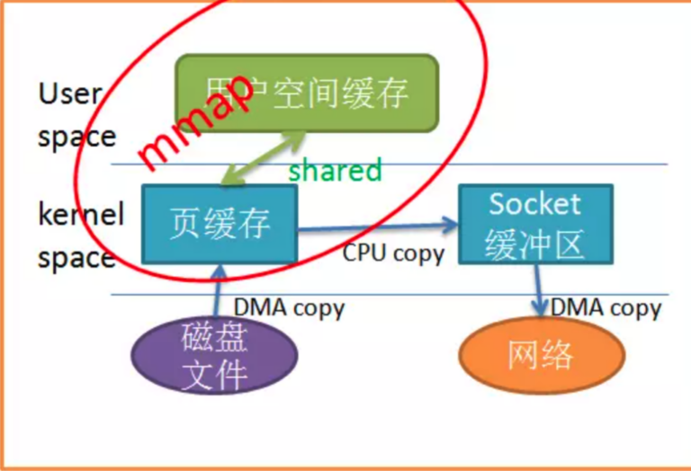
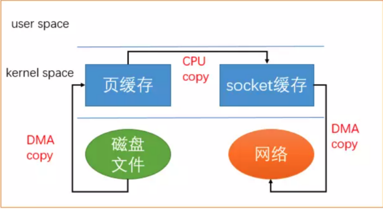
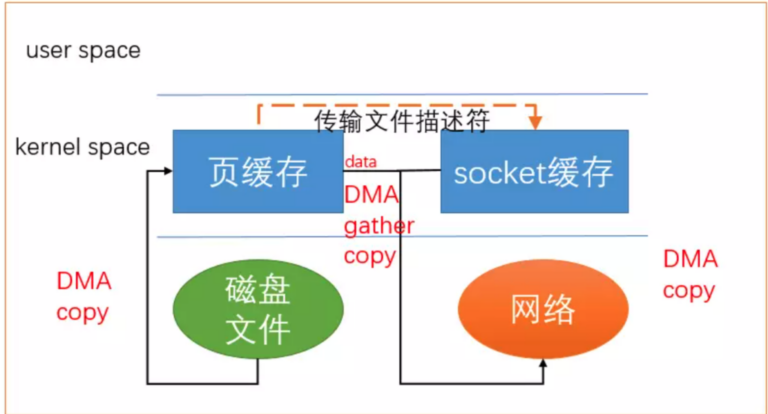
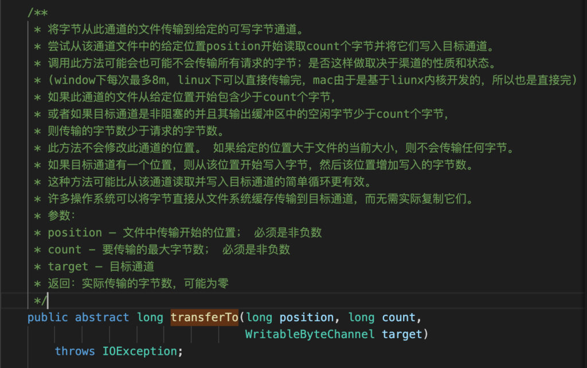
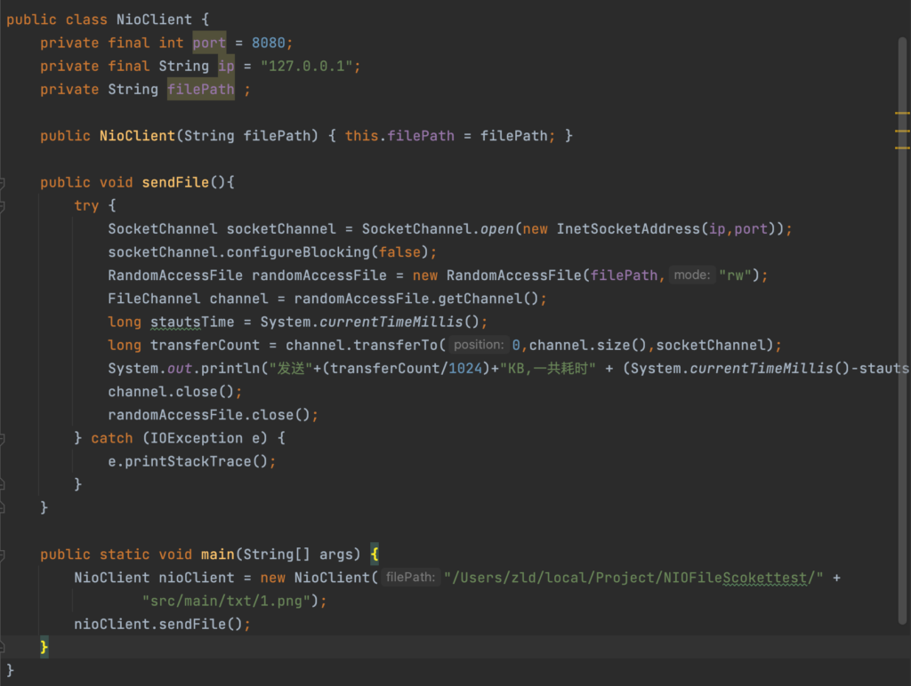
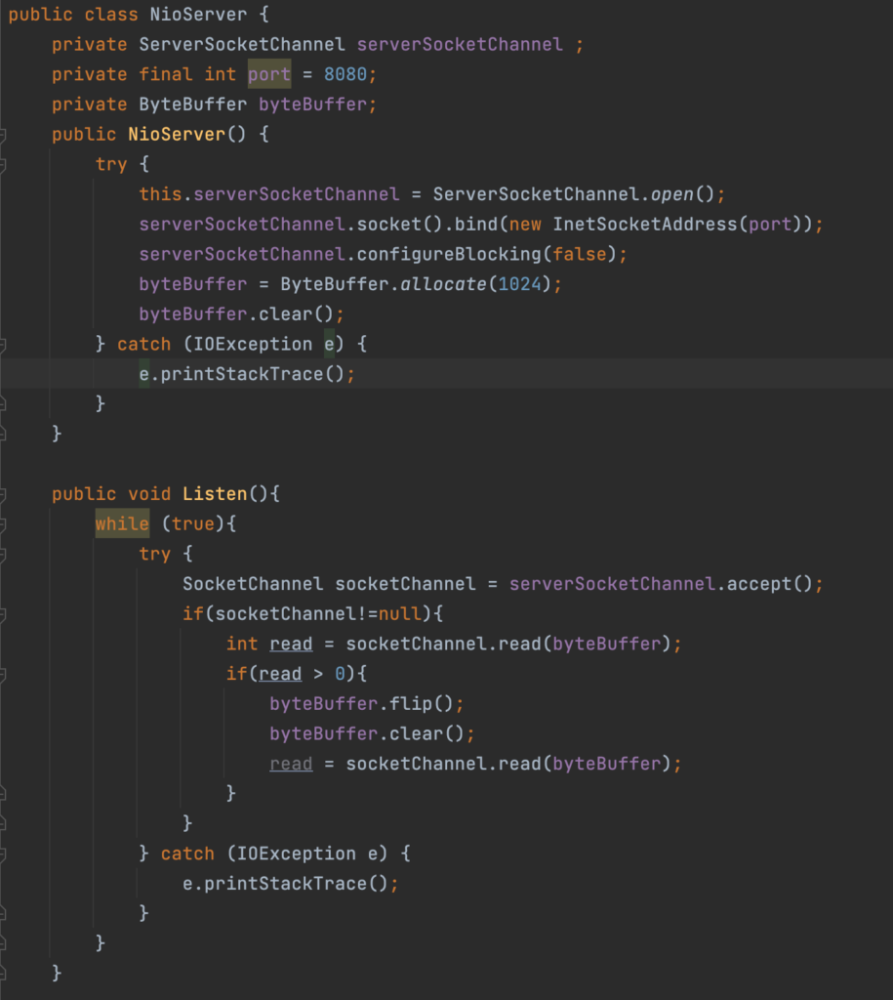
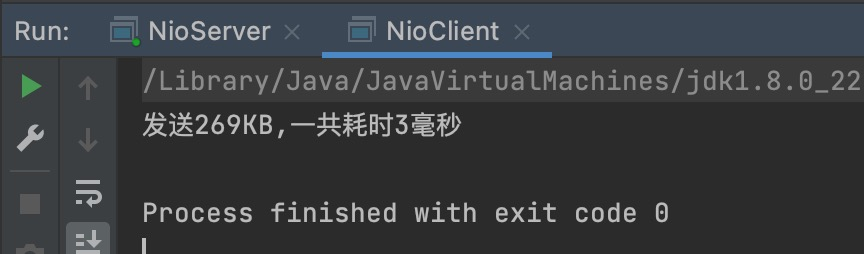
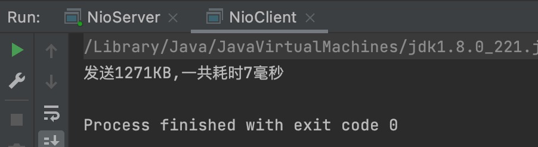

## 零拷贝是什么

零拷贝是网络编程的关键，**“一种避免CPU将数据从一块存储拷贝到另一块存储的技术”**，**记住是避免CPU执行的拷贝，而不是不拷贝**。在Java程序中，常用的零拷贝落地技术有mmap(内存映射)和sendFile。

介绍一下传统IO的流程

也就是我们刚学计算机的时候老师讲述的一套流程，即从磁盘中加载到直接内存中，然后由CPU去读取修改管理之后再由CPU写入到直接内存后，最后加载进磁盘中。

我们再把上述宏观的话细化一下顺带把场景带到网络IO中：

传统IO会将数据从磁盘中通过DMA加载到内核缓存区中，然后CPU通过调度应用程序进程去获取内核缓冲区中的数据后，对数据进行修改管理后再通过CPU指令调用应用程序进程去写入到Socket缓冲区，然后Socket缓冲区再通过DMA写入到网络中。

**（DMA为direct memory access也就是”直接内存拷贝”，不需要CPU的参与。）**

这样看来我们一共涉及到两次CPU参与的内存拷贝， 能不能想办法减少这个内存拷贝的次数呢，方法是有的，通过mmap和sendFile技术。

------

------

## mmap内存映射

mmap内存映射：磁盘上的数据会通过DMA拷贝到内核缓冲区，然后**操作系统会把这段内核缓冲区与应用程序进程共享(也可以说是映射到了应用进程缓冲区)**，这样就不需要CPU调度应用进程去拷贝一份数据了，而是直接使用内核缓冲区的数据。然后应用程序进程调用write方法使用CPU调度把数据从内核缓存区拷贝到Socket缓冲区中。最后socket缓冲区再把数据发到网卡去。

很明显使用mmap代替read方法时，减少了一次数据的拷贝，提高了程序的性能。但是也只是减少了一次CPU参与的数据拷贝，并没有实现真正的零拷贝。于是乎sendFile机制也就出现了。

------

------

## Linux2.1版本下的SendFile机制

SendFile机制让数据不在经过用户缓冲区(应用进程缓冲区)，而是直接从内核缓冲区拷贝到Socket缓存区。相比于mmap来说减少了一次状态的切换，即从内核态到用户态的转化。但是还是有一次CPU参与的数据拷贝。

------

------

## Linux2.4版本下的SendFile机制

在原来SendFile的基础上，进行了修改，没错就是把唯一的一次CPU参与的拷贝优化掉。避免了从内核缓冲区到Socket缓冲区之间的数据拷贝，从而真正实现零拷贝。

实现原理就是借助硬件的特性，**把缓冲区的描述符传到Socket缓冲区中，再把数据长度传到Socket缓冲区中**，这样DMA控制器就可以直接从内核缓冲区中的数据打包发送到网络中。

**通过对Sendfile机制的了解，我们也懵懵懂懂的对SendFile的使用和mmap有了质疑，就是mmap虽然有用户态和内核态的切换，但是保证了数据可以被应用进程处理。但是SendFile机制直接不进去用户态，那么数据难道只能用来进行拷贝嘛？想的没错，所以SendFile机制只适合于数据不需要被修改的情况下使用。**

–

–

## Java中的零拷贝使用实例解析-

在写NIO零拷贝的时候，我们要先了解FileChannel的一个方法transferTo方法。

**transferTO方法的底层就是调用了零拷贝的方式。**

零拷贝客户端：

零拷贝服务器：

结果：传输一个279kb的文件和传输一个1.2MB的文件

- 
- 

自己后来又做了超过8MB的数据传输，发现分段了，mmp。

