## 什么是注解（Annotation）？

注解(Annotation)是从JDK5.0引入的技术。即不属于程序的本身，但是可以对程序作出一些解释。但是和注释不同，**注解是可以被编译器读取编译的。**

注解的格式为：**@注解名(注解参数)**

注解往往使用在Field，Class，Method等上面，用于给他们添加可以被编译的额外信息。

其中最通俗易懂的就是@Override注解，告诉编译器这个方法是重写的。

光看这上面的话，初学者能完全看明白就有鬼了。先有这个概念印象就行。重写肯定不陌生。

如果有过Spring或者Redis开发经验的话，就可以明白再说什么。所以我们就继续往下看

------

------

## 注解的分类

注解一共分为三类，即内置注解，元注解和自定义注解。

------

## **内置注解**(@Override,@Deprecated,@suppressWarnnings)

**@Override内置注解**大家估计都不陌生，定义在java.lang.Override，此注解只能注解方法，表示一个方法声明打算重写超类中的对应方法。

也就是说被@Override注解的方法会将父类/超类中声明的方法覆盖，同理当然就要满足重写的定义，不然就会抛出异常。

**源码看不懂很正常，等元注解和自定义注解学习就可看懂了，建议可以过一眼就行。**

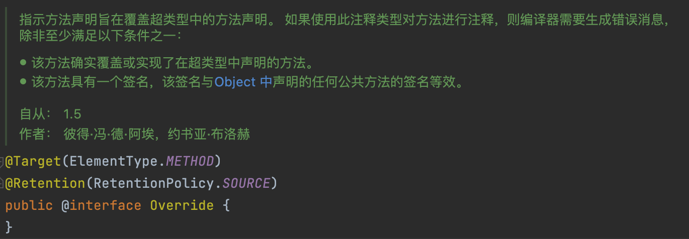

**@Deprecated内置注解**，定义在java.lang.Deprecated，此注解可以用来修饰方法，属性和类。表示不鼓励程序员使用这些的方法，属性和类。

当我们使用被@Deprecated注解的方法时，一般调用者会发现此方法被横行划去，虽然还可以使用的。

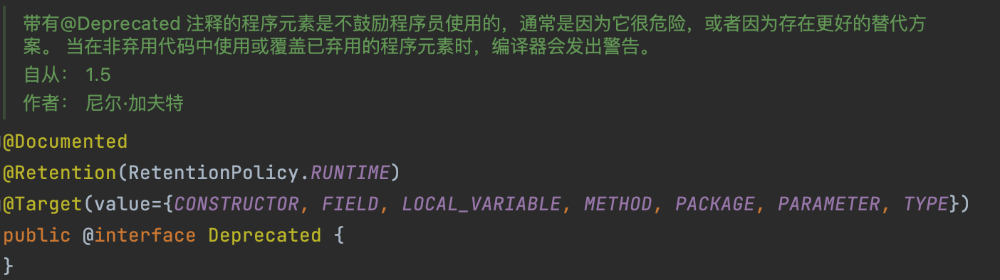

**@SuppressWarnings内置注解**，定义在java.lang.SuppressWarnings，此注解用来抑制编译时的警告信息，此注解和上述注解不同，可以设置注解参数，即

1）@SuppressWarnings(“all”)：抑制全部警告信息

2）@SuppressWarning(“unchecked”):抑制未检查的警告信息

3）@SuppressWarning(value={“unchecked”,”deprecation”}):抑制未检查的和不推荐使用的

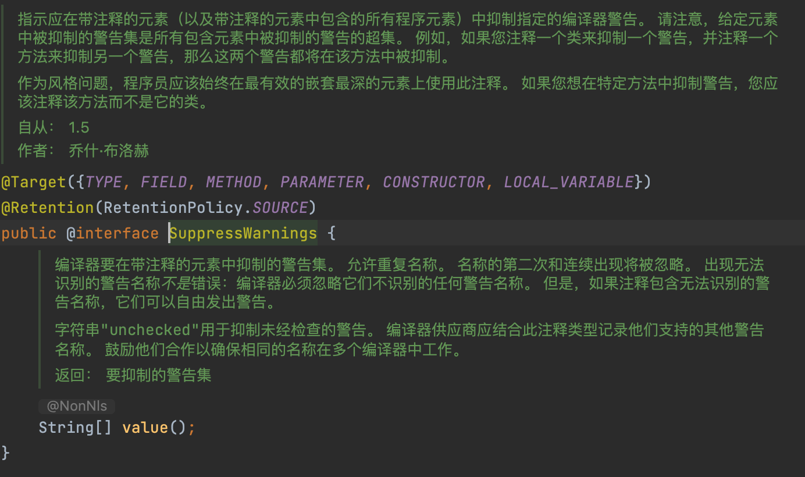

**决定一个注解有没有参数的核心就在于源码中的String[] value字段，这些字段的讲解我们放在自定义注解中说明**

------

------

## **元注解**(@Target，@Retention，@Document，@Inherited)

元注解的作用就是负责注解其他的注解，也就是作用于注解上，java一共定义了四种元注解，均在java.lang.annocation包下。

- @Target元注解

  ，用于描述被修饰注解的使用范围。

  1. ElementType.CONSTRUCTOR：构造器声明，也就是可以被使用在构造方法上。
  2. ElementType.FIELD：字段声明
  3. ElementType.LOCAL_VARIAVLE：局部变量声明，可以被作用到字段上。
  4. ElementType.METHOD：方法声明，可以被作用到方法上。
  5. ElementType.PACKAGE：包声明，可以作用在包上。
  6. ElementType.PARAMETER：方法声明，可以作用在方法上。
  7. ElementType.TYPE：类型，接口声明，可以作用在类以及接口中。
  8. ElementType.ANNOTATION_TYPE：注解声明，

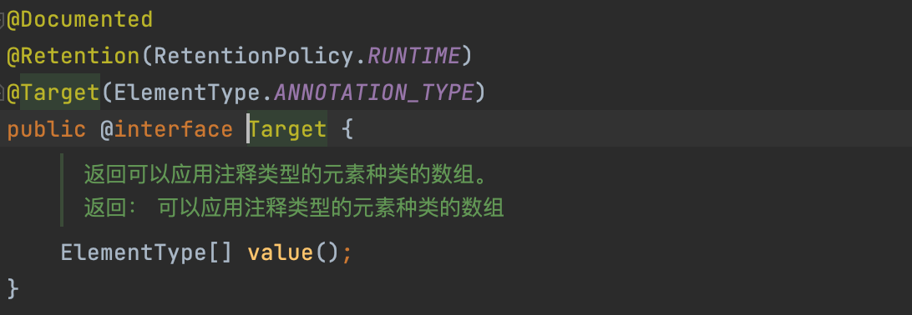

- @Retention

  ：表示需要在什么级别保存该注解信息，用于描述注解的生命周期。

  1. RetentionPolicy.SOURCE：注解会被编译器丢弃，但是开发的时候会被提示。
  2. RetentionPolicy.CLASS：注解可以在字节码文件中看到，但会被JVM丢弃
  3. RetentionPolicy.RUNTIME：JVM将在运行期也保留注解，可以通过反射获取到注解的内容。

生命周期关系为：(SOURCE < CLASS < RUNTIME)，一般都是RUNTIME运行的时候还可以使用。

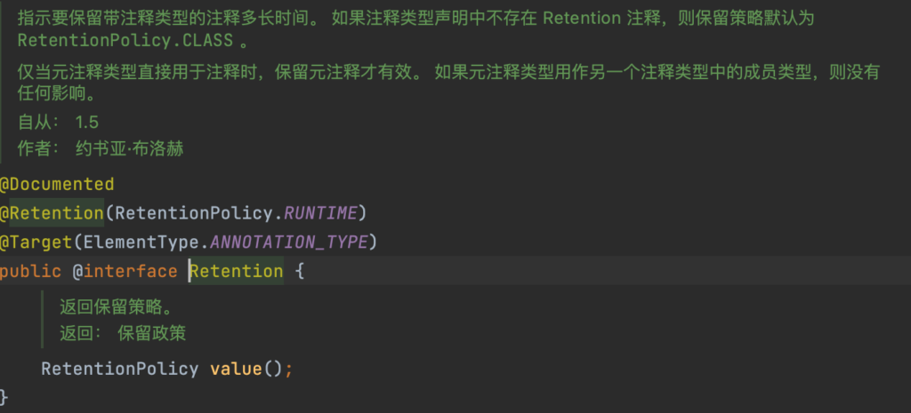

**@Document**：说明该被修饰注解将被包含在java doc中。即文档注释中，很少使用。

**@Inherited**：说明子类可以继承父类中的该注解。

------

------

## 自定义注解

一般来说我们自定义注解一般要实现java.lang.annotation.Annotation接口。但是我们在声明自定义注解的时候，一般都会使用@interface来声明，这个其实已经自动帮我们实现了Annotation接口。

自定义注解无参数格式：

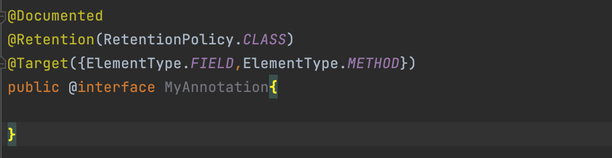

有参数注解格式：**参数类型 + 参数名+()** //只能是基本类型

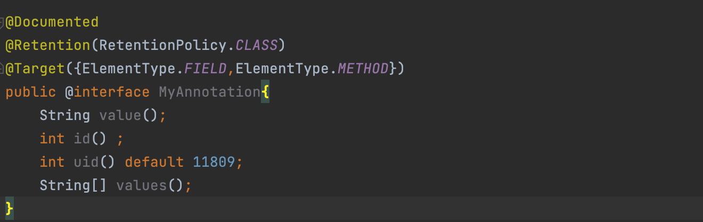

有参数注解的使用方式：

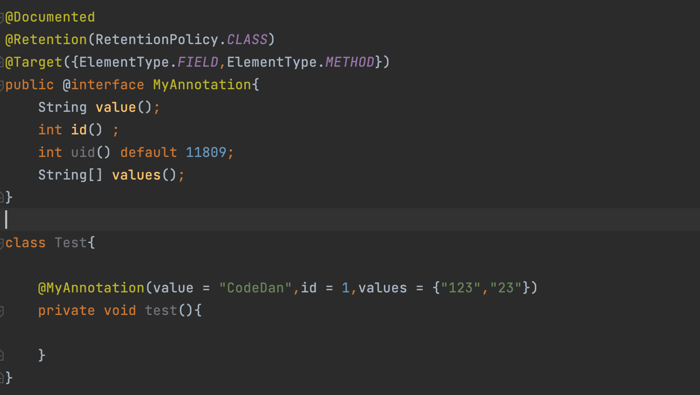

## 注解实例之通过注解和反射完成ORM关系映射

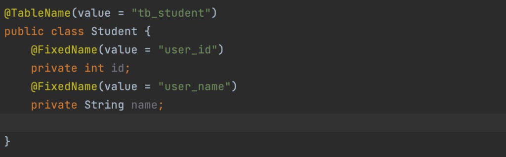

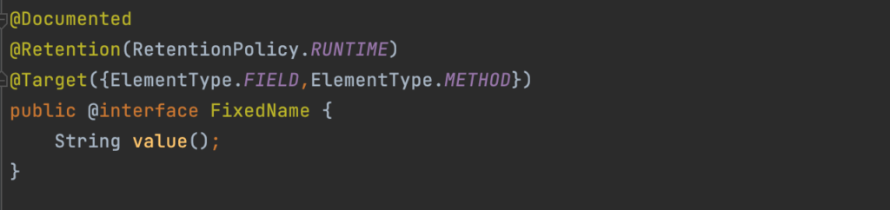

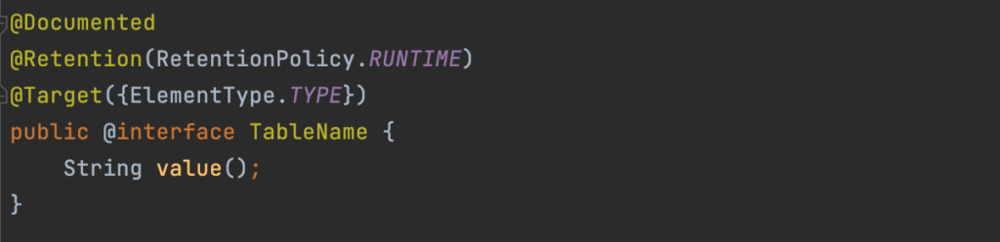

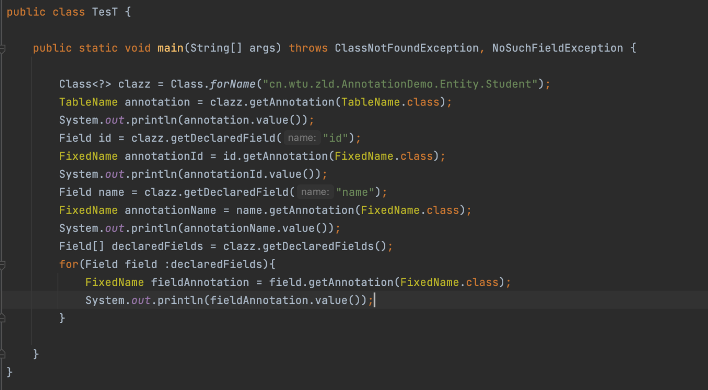

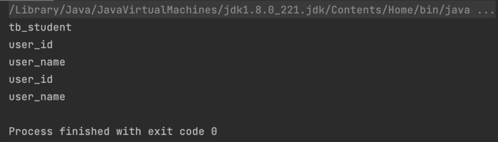