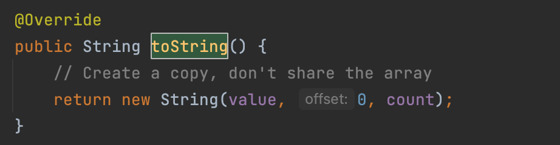
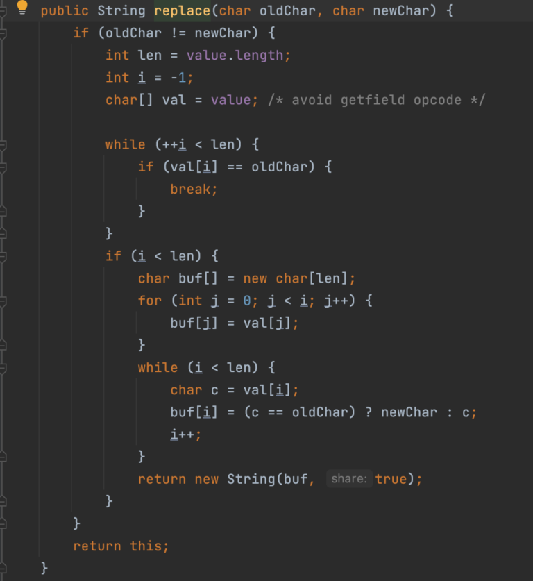

一定要弄明白String字面量生成方式和new生成方式的区别再看下面的解析

```
//字面量生成方式,此方式并不会在堆中生成一个String对象内存地址，而是直接引用的"字符串常量池"中的字符串常量地址。
String str1 = "abc"; 
//new方式生成，此方式先在堆中生成了一个String对象的内存地址，然后此内存地址在指向"字符串常量池"中的字符串常量地址。
String str2 = "abc";
```

## 面试高频之String不可变性

String：代表不可变字符序列，简称不可变性

我们可以从三个角度去分析String的不可变性：

(1) 当对字符串引用重新赋值的时候，需要重写指定内存区域的赋值，不能使用原有的value进行赋值。

(2) 当对现有的字符串进行连接操作时，也需要重新指定内存区域的赋值，不能使用原有的value进行赋值。

(3) 当调用String的replace()方法修改字符串时，也需要重新制定内存区域赋值，不能使用原有的value进行赋值。

------

我们先从第一点来说明：第一点讲究：当对字符串引用重新赋值的时候，需要重写指定内存区域的赋值，不能使用原有的value进行赋值。

```
    public static void main(String[] args) {
        String s1 = "abc"; //字面量定义的方式，"abc"存储在堆中的字符串常量池中
        String s2 = "abc";
        System.out.println(s1 == s2);  //true
        System.out.println(s1);        //abc
        System.out.println(s2);        //abc

        s1 = "hello";
        System.out.println(s1 == s2);  //false
        System.out.println(s1);        //hello
        System.out.println(s2);        //abc
    }
```

到这里明白了上述程序的作用，但是深入底层的话，我们会发现一个问题，**就是s1为什么可以替换字符串对象地址。**

为什么我们提出这个问题，因为大家如果看过jdk8下String源码的话，就会发现在String源码中，存储字段如下所示：

```
final char[] value;
```

对于被final修饰的基本类型数组和修饰引用类型一样，只能修改其引用对象的状态，而不能修改其引用对象的地址。

但是上面的操作的的确确修改了s1所引用的内存地址。从字符串常量池中”abc”的内存地址变到了”hello”的内存地址。

那么String是怎么做到的？

第一：我们得先知道String s1是没有被final修饰的，也就是说s1是可以变换String对象内存地址的！！！

**[这里多解释一下，String底层结构是public final Class String ,这个final的作用仅仅只是让类不能被继承修改而已，和在字段上final String s1是两码事儿]**

第二：s1所值的内存空间对象中final char[] value并没有违反final的不能修改其引用的作用，也就是说s1=”hello”并没有改变原来s1中value字段的内存地址指向”abc”。[1].对于new生成的String 变量来说**而是在堆中又生成了一个新的String对象**，这个新String对象中value的内存地址指向字符串常量池中的”hello”内存地址。然后被s1引用而已。[2]对于字面量生成的String变量来说而是**在字符串常量池中生成了一个新的内存地址”**hello”，然后被s1引用而已。

------

第二点解析：当对现有的字符串进行连接操作时，也需要重新指定内存区域的赋值，不能使用原有的value进行赋值。

```
    public static void main(String[] args) {
        String s1 = "abc";
        String s2 = "abc";
        System.out.println(s1 == s2);  //true
        System.out.println(s1);        //abc
        System.out.println(s2);        //abc
        s1 = "abcdef";
        s2 += "def";
        System.out.println(s1 == s2);  //false
        System.out.println(s1);        //abcdef
        System.out.println(s2);        //abcdef
    }
```

大家估计对第二个false感到疑惑，这拼接完之后按照第一点定理和第二点定理来说s1和s2内存地址不都改变了并且是指向了字符串常量池”abcdef”的内存地址嘛，不管怎么比应该都是true啊？

其实如果是**拼接其中一方是字符串变量**(比如String s2 = “abc”是变量,s2 += “def”)的话，那么拼接过程如下所示：

(1) 产生一个StringBuilder对象，**这个对象地址中存储了拼接之后的”abcdef”**，这次”abcdef”可没有存储在字符串常量池中。

(2) 然后调用此对象的toString()方法。此方法会得到一个String对象内存地址，此String对象内存地址指向了刚刚这个StringBuilder对象地址。



(3)最后让s2指向这个String对象地址。完成拼接过程。

所以现在s2的内存地址是堆中String对象的地址，而不是s1所指的字符串常量池”abcdef”的内存地址。比较结果当然是false。

**扩展：**

(1)当拼接双方都是字符串常量的时候，比如下面两种：

```
("abc"+"def") == ("abc"+"def") //true
final String s1 = "abc";
final String s2 = "def";
String s3 = s1 + s2;
s3 == "abcdef"   //true
```

那么结果就是在字符串常量池中生成。

------

第三点：当调用String的replace()方法修改字符串时，也需要重新制定内存区域赋值，不能使用原有的value进行赋值。

Spring类中replace方法是寻找出被替换元素，然后使用替换元素进行替换。

```
    public static void main(String[] args) {
        String s1 = "abc";
        String s2 = s1.replace('a','m');
        System.out.println(s1);  //abc
        System.out.println(s2);  //mbc
        String s3 = "mbc";
        System.out.println(s2 == s3); //false
    }
```

通过案例我们可以知道s2引用的内存地址确实是一个新的内存地址，而不是原来那块”abc”，而且通过最后的比较为false和下属源码我们可以得知s2指向了堆中一个新的String对象，此String对象又指向了字符串常量池中的”mbc”内存地址。

