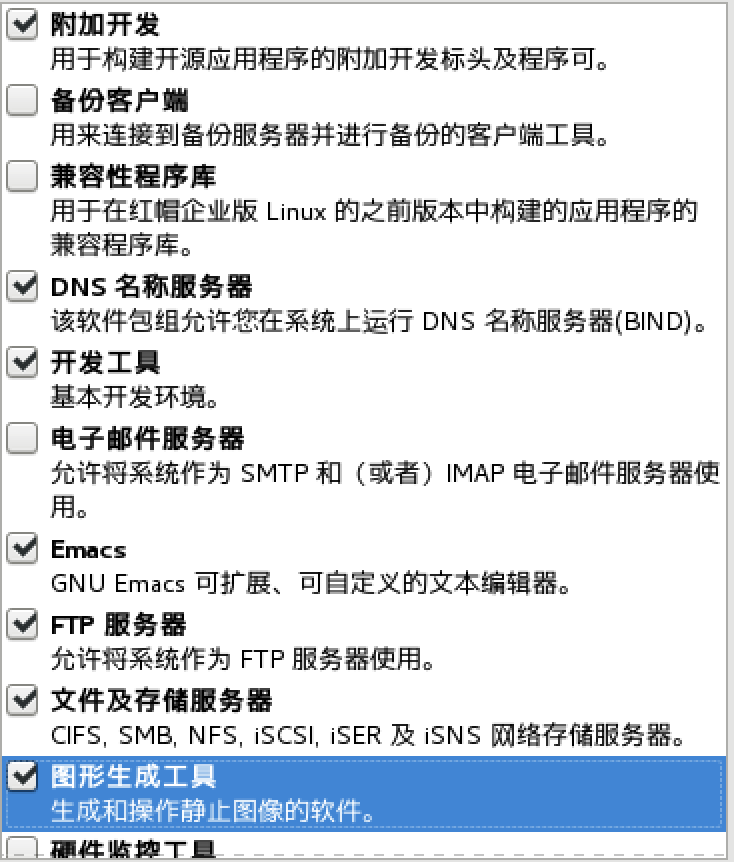
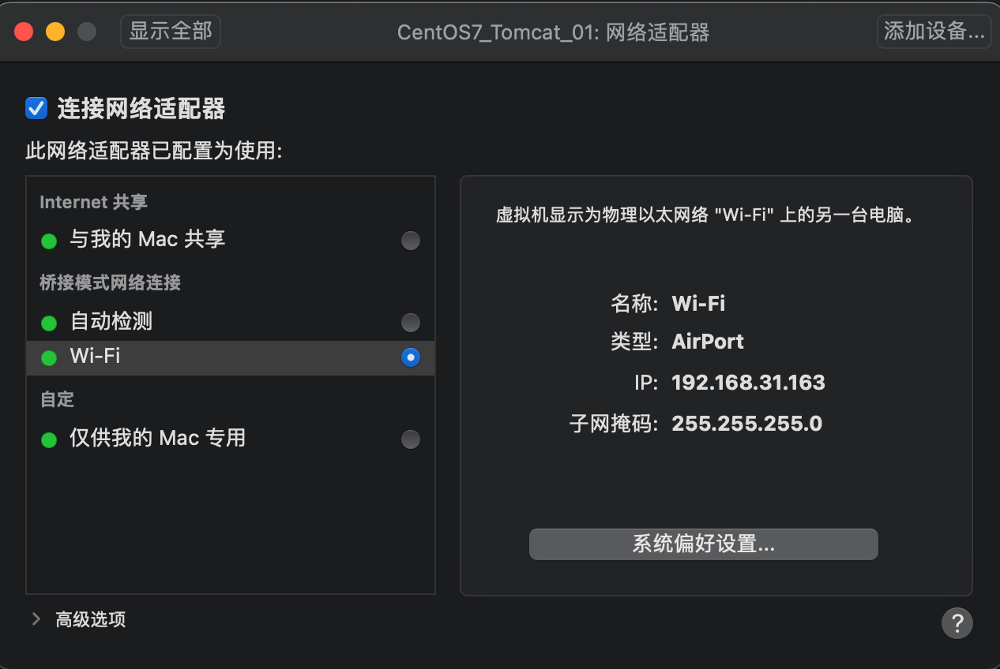
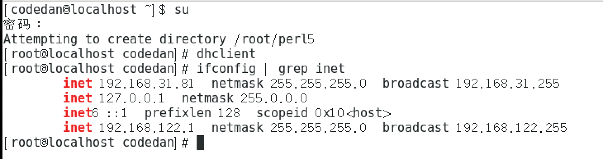

### Linux安装选择

首先Linux在安装时需要选择如下配置：




------

### Linux网络配置

首先计算机网络告诉我们，如果一条设备想要上网，那么必须接入外部互联网，首先你得去三大运营商去开户，获取你登入外部互联网的账号与密码。那么我们肯定会通过购买一个路由器当作网关的方式，去组建家庭局域网。那么此时就可以来设置虚拟机的网络了。

+ **在创建虚拟机的主力机上将虚拟机设置为桥连模式，让此虚拟机变成逻辑上家庭局域网的一份子。**



+ **通过下述指令让路由器给此虚拟机分配IP地址，并查看当前网络情况记录下此`IP地址`、`子网掩码`、`网关IP`**。

```tex
//使用管理员权限，去申请动态IP
> sudo dhclient 

//查看当前网络情况
> ifconfig | grep inet
```



+ **到`/etc/sysconfig/network-scripts/ifcfg-ens33`下去配置一下如下消息。**

```tex
> vim /etc/sysconfig/network-scripts/ifcfg-ens33
```

```tex
TYPE=Ethernet
PROXY_METHOD=none
BROWSER_ONLY=no
#修改第一处，将网络IP设置为静态IP
BOOTPROTO=static
DEFROUTE=yes
IPV4_FAILURE_FATAL=no
IPV6INIT=yes
IPV6_AUTOCONF=yes
IPV6_DEFROUTE=yes
IPV6_FAILURE_FATAL=no
IPV6_ADDR_GEN_MODE=stable-privacy
NAME=ens33
UUID=7f23d8dd-1e4d-4ffd-a3d5-8f4acfebf571
DEVICE=ens33
#设置第二处，使用此处配置
ONBOOT=yes
#设置第三处，设置网络IP
IPADDR=192.168.31.94
#设置第四处，设置子网掩码
NETMASK=255.255.255.0
#设置第五处，设置网络网关
GATEWAY=192.168.31.1
#设置第六处，设置DNS服务器地址
DNS1=119.29.29.29
```

```tex
//重启网络服务
> systemctl restart network.service
```
