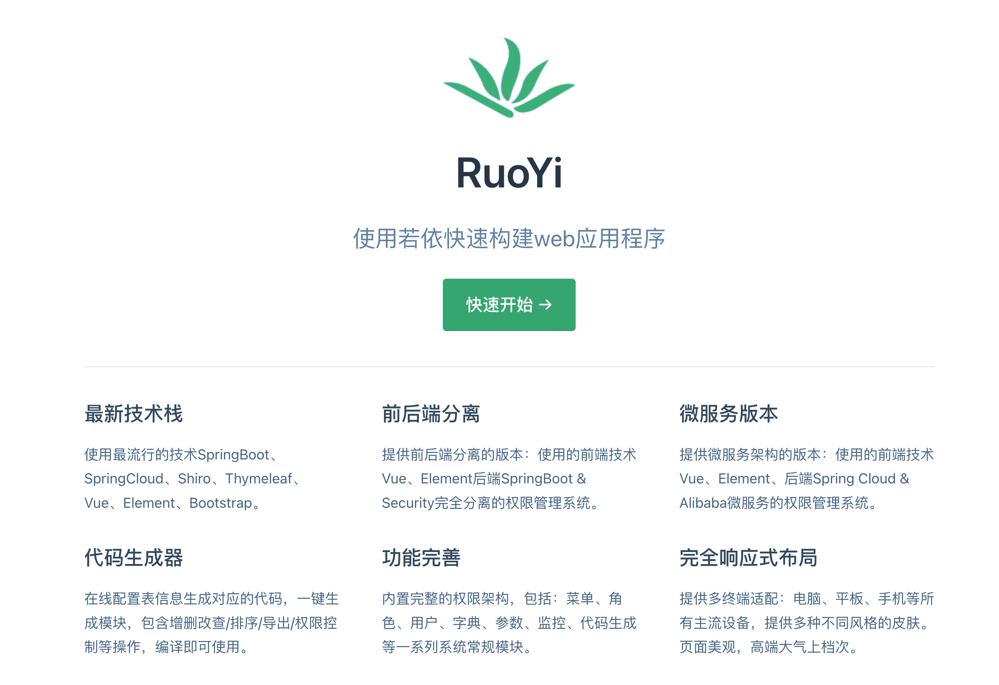

### 部署单体ruoyi项目

让我们来看看ruoyi项目使用哪些技术栈(很适合初学者去学习)，如下图所示：



将ruoyi项目进行部署，可以体验前后端分离的部署流程(单体架构Ruoyi，以后出一个微服务Ruoyi的部署)。

&nbsp;

##### 环境准备

那让我们来看看部署`RuoYi`项目，需要准备哪些前置环境。

+ 一个完整的局域网（作者家庭局域网是小米路由器搭建，网关为`192.168.31.1`）

+ 多台已经加入局域网可以访问外网的虚拟机(不需要做内网穿透)，如下为笔者自己的虚拟机环境。
  
  + **192.168.31.94:6479**：为Redis部署虚拟机
  
  + **192.168.31.186:3306**：为MySQL部署虚拟机
  
  + **192.168.31.24:80**：为nginx以及前端部署虚拟机
  
  + **192.168.31.81:8080**：为tomcat以及后端部署虚拟机
  
  + **192.168.31.155:8080**：为tomcat以及后端部署虚拟机

+ 一台位于局域网内的可操作代码主机(windows / mac)以及具备集成开发环境

+ 已经做好token处理并且配置完毕的git(如果能搭个梯子是最好啦，github那个网络环境一言难尽)

&nbsp;

##### 部署流程

**第一步：在指定的目录下，使用Https将Ruoyi项目从Github远程库中clone下来。**

```git
git clone https://github.com/yangzongzhuan/RuoYi-Vue-fast.git
```

&nbsp;

**第二步：在项目部署之前，，我们需要将数据库创建、表导入(sql位于项目根路径下)以及在本地集成开发工具中将项目run起来一边，这样才能保证部署的项目可以正常运行(此步骤需要将Idea的maven进行配置后，才可将项目进行引入)。**

+ 第一处修改地点：application.yml中redis的配置，如下所示。


+ 第二处修改地点：application-druid.yml中mysql的配置，如下所示。


+ 第三处修改地点：logback.xml中采用系统文件进行日志输出的文件地址(注意此地址填写自己计算机已存在的路径)，如下所示。


<mark>完成上述修改，那么项目就可以在本地运行起来</mark>

&nbsp;

**第三步：使用git将Ruoyi前端项目clone下来后，打包为zip文件发送到192.168.31.24:80虚拟机中，将zip文件进行解压缩。**

```git
//项目中ruoyi-ui即是前端项目
git clone https://gitee.com/y_project/RuoYi-Vue.git
```

```tex
> unzip ruoyi-ui.zip
```

&nbsp;

**第四步：192.168.31.24:80虚拟机安装Vue脚手架的依赖，即node.js的安装中的npm指令后将前端项目进行构建打包。**

[linux安装npm_热心市民小姜的博客-CSDN博客_linux npm](https://blog.csdn.net/qq_40830217/article/details/122335267)

```tex
//跳转到项目中
> cd ruoyi-ui
//进行项目脚手架搭件
> npm install --unsafe-perm --registry=https://registry.npm.taobao.org
//进行项目打包
> npm run build:prod
```

**<mark>打包完成后项目中会出现`dist`目录，记住此目录的路径，需要在nginx中配置的</mark>**

&nbsp;

**第五步：192.168.31.24:80虚拟机下去修改nginx的配置文件nginx.conf，修改内容如下所示。**

```tex
//修改第一处，将注解取消，并设置为root用户
user  root;
//修改第二处，设置前端跳转路径
        location / {
            root   /root/workspace/ruoyi-ui/dist;
            index  index.html index.htm;

        }
```

```tex
//重启nignx
> nignx -s reload
```

&nbsp;

**第六步：在主力机上通过访问192.168.31.24:80来测试nginx是否正常将前端请求转发至部署的前端项目中，并打开网络抓包工具，获取后段请求url中/prod-api/路径。**


<mark>此`/prod-api/`路径是要在nginx中进行配置的，需要要查看一下是不是/prod-api/</mark>

&nbsp;

**第七步：需要在本地修改后端项目打包方式为war包，并修改将spring boot项目自带的tomcat的生命周期设置为打包部署失效，最后修改boot项目启动方式即可**

+ 在pom.xml中修改内容如下

```xml
    <groupId>com.ruoyi</groupId>
    <artifactId>ruoyi</artifactId>
    <version>3.8.3</version>
    <packaging>war</packaging>
```

+ 在pom.xml中修改tomcat生命周期内容如下：

```xml
        <!-- SpringBoot Web容器 -->
        <dependency>
            <groupId>org.springframework.boot</groupId>
            <artifactId>spring-boot-starter-web</artifactId>
        </dependency>

        <dependency>
            <groupId>org.springframework.boot</groupId>
            <artifactId>spring-boot-starter-tomcat</artifactId>
            <scope>provided</scope>
        </dependency>
```

+ 在原本`ruoyiAppilication`启动类相同路径下创建`RuoyiStartApplication`作为新的部署启动类。类内容如下：

```java
import org.springframework.boot.builder.SpringApplicationBuilder;
import org.springframework.boot.web.servlet.support.SpringBootServletInitializer;

public class RuoYiStartApplication extends SpringBootServletInitializer {
    @Override
    protected SpringApplicationBuilder configure(SpringApplicationBuilder builder) {
        return builder.sources( RuoYiApplication.class );
    }
}
```

&nbsp;

**第八步：将后端项目直接发送到192.168.31.81:8080虚拟机以及192.168.31.155:8080虚拟机的指定目录下**

&nbsp;

**第九步：使用maven指令将项目原本编译清空后，重新对项目进行war包的打包**

[Linux安装maven(详细教程)_黄金龙666的博客-CSDN博客_linux安装maven](https://blog.csdn.net/weixin_58276266/article/details/122566931)

```tex
//跳转到后端项目中
> cd Ruoyi-Vue-Fast

//将项目原本编译结果删除
> mvn clean

//重新对项目进行编译打包
> mvn package
```

**<mark>完成上述操作后，即可获取到此项目的war包文件，此文件即将被放入tomcat中</mark>**

&nbsp;

**第十步：将项目war包丢入tomcat目录下webapps目录中，并对tomcat配置文件进行修改。完成项目路径的虚拟映射**

```tex
<Context path="/" docBase="/usr/local/apache-tomcat-8.5.81/webapps/ruoyi" reloadable="false"/>
```

```tex
//启动tomcat
> ./start.sh
```

&nbsp;

**第十一步：192.168.31.24:80虚拟机上修改nginx的配置文件，将后端请求转发到部署后端的两台服务器上即可。**

```tex

```
