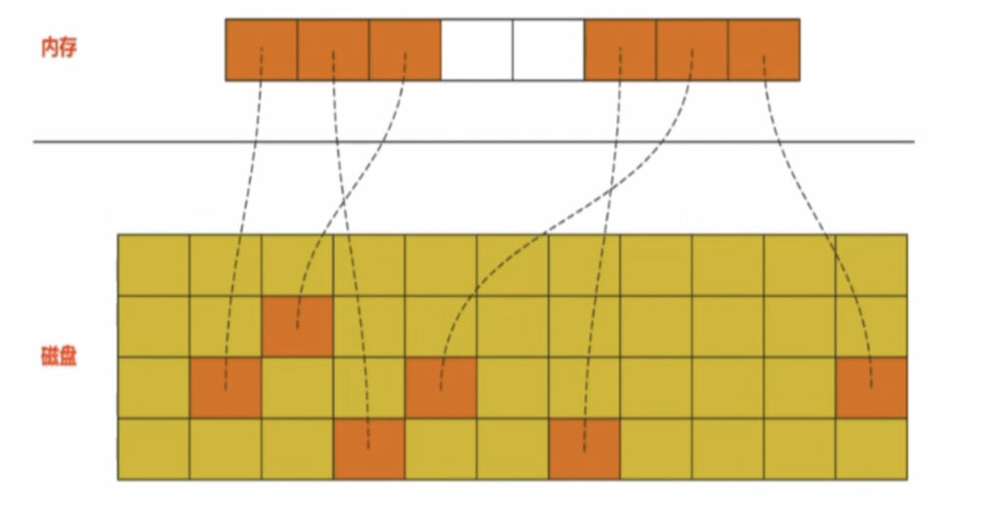
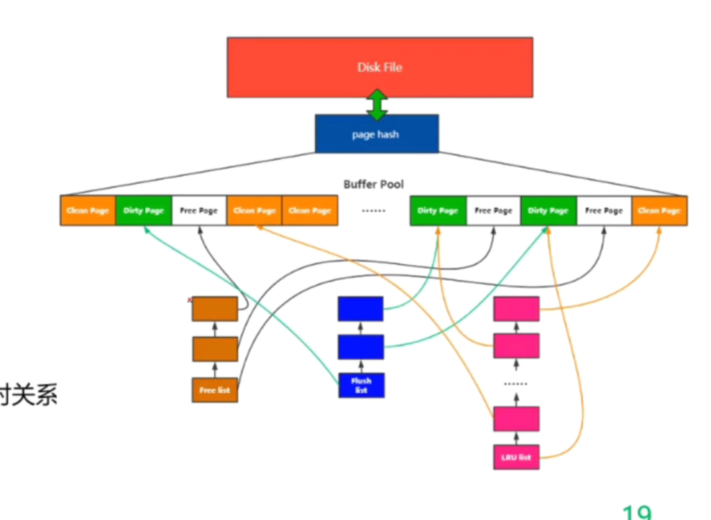
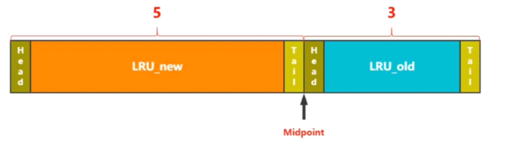

### InnoDB存储引擎内存管理

> 还记得我们最开始说的，数据库数据会出现在两个地方，第一个地方就是存储引擎内存中，第二个地方也就是当前MySQL所属机器的磁盘上。那么现在就可以来看看数据页在存储引擎内存中是如何被管理的。

InnDB内存管理分为三个步骤：我们也是对三个步骤进行详细说明。

1）**预分配内存空间**

2）**数据加载单元**

3）**数据内外存交换**

&nbsp;

##### InnoDB内存管理之预分配内存空间

即**分配一块连续的内存空间，用作存储引擎存放数据的空间**。**这个空间也就是我们常说的Buffer Pool分配的内存了。**

那么为什么不直接存储一个数据就开辟一块空间进行存储呢？主要是数据库哪怕内存存储数据和磁盘中存储数据相比，相对而言存储的数据是很小，但是每次开辟和销毁内存空间对于系统性能开销来说也是不小的消耗。所以采用的是直接创建一块固定大小的连续内存，用来存储数据库缓存。

&nbsp;

##### InnoDB内存管理之数据加载单元

即**预分配内存空间中，是以数据页作为基本的数据单元来进行存储的，而不是一条记录作为数据单元。**

<mark>***注意：加载数据页的时候默认加载16KB，最少拥有两条记录。***</mark>

那么为什么是采用数据页，而不是记录呢？这得逐个分析一下，首先在空间利用率上，存储一个数据页，可能会发生这个数据页中只有两条记录，还有一大片非分配空间。但是我们还是得存储16kb的大小。反之如果存储一条记录的话，那可以说是空间利用恰到好处。

**但是以记录为内存存储数据单元的话，缺点影响可比良好的空间利用率要大。**

1. ***维护映射关系***。内存中存储记录，还得额外保存此记录在磁盘中数据页地址的映射关系(如下图所示)。

2. ***同步流程繁琐***。修改内存中记录之后需要把记录同步到磁盘中指定数据页的时候，还需要在数据页中寻找记录所在进行修改。同步数据页的话，直接同步上去即可。

3. ***频繁的IO次数***。缓存从磁盘中加载数据到内存中时，加载一个16KB数据页是批量I/O加载，但是加载16条记录可是频繁I/O加载才能做到。

&nbsp;

##### innoDB内存管理之数据内外存交换

内存存储数据的大小肯定比不了磁盘中存储数据的大小，那么也就意味着内存无法加载所有磁盘中的数据，当内存存储空间占满之后，又想加载新的数据页到内存中，此时就要发生内外存的交换机制了。

**内外存交换即当内存空间占满时，内存中某个数据页要不被刷回磁盘中，要不直接淘汰掉后，再加载新的磁盘中数据页上来。**

-----

### InnoDB内存管理细节

上述只是简单介绍了一下innodb中这块内存空间的分配，存储单元和内外存交换。我们还需要知道这块内存<mark>"内存中的数据页种类"</mark>以及<mark>"内存中数据页的管理"</mark>。

##### 问题一：内存中的数据页种类页？

存储在内存中的数据页被分为三种数据页：

1）**空页**(Free Page)：即还没有加载磁盘中对应数据页的内存空间

2）**只读页**(Clean Page)：即加载后只是用来读取数据的数据页，不会发生修改。

3）**脏页**(Dirty Page)：即发生页内记录修改，但是还没有同步到磁盘中对应映射的数据页中。

&nbsp;

##### 问题二：内存中数据页的管理？

下图为内存管理组件完整图：

1）***Disk File(磁盘中的文件)***：即保存在磁盘中的数据页。

2）***page hash***：维护内存Page和文件Page的映射关系表。

3）***Buffer Pool***：即分配的存储数据页的内存空间

4）***FreeList***：空闲Page组成的链表，用来维护Buffer Pool中空闲Page。

5）***Flush List***：脏页Page组成的链表，用来维护Buffer Pool中脏页Page。

6）***LRU LIst***：即逻辑上被分为LRU_Old和LRU_New两个LRU List，目的是为了解决单个LRU结构下，热数据被冷数据淘汰问题。**LRU List存放了Buffer Pool中所有的Dirty Page和Clean Page。**

&nbsp;

##### 问题三：磁盘数据页到内存数据页的加载过程？

***情况一：FreeList链表中拥有空闲Page***。即先确定加载数据页所在磁盘中位置，然后从Free List列表中获取一个空闲Page地址。随后建立他们两个内存和磁盘中的映射关系存入Page Hash中，最后在空闲Page中写入对应的数据页并把此数据页加入到LRU_OLD中。属于冷表中最热的数据。

***情况二：Freelist链表中没有空闲Page***。即虽然已经确定加载数据页所在磁盘中位置，但是Free List列表已经没有空闲Page能分配了，此时就要LRU List去淘汰Buffer Pool中的Dirty Page或者Clean Page来保证新的数据页能有空闲Page加载。正常是通过淘汰LRU_OLD区的尾数据页来清出空间，当尾数据页有可能被使用时候，就要通过LRU Flush去把LRU_OLD尾部的第一个能刷盘的数据页进行刷盘操作，然后清出一个空的数据页。这个空的数据页在LRU_OLD中位置不变，现在空的数据页加入到Free List列表中，完成情况一的加载。由于此数据页加载了新的数据页，所以其也从之前的位置变到了LRU_OLD首部(head);

&nbsp;

##### 问题四：LRU中冷热数据页的迁移？

这个重点在要清楚LRU List的结构组成，即逻辑上被分为LRU_NEW和LRU_OLD两个LRU列表，如下所示：

一共三个组件组成：LRU_NEW列表，MidPoint指针，LRU_OLD列表。

1. **LRU_NEW**：即热数据页存放列表，冷数据页的加载不会影响到此LRU列表。

2. **LRU_OLD**：即冷数据页存放列表，一般全表扫描加载的数据页都在LRU_OLD中，这样可以防止热数据页被因为全表扫描而被淘汰。

3. **midPoint指针**：即LRU_NEW和LRU_OLD的分解指针，其总是存在于让LRU_NEW：LRU_OLD为5:3的分解位置。

<mark>知道组建之后就需要了解一下两个关键的步骤，</mark>

***即"LRU_NEW中的热数据向LRU_OLD中如何迁移"，"LRU_OLD中的冷数据向LRU_NEW中如何迁移"。***

1) **LRU_OLD中的冷数据向LRU_NEW中迁移过程**：即当我们访问在LRU_OLD中的冷数据页时，会去检测这个冷数据页在LRU_OLD中有没有存储一定的时间(innoDB_old_blocks_time)，超过这个时间参数就有机会自动升入到LRU_NEW中成为热数据。
2. **LRU_NEW中的热数据向LRU_OLD中迁移过程**：由于在LRU_NEW区的数据再冷，相对于LRU_OLD区的数据也是够热的，所以也是直接移动到LRU_OLD的head首部中。那么到底是怎么移动的呢？

一般LRU_NEW不主动向LRU_OLD的头部插入数据，而是通过从LRU_OLD中获取晋升的数据页，不断增加LRU_NEW的总体大小，压榨LRU_OLD的空间，使其比例不再是5:3，那么这个时候midpoint指针就会重新指向当前比例5:3的地方，那么此时之前LRU_NEW尾部的数据自然也就变成了当前LRU_OLD的头部数据了。

&nbsp;

##### 关于LRU_NEW的优化操作

即热数据被使用时，当前热数据所在数据页自然也要插入到LRU_NEW的头部，虽然修改几个指向不需要消耗系统资源，但是多线程下这个操作必定是要加锁的，那么必然是有锁开销的。**所以MySQL提出"尽量减少移动次数"的方案进行优化**，即不再是你使用了热数据，那么这个对应的热数据页立马获取锁之后去插入到头节点之后。

<mark>简单说来就是把这个热数据页的多次移动变成一次移动，来减少锁的开销</mark>。

这需要关注两个参数，第一个参数是freed_page_clock第二个参数也就是LRU_NEW长度的1/4值。

第二个参数没必要多解释，第一个参数代表全局Buffer pool中被淘汰的数据页个数。

我们假设待移动数据页在Head节点之后时free_page_clock为Y，那么当满足下述公式时，移动当前检测数据页到Head头部之后。

**当前Free_page_clock - Y > LRU_NEW *1/4**
