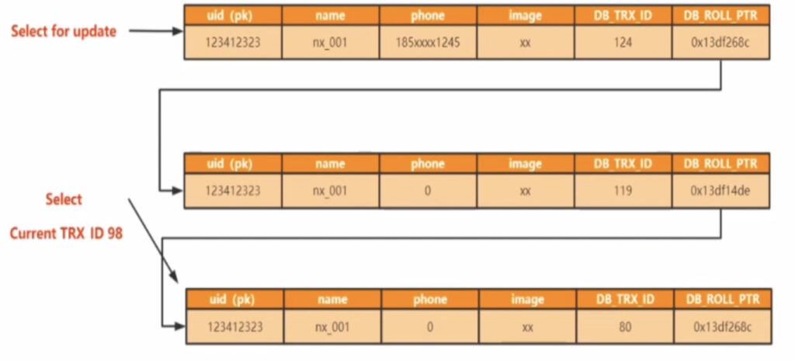
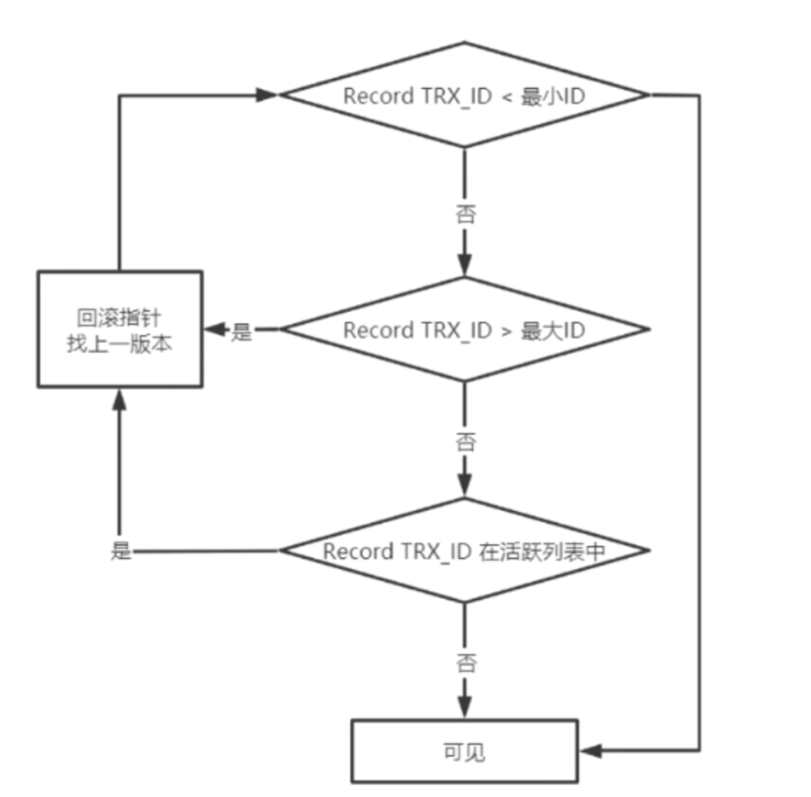
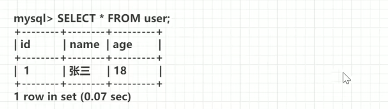
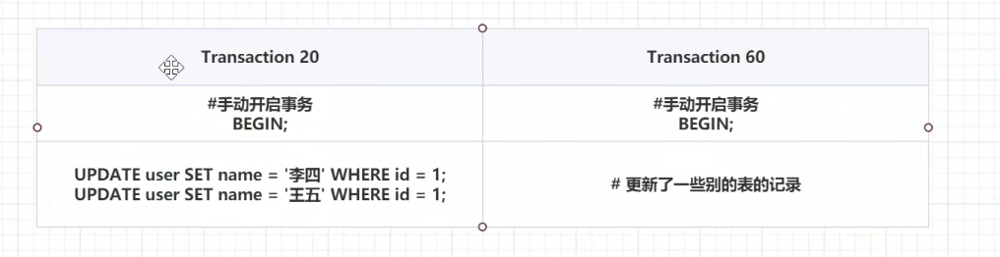
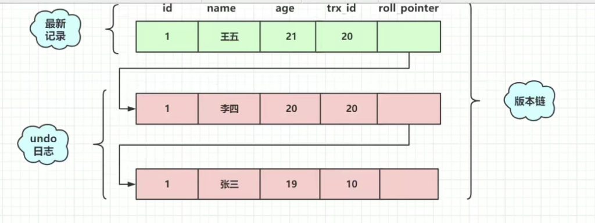
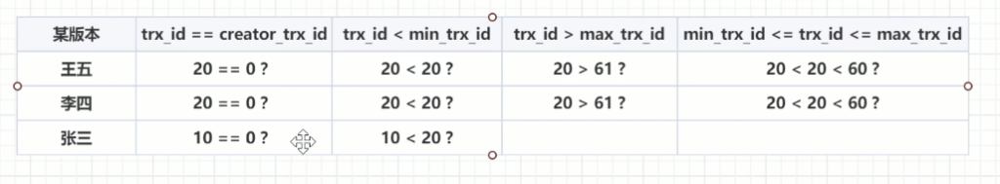

### MySQL事务ACID与组成

##### MySQL事务基本特征

+ ***Atomicity***：即事务原子性，表示事务中的指令集是不可再分的，是一个整体。要不都完成，要不都不完成。

+ ***Isolation***：即事务隔离性。表示数据库允许多个并发事务同时对其数据进行读写和修改的能力，隔离性可以防止多个事务并发执行时由于交叉执行而导致数据的不一致。

+ ***Durability***：即事务持久性。表示数据被事务修改提交之后，应该是永久有效的。

+ ***Consistency***：即事务一致性。表示事务执行前后，数据没有中间状态，只能从一个状态转变成另一个状态。

----

### 数据库并发问题与事务隔离级别

一般来说对于多事务并发情况下，就会出现事务并发问题，主要归为下述三类：

1）***Dirty Read***：即当前事务可以读取到其他事务修改后还未提交的数据。

2）***Not-Repeatable-read***：即当前事务读取相同的数据时，两次读取的数据并不相同。

3）***Phantom problem***：事务A 按照一定条件进行数据读取， 期间事务B 插入了相同搜索条件的新数据，事务A再次按照原先条件进行读取时，发现了事务B 新插入的数据 称为幻读。

**需要注意一下Not-Repeatable-read和Phantom problem的区别，前者是对于已经存在的数据进行操作(修改，删除)后被不同时期事务获取到不同时期的数据。后者则是对新插入的数据前后进行的数据范围获取。**

而MySQL是如何解决上述事务并发问题的呢？首先是通过设定四种完全不同的事务隔离级别来解决的，但是这四种事务隔离级别也是并发性能和事务数据安全之间的权衡。

1）***Read uncommit***：事务隔离最低级别，即未提交读级别，此级别主要是能读取到其他事务未提交数据即Dirty Read问题。但是也存在Not-Repeatable-read和Phantom problem问题。

2）***Read commit***：即已提交读级别，此级别主要是事务执行过程中可以读取到别的事务在其开始后提交的数据。即Not-Repeatable-read问题，其次还伴随着Phantom problem问题。但是Dirty Read问题已经被解决。

3）***Repeatable read***：即可重复读级别，此级别每次读取数据都是相同的数据，不会发生变化。解决了Not-Repeatable-Read问题，但是还存在Phantom-Problem问题。

4）***Serializable***：事务隔离最高级别，即串行化级别，通过加锁的方式，让事务一个一个的顺序执行。

一般来说事务隔离等级越高，那么此数据库在多事务并发下，数据越安全。MySQL数据库默认事务隔离级别是Repeatable-Read级别。

----

#### Read Commit与Repeatable Read深度解析

大家有没有想过，RC(Read Commit)是如何解决Dirty Read的问题的，RR又是如何解决Not-Repeatable-Read问题的呢？

这两个事务隔离级别实现的根本在于MVCC多版本并发控制机制，那么什么是多版本并发控制机制呢？

MVCC多版本并发控制主要是通过数据行的多个版本来控制数据库的并发，在InnoDB中实现MVCC主要是为了解决读-写冲突，我们知道在加读写锁时，两个锁是相互排斥的，那么我们在进行修改数据的同时，同一个数据无法被读取。这样的数据可以保证线程安全，虽然并发性能却很低。但是我们可以获取最新的数据。所以加锁读也被称为"当前读"。

所以和当前读不同的是，**MVCC通过无锁的形式去增加并发性能，但是在获取数据上，就不一定是最新的数据了，也有可能是此数据的老版本数据。**

MVCC能完成上述功能主要就是依赖其几个组成组件：

1）**隐藏列**：即每个记录除了必须的元数据字段之外，还存在一些隐藏字段。分别是trx_id字段与roll_pointer字段。

1. *trx_id字段*：即当前修改此记录中数据的事务ID，用来当作数据版本。
2. *roll_pointer字段*：即指向当前记录之前数据版本的内存地址指针。用来定位不同的数据版本。

2）**undo log日志**：undo log日志分为**insert undo log 和 update undo log两种**，其中insert事务操作生成的insert undo log只在事务回滚的时候有用，该事务提交之后就会删除此insert undo log。

而update undo log则是update和delete事务操作产生的undo log，可用于MVCC的数据版本管理和事务回滚。在对roll_pointer字段解析的时候，提到过当前记录的不同数据版本，那么这些当前记录的不同数据版本存放在哪呢？试想如果存储在数据页的记录堆中，当之前的老旧记录版本再也使用不到的时候，加载数据页会浪费多少空间？所以肯定不会使用数据页去存储老旧版本记录，**要注意数据页只存储当前记录的最新数据。**(关于数据页不明白的同学可以看看我的另外两个博客["MySQL底层存储结构"](http://www.studylove.cn:8000/2022/03/23/innodb%e5%ad%98%e5%82%a8%e5%bc%95%e6%93%8e%e5%86%85%e5%ad%98%e7%ae%a1%e7%90%86/),-,["InnoDB存储引擎内存管理"](http://www.studylove.cn:8000/2022/03/22/mysql%e5%ba%95%e5%b1%82%e5%ad%98%e5%82%a8%e7%bb%93%e6%9e%84/))

所以MySQL专门使用undo log日志来存储记录的不同版本，如下所示：

第一条记录作为数据库最新版本数据被储存在数据页中，不过其的roll_point字段只也指向update undo log中最新版本数据。( 数据库中最新版本 > undo log 中最新版本 )

那么undo log中的记录版本数据是如何进入到undo log中的呢？我们从MySQL的三层模型中分析。

1. 当客户端层面完成用户认证之后，向MySQL业务逻辑层发出Update SQL。
2. MySQL业务逻辑层通过SQL Interface，编辑器，优化器后向存储引擎层中InnoDB发出对应指令。
3. 此时InnoDB会将数据页中此记录先原封不动的copy一份到undo log中(版本链完整)，然后修改数据页中记录的数据以及trx_id和roll_pointer字段，trx_id当然是修改为当前修改数据的事务ID作为新的版本号，roll_pointer指针则是指向刚刚copy到undo log中的记录数据版本。

***对于在undo log日志中全部旧数据形成的链表被称为版本链。这些数据版本也成称为Record。***

3）**ReadView视图**：MVCC可见性的关键组件，当多个事务同时对同一条记录进行Update操作时，每个事务会被分配一个事务号作为其Update操作此记录的版本号。通过版本号的顺序插入到undo log日志中。那么此时如果一个事务需要查询此记录中数据，那么它是查询哪一个版本的数据呢？

ReadView本质上是一个读视图，即当此事务开始时，会生成一个数据库当前数据快照。此快照中记录了很多MVCC相关操作的元数据，比如下属几个元数据：

1. ***creator_trx_id***：即创建此ReadView视图的事务ID，不过需要注意的是只有写操作事务会被分配事务ID，读操作事务的事务ID默认为0。
2. ***m_ids***：即表示在生成ReadView视图时当前数据库中还在执行中的事务ID列表。
3. ***min_trx_id***：即m_ids中最小活跃事务ID。是一个很重要的参考值
4. ***max_trx_id***：即当前ReadView视图创建时，系统会给下一个事务分配的事务ID。

----

### 版本链使用流程

知道MVCC的组成组建之后，就可以来说说ReadView的可见性规则了，首先我们看看下述流程图：

当一个读事务来获取数据时，首先会读取最新的record_trx_id，也即是最新数据版本，最新数据版本存在于Buffer pool的数据页中，

(1)如果最新版本的事务ID小于min_trx_id值，那么可以获取到此数据版本的数据

(2)反之去看看最新版本的事务ID是不是大于max_trx_id，如果不大于说明可能位于m_ids中，需要再去m_ids中对比，如果大于直接通过roll_point指针去上一个数据版本，再重复开始流程。

(3)流程2中，需要再去m_ids对比时，如果存在于m_ids中，说明当前数据版本属于活跃状态，那么只能通过roll_point指针去上一个数据版本，再重复开始流程。反之不在m_ids中，则说明当数据版本属于非活跃状态，可以获取当前版本数据。

-----

### **MVCC的具体操作流程**

1）建表

&nbsp;

2）不同会话的不同事务之间操作

&nbsp;

3）查看此时对应得版本链

&nbsp;

4）建立并查看readview

&nbsp;

5）快照对应版本数据

**通过快照对应版本数据分析，可以获取到版本为10的数据。**

&nbsp;

----

### 结论

通过上述MVCC获取不同数据版本的流程，现在就可以说说Repeatable Read和Read Commit两个级别是如何借助MVCC来实现的了

1）MVCC实现Read Commit事务隔离级别：Read Commit级别下会出现不可重复读的问题，也就是两次读取的数据结果不同，主要原因是在此隔离级别下，创建事务时会创建一个ReadView快照视图，但是此事务执行select指令的时候，会刷新一次ReadView视图，也就是说在两次Select操作中，数据获取依据的ReadView是不同的，可能第一次Select刷新ReadView时，获取的数据版本是小于min_trx_id的数据，第二次Select刷新ReadView时，获取的是上个ReadView中处于m_ids中，但是此ReadView已经不再m_ids中的数据版本。

2）MVCC实现Repeatable Read 事务隔离级别：懂得了RC的实现之后，一句话就可以解释如何实现RR级别的，在此隔离级别下，ReadView只有在事务诞生的时候，才会创建出来。之后并不存在刷新操作。始终读取同一个ReadView。

----

## MySQL事务ACID是如何被保证的

1）***Atomicity原子性保证***：通过insert undo log以及update undo log的回滚机制来保证事务的原子性。

2）***Durability持久性保证***：通过redo log日志记录数据页中数据的改变，来完成事务的持久性。

3）***Consistency一致性保证***：即通过undo log和redo log一起来保证事务的一致性。

4）***isolation隔离型保证***：通过MVCC机制和当前读来保证事务的四大隔离性。
