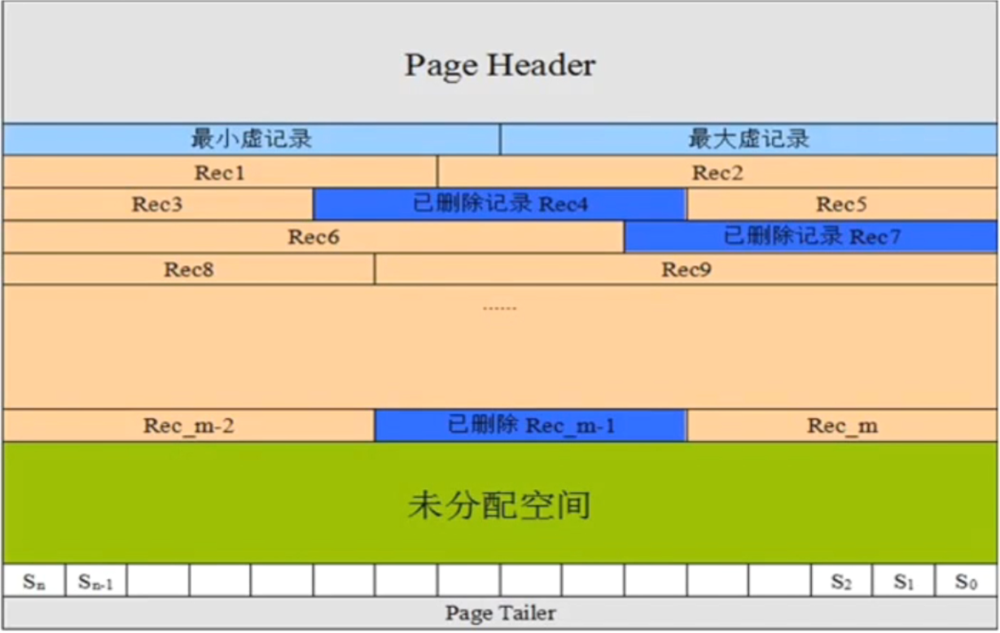
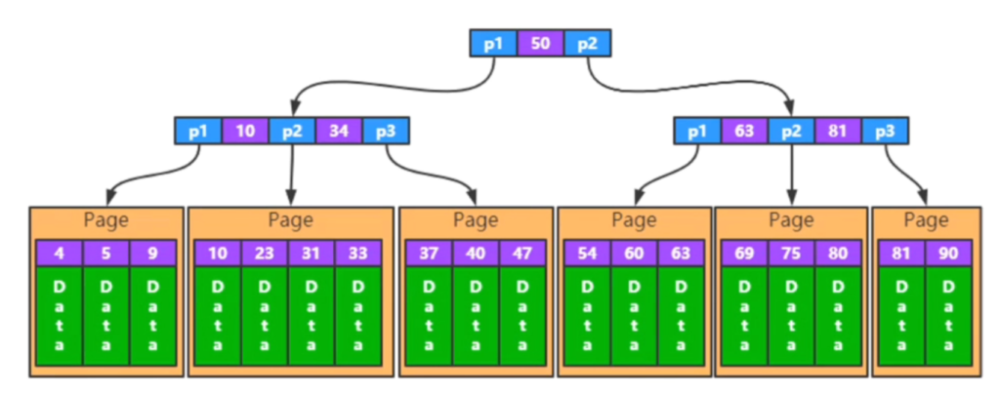
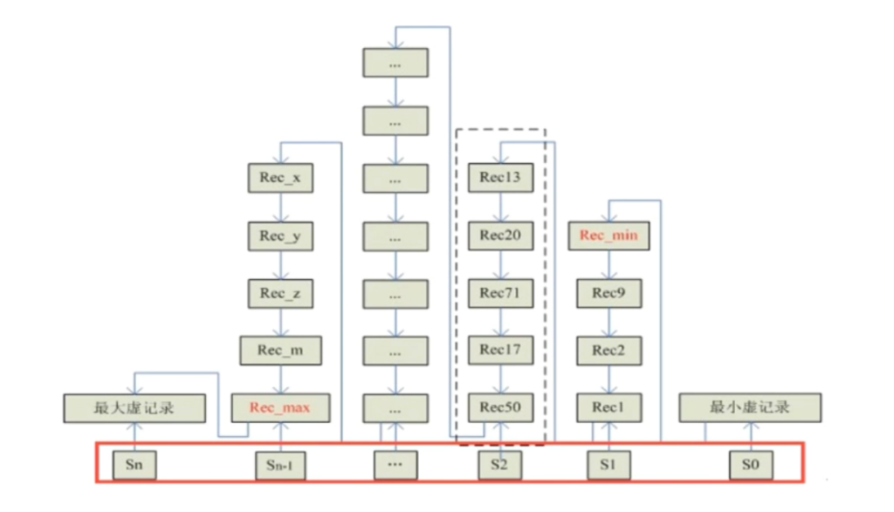

### MySQL底层存储—数据页解析

先说明，不涉及到非常具体的参数等等，毕竟不是BDA，没必要了解那么清楚。

一个数据页由16KB组成，也就是16 * 1024=16384字节组成。那么数据页到底是由什么一共组成到16KB的呢？整体组成由下图所示：

1）***Page Header(页头)***：记录页面的控制消息，共占用56个字节，包括页的左右兄弟页面指针，页面空间使用情况等等。**注意：包括页的左右兄弟页面指针，说明数据页之间是有相互指针的，底层是双向链表。**

2）***最大最小虚记录***：虚记录就是不存在的记录。

1. **最大虚记录**：比当前数据页中最大实际记录主键(聚簇索引选取的字段)还大的记录。
2. **最小需记录**：比当前数据页中最小实际记录主键(聚簇索引选取的字段)还小的记录。

3）***记录堆***：此数据页中已经记录成功的数据记录。对于记录堆来说，删除已有记录后不会进行收缩，而是保留此记录的特征并标记已删除，比如主键，唯一键，索引键等。方便下次特征相同的数据加入时直接加入到此位置上。

4）***自由空间链表***：这个是帮助完成记录堆中删除记录的重新插入的，被标记删除的记录地址空间会被记录到自由空间链表中，方便特征符合的记录寻找到删除记录的位置，进行插入。

5）***未分配空间***：属于数据页的未使用区域，等待记录的到来。

6）***Slot区***：这是优化查询区，**是一块连续的空间。**这要结合记录堆组成的数据结构——双向链表来说明。

7）***页尾***：占8个字节，主要存储页面的校验消息。

-----

### 解析记录堆

**问题**：我们要知道记录堆到底是采用什么数据结构，这个数据结构到底是物理有序还是逻辑有序？这个数据结构的插入策略是什么？这个数据结构如何查询记录？

对于一个表来说，我们可以把他抽象为一颗聚簇索引的B+树，即如下所示的B+树。

Page也就是我们的数据页，其中的数据也就是我们的记录，每条记录的紫色开头为聚簇索引选取索引字段，后紧跟记录其他完整字段。这些字段的集合也就是记录堆。

&nbsp;

**问题一：记录堆采用的数据结构到底是物理有序还是逻辑有序？这个数据结构的插入策略是什么？**

物理有序的数据结构很明显是数组，但是如果我们使用数组结构来保存记录堆，那么数组的特性就是由于是一块连续的内存空间，所以查找指定记录的效率是很高的。

但是数组的缺陷也就是插入和删除操作的都会去收缩数组，这个收缩过程的时间复杂度为O(n)。而记录堆删除特性是不删除内存空间，而是标记这个内存空间已删除，然后保留这个记录的特征，以便特征相同的记录插入。

我们试想一下，一个大小为N字节的主键为2的记录被删除，那么就会保留这个大小为N个字节记录空间。但是如果下次符合主键为2的记录大小为M(M > N)，那么能不能被插入进去呢？反之如果M < N，那势必会造成空间浪费。

所以物理有序的数组结构其实并不太符合记录堆，再来看看逻辑有序的链表结构。

链表结构的优点就在于不在意每个节点的大小，插入和删除操作紧紧只是改变几个内存地址指针，可以说没有什么资源消耗。但是链表的查询却是其最大的缺点，正常链表的查询一般都是采用遍历的做法。

**但是不在意每一个节点的大小上，就十分符合记录堆的删除和插入流程**，不需要考虑原本节点的大小，只要特征一致，就可以借助空闲空间链表中此节点的指针插入到指定位置，完成替换。

&nbsp;

**问题二：此数据结构的插入策略？**

策略一：删除后符合特征顶替原来位置记录节点，这个上面说过了，不再啰嗦。

策略二：利用非分配空间做追加节点的处理。

&nbsp;

**问题三：此数据结构如何查询呢？**

通过上述分析我们可以确定记录页采用的就是双向链表结构，但是链表的查询问题还需要解决，也就是优化查询。不能光靠纯遍历做法。

MySQL采用Slot槽配合二分查找的思想来优化链表查询，具体数据结构如下所示：

