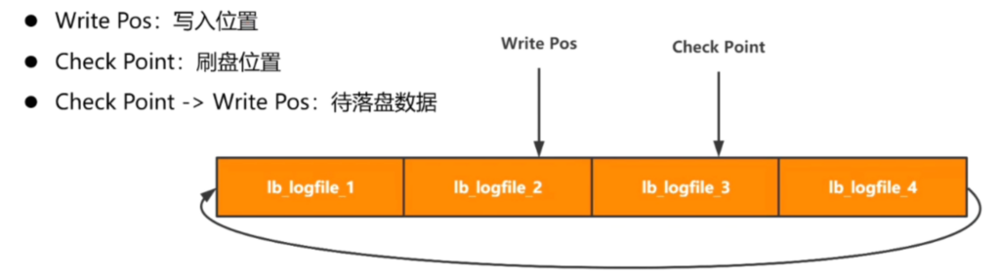
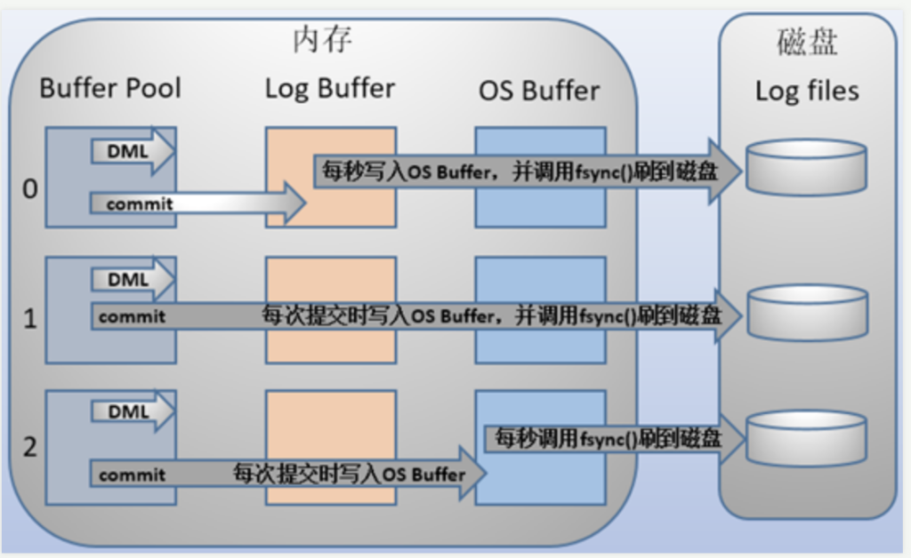

### Redo log日志

> **redo log日志主要是用来实现事务的持久性，属于物理日志，记录的是数据页的物理修改，而不是某一行或某几行修改成怎样怎样，它用来恢复提交后的物理数据页(恢复数据页，且只能恢复到最后一次提交的位置)。记住其是InnoDB存储引擎特有的。**

------

### redo log buffer日志作用

首先我们先来看看redo log日志的组成：

1）**Write Pos**：写入位置指针

2）**Check Point**：刷盘位置指针

3）**Check Point** -> Write Pos：待刷盘数据



通过上述结果我们会发现，其实redo log并不能长久的保存数据，而是通过写入后刷盘的方式，把写入数据刷入磁盘中，所以我们需要注意不能写入数据到还未刷盘的数据区域，不然就会引发数据覆盖。

接下来我们通过MySQL三层模型来分析一下redo log的运行流程：


1）当我们完成客户端的验证之后，就会来执行Update请求

2）在MySQL业务逻辑层首先发送修改数据指令到我们的存储引擎层，具体下来也就是InnoDB存储引擎。

3）innoDB存储引擎接受到指令，先把原来数据生成一个新的版本数据，并建立好版本链。

4）然后InnoDB会去存储内存中修改此数据

5）完成数据修改后，先写入到redo log日志中，等待commit指令到来后进行刷盘操作。

6）完成上述流程后，InnoDB告诉MySQL业务逻辑层数据修改完毕，可以进行事务提交了。

7）MySQL业务逻辑层发出事务提交Commit指令，来到innoDB存储引擎

8）innoDB存储引擎发送commot指令到redo log日志中，redo log开始执行刷盘流程。刷盘完成后即事务结束。

------

## Redo log日志文件刷盘解析

别小看redo log日志刷盘，这里面学问呢

首先我们得知道redo log日志其实分为两部分，**第一部分为redo log buffer，第二部分为redo log file。**

**redo log buffer**：属于redo log在数据库中的日志缓存，这也就是标志着这属于易丢失文件。

**redo log file**：属于redo log在磁盘中的日志文件，这次是真正持久文件。

刷盘也就是将redo log buffer中的写入的日志通过I/O的形式写入到磁盘中的redo log file文件上。那么根据持久化方案的不同，刷盘的流程也有所不同。

我们可以设置innodb_flush_log_at_trx_commit参数的值来控制刷盘的流程，参数可以选择0，1，2三种不同的持久化方案。



讲解之前，如果不知道Buffer Pool和OS Buffer是什么的同学，就简单认为Buffer Pool是数据库中保存数据的缓存，为了不每次修改获取数据都去访问存储引擎中的磁盘页，OS Buffer也是相同的东西，是操作系统为了不直接写入磁盘，而建立的数据缓存。两者是同一个思想在不同产品之间的落地实现。之后我完善MySQL博客的时候，会深入解析。

1）参数为0：即commit指令到达Redo log buffer之后，代表运行时每秒都会把日志写入到OS Buffer中，然后立即操作系统立即调用fsync()从其中刷到磁盘。

2）参数为1：即commit指令到达后，将此次事务中的事务日志写入到OS Buffer中，然后立即操作系统立即调用fsync()从其中刷到磁盘。

3）参数为2：即commit指令到达后，将此次事务中的事务日志写入到OS Buffer中，然后OS buffer每秒被操作系统调用fsync指令刷入到磁盘中。

这三种方式都会有一定的数据丢失，但是由于丢失程度不同，让我们可以在不同业务场景进行使用。

**当innoDB_flush_log_at_trx_commit = 0的时候**，是每秒从Redo Log Buffer中写入到OS Buffer，然后随即调用fsync()把日志刷入到磁盘中，那么我们就有可能丢失一秒的数据，即还没有刷到磁盘，数据库宕机就会丢失Redo Log Buffer以及Buffer Pool中的事务日志以及数据。

**当innoDB_flush_log_at_trx_commit = 1的时候**，是每次事务提交后，就把本次事务相关日志从Redo Log Buffer写入到OS buffer中，然后随即调用fsync()方法刷入到磁盘中。所以我们就有可能会丢失一次事务的数据，道理和上述相同。

**当innoDB_flush_log_at_trx_commit = 2的时候**，是每次事务提交后，就把本次事务相关日志从Redo Log Buffer写入到OS buffer中，由操作系统每秒执行一次fsync()指令刷入磁盘中，这种也可能会造成一秒内数据的丢失，但是安全性比0要高，毕竟是存放在Os Buffer中，操作系统崩溃概率要比数据库崩溃要低得多。

------

## 模拟Redo log日志刷入

建立模拟环境来测试一下，实际情况下redo log刷入磁盘的时间效率，从而好让我们在业务环节进行选择。

```sql
##编写存储过程，往表中插入指定数据。
drop PROCEDURE if EXISTS proc;
delimiter $$
create PROCEDURE proc(i int)
begin
    declare s int default 1;
    declare c char(50) DEFAULT repeat('a',50);
    while s <= i DO
        START TRANSACTION;
        insert into tb_test_flush_redo_log VALUES(null,c);
        COMMIT;
        set s=s+1;
    END WHILE;
end$$
delimiter ;
##执行存储函数，插入10w数据
call proc(100000);
```

**参数innodb_flush_log_at_trx_log = 1的时候，插入时间：**


**参数innodb_flush_log_at_trx_log = 0的时候，插入时间**：

```sql
mysql> set @@global.innodb_flush_log_at_trx_commit=0;
Query OK, 0 rows affected (0.00 sec)
mysql> truncate tb_test_flush_redo_log;
Query OK, 0 rows affected (0.04 sec)
```


**参数innodb_flush_log_at_trx_log = 2的时候，插入时间**：

```sql
mysql> set @@global.innodb_flush_log_at_trx_commit=2;
Query OK, 0 rows affected (0.00 sec)
mysql> truncate tb_test_flush_redo_log;
Query OK, 0 rows affected (0.04 sec)
```


通过上述分析会发现，当**innodb_flush_log_at_trx_log=1**时，也就是每次事务提交后从redo log buffer中把本次事务所有的日志写入到os buffer中，操作系统立马调用fsync()指令，刷入到磁盘中。这种方式插入10w条数据，共花费了6分20秒。

当**innodb_flush_log_at_trx_log=0**时，也就是每次事务提交后，每秒把redo log buffer中本次事务所有的日志写入到os buffer中，操作系统立马调用fsync()指令，刷入到磁盘中。这种方式插入10w条数据，共花费了2.24秒。

当**innodb_flush_log_at_trx_log=2**时，也就是每次事务提交后从redo log buffer中把本次事务所有的日志写入到os buffer中，操作系统每秒调用一次fsync()指令，刷入到磁盘中。这种方式插入10w条数据，共花费了2.57秒。

**同样是每秒，但是innodb_flush_log_at_trx_log=2的是每秒从OS Buffer中刷入到磁盘中，安全性能保证在操作系统级别。**

-------

## Redo log日志的总结

对于使用Redo log的好处如下所示：

**1）体积小，只是记录页的修改，并不进行页的修改。**

**2）末尾追加，随机写能变成顺序写。**
