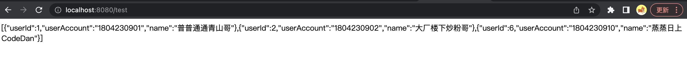
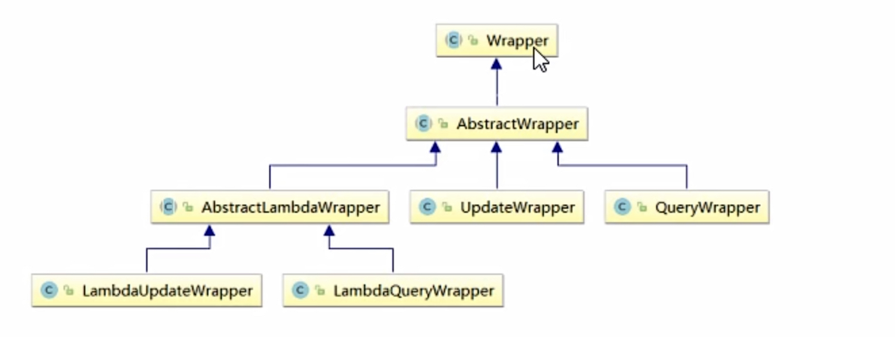
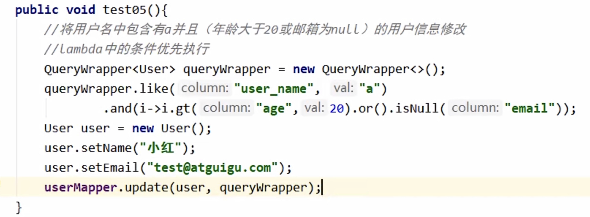
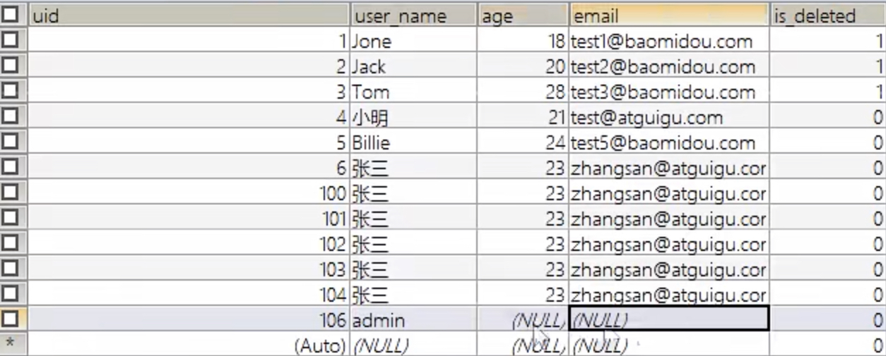
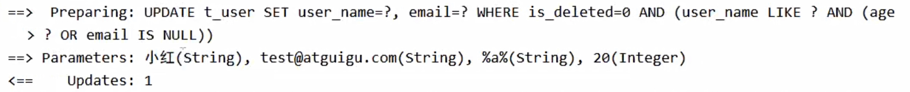
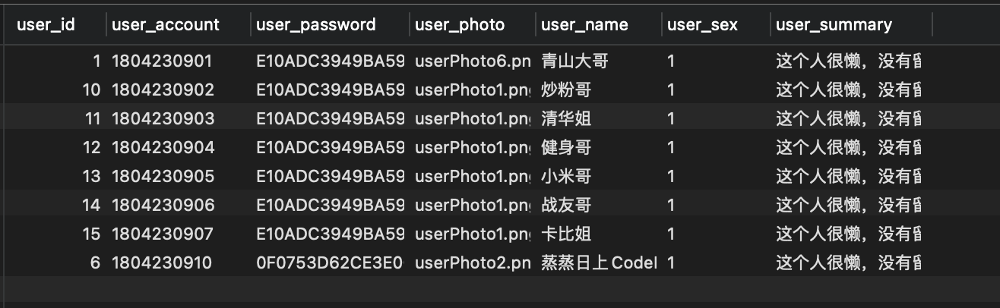

### MyBatis-Plus使用

首先使用环境上使用Spring boot来进行使用MyBatis-Plus，并且使用Maven项目去构建Boot的结构

***1）导入POM坐标***

```xml
 <dependencies>
        <dependency>
            <groupId>org.springframework.boot</groupId>
            <artifactId>spring-boot-starter-web</artifactId>
            <version>2.6.3</version>
        </dependency>

        <dependency>
            <groupId>mysql</groupId>
            <artifactId>mysql-connector-java</artifactId>
            <version>5.1.48</version>
        </dependency>

        <dependency>
            <groupId>org.projectlombok</groupId>
            <artifactId>lombok</artifactId>
            <version>1.18.20</version>
        </dependency>

        <dependency>
            <groupId>com.baomidou</groupId>
            <artifactId>mybatis-plus-boot-starter</artifactId>
            <version>3.5.1</version>
<!--     如果配置了日志输出，可以去掉下述代码，反之加上下述依赖即可       -->
            <exclusions>
                <exclusion>
                    <groupId>org.apache.logging.log4j</groupId>
                    <artifactId>log4j</artifactId>
                </exclusion>
                <exclusion>
                    <groupId>org.slf4j</groupId>
                    <artifactId>slf4j-api</artifactId>
                </exclusion>
<!--     如果配置了日志输出，可以去掉上述代码，反之加上上述依赖即可       -->
            </exclusions>
        </dependency>
    </dependencies>
```

&nbsp;

***2）配置数据库信息(application.properties)***

```properties
spring.datasource.driver-class-name=com.mysql.jdbc.Driver
spring.datasource.url=jdbc:mysql://101.43.73.10:3306/db_ChatRoom?useUnicode=true&characterEncoding=UTF-8&useJDBCCompliantTimezoneShift=true&useLegacyDatetimeCode=false&serverTimezone=UTC
spring.datasource.username=root
spring.datasource.password=zld19981016
```

&nbsp;

***4）构建启动类Application.java***

```java
@SpringBootApplication
@MapperScan(basePackages="cn.wtu.zld.mapper")
public class MybatisPlusDemoApplication {
    public static void main(String[] args) {
        SpringApplication.run(MybatisPlusDemoApplication.class,args);
    }
}
```

&nbsp;

***5）编写实体类***

```java
@Data
//指定对应数据库表名
@TableName("tb_user")
public class User implements Serializable {
    //通过注解建立映射关系的基础
    @TableField("user_id")
    private Integer userId;

    @TableId("user_account")
    private String userAccount;

    @TableField("user_name")
    private String name;

}
```

&nbsp;

***6）编写Mapper接口及实现BaseMapper接口并指定泛型***

```java
@Resource
public interface UserManageMapper extends BaseMapper<User> {

}
```

&nbsp;

***7）使用BaseMapper类中的内置方法进行SQL查询***·

```java
@RestController
public class testUserCotroller {

    @Autowired
    private UserManageMapper userManageMapper;

    @GetMapping("/test")
    public String test(){
        List<User> users = userManageMapper.selectList(null);
        System.out.println("结果"+users);
        ObjectMapper objectMapper = new ObjectMapper();
        try {
            return objectMapper.writeValueAsString(users);
        } catch (JsonProcessingException e) {
            e.printStackTrace();
        }
        return null;
    }

}
```

&nbsp;

***8）结果展示***



&nbsp;

------

### BaseMapper类详解

通过泛型以及反射的方式，让继承BaseMapper类的Mapper接口拥有基本Curd接口。<mark>在底层通过反射代理完成对应泛型的数据结构CURD过程。</mark>

通过BaseMapper类结构来看看其通过了哪些常用的接口给我们使用：

```java
public interface BaseMapper<T> extends Mapper<T> {
    /**
    * 插入一条记录，并在entity中获取插入之后的自增主键值(雪花算法计算过)
    */
    int insert(T entity);

    /**
    * 根据主键Id删除一条记录(不局限于一条类型)
    */
    int deleteById(Serializable id);

    /**
    * 根据一个实体中的主键ID删除一条匹配的记录    
    */
    int deleteById(T entity);

    /**
    * 根据Map中的多个条件进行记录的删除，逻辑上是生成一条and的where
    */
    int deleteByMap(@Param("cm") Map<String, Object> columnMap);

    /**
    * 根据entity条件，删除记录
    * @param queryWrapper 实体对象封装操作类(可以是null，也可以根据entity生成where语句)
    */
    int delete(@Param("ew") Wrapper<T> queryWrapper);

    /**
    * 根据ID或者实体进中的ID行批量删除，构建一个Collection实现的集合即可
    */
    int deleteBatchIds(@Param("coll") Collection<?> idList);

    /**
    * 根据实体类中的ID进行更新，只有实体类中有数据的才会更新
    */
    int updateById(@Param("et") T entity);

    /**
    * 根据entity生成的where语句来进行修改
    * @param entity 修改值实体类
    * @param updateWrapper 修改条件eneity封装类
    */
    int update(@Param("et") T entity, @Param("ew") Wrapper<T> updateWrapper);

    /**
    * 根据主键ID来查询指定记录
    */
    T selectById(Serializable id);

    /**
    * 根据Id集合来查询多个记录（in的方式）
    */
    List<T> selectBatchIds(@Param("coll") Collection<? extends Serializable> idList);

    /**
    * 根据多个条件查询指定记录
    */
    List<T> selectByMap(@Param("cm") Map<String, Object> columnMap);

    /**
    * 根据entity实体查询记录，限定一条，多条抛异常
    */
    default T selectOne(@Param("ew") Wrapper<T> queryWrapper) {
        List<T> ts = this.selectList(queryWrapper);
        if (CollectionUtils.isNotEmpty(ts)) {
            if (ts.size() != 1) {
                throw ExceptionUtils.mpe("One record is expected, but the query result is multiple records", new Object[0]);
            } else {
                return ts.get(0);
            }
        } else {
            return null;
        }
    }

    /**
    * 根据entity封装的where判断记录是否存在
    */
    default boolean exists(Wrapper<T> queryWrapper) {
        Long count = this.selectCount(queryWrapper);
        return null != count && count > 0L;
    }

    /**
    * 根据entity封装的where获取符合记录的条数
    */
    Long selectCount(@Param("ew") Wrapper<T> queryWrapper);

    /**
    * 根据entity封装的where获取符合的记录集合
    */
    List<T> selectList(@Param("ew") Wrapper<T> queryWrapper);

    /**
    * 根据entity封装的where获取符合的记录的Map集合
    */
    List<Map<String, Object>> selectMaps(@Param("ew") Wrapper<T> queryWrapper);

    /**
    * 根据entity封装的where获取符合的记录
    */
    List<Object> selectObjs(@Param("ew") Wrapper<T> queryWrapper);

    /**
    * 根据entity封装的where条件，查询符合的全部记录（并翻页）
    * @param page 分页查询条件(RowBounds.DEFAULT)
    * @param queryWrapper 实体对象封装操作
    */
    <P extends IPage<T>> P selectPage(P page, @Param("ew") Wrapper<T> queryWrapper);

     /**
    * 根据entity封装的where条件，查询符合的全部记录（并翻页）
    * @param page 分页查询条件(RowBounds.DEFAULT)
    * @param queryWrapper 实体对象封装操作
    */
    <P extends IPage<Map<String, Object>>> P selectMapsPage(P page, @Param("ew") Wrapper<T> queryWrapper);
}
```

&nbsp;

-----

### MyBatis-Plus注解详解

##### @TableName注解

```java
@Documented
@Retention(RetentionPolicy.RUNTIME)
@Target({ElementType.TYPE, ElementType.ANNOTATION_TYPE})
public @interface TableName {
    String value() default "";

    String schema() default "";

    boolean keepGlobalPrefix() default false;

    String resultMap() default "";

    boolean autoResultMap() default false;

    String[] excludeProperty() default {};
}
```

通过注解源码我们发现使用@TableName注解时，常常使用的就是`value()字段`，用来设置当前实体类映射的表名。

而resultMap()字段，则是如果在xml中设置此实体类的resultMap，那么填入其id即可，不过搭配`@TableId`以及`@TableField`注解修饰实体类中字段时，无需使用此字段。

**<mark>扩展：自动映射时，自动添加表名前缀。</mark>**

```properties
//全局配置，使得实体类在不使用@TableName注解时，映射时自动加上tb_前缀。
mybatis-plus.global-config.db-config.table-prefix="tb_"
```

开发手册上表明还是建议使用`@TableName`

&nbsp;

##### @TableId注解

**用来修饰实体类中设置为主键字段的字段**，

+ ***作用1***：因为在`BaseMapper`中有很多依赖于主键进行查询删除修饰的CURD接口，所以如果不指定一个实体类中主键字段，那么就会默认采用名为id的字段，此字段在实体类中不存在时，抛出异常。

+ ***作用二***：也是通过注解的方式，底层使用反射代理做到与xml文件中配置ResultMap中id标签相同的效果。

```java
@Documented
@Retention(RetentionPolicy.RUNTIME)
@Target({ElementType.FIELD, ElementType.ANNOTATION_TYPE})
public @interface TableId {
    String value() default "";

    IdType type() default IdType.NONE;
}
```

默认使用@TableId修饰实体类中主键字段，并使用此注解的`value()字段`接收`数据库字段名称`，在进行数据访问操作时，通过此注解的value()字段值建立数据库字段与实体类中指定字段的映射关系。

而`type()字段`则是对主键字段的一些操作，操作类IdType为枚举类，如下代码所示：

```java
public enum IdType {
    //数据库自己去自增，相应数据库字段一定要设置auto_increment
    //此时使用BaseMapper中接口的entity插入时，就算指定了ID，也不会在SQL语句中出现插入ID的语句。
    AUTO(0),
    //采用默认,输入啥是啥
    NONE(1),
    INPUT(2),
    //MyBatis-Plus采用雪花算法获取主键后插入数据库主键中
    //此时使用BaseMapper中接口的entity插入时，指定了ID，会在SQL语句中出现插入雪花ID的语句。
    ASSIGN_ID(3),
    ASSIGN_UUID(4);

    private final int key;

    private IdType(int key) {
        this.key = key;
    }

    public int getKey() {
        return this.key;
    }
}
```

```properties
//全局的主键设置
mybatis-plus.global-config.db-config.id-type=auto
```

以上就是关于@TableId注解使用上的详解。另外叮嘱自己以及大家：

***<mark>强烈建议通过@TableId指名实体类中主键字段，并且将value()值与数据库字段名一致。</mark>***

&nbsp;

##### @TableField注解

用来建立实体类中非主键字段与数据库中字段的映射关系，我们经常使用此注解的`value()字段`，用来表名此字段对应的数据库字段名称。

```java
@Documented
@Retention(RetentionPolicy.RUNTIME)
@Target({ElementType.FIELD, ElementType.ANNOTATION_TYPE})
public @interface TableField {
    String value() default "";

    /**
     * 是否为数据库表字段
     * <p>
     * 默认 true 存在，false 不存在
     */
    boolean exist() default 

    /**
     * 字段自动填充策略
     * <p>
     * 在对应模式下将会忽略 insertStrategy 或 updateStrategy 的配置,等于断言该字段必有值
     */
    FieldFill fill() default FieldFill.DEFAULT;true;
}
```

主要重点在于字段填充策略`@fill`注解，比如创建时间字段、更新时间字段等都是需要自动填充的字段，那么此字段就必须进行自动配置的。

来看看此注解的关键枚举类`FieldFill`的构成：

```java
/**
 * 字段填充策略枚举类
 *
 * <p>
 * 判断注入的 insert 和 update 的 sql 脚本是否在对应情况下忽略掉字段的 if 标签生成
 * <if test="...">......</if>
 * 判断优先级比 {@link FieldStrategy} 高
 * </p>
 *
 * @author hubin
 * @since 2017-06-27
 */
public enum FieldFill {
    /**
     * 默认不处理
     */
    DEFAULT,
    /**
     * 插入时填充字段
     */
    INSERT,
    /**
     * 更新时填充字段
     */
    UPDATE,
    /**
     * 插入和更新时填充字段
     */
    INSERT_UPDATE
}
```

从上述枚举类中可以发现对于各种情况的时间字段都有相应的处理，只需要根据实际业务场景进行选择即可。

除了相应的字段使用`fill`注解之后，还需要进行编写MyBatisPlus的配置文件，比如下述就是自动填充的相关配置。

```java
@Component
public class MybatisPlusFillConfig implements MetaObjectHandler {
    /***
     * 插入时要填充字段值
     * 注意:多个时间字段，如果名称相同，那么一次stricInsertFill方法即可，如果名称不同就像下面所写一样即可
     * @param metaObject 元对象
     */
    @Override
    public void insertFill(MetaObject metaObject) {
        log.info("插入开始填充");
        //此方法的第二参数是需要填充并已经使用fill.INSERT进行注解的，第三参数是与之字段对应的时间类型，第四参数则是相应的填充
        this.strictInsertFill(metaObject ,"typeCreateTime", Date.class, new Date());
        this.strictInsertFill(metaObject ,"typeUpdateTime", Date.class, new Date());
        this.strictInsertFill(metaObject ,"equipmentCreateTime", Date.class, new Date());
        this.strictInsertFill(metaObject ,"equipmentUpdateTime", Date.class, new Date());
        this.strictInsertFill(metaObject ,"requestCreateTime", Date.class, new Date());

    }

    /***
     * 更新时要填充字段值
     * @param metaObject 元对象
     */
    @Override
    public void updateFill(MetaObject metaObject) {
        log.info("更新开始填充");
        //此方法的第二参数是需要填充并已经使用fill.UPDATE或者fill.UPDATE_INTSERT进行注解的，第三参数是与之字段对应的时间类型，第四参数则是相应的填充
        this.strictInsertFill(metaObject ,"typeUpdateTime", Date.class, new Date());
        this.strictInsertFill(metaObject ,"equipmentUpdateTime", Date.class, new Date());
    }
}
ss, new Date());
    }
}
```

**注意：这里虽然没有进行Date的日期格式要求，但是配置了数据库时区时，会自动转化。**

&nbsp;

##### @TableLogic注解(建议不用，手写)

此注解无法和BaseMapper之外提供的接口使用，只能搭配BaseMapper中方法进行使用。

作用是：

+ 当调用BaseMapper接口中删除接口时，不再是真实的删除，而是修改被@TableLogic修饰的字段，将其值变为1，代表逻辑删除。

+ 当调用BaseMapper接口中的查询接口时，不会查询被@TableLogic修饰字段值为0的记录。

```java
@Documented
@Retention(RetentionPolicy.RUNTIME)
@Target({ElementType.FIELD, ElementType.ANNOTATION_TYPE})
public @interface TableLogic {
    String value() default "";

    String delval() default "";
}
```

&nbsp;

----

### Wrapper<T> 条件构造器详解

首先来看看其的类结构关系，如下图所示：



+ Wrapper：条件构造抽象类，最顶端的构造基类
  
  + AbstractWrapper：用于查询条件条件的封装，自动生成sql的where条件
    
    + QueryWrapper：查询条件进一步封装
    
    + UpdateWrapper：Update条件封装
    
    + AbstractLambdaWrapper：使用Lambda语法去重构了一下
      
      + LambdaQueryWrapper：Lambda语法重构版QueryWrapper
      
      + LambdaUpdateWrapper：Lambda语法重构版UpdateWrapper

**<u>*一般使用QueryWrapper类以及UpdateWrapper类比较多，当然如果熟悉Lambda表达式，也可以使用其重构版即可。*</u>**

&nbsp;

##### QueryWapper实现类详解

此类提供的方法与SQL中关键字相同，也就是通过调用QueryWrapper中的方法并填入相关参数，即可生成对应SQL。

比如在下属例子中，借助QueryWapper实现类去在线构造一个对应的SQL。

```java
    @GetMapping("/test")
    public String test(){
        //查询一个id在1-10之间，账号包含180开头，名称信息不为null的用户信息们
        QueryWrapper<User> queryWrapper  = new QueryWrapper<>();
        queryWrapper.between("user_id",1,10);
        queryWrapper.like("user_account","180");
        queryWrapper.isNotNull("user_name");
        List<User> users = userManageMapper.selectList(queryWrapper);
        System.out.println("结果"+users);
        ObjectMapper objectMapper = new ObjectMapper();
        try {
            return objectMapper.writeValueAsString(users);
        } catch (JsonProcessingException e) {
            e.printStackTrace();
        }
        return null;
    }
```

```tex
==>  Preparing: SELECT user_account,user_id,user_name AS name FROM tb_user WHERE (user_id BETWEEN ? AND ? AND user_account LIKE ? AND user_name IS NOT NULL)
==> Parameters: 1(Integer), 10(Integer), %180%(String)
<==    Columns: user_account, user_id, name
<==        Row: 1804230901, 1, 普普通通青山哥
<==        Row: 1804230902, 2, 大厂楼下炒粉哥
<==        Row: 1804230910, 6, 蒸蒸日上CodeDan
<==      Total: 3
```

在上述例子中，我们就使用Wrapper类提供的接口，一般来说只要是SQL中包含的关键字都会有对应方法，至于怎么使用，用的时候看看API或者看看源码即可。

***大不了原生Mybatis写一个嘛，多大点事儿？***

&nbsp;

**<u>*只不过要注意的是，BaseMapper接口中删除接口也是可以使用QueryWrapper去生成where语句的。*</u>**

```java
    @GetMapping("/delete")
    public String delete(){
        //删除名称
        QueryWrapper<User> queryWrapper  = new QueryWrapper<>();
        queryWrapper.like("user_name","炒粉");
        userManageMapper.delete(queryWrapper);
        return "success";
    }
```

```tex
==>  Preparing: DELETE FROM tb_user WHERE (user_name LIKE ?)
==> Parameters: %炒粉%(String)
<==    Updates: 1
```

&nbsp;

****<u>更甚至于BaseMapper接口中Update接口也是可以使用QueryWrapper去生成where语句的。</u>****

```java
    @GetMapping("/update")
    public String update(){
        //修改名称
        QueryWrapper<User> queryWrapper  = new QueryWrapper<>();
        User user = new User();
        queryWrapper.eq("user_account","1804230901");
        //语句之间默认使用and，如果想使用or的话，调用如下方法
        queryWrapper.or();
        queryWrapper.eq("user_id",6);
        user.setName("青山大哥");
        //由于update方法参数采用Wrapper作为形参，所以多态特性保证其可以接受QueryWrapper类型的实参
        userManageMapper.update(user,queryWrapper);
        return "success";
    }
```

```tex
==>  Preparing: UPDATE tb_user SET user_name=? WHERE (user_account = ? OR user_id = ?)
==> Parameters: 青山大哥(String), 1804230901(String), 1(Integer)
<==    Updates: 1
```

<mark>注意一下，下面这种需要指定优先级的where时，如何操作：</mark>







&nbsp;

##### QueryWrapper设置指定查询结果字段

通过QueryWrapper实例对象，我们可以设置Select字句中需要查询的字段，而不是实体类中包含什么就全部查什么。

```java
    @GetMapping("/select")
    public String select(){
        //查询一个id在1-10之间，账号包含180开头，名称信息不为null的用户信息们
        QueryWrapper<User> queryWrapper  = new QueryWrapper<>();
        queryWrapper.select("user_account","user_name");
        List<User> users = userManageMapper.selectList(queryWrapper);
        System.out.println("结果"+users);
        ObjectMapper objectMapper = new ObjectMapper();
        try {
            return objectMapper.writeValueAsString(users);
        } catch (JsonProcessingException e) {
            e.printStackTrace();
        }
        return null;
    }
```

```tex
==>  Preparing: SELECT user_account,user_name FROM tb_user
==> Parameters: 
<==    Columns: user_account, user_name
<==        Row: 1804230901, 青山大哥
<==        Row: 1804230910, 蒸蒸日上CodeDan
<==      Total: 2
```

&nbsp;

##### UpdateWrapper实现类详解

使用UpdateWrapper实现类去实现BaseMapper接口中修改操作，重点在于UpdateWrapper类实现了`set`方法，可以手动去构建set语句。而不是使用QueryWrapper类搭配修改值实体类的方式。

```java
    @GetMapping("/update")
    public String update(){
        //修改名称
//        QueryWrapper<User> queryWrapper  = new QueryWrapper<>();
//        User user = new User();
//        queryWrapper.eq("user_account","1804230901");
//        //语句之间默认使用and，如果想使用or的话，调用如下方法
//        queryWrapper.or();
//        queryWrapper.eq("user_id",1);
//        user.setName("青山大哥");
        UpdateWrapper<User> updateWrapper = new UpdateWrapper<>();
        updateWrapper.set("user_name","青山大哥")
                .eq("user_account","1804230901")
                .or()
                .eq("user_id",1);
        userManageMapper.update(null,updateWrapper);
        return "success";
    }
```

-----

### MyBatis-plus分页功能使用

由于MyBatis-plus自带分页插件，所以我们只需要给其配置一下拦截器`MybatisOlusInterceptor`类，给其加入`PaginationInnerInterceptor`对象即可。

```java
@Configuration
//这里配置啦MapperScan之后，启动类就无需配置啦
@MapperScan(basePackages="cn.wtu.zld.mapper")
public class MyBaitsPlusConfig {

    @Bean
    public MybatisPlusInterceptor mybatisPlusInterceptor(){
        MybatisPlusInterceptor mybatisPlusInterceptor = new MybatisPlusInterceptor();
        mybatisPlusInterceptor.addInnerInterceptor(new PaginationInnerInterceptor());
        return mybatisPlusInterceptor;
    }

}
```

在使用上分为使用BaseMapper提供的接口以及自定义SQL的分页。

这是查询数据库中的全部数据，如下图所示：



&nbsp;

##### BaseMapper提供接口查询的分页

```java
    @GetMapping("/selectList")
    public String selectList(){
        //查询一个id在1-10之间，账号包含180开头，名称信息不为null的用户信息们
        QueryWrapper<User> queryWrapper  = new QueryWrapper<>();
        Page<User> page = new Page<>(2,3); //第一个参数为pageNum，第二个参数为pageSize
        Page<User> userPage = userManageMapper.selectPage(page, queryWrapper);
        System.out.println("结果"+userPage.getRecords());
        ObjectMapper objectMapper = new ObjectMapper();
        try {
            return objectMapper.writeValueAsString(userPage.getRecords());
        } catch (JsonProcessingException e) {
            e.printStackTrace();
        }
        return null;
    }
```

```tex
==>  Preparing: SELECT COUNT(*) AS total FROM tb_user
==> Parameters: 
<==    Columns: total
<==        Row: 8
<==      Total: 1
==>  Preparing: SELECT user_account,user_id,user_name AS name FROM tb_user LIMIT ?,?
==> Parameters: 3(Long), 3(Long)
<==    Columns: user_account, user_id, name
<==        Row: 1804230904, 12, 健身哥
<==        Row: 1804230905, 13, 小米哥
<==        Row: 1804230906, 14, 战友哥
<==      Total: 3
```

&nbsp;

##### 自定义SQL的分页

即在普通Myabtis自定义SQL时，在Mapper映射文件中正常编写查询SQL(不携带LIMIT)，而且在Mapper接口中参数要携带一个page参数即可。最后会通过反射代理的方式拼接出完整的分页SQL。

**注意1：自定义SQL进行分页时，如果携带有其他参数，那么其他参数直接使用@Param注解进行注解即可**

**注意2：实现BaseMapper接口的Mapper接口依旧可以编写相应的Mapper映射文件**

```java
@Data
@TableName("tb_user")
public class User implements Serializable {

    @TableField("user_id")
    private Integer userId;

    @TableId(value = "user_account", type = IdType.NONE)
    private String userAccount;

    @TableField("user_name")
    private String userName;

}
```

```properties
spring.datasource.driver-class-name=com.mysql.jdbc.Driver
spring.datasource.url=jdbc:mysql://101.43.73.10:3306/db_ChatRoom?useUnicode=true&characterEncoding=UTF-8&useJDBCCompliantTimezoneShift=true&useLegacyDatetimeCode=false&serverTimezone=UTC
spring.datasource.username=root
spring.datasource.password=zld19981016
mybatis-plus.configuration.log-impl=org.apache.ibatis.logging.stdout.StdOutImpl

mybatis-plus.global-config.db-config.table-prefix=tb_

#配置使用普通Myabtis
mybatis-plus.type-aliases-package=cn.wtu.zld.entity
mybatis-plus.mapper-locations=classpath:*/*.xml
```

```xml
<!DOCTYPE mapper
                PUBLIC "-//mybatis.org//DTD Mapper 3.0//EN"
                "http://mybatis.org/dtd/mybatis-3-mapper.dtd">
<mapper namespace="cn.wtu.zld.mapper.UserManageMapper">
<!--  这里没有配置resultMap，但是返回User类已经通过@tableName，@tableId，@tableField建立了映射关系  -->
    <select id="selectUserAll"  resultType="User">
        select user_account,user_name from tb_user
    </select>
</mapper>
```

```java
    @GetMapping("/select")
    public String select(){
        //查询一个id在1-10之间，账号包含180开头，名称信息不为null的用户信息们
        Page<User> page = new Page<>(2,3);
        Page<User> pageResult = userManageMapper.selectUserAll(page);
        System.out.println("结果"+pageResult.getRecords());
        ObjectMapper objectMapper = new ObjectMapper();
        try {
            return objectMapper.writeValueAsString(pageResult.getRecords());
        } catch (JsonProcessingException e) {
            e.printStackTrace();
        }
        return null;
    }
```

```tex
==>  Preparing: SELECT COUNT(*) AS total FROM tb_user
==> Parameters: 
<==    Columns: total
<==        Row: 8
<==      Total: 1
==>  Preparing: select user_account,user_name from tb_user LIMIT ?,?
==> Parameters: 3(Long), 3(Long)
<==    Columns: user_account, user_name
<==        Row: 1804230904, 健身哥
<==        Row: 1804230905, 小米哥
<==        Row: 1804230906, 战友哥
<==      Total: 3
```

&nbsp;

##### Mybatis-Plus中page的常用方法

如果只是上面的应用，我们发现只有简单的分页操作，没有上一页，下一页，总页数等参数的获取，其实MybatisPlus的Page也是封装了的。

```java
public class Page<T> implements IPage<T> {
    private static final long serialVersionUID = 8545996863226528798L;
    //获取结果集合
    protected List<T> records;
    //总记录条数
    protected long total;    
    //实际条数        
    protected long size;
    //当前页码
    protected long current;  
    //获取总页数    
    public long getPages() {
        return super.getPages();
    }  
    //是否存在下一页
    public boolean hasPrevious() {
        return this.current > 1L;
    }
    //是否存在下一页
    public boolean hasNext() {
        return this.current < this.getPages();
    }
    //获取当前页数据
    public List<T> getRecords() {
        return this.records;
    }
    //设置当前页数据
    public Page<T> setRecords(List<T> records) {
        this.records = records;
        return this;
    }

    public long getTotal() {
        return this.total;
    }

    public Page<T> setTotal(long total) {
        this.total = total;
        return this;
    }

    public long getSize() {
        return this.size;
    }

    public Page<T> setSize(long size) {
        this.size = size;
        return this;
    }

    public long getCurrent() {
        return this.current;
    }

    public Page<T> setCurrent(long current) {
        this.current = current;
        return this;
    }
}
```

&nbsp;

##### MybatisPlus分页Page对象替换记录类型

在实际项目开发中，我们经常将PO转化对象DTO向外暴露，所以查询出来的保持在Page中的PO类型记录必须换成VO或者DTO对象类型之后在向外暴露，所以Page对象中替换记录类型的方式就很重要了。

```java
 IPage<EquipmentBrieVo> respDtoIPage = allEquipment.convert(result ->{
            EquipmentBrieVo equipmentBrieVo = new EquipmentBrieVo();
            BeanUtils.copyProperties(result, equipmentBrieVo);
            equipmentBrieVo.setTypeName(result.getEquipmentTypePo().getTypeName());
            return equipmentBrieVo;
        });
```

-----

### MyBatis-plus配置多个数据源

一般在开发环境下中就存在有开发环境，上线环境的不同数据源，况且在数据库容灾处理时，可能会配置一主多从等数据库集群，那么就需要多个数据源。一般我们会把数据源交给Spring去管理，也就是说普通Mybatis也可以这样用。

此时需要借助一个配置多数据源插件`dynamic`：

```xml
        <dependency>
            <groupId>com.baomidou</groupId>
            <artifactId>dynamic-datasource-spring-boot-starter</artifactId>
            <version>3.5.0</version>
        </dependency>
```

```properties
#多数据源配置
#设置默认的数据源或者数据源组，默认为master
spring.datasource.dynamic.primary=master
#严格匹配数据源，默认false，true时未匹配到数据源时抛出异常，false使用默认数据源
spring.datasource.dynamic.strict=false
#配置主数据源
spring.datasource.dynamic.datasource.master.url=jdbc:mysql://101.43.73.10:3306/db_ChatRoom?useUnicode=true&characterEncoding=UTF-8&useJDBCCompliantTimezoneShift=true&useLegacyDatetimeCode=false&serverTimezone=UTC
spring.datasource.dynamic.datasource.master.driver-class-name=com.mysql.jdbc.Driver
spring.datasource.dynamic.datasource.master.username=root
spring.datasource.dynamic.datasource.master.password=zld19981016
#配置从数据源
spring.datasource.dynamic.datasource.slave_1.url=jdbc:mysql://101.43.73.10:3306/db_ChatRoom?useUnicode=true&characterEncoding=UTF-8&useJDBCCompliantTimezoneShift=true&useLegacyDatetimeCode=false&serverTimezone=UTC
spring.datasource.dynamic.datasource.slave_1.driver-class-name=com.mysql.jdbc.Driver
spring.datasource.dynamic.datasource.slave_1.username=root
spring.datasource.dynamic.datasource.slave_1.password=zld19981016
```

在使用上，主要是通过`@DS`注解`Sevrice类`或者`Service类中方法`来使用的，

```java
//此元注解表明此注解可以用于方法以及类上
@Target({ElementType.TYPE, ElementType.METHOD})
@Retention(RetentionPolicy.RUNTIME)
@Documented
public @interface DS {
    //保存数据源名称，比如master、slave_1等
    String value();
}
```
