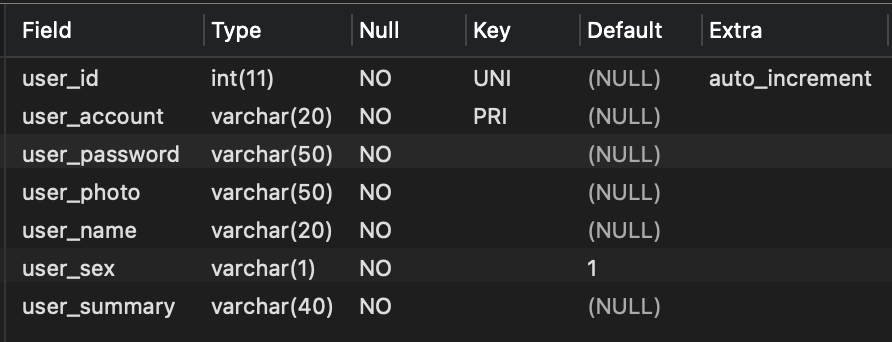
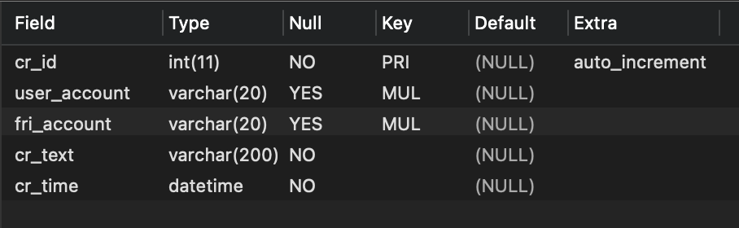
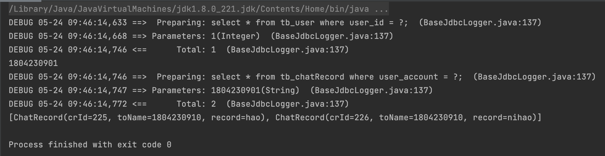

### MyBatis的分步查询

> 即解决数据库查询时需要使用JOIN进行连表查询时的查询的耦合度过高的问题，通过MyBatis的分布查询，我们完全可以做到通过将一个完整的SQL变成两个解耦合的SQL，两个SQL可以单独执行，也可以一直执行完成逻辑上的"连表查询"。

在数据库层面对MyBatis分步查询的理解可以理解为把JOIN形式的SQL变换成嵌套查询SQL的形式。嵌套查询的多条SQL也是可以单独拿出来执行的。并且将最内部嵌套的SQL作为分步的第一步SQL。之后依次类推，最外层嵌套SQL作为最后一步SQL即可。

-----

### 分布查询操作流程

##### 数据库表环境介绍

tb_user表结构如下图所示：



&nbsp;

tb_chatRoom表结构如下图所示：



&nbsp;

##### Maven项目结构介绍

pom.xml详情展示：

```xml
    <dependencies>
        <dependency>
            <groupId>org.mybatis</groupId>
            <artifactId>mybatis</artifactId>
            <version>3.5.7</version>
        </dependency>
        <dependency>
            <groupId>mysql</groupId>
            <artifactId>mysql-connector-java</artifactId>
            <version>5.1.48</version>
        </dependency>
        <dependency>
            <groupId>org.projectlombok</groupId>
            <artifactId>lombok</artifactId>
            <version>1.18.20</version>
        </dependency>
        <dependency>
            <groupId>com.fasterxml.jackson.core</groupId>
            <artifactId>jackson-annotations</artifactId>
            <version>2.13.2</version>
        </dependency>
        <dependency>
            <groupId>log4j</groupId>
            <artifactId>log4j</artifactId>
            <version>1.2.17</version>
        </dependency>
    </dependencies>
```

&nbsp;

Mybatis配置文件Mybatis.xml展示：

```xml
<?xml version="1.0" encoding="UTF-8" ?>
        <!DOCTYPE configuration
                PUBLIC "-//mybatis.org//DTD Config 3.0//EN"
                "http://mybatis.org/dtd/mybatis-3-config.dtd">
<configuration>

    <properties resource="db.properties"/>
    <settings>
        <setting name="lazyLoadingEnabled" value="true"/>
    </settings>
    <typeAliases>
        <package name="cn.wtu.zld.entity"/>
    </typeAliases>
    <environments default="development">
        <environment id="development">
            <transactionManager type="JDBC"/>
            <dataSource type="POOLED">
                <property name="driver" value="${jdbc.driver}"/>
                <property name="url" value="${jdbc.url}"/>
                <property name="username" value="${jdbc.username}"/>
                <property name="password" value="${jdbc.password}"/>
            </dataSource>
        </environment>
    </environments>

    <mappers>
        <mapper resource="mappers/ChatRecordManageMapper.xml" />
    </mappers>
</configuration>

```

&nbsp;

Mybatis映射文件ChatRecordManageMapper.xml展示：

```xml
<!DOCTYPE mapper
        PUBLIC "-//mybatis.org//DTD Mapper 3.0//EN"
        "http://mybatis.org/dtd/mybatis-3-mapper.dtd">

<mapper namespace="cn.wtu.zld.mapper.ChatRecordManageMapper">
    <resultMap id="UserAndRecord" type="User">
        <id property="userId" column="user_id"></id>
        <result property="userAccount" column="user_account"></result>
        <result property="name" column="user_name"></result>
        <collection property="chatRecords"
                    select="cn.wtu.zld.mapper.ChatRecordManageMapper.getChatRecordByDataBase"
                    column="user_account" ></collection>
    </resultMap>
    <resultMap id="Record" type="ChatRecord">
        <id property="crId" column="cr_id"></id>
        <result property="toName" column="fri_account"></result>
        <result property="record" column="cr_text"></result>
    </resultMap>
    <select id="getUserByDataBase" parameterType="java.lang.Integer" resultMap="UserAndRecord">
        select * from tb_user where user_id = #{id};
    </select>

    <select id="getChatRecordByDataBase" parameterType="java.lang.String" resultMap="Record">
        select * from tb_chatRecord where user_account = #{userAccount};
    </select>

</mapper>
```

&NBSP;

Mybatis映射接口ChatRecordManageMapper.java展示：

```java
public interface ChatRecordManageMapper {
    /**
     * 获取指定用户信息
     * @param id 账号标识id
     * @Return User
     * */
    public User getUserByDataBase(Integer id);


    /**
     * 通过指定用户账号获取其发送的信息
     * @param userAccount 用户账号
     * @Return ChatRecord
     * */
    public List<ChatRecord> getChatRecordByDataBase(String userAccount);

}

```

&nbsp;

实体类(User,ChatRecord)展示：

```java
@Data
public class ChatRecord {
    private Integer crId;
    private String toName;
    private String record;
}

@Data
public class User {

    private Integer userId;
    private String userAccount;
    private String name;
    private List<ChatRecord> chatRecords;
}
```

&nbsp;

测试类展示：

```java
public class test {

    private static SqlSessionFactory sqlSessionFactory;
    static {
        String resourceName = "Mybatis.xml";
        try {
            InputStream resourceAsStream = Resources.getResourceAsStream(resourceName);
            sqlSessionFactory = new SqlSessionFactoryBuilder().build(resourceAsStream);
        } catch (IOException e) {
            e.printStackTrace();
        }
    }

    public static void main(String[] args) {
        ChatRecordManageMapper mapper = sqlSessionFactory.openSession().getMapper(ChatRecordManageMapper.class);
        User byDataBase = mapper.getUserByDataBase(1);
        System.out.println(byDataBase.getUserAccount());
        System.out.println(byDataBase.getChatRecords());

    }
}
```

&nbsp;

结果展示：



***我们可以发现数据库根据获取内容的不同，去执行了不同的SQL，而不是一起执行的，通过两条解耦合的SQL去完成之前JOIN操作的SQL所完成的操作。***

-----

### 分步查询两种不同配置

##### 第一种：全局分步加载

即所有需要进行分步加载的地方，全部默认分步加载，而不是直接全部加载。在MyBaits配置文件中添加全局配置变量即可。

```xml
    <settings>
        <setting name="lazyLoadingEnabled" value="true"/>
    </settings>
```

&nbsp;

### 第二种：局部分步加载

即有些分步加载的地方采用全部加载，有些又需要分步加载，那么就直接在Mapper映射文件中的ResultMap标签中进行`fetchType属性`的设置。其拥有以下两个值。

+ ***lazy***：即当前ResultMap作为返回值的查询语句采用分步查询的方式

+ ***eager***：即当前ResultMap作为返回值的查询语句采用全部加载的查询方式

```xml
    <resultMap id="UserAndRecord" type="User">
        <id property="userId" column="user_id"></id>
        <result property="userAccount" column="user_account"></result>
        <result property="name" column="user_name"></result>
        <collection property="chatRecords"
                    select="cn.wtu.zld.mapper.ChatRecordManageMapper.getChatRecordByDataBase"
                    column="user_account" fetchType="lazy"></collection>
    </resultMap>
```


