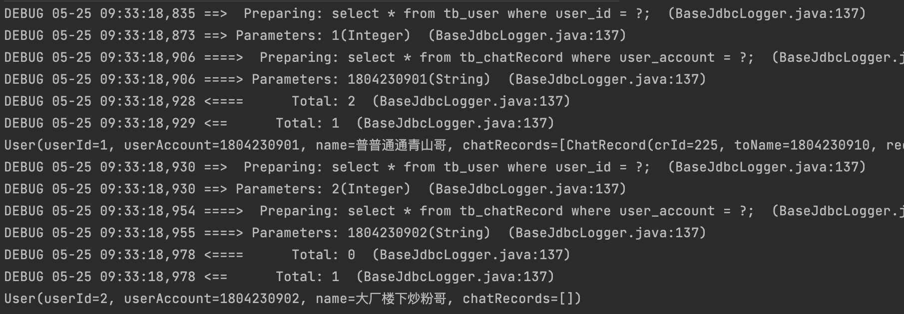
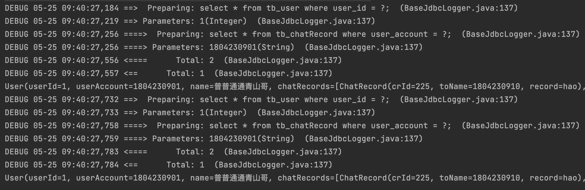
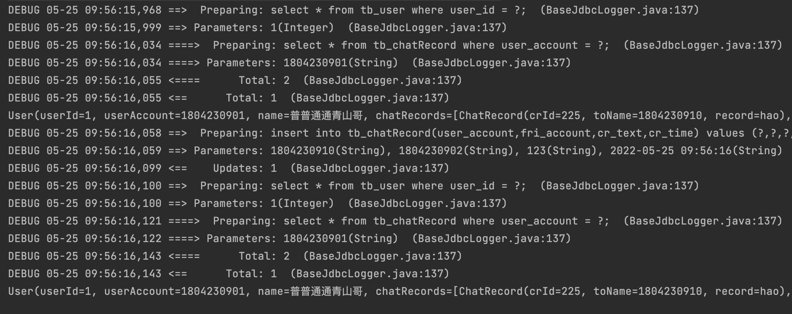
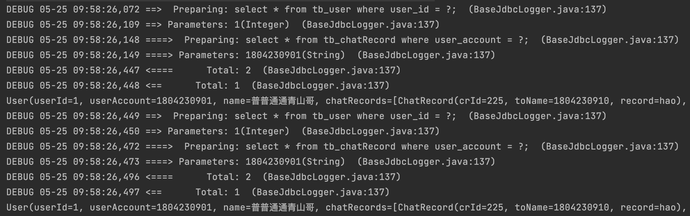
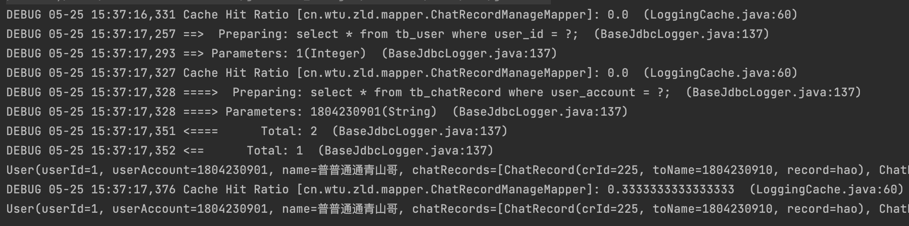

### MyBatis的缓存情况

##### 一级缓存

一级缓存是SqlSession级别的，通过同一个SqlSession查询的数据会被缓存，下次查询相同的数据，就会从缓存中直接获取，不会从数据库中重新访问获取。

不过需要注意使得缓存失效的四种情况：

1. ***同一个SqlSession查询不同的一级缓存***，即使用相同的SqlSession查询不同的SQL语句时，给不同的SQL建立缓存。只要查询相同的SQL时，缓存才能生效。
   
   ```java
       public static void main(String[] args) {
           ChatRecordManageMapper mapper = sqlSessionFactory.openSession().getMapper(ChatRecordManageMapper.class);
           User byDataBase = mapper.getUserByDataBase(1);
           System.out.println(byDataBase);
           User byDataBase2 = mapper.getUserByDataBase(2);
           System.out.println(byDataBase2);
       }))
   ```
   
   

2. ***不同的SqlSession对应不同的一级缓存***，即使用不同SqlSession对象查询相同SQL时，缓存失效。
   
   ```java
       public static void main(String[] args) {
           ChatRecordManageMapper mapper = sqlSessionFactory.openSession().getMapper(ChatRecordManageMapper.class);
           ChatRecordManageMapper mapper1 = sqlSessionFactory.openSession().getMapper(ChatRecordManageMapper.class);
           User byDataBase = mapper.getUserByDataBase(1);
           System.out.println(byDataBase);
           User byDataBase2 = mapper1.getUserByDataBase(1);
           System.out.println(byDataBase2);
       })
   ```
   
   

3. ***同一个SqlSession两次查询期间执行了任何一次增删查操作***。两次使用相同的SqlSession查询相同的SQL语句之间新增、修饰、删除了一次任何数据，那么缓存失效，重新建立缓存。
   
   ```java
       public static void main(String[] args) {
           ChatRecordManageMapper mapper = sqlSessionFactory.openSession().getMapper(ChatRecordManageMapper.class);
           User byDataBase = mapper.getUserByDataBase(1);
           System.out.println(byDataBase);
           String time = new SimpleDateFormat("yyyy-MM-dd hh:mm:ss").format(new Date());
           mapper.addChatRecordToDataBase("1804230910","1804230902","123",time);
           User byDataBase2 = mapper.getUserByDataBase(1);
           System.out.println(byDataBase2);
       }
   ```
   
   

4. ***同一个SqlSession两次查询期间手动清空了缓存。**
   
   ```java
       public static void main(String[] args) {
           SqlSession sqlSession = sqlSessionFactory.openSession();
           ChatRecordManageMapper mapper = sqlSession.getMapper(ChatRecordManageMapper.class);
           User byDataBase = mapper.getUserByDataBase(1);
           System.out.println(byDataBase);
           //手动清空缓存
           sqlSession.clearCache();
           User byDataBase2 = mapper.getUserByDataBase(1);
           System.out.println(byDataBase2);
       }
   ```
   
   

&nbsp;

##### 二级缓存

二级缓存时SqlSessionFactor级别的，通过同一个SqlSessionFactory创建的SqlSession查询的结果会被缓存；此后若再执行相同的查询语句，结果就会从缓存中获取。

<mark>二级缓存需要手动开启，并且只有任何的增删改会使得二级和一级缓存同时失效</mark>

***第一步：在核心配置xml中配置全局配置属性(默认为true)***

```xml
     <settings>
        <setting name="cacheEnabled" value="true"/>
    </settings>
```

&nbsp;

***第二步：在对应Mapper映射文件中进行缓存Cache配置***

```xml
    <cache eviction="LRU" size="10" readOnly="true"></cache>
```

配置Cache标签的四大属性即可正确的使用二级缓存，四大属性如下所示：

+ ***eviction属性(缓存回收策略)***：<mark>默认为LRU</mark>
  
  + LRU策略：即最近最少使用的，移除最长时间不被使用的对象
  
  + FIFO策略：先进先出，按对象进入缓存的顺序来移除
  
  + SOFT策略：即软引用，基于垃圾回收器状态和软引用规则来进行移除
  
  + WEAK策略：即弱引用，更积极地移除基于垃圾收集器状态和弱引用规则的对象

+ ***flushinterval属性***：刷新间隔，单位毫秒，<mark>默认不设置</mark>，也就是没有刷新时间，只有发生任何增删改操作才会刷新缓存。

+ ***size属性***：即缓存最多可以缓存多少个对象，太大容易内存溢出

+ ***readOnly属性***：缓存是否只读，<mark>默认false</mark>
  
  + true：只读缓存，会给所有调用者返回缓存对象的原对象实例，因此这些对象不能修改
  
  + false：读写缓存，会返回缓存对象的拷贝(通过序列化)。这会慢一些，但是安全。

&nbsp;

***第三步：查询的数据所映射的实体类必须是实现了Serializable接口***

&nbsp;

***第四步：二级缓存在查询语句下只有关闭当前sqlSession之后才会生效，其他语句只有在事务提交之后生效***

使用一下：

```java
    public static void main(String[] args) {
        SqlSession sqlSession = sqlSessionFactory.openSession();
        ChatRecordManageMapper mapper = sqlSession.getMapper(ChatRecordManageMapper.class);
        User byDataBase = mapper.getUserByDataBase(1);
        System.out.println(byDataBase);
        sqlSession.close();

        SqlSession sqlSession1 = sqlSessionFactory.openSession();
        ChatRecordManageMapper mapper2 = sqlSession1.getMapper(ChatRecordManageMapper.class);
        User byDataBase2 = mapper2.getUserByDataBase(1);
        System.out.println(byDataBase2);
        sqlSession1.close();
    }
```



------

### 缓存查询顺序

1）首先查询二级缓存，因为二级缓存中可能有其他应用程序查出来的数据，可以直接拿来用

2）如果二级缓存没有命中，那么查询一级缓存

3）如果一级缓存也没有命中，则查询数据库

4）最后一级缓存是查询之后即会生成，二级缓存是关闭sqlSession之后才会生成


