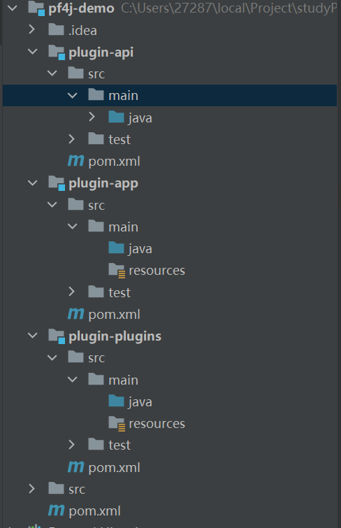

### PF4J的简单使用

##### Demo项目结构简介

此Demo项目采用Maven进行项目的构建以及生命周期的管理，项目结构如下图所示：



此项目结构主要由父项目`pf4j-demo`以及三个子项目`plugin-api`、`plugin-app`、`plugin-plugins`，其中着重说明三大子项目：

1. ***plugin-api :*** 即存放插件定义的可扩展接口所在工程

2. ***plugin-plugins ：***即实现插件定义扩展点的真实插件所在工程

3. ***plugin-app：***主程序，即加载由`plugin-plugins`中真实插件打包成的jar包，并运行插件包中定义的扩展点实现方法。

   

----

##### 构建plugin-api模块流程

**第一步：**引入pf4j插件的pom坐标，如下是坐标代码：

```xml
        <dependency>
            <groupId>org.pf4j</groupId>
            <artifactId>pf4j</artifactId>
            <version>3.6.0</version>
        </dependency>
```


**第二步**：创建`com.plugin.api`包，并在此包下创建名为Greeting接口，去继承`ExtensionPoint`类即可定义一个扩展点接口。

```java
public interface Greeting extends ExtensionPoint {
    
    //自定义扩展方法
    public String getGreeting();
    
}
```

由于是简单Demo，所以只在plugin-api模块中定义一个扩展点接口，真实PF4J插件可以定义许多扩展点接口，扩展点接口可以说是开始的关键。


-----

##### 构建plugin-plugin模块流程

在此模块上，我们要编写一个实现上述扩展点的真实插件，并将此插件进行jar包方式的打包，提供给plugin-app模块进行插件的使用。

**第一步**：在此项目中pom文件下引入基础的pf4j插件以及上一步构建的plugin-api模块，代码如下：

```xml
    <dependencies>
        <dependency>
            <groupId>org.pf4j</groupId>
            <artifactId>pf4j</artifactId>
            <version>3.6.0</version>
        </dependency>

        <dependency>
            <groupId>cn.pf4j.demo</groupId>
            <artifactId>plugin-api</artifactId>
            <version>1.0-SNAPSHOT</version>
        </dependency>
    </dependencies>
```


**第二步**：创建`com.plugin.demo`包，并在包下创建名为`HelloGreeting`的类，并实现plugin-api中定义的Greeting扩展点接口，最后使用`@Extension`注解此类，使其成为一个真正可被检测到的可执行扩展点类。

```java
@Extension
public class HelloGreeting implements Greeting {

    @Override
    public String getGreeting() {
        return "Hello Pf4j";
    }
}
```


**第三步**：构建maven打包配置，在此模块的pom文件下新增如下内容，用于PF4J定位插件。

```xml
    <build>
        <plugins>
            <plugin>
                <groupId>org.apache.maven.plugins</groupId>
                <artifactId>maven-jar-plugin</artifactId>
                <version>2.3.1</version>
                <configuration>
                    <archive>
                        <!--  下述配置用于让PF4J识别此插件  -->
                        <manifestEntries>
                            <Plugin-Id>welcome-plugin</Plugin-Id>
                            <Plugin-Version>0.0.1</Plugin-Version>
                        </manifestEntries>
                    </archive>
                </configuration>
            </plugin>
        </plugins>
    </build>
```

其中`Plugin-Id`是此插件在PF4J启动插件生命周期时，插件的唯一标识（并不是打包生成的插件名称），而`Plugin-version`则是此插件的版本。


**第四步：**使用maven对父项目进行install操作，进行全部项目的jar包构建（主要是解决单独install plugin-plugins时，无法从本地加载jar包的异常）。


**第五步：**单独对`plugin-plugins`模块进行maven clean以及install操作。


**第六步**：到maven仓库中找到此项目打包的jar包后，放入桌面（当然这里可以放在其他地方，我只是为了方便）。我这里找到的jar包名为`plugin-plugins-1.0.SNAPSHOT.jar`。


-----

##### 构建plugin-app模块流程

此模块为插件使用模块，在此模块中会进行插件的读入，类加载，启动插件，调用插件扩展点，停止插件等操作。

**第一步**：在此项目中pom文件下引入基础的pf4j插件以及上一步构建的plugin-api模块，代码如下：

```xml
    <dependencies>
        <dependency>
            <groupId>org.pf4j</groupId>
            <artifactId>pf4j</artifactId>
            <version>3.6.0</version>
        </dependency>

        <dependency>
            <groupId>cn.pf4j.demo</groupId>
            <artifactId>plugin-api</artifactId>
            <version>1.0-SNAPSHOT</version>
        </dependency>
    </dependencies>
```


**第二步**：创建`com.plugin.app`包，并在包下创建一个名为app的类，此类为其他插件的启动类，代码如下所示：

```java
public class app {

    public static void main(String[] args) {

        // jar插件管理器
        PluginManager pluginManager = new JarPluginManager();

        String path = "C:\\Users\\27287\\Desktop\\plugin-plugins-1.0-SNAPSHOT.jar";

        // 加载指定路径插件
        pluginManager.loadPlugin(Paths.get(path));

        // 启动指定插件(也可以加载所有插件)
        pluginManager.startPlugin("welcome-plugin");

        // 执行插件
        List<Greeting> greetings = pluginManager.getExtensions(Greeting.class);
        for (Greeting greeting : greetings) {
            System.out.println(">>> " + greeting.getGreeting());
        }

        // 停止并卸载指定插件
        pluginManager.stopPlugin("welcome-plugin");
        pluginManager.unloadPlugin("welcome-plugin");

    }
}
```

结果：

```java
>>> Hello Pf4j

Process finished with exit code 0
```


-----

### 总结

综上所示即时简单使用PF4J微框架搭建的一个Demo，主要是用于PF4J项目的快速入门，了解PF4J插件启动以及使用的流程，并没有过多解释细节，会在后续文章中对PF4J的细节进行解析和展示。

利用PF4J可以实现动态jar包的加载和移除，完成项目动态进行扩展功能的添加和移除，非常的灵活。


