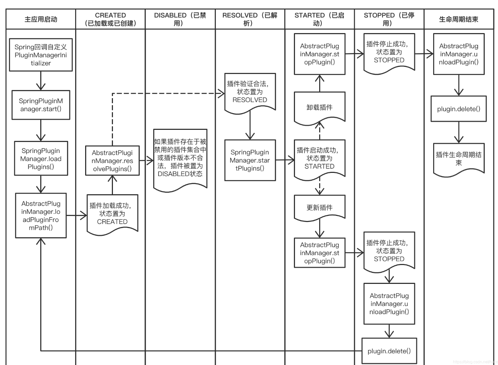

### 简介基础PF4J微框架

> 声明：此简介不包括PF4J微框架的异步部分内容，主要简述PF4J微框架的管理，加载，使用，停止，卸载等过程所涉及到的组成结构，做到更加了解PF4J微框架。

##### PF4J微框架  <u>部分</u>  组成类UML图


首先先简单介绍一下上述UML图中的类组成结构中类的作用：

1. **PluginManager接口：**为PF4J微框架的核心类，插件化编程一切的开始，用于管理插件。其提供了插件管理的基本方法架构。

2. **AbstractPluginManager抽象类：**为PluginManager接口的抽象实现类，进一步完善插件管理框架，其依赖了PF4J微框架的各大核心组件。

3. **PluginLoader接口**：仅提供了插件加载类方法框架。

4. **PluginWrapper类**：为某个插件的详细信息所在类，也可以说他就是插件对象本身。记录了当前插件所在路径、管理此插件的插件管理器、加载此插件的插件类加载器、此插件状态、此插件基本信息（比如插件id、插件版本、插件各种元数据）、此插件生命周期类。

5. **PluginState枚举类：**提供了插件固定几种状态的枚举，插件状态分为：
   + ***CREATED状态：***此状态为被创建状态，为插件打包后并被加载后所处状态。
   + ***DISABLED状态：***此状态为禁用状态，即插件状态从CREATE状态转变为RESOLVED状态时，如果发现插件版本不合法，或者此插件已经存在于RESOLVED状态集合中，那么就会被置于DISABLED状态。
   + ***RESOLVED状态：***此状态为解析状态，成功从CREATE状态转变为RESOLVED状态的插件就处于此状态，等待管理器对其进行start状态的转变。
   + ***STARTED状态：***此状态为启动状态，为插件被管理、加载、启动之后所处状态。
   + ***STOPED状态：***此状态为停止状态，为插件启动后被停止所处状态。
   
   
   
6. **PluginDescriptor接口：**记录了插件的更加详细的信息，比如插件id、插件版本、插件扩展等。

7. **PluginDependency接口：**记录了插件的各种元数据。

知道PF4J微框架基础的类组成结构之后，就开始根据插件在PF4J微框架中的流程进行依次参与类的深入解析。


-----

##### PluginManager接口深入信息

此接口的作用是进行不同形式插件的管理，提供了管理插件的基本框架，比如加载，状态变更，获取插件各种信息等。具体的实现类包括`JarPluginManager`等，顾名思义`JarPluginManager`作用是管理打包为jar包形式的PF4J插件。

其通过以下集中常见的方法去管理插件：

```java
//获取当前插件管理器下被管理的插件列表
List<PluginWrapper> getPlugins();

//获取当前插件管理器下制定状态的插件列表
List<PluginWrapper> getPlugins(PluginState var1);

//加载默认路径下的所有插件（pluginsRoots中存储的路径，支持在管理器的构造方法中指定，本质是List<Path>集合）
void loadPlugins();

//加载指定目录下的指定插件
String loadPlugin(Path var1);

//开启当前管理器下所加载后处于RESOLVED状态的所有插件
void startPlugins();

//开启当前管理器下指定插件
PluginState startPlugin(String var1);

//停止当前管理器下所有处于start状态的插件
void stopPlugins();

//停止当前管理器下指定插件
PluginState stopPlugin(String var1);

//卸载当前管理器下所有处于stop状态的插件
void unloadPlugins();

//卸载当前管理器下指定插件
boolean unloadPlugin(String var1);

//卸载当前管理器下指定插件（首先的处于unload状态）
boolean deletePlugin(String var1);

//获取当前管理器中处于start状态下插件执行对象集合（指继承了ExtensionPoint类的接口）
<T> List<T> getExtensions(Class<T> var1);
```


##### pluginWrapper类包含插件信息解析

```java
//当前插件的管理器对象
private PluginManager pluginManager;

//当前插件的简介
private PluginDescriptor descriptor;

//当前插件所在位置
private Path pluginPath;

//当前插件的类加载器
private ClassLoader pluginClassLoader;

//当前插件的状态
private PluginState pluginState;
```


