## **什么是Spring AOP**

**AOP全称Aspect Oriented Program,也就是”面向切面编程”思想，想要理解这个思想。**

那么我们就要知道何为切面。

​    我们可以把一个业务逻辑方法称为方法A，然后我们想在这个方法上添加日志要求，比如执行该方法时，把相应信息输出到指定的日志文件中，但是这个方法A属于另一个完成的工程中的调用方法。属于无法进行修改的方法。

​    那么我们要怎么在不变化这个类方法内容的情况下，完成这个业务呢？此时我们把方法A想象成一个管道，只有从管道头走到管道尾才算把方法A执行完毕，我们在管道的头部插入一个圆面切进去，这个圆面上面刻了日志输入的代码，这样方法A要执行完成就要先把圆面的代码走完，才能去走到管道尾。

**所以切面其实就是你想让指定方法执行额外的业务逻辑代码的封装产物。**通过切面的方式将不同业务逻辑进行解耦合，提供程序的复用性，同时提高了开发效率。

------

------

## **两种拥有和AOP相似思想的设计模式**

**装饰者模式**

如果大家学过装饰者模式的话，装饰者模式就是不通过继承的方式，扩展方法的业务逻辑。通过用新的装饰类去实现和被扩展方法所在类相同的抽象接口，重写被扩展方法。一旦需要扩展被扩展方法，那么就会创建一个新的装饰者实现类，去实现装饰者类。在扩展方法中新增业务逻辑后再调用原来的被扩展方法（通过内聚目标对象来实现调用）。实现利用虚方法在运行时”欺骗”JVM的作用。

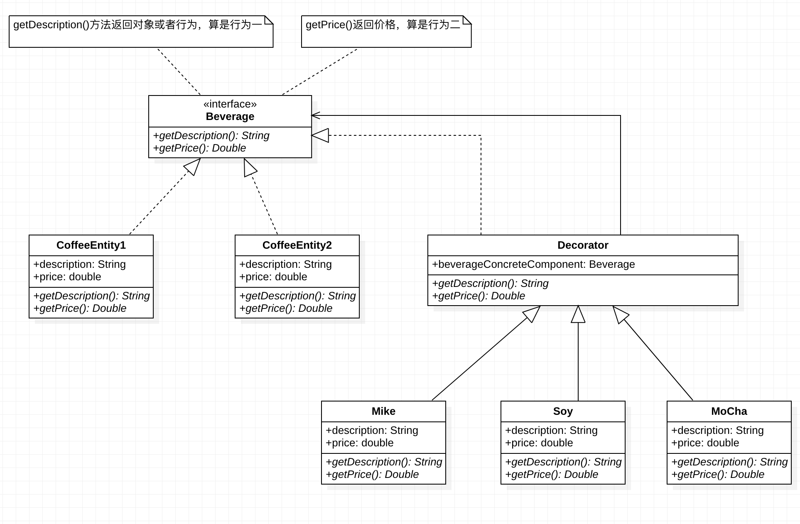

**代理模式**

相对于装饰者模式来说，更加好理解，也更加直观。就是使用一个新增的代理类，去实现被扩展方法Request()实现类的抽象接口，重写Request方法，新增扩展业务逻辑后执行原来的Request方法。核心也是通过多态和虚方法在运行时”欺骗”JVM。

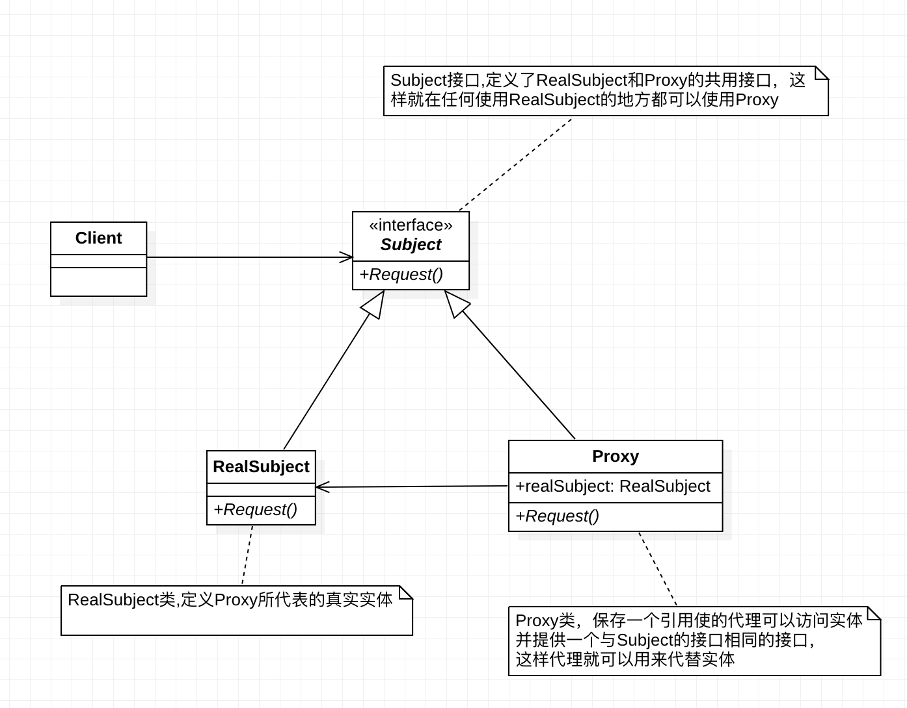

------

------

## **看看AOP思想在Spring中落地核心组件**

通过上述的了解之后，应该大致上对AOP是什么，AOP的作用产生了一定的理解，那么我们就要来解释一下AOP为什么可以做到这些功能。

AOP是使用其的核心组件完成切面编程的功能的，下述就是核心组件的概念：

1） **通知（Advice）**：被定义好的扩展的业务逻辑代码以及什么时候执行（被扩展方法前还是后，或者两者都有）。

2）**连接点（JoinPoint）**：Spring允许你使用通知的地方，通俗来说就是每个方法执行之前或者之后，亦或者两者都有。

3）**切入点（PointCut）**：切入点建立在连接点的基础上，连接点是Spring允许的可以使用通知的地方，但是不是开发者想要使用通知的地方，切入点就是开发者在连接点成立的方法集合中选择想要执行通知的方法。这些被选中的方法就是切入点。

4）**切面（Aspect）**：通知和切入点的结合体，我们在使用中直接用切面整合了通知和切入点，使用通知和切入点好让人理解。

5）**目标（target）**：也就是被扩展方法所在的对象，也就是被通知对象。

6）**代理（Proxy）**：AOP的核心，通过代理完成切面的切入。

7）**织入（weaving）**：把切面应用到目标对象来创建新的代理对象的过程。有3种方式，spring采用的是运行时，为什么是运行时，骗过JVM呀。

**而把这些组件整合起来的就是动态代理和静态织入**

------

------

## **动态代理和静态织入**

AOP的动态代理实现分为两种，第一种是jdk自带的动态代理API（InvocationHandler接口），第二种就是asm(cglib)动态代理（没有接口）。

**使用动态代理得指定一个规则**，因为动态代理并没有指定专门的代理对象，而是通过定制规则来匹配现有的代理对象来代理。

(1)比如invocationHandler接口，就是jdk自带动态代理的实现核心之一。

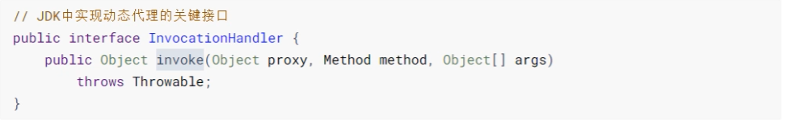

这个包是反射中的包，你想要动态的把切面交给一个动态生成的代理类，只有反射做的到。

–

(2)再比如methodInterceptor接口，就是asm实现动态代理的实现核心之一。

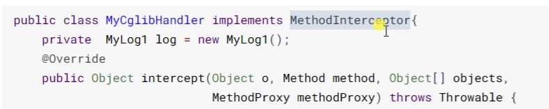

------

------

## **InvocationHandler动态代理实例**

实验环境：Services层下保存和删除业务逻辑代码

目录结构：


业务逻辑接口：

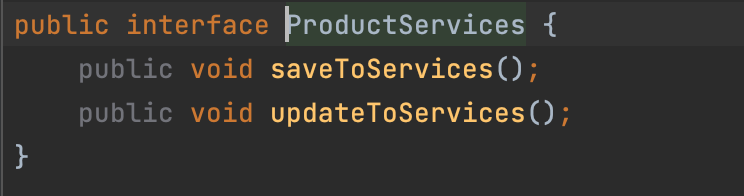

业务逻辑实现：

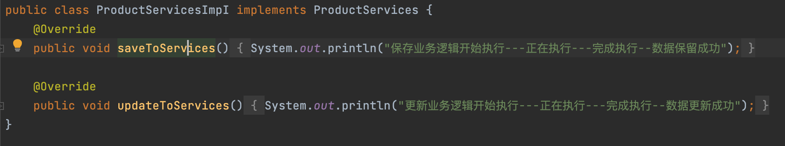

这是我们正常的业务逻辑代码，然后现在我们要进行定义切面，我们知道切面包含通知和切入点。定义切面类AspectLog.java作为切面类。

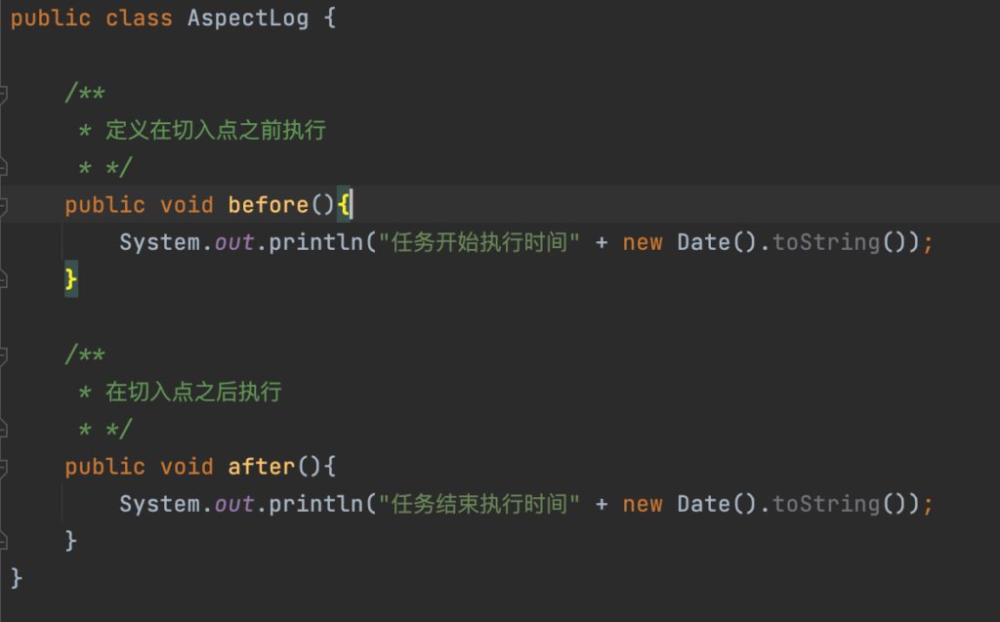

动态代理，首先我们要实现动态代理规则，通过自定义动态规则类实现InvocationHandle接口，重写invoke方法，注意此方法属于反射包下的方法，也就是通过反射去获取匹配切入点。通过在动态代理规则中定义以下要素完成动态规则创建。

1）目标对象

2）切面

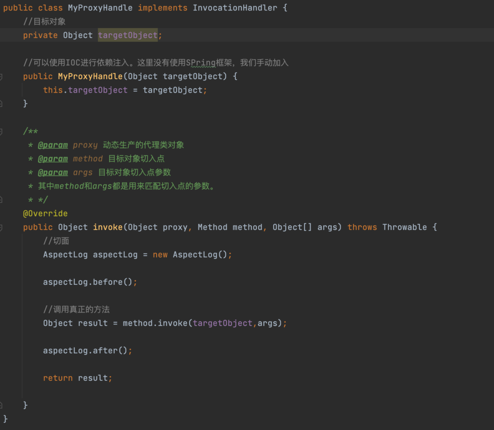

动态代理中的核心中的核心就是Proxy类。通过Proxy类去动态生成一个代理类，代理类符合动态规则，并实现了目标类的接口（骗过JVM）。

执行原来业务逻辑的过程：

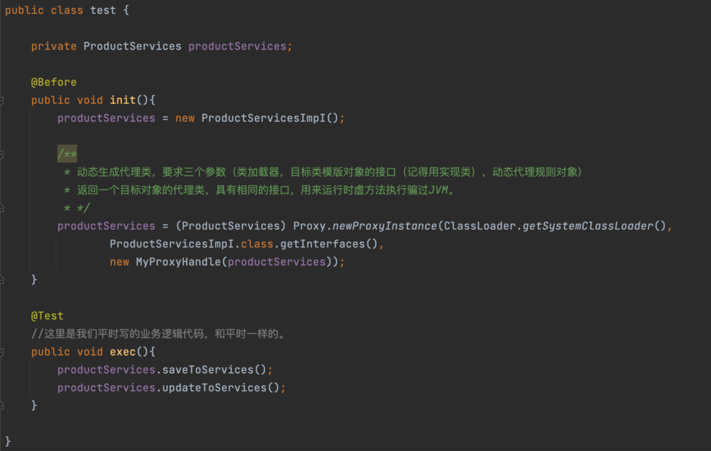

从而达到目的，执行exec方法后结果为：

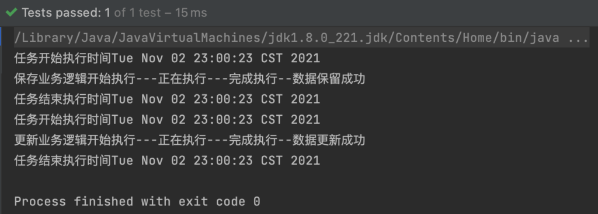

------

**思路在于：通过实现InvocationHandle接口并重写invoke方法的方式去定义动态规则，然后通过Proxy的newProxyInstance方法去动态的生成一个满足动态规则并拥有目标类接口的代理类，通过相同接口的属性，利用虚方法骗过JVM然后动态的替换掉了原来的业务逻辑代码。**

Proxy代理类的三大重点参数：

1）**类加载器对象**，可以通过ClassLoader.getSystemClassLoader()方法获取到系统类加载器。

2）**具体实现类的接口对象**，必须通过具体实现类的类模版对象获取到其的上层接口对象

3）**定义来的切面对象**。也就是我们自定义实现InvocationHandle接口的切面实现类对象。

但是如果说我们的目标类没有接口的话，那还怎么骗过JVM呢，asm动态代理就是不需要接口的代理。

------

## **asm动态代理实例****(****环境和上述相同****)**

导入asm第三方实现AspectJ包，**这里只是利用spring****-aspects包中的AspectJ****，源码层次不涉及任何Spring操作**

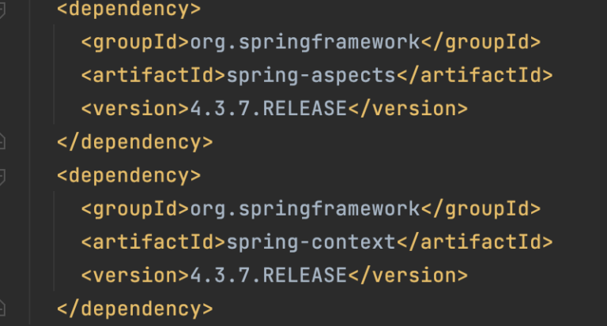

实验环境：Services层下保存和删除业务逻辑代码

目录结构：


业务逻辑接口：


业务逻辑实现：


这是我们正常的业务逻辑代码，然后现在我们要进行定义切面，我们知道切面包含通知和切入点。定义切面类AspectLog.java作为切面类。


动态代理，首先我们要实现动态代理规则，这里我们使用MethodInterceptor接口，翻译过来就是方法拦截器，重写其中的Intercept方法，翻译过来为拦截器方法。同时内聚切面对象即可完成动态代理规则对象编写。

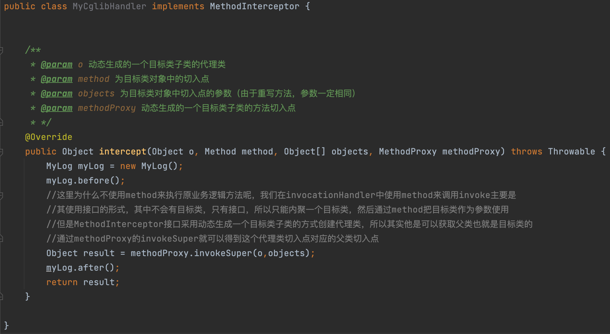

这里要注意cglib的动态代理规则没有目标类的内聚，为什么呢？

i**nvocationHandler中使用method来调用invoke主要是其使用接口的形式，其中不会有目标类，只有接口，所以只能内聚一个目标类，然后通过method把目标类作为参数使用。**

**但是MethodInterceptor接口采用动态生成一个目标类子类的方式创建代理类，所以其实他是可以获取父类也就是目标类的通过methodProxy的invokeSuper就可以得到这个代理类切入点对应的父类切入点。通过传入代理类完成。**

利用cglib的核心之二：Enhacer类，通过实例化Enhacer对象，设置其父类也就是目标类，然后添加动态代理规则后进行目标子类代理类的生成，然后替换掉原业务逻辑。

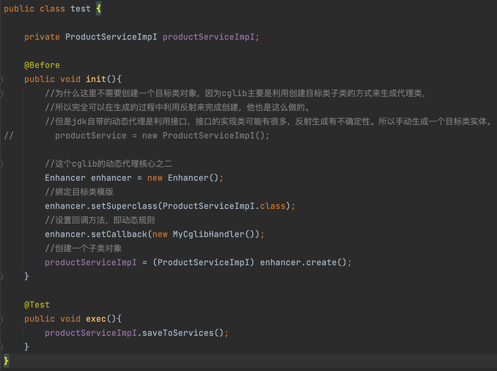

这里有个注意的要点：即目标类的实例化上：

为什么这里不需要创建一个目标类对象，因为cglib主要是利用创建目标类子类的方式来生成代理类，

所以完全可以在生成的过程中利用反射来完成创建，他也是这么做的。

但是jdk自带的动态代理是利用接口，接口的实现类可能有很多，反射生成有不确定性。所以手动生成一个目标类实体。

**思路在于：通过实现MethodIntercept接口并重写intercept方法的方式去定义动态规则，然后通过Enhancer对象配置目标对象类模版和动态代理规则后生成一个由目标类子类组成的代理类，利用父类和子类之间的重写以及虚方法骗过JVM然后动态的替换掉了原来的业务逻辑代码。**

------

## 关于**AspectJ**的注解开发

上述关于AspectJ的底层实现中，我们不管是确定切入点，还是切面对象的生成以及手动编写代理类对象都是一些繁琐的代码，那么注解就可以帮我们简化切入点的选择以及代理对象的生成。

步骤流程：**//一定要先开启注解扫瞄，并定位到注解所在类包下**

1）开启Spring-aop的配置，也就是在XML<beans>标签添加如下内容

```
xmlns:aop="http://wwww.springframework.org/schema/aop"
xsi:schemaLocation="http://wwww.springframework.org/schema/aop 
                    http://www.springframework.org/schema/aop/spring-aop.xsd"
```

\2) 在被增强类和我们编写的通知类上分别使用业务逻辑注解(@Services)以及对象注解(@Component)进行注解。

3）直接在编写的通知类中使用@AspectJ注解进行修饰，表明自动使用此通知类生成代理对象。

4）使用@Before，@After注解完成切入点的确定，此类标签都有一个value字段，用来存储匹配切入点的表达式。

```
//表达式解析：
execution([权限修饰符][方法返回值][类全名].[方法]([参数]));
比如execution(* cn.zld.codeDan.User.*)就是关于User类下的所有方法均为切入点
比如execution(* cn.zld.codeDan.User.add(..))就是关于User类下所有add的重载方法作为切入点。
//@Before，@After等注解解析顺序解析，也就是出现的顺序
@Around注解，环绕声明，可用于修饰方法，配合切入点匹配表达式用于在匹配的切入点之前执行的业务逻辑代码，环绕之前执行优先级最高。
@Before注解，可用于修饰方法，配合切入点匹配表达式用于在匹配的切入点之前执行的业务逻辑代码。
---------执行被扩展方法--------
@Around注解，环绕声明，可用于修饰方法，配合切入点匹配表达式用于在匹配的切入点之前执行的业务逻辑代码，环绕之后执行优先级在@After之上。在异常发生的时候不执行。
@After注解，可用于修饰方法，配合切入点匹配表达式用于在匹配的切入点之后执行的业务逻辑代码。
@AfterReturning注解，可用于修饰方法，配合切入点匹配表达式用于在匹配的切入点返回值之后执行的业务逻辑代码，优先级最低。但是可以携带返回值参数，进行操作。在异常发生的时候不执行。
@AfterThrowing注解：只有在被扩展方法执行异常的时候，才会执行。
```

5）在xml文件中添加如下标签，开启aop自动代理对象生成配置

```
<aop:aspectJ-autoproxy></aop:aspectJ-autoproxy>
```

6）**优化操作**，可有可无，即随便编写一个方法使用@Pointcut注解进行修饰，并把公共execution表达式放入value字段中。之后就可以在@before等标签中直接把方法名()放入其value字段即可。这样在多个相同切入点的情况下，易于维护。

```
@Pointput(value="execution(* cn.zld.codeDan.User.add(..))")
public void pointSelect(){};

@Before(value="pointSelect()")
public void before(){
    .....;
}
```

7）**注意操操作**，当一个被扩展方法被多个切面进行扩展的时候，设置一下切面的优先级。操作主要是在通知类中添加@Order注解，在其字段中输入一个数字值，**数字越小，优先级越大。**

------

注解结构图


编写的通知类

```
@Component
@Aspect
@Order(1)
public class MyProxy {

    @Pointcut(value = "execution(* com.wtu.zld.ServicesImpI.update(..))")
    public void pointCut(){

    }


    @Before(value = "pointCut()")
    public void before(){
        System.out.println("Before......");
    }

    @After(value = "pointCut()")
    public void after(){
        System.out.println("after......");
    }

    @AfterReturning(value = "pointCut()")
    public void afterReturing(){
        System.out.println("afterReturning......");
    }

    @AfterThrowing(value = "pointCut()")
    public void afterThrowing(){
        System.out.println("afterThrowing......");
    }

        @Around(value = "pointCut()")
    public void around(ProceedingJoinPoint joinPoint) throws Throwable {
        System.out.println("环绕开始.......");
        joinPoint.proceed();
        System.out.println("环绕结束.......");
    }
}
```

编写业务逻辑类

```
@Service
public class ServicesImpI {
    //模拟业务逻辑，更新操作
    public void update(){
        System.out.println("更新完成");
    }
}
```

启动类

```
public class Test {

    public static void main(String[] args) {
        ApplicationContext applicationContext =new ClassPathXmlApplicationContext("applicationContext.xml");
        ServicesImpI servicesImpI = applicationContext.getBean("servicesImpI",ServicesImpI.class);
        servicesImpI.update();
    }
}
```

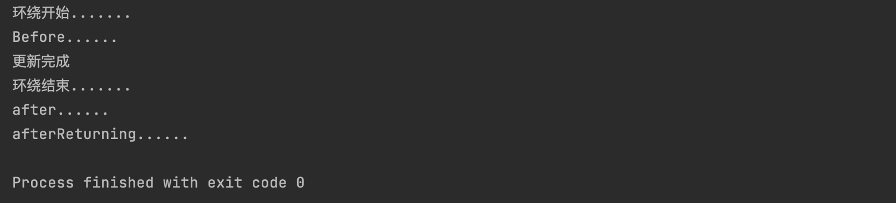