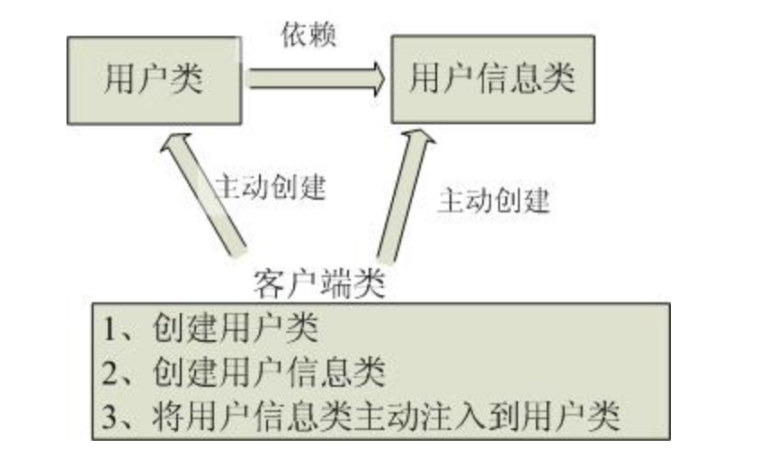
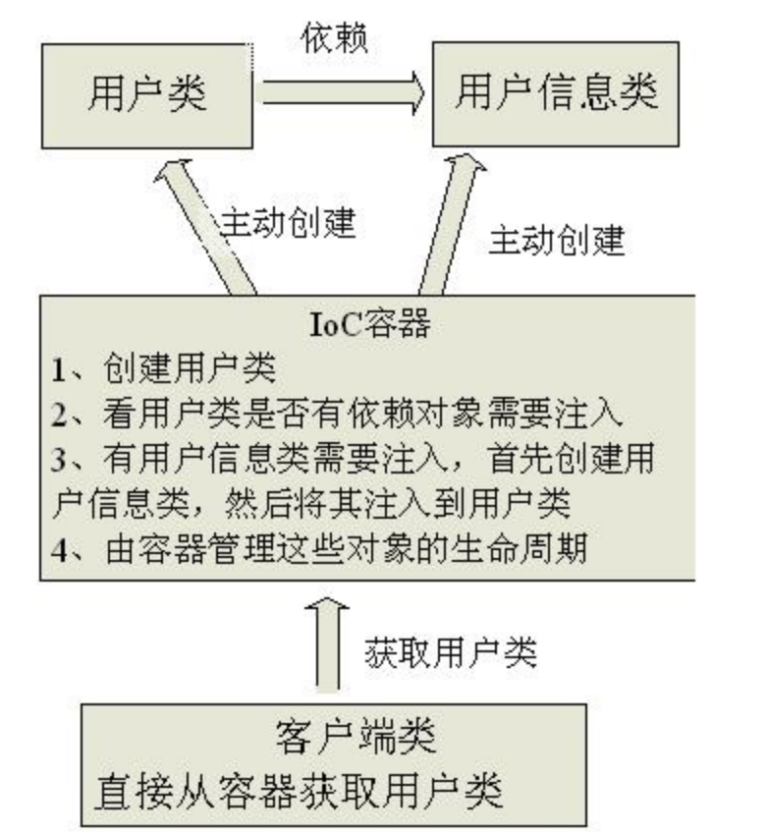
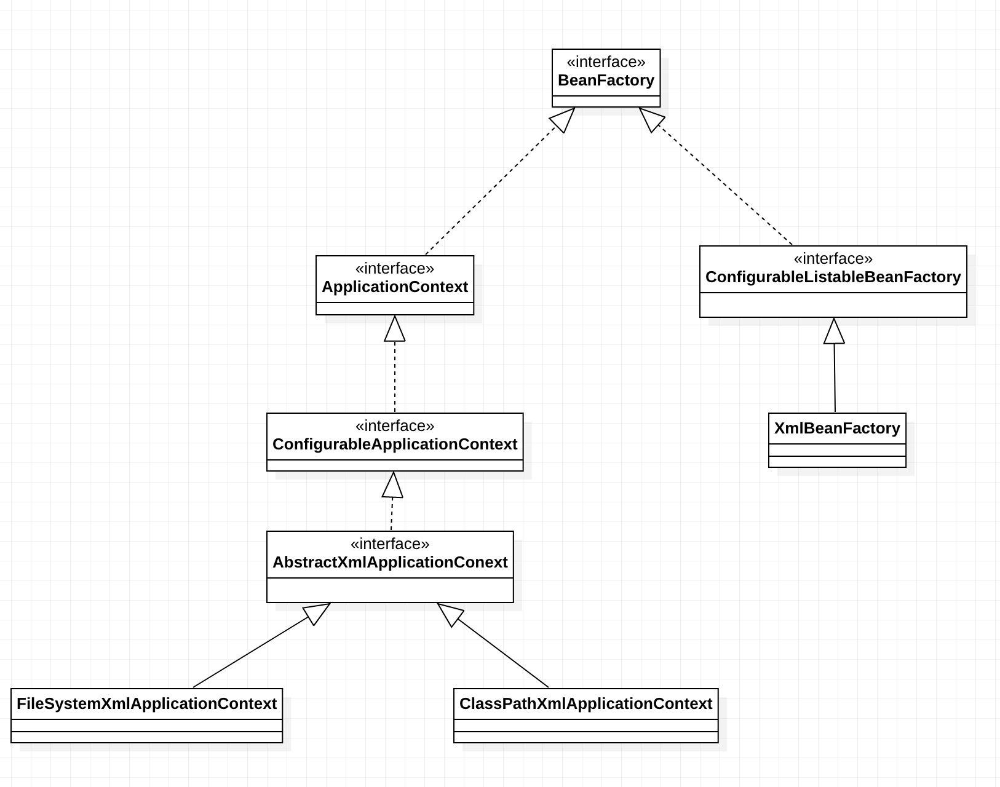

**在我们进行Spring源码分析之前，先把IOC和AOP回忆一下！**

## **首先我们要知道Spring** **IOC和DI是什么？**

**Spring IOC代表着Spring框架的控制反转，而DI代表着依赖注入的概念。**

------

## **来谈谈IOC**

IOC全称”inversion of Control”，即”控制反转”，这是一种设计思想，Spring IOC算是其的落地实现方式。

那么我们就要知道这个”思想”是什么意思，IOC思想表示你要**将设计好的对象交给容器去管理，而不是开发者(\**应用程序管理\**)直接管理对象(直接new的方式)，或者对象(\**应用程序管理\**)管理对象的方式(内聚对象)。**

这也解释了IOC的字面意思，控制反转，把对象的控制从开发者(**应用程序管理**)手里交给容器，可谓是”控制反转”。

两个图解释一下开发者/对象管理对象(或者叫开发者/对象获取对象的控制权)和容器管理对象的区别：

传统方式：也就是开发者/对象获取对象的控制权



IOC模式：



通过上面两个图，**我们发现IOC带来的最明显的作用就是让应用程序被动化**。即在传统程序中应用程序可以说无所不能，想要什么对象就主动创建什么对象。要是对象中内聚了也就是主动创建直接再加进去。

而IOC模式，则是应用程序变成了被动方。要去请求IOC容器，然后等待IOC把需要的对象以及对象之间的依赖对象创建并注入给应用程序。（这里可以看到建造者模式的影子）

**通过这种方式可以进行应用程序和需求对象之间的解耦合，应用程序专注于业务逻辑代码，对象的创建或者依赖创建以及对象的生命周期，对应类型注入的问题都交给IOC容器。**

------

------

## **再来看看DI是什么？**

DI全称Dependency Injection，即”依赖注入”：组建对象之间的依赖关系由容器在运行期决定，通俗易懂的说就是”由容器动态的将某个依赖关系对象注入组件对象之中”。

其实这也不好懂，费劲！但是呢又感觉和IOC有些冗余理解对吧。毕竟IOC阶段也有注入的功能。

我们得从四个阶段去分析DI：

1）谁依赖了谁？     当然是应用程序依赖了IOC容器。

2）为什么需要依赖？  因为应用程序执行需要对象（外部资源）

3）谁注入了谁？     当然是容器把对象实体注入了应用程序中的某个对象引用。

4）注入了什么？     肯定是注入了应用程序需要的对象（外部资源）

分析完这四个阶段之后，我们会就发现一个神奇的事情，这TM不是和IOC越来越冗余了？这一套不就是IOC的流程嘛……..

**所以结论也很简单，IOC和DI其实就是对同一个事物不同的解释而已。为什么会这样呢，Spring开发者觉得IOC也就是控制反转不好理解，但是DI依赖注入一听就懂。**

------

------

## **总结**

IOC总结：

Spring所倡导的开发方式就是，所有的类都会在spring容器中登记，告诉spring你是个什么东西，你需要什么东西，然后spring会在系统运行到适当的时候，把你要的东西主动给你，同时也把你交给其他需要你的东西。所有的类的创建、销毁都由 spring来控制，也就是说控制对象生存周期的不再是引用它的对象，而是spring。对于某个具体的对象而言，以前是它控制其他对象，现在是所有对象都被spring控制，所以这叫控制反转。

DI总结：

IoC的一个重点是在系统运行中，动态的向某个对象提供它所需要的其他对象。这一点是通过DI（Dependency Injection，依赖注入）来实现的

这里如果有人疑惑为啥都说IOC和DI是同一个事物的不同概述的了，我还要分开总结的话，先把我骂一遍再看我解释，问题不大。

**因为IOC像是静态的解释，DI更像是动态的解释。**

------

## 宏观Spring IOC生成对象流程

\1) 通过XML文件的形式，使用如下格式完成对象的完整类名参数以及字段参数的填充。

```
<bean id="codeDan" class="cn.wtu.zld.codeDan">
```

\2) 通过工厂设计模式，创建一个工厂类，在工厂类中创建对象方法里使用xml解析获取到完整的类名后，使用反射去完成对象的创建

```
public class Factory{
    public static Obeject getObject(){
        String className = "xml中解析的类全名字符串";
        Class clazz = Class.forName("className");
        return clazz.newInstance();
    }
}
```

------

## 微观工厂类结构组成UML图



1）**BeanFactory接口**：Spring IOC底层实现之一的工厂基类。之后落地的派生类都是由此基类衍生出去的。

2）**XMLBeanFactory实现类**：即通过加载src目录下的xml文件，获取对象的配置信息，**但是只有在应用程序申请此对象的时候，才会去加载。**

3）**ApplicationContext接口**：和XMLBeanFactory不同，此接口是为了满足开发人员需求定制的对象工厂类。

4）**FileSystemXmlApplicationContext实现类**：隶属于**ApplicationContext接口**派生类，通过操作系统下指定的目录路径去获取xml文件。例如C://…..或者/usr/local等等。

5）**ClassPathXmlApplicationContext实现类**：隶属于**ApplicationContext接口**派生类，通过src目录下获取xml文件中对象资源，**但是和XMLBeanFactory类不同的是此类在加载完xml文件后就会生成出xml文件中包含的所有对象。**由于现在都是Web项目，当然能在启动阶段就把所需对象全部生成的话，有利于运行时系统专心应付业务逻辑。

------

## Spring Bean中普通Bean和工厂Bean(Factory Bean)的区别

**普通Bean**，XML进行配置时会对Bean标签中类对象会设置class类型，这个设置什么就会返回什么Class类型。

```
<bean id = "codeDan" class="cn.wtu.zld.codeDan"></bean>
```

**FactoryBean**，XML进行配置时会对Bean标签中类对象会设置class类型，但是返回值不一定是定义好的Class类型。

```
//新建工厂类，实现FactoryBean接口，并施加泛型
import cn.wtu.zld.codeDan.Student;
public class MyBeanFactory implements FactoryBean<Student>{
   //重写接口方法，返回指定类型的Bean
   @Override
   public Student getObject() throws Exception{
       Class<?;> clazz = Class.forName("cn.wtu.zld.codeDan.Student");
       return (Student)clazz.newInstance();
       
   }
}
//新建XML配置文件，省略SPring配置部分
<bean name = "myBeanFactory" class = "cn.wtu.zld.codeDan.MyBeanFactory"> </bean>
//新建启动类,XML文件为了方便直接放在src目录下，实际开发中请放入Resources中
public class Main{
    public static void main(String[] args){
        ApplicationContext applicationContext = new ApplicationContext("bean1.xml");
        Student zld = application.getBean("myBeanFactory",Student.Class);
    }
}
```

------

## Spring Bean的作用域与生命周期

首先来说说作用域问题，即生成的Bean到底是单实例还是多实例。

1）**单实例**(默认状态)：即不管多少次应用程序向IOC容器请求相同的Bean对象，返回的Bean对象都是同一个对象(第一次生成的对象)。**而且在AppicationContext工厂下，是符合加载即生成的。**

```
<bean name="codeDan" class="cn.wtu.zld.CondeDan" scope="singleton">
</bean>
```

2）**多实例**：即每一次应用程序向IOC容器请求相同的Bean对象都会返回不同的对象(即请求一次生成一个新的对象)；**而且在AppicationContext工厂下，是不符合加载即生成的，其会在获取到对象请求后创建。**

```
<bean name="codeDan" class="cn.wtu.zld.CondeDan" scope="prototype">
</bean>
```

然后我们来看看Bean的生成周期到底是什么？

**Bean的生命周期可以被分为对象生成到对象被销毁的过程。**其中细节一共可以被分为如下7步：

```
//例子：Student对象
public class Student{
    private int name;
    public String getName(){
        return this.name;
    }
    public void setName(String name){
        this.name = name;
    }
    //编写初始化方法
    public void initMethod(){
        ……;
    }
    //编写销毁方法
    public void destroyMehtod(){
        ……;
    }
}
//后置处理器类，主要靠实现BeanPostProcessor接口
public class MyBeanPostProcessor implements BeanPostProcessor{
   @Override
   public Object postProcessBeforeInitialization(Object bean, String beanName ) throws BeansException{
       ……;
       return bean;
   }
   @Overdride
   public Object postProcessAfterInitialization(Object bean, String beanName) throws BeansException{
       ……;
       return bean;
   }
}
//XML配置文件
<bean name="student" class="cn.wtu.zld.Student" init-Method="initMethod" destroy-Method="destroyMethod">
    <property name="name" value="CodeDan"></property>
</bean>
<bean name="myBeanPostProcessor" class="cn.wtu.zld.MybeanPostProcessor"></bean>
//启动类
public class Main{
   public static void main(String[] args){
       ClassPathXmlApplicationContext applicationContext = new ClassPathXmlApplicationContext("Bean.xml");
       Student zld = application.getBean("student",Student.class);
       //销毁
       application.close(); 
   }
}
```

1）利用构造器生成对象(如果不在Bean标签中指定构造方法，默认使用无参构造方法)

\2) 利用设置Bean中Propery标签设置字段值

3）在执行初始化方法之前会把生成的对象传入后置处理器中的postProcessorBeforeInitialization方法中。

4）执行初始化方法，此方法需要在对象中进行编写，并在XML文件对应Bean标签中使用init-Method参数表明类中编写方法的名称。

5）在执行初始化方法之后会把生成的对象传入后置处理器中的postProcessorAfterInitialization方法中。

6）使用BeanFactory或者ApplicationContext派生类获取到对象。

7）执行销毁方法，此方法也需要在对象中进行编写，并在XML文件对应Bean标签中使用destroy-Method参数中指定类中编写方法名称。

