### Spring 事务管理方式

> 即**编程式事务管理**和**声明式事务管理**两种，首先编程式事务管理属于我们自己对可能发生的异常进行处理，手动去进行失败事务的数据恢复操作，灵活度高，可以精确到代码块级别，但是相应的维护难度大。
> 
> 而**声明式事务管理**则是利用AOP思想，对原本的数据操作方法进行增强处理，将业务代码和事务管理分离，你只需用注解和XML配置来管理事务。但是精确度只能在方法级别。

### 

### Spring声明式事务解析

Spring声明式事务是正常开发中经常使用的， 所以我们主要是看声明式事务如何完成以及其中配置参数解读。

首先我们得知道我们使用的事务管理类是什么？以及其的类结构组成，如下图所示：

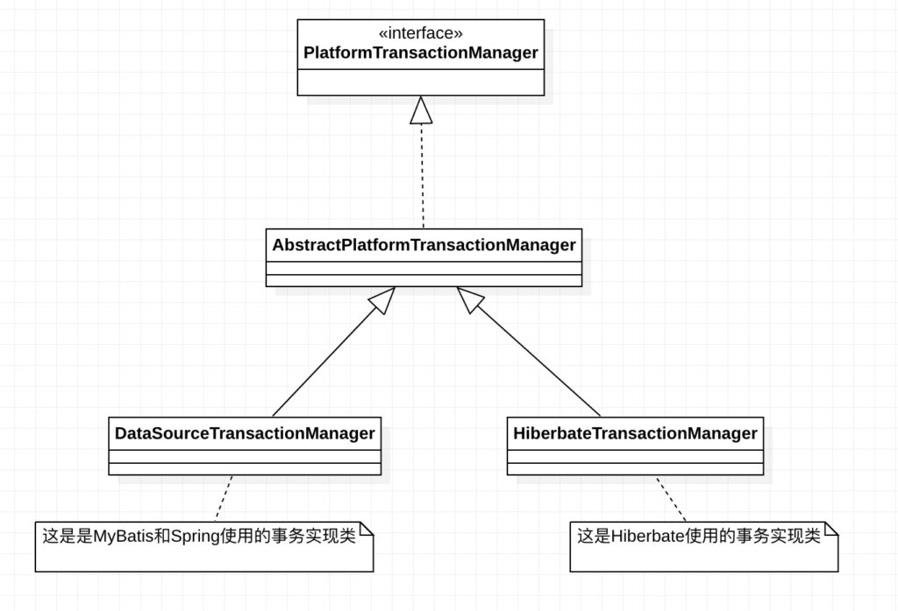

1. **PlatformTransactionManager类**：属于Spring管理的基类，所有在Spring实现的事物管理类都是其的派生类，

2. **AbstractPlarformTransactionManager类**：属于直接实现**PlatformTransactionManager类**的实现类，并没有完整编写出一个事物管理类，只是为了简化之后的事务管理类的开发，对一些冗余操作等进行编写，但是对于一些关键操作还是留给具体的事务管理类去实现。

3. **DataSourceTransactionManager类**：实现了**AbstractPlatformTransactionManager**类，完整的实现了事务管理功能，一般Spring JDBC和MyBatis均适用其作为事务管理实现

4. **HibernateTransactionManager类**：实现了**AbstractPlatformTransactionManager**类，通过名字就可以知道这是为ORM结构的Hibernate框架准备的事务管理器。(现在很少用了)

-----

## 参数解读

然后我们针对DataSourceTransactionManager类来解读起一些参数，方便我们XML配置或者注解参数使用

1）首先是第一个参数**Propagation**，也是最需要大篇幅去解释的，这里采用实际代码环境来介绍这个参数。


Propagation是一个枚举类，也就是其拥有固定的字段作为参数，我下面一一列举这枚举类中的字段进行介绍：

我们把这些字段分为三类不同的事务传播行为，分别是**死活都要事务型，死活不要事务型以及可有可无事务型。**

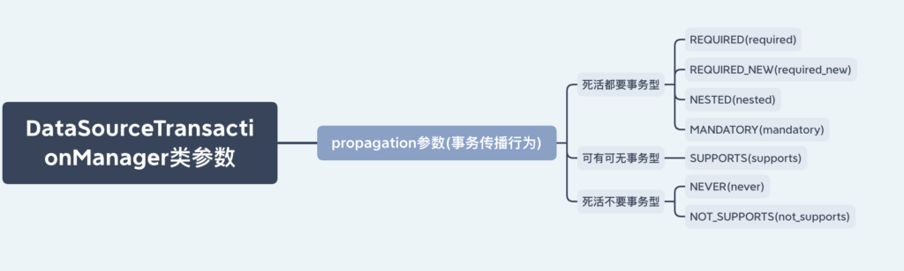

分析这些参数我们要知道第一对象是被调用的方法，也就是被调用对象一定为事务方法，至于调用方法是不是事务方法，相应的参数都有相应的处理。

##### 死活都要事务型

1）**REQUIRED事务传播**：隶属于死活都要事务型，被调用方法一定是事务方法的前提下，调用方法如果是事务方法，那两个事务方法就会合并为一个事务进行处理，反之调用方法不是事务方法，那么被调用方法也一定会自己建立一个属于自己的事务执行。

业务场景模拟，即Mapper对象中，建立两个数据访问方法，分为是inset和set方法，操作分别是插入一条{1,3}数据，{2,4}数据。**注意：在set方法执行完插入后，会主动抛出异常。用来检测回滚情况。**

+ 情况一：**被调用方法set必定为事务方法，调用方法inset不为事务方法，此情况就是set方法自成一派，自己单独作为事务执行**。

```java
@Repository
public class TestMapperImpI {

    @Autowired
    private JdbcTemplate jdbcTemplate ;

    //这里需要注意为什么要引入自己，如果我只是单纯的使用insert方法去调用set方法，
    //那么由于声明式事务是基于AOP实现的，
    //所以inset方法是可以被切面切入的，set只是普通调用，
    //所以我们也要让set方法也可以被切面切入，那么只能让两个方法的调用就是基于IOC容器生成的对象
    //最后可以选择再次引入自己，自己去亲自调用来解决
    @Autowired
    private TestMapperImpI testMapperImpI;

    public void insert(Student student){
        jdbcTemplate.update("insert into tb_stu value(1,3)");
        testMapperImpI.set(student);
    }

    @Transactional
    public void set(Student student){
        jdbcTemplate.update("insert into tb_stu value(2,4)");
        int i = 1/0;
    }
}
```

```java
@Service
public class TestServiceImpI implements TestService {
    @Autowired
    private TestMapperImpI testMapperImpI;

    @Override
    public void test() {
        testMapperImpI.insert(new Student());
    }
}
```

```java
public class Application {
    public static void main(String[] args) {
        ApplicationContext applicationContext =
                new ClassPathXmlApplicationContext("spring.xml")
        TestService testService = 
                applicationContext.getBean("testServiceImpI", TestServiceImpI.class);
        testService.test();
    }
}
```

运行结果：大家可以先猜猜看，看能不能和下面数据库中实际插入情况一样。


**<mark>只插入了inset方法的{1,3}数据，但是set方法中的{2,4}数据被异常回滚了，</mark>**

+ 情况二：**被调用方法set必定为事务方法，调用方法inset也为事务方法，此情况就是inset和set融为一个完整事务执行。**

```java
@Repository
public class TestMapperImpI {

    @Autowired
    private JdbcTemplate jdbcTemplate ;

    @Autowired
    private TestMapperImpI testMapperImpI;

    @Transactional
    public void insert(Student student){
        jdbcTemplate.update("insert into tb_stu value(1,3)");
        //进行捕获，所以外部事务不会因为内部异常抛出而回滚，把情况限制为内部事务异常会不会导致全局回滚。
        try{
            testMapperImpI.set(student);
        }catch (Exception e){
            System.out.println("set异常");
        }
    }
    @Transactional
    public void set(Student student){
        jdbcTemplate.update("insert into tb_stu value(2,4)");
        int i = 1/0;
    }
}
```

其他代码和上述一样，所以不重复放了，直接上数据库结果，大家可以先继续猜一猜，结果是什么？**(所有结果都是从空表开始的，和上一情况结果无关)**


**<mark>结果就是不管是{1,3}还是{2,4}都被最后的1/0异常给回滚了。</mark>**

**此情况二中不管是inset中有异常**(此异常必须在调用set方法后，之前无意义)**还是set中有异常都会让合并完成的整个事物进行回滚。**


2）**REQUIRED_NEW事务传播**：隶属于死活都要事务型，被调用方法一定是事务方法的前提下，调用方法如果是事务方法，那被调用方法自成一事务，并把调用方法事务挂起后执行。反之调用方法不是事务方法，那么被调用方法也一定会自己建立一个属于自己的事务执行。

+ **情况一：被调用方法set必定为事务方法，调用方法inset不为事务方法，此情况就是set方法自成一派，自己单独作为事务执行**。

```java
@Repository
public class TestMapperImpI {

    @Autowired
    private JdbcTemplate jdbcTemplate ;

    @Autowired
    private TestMapperImpI testMapperImpI;

    public void insert(Student student){
        jdbcTemplate.update("insert into tb_stu value(1,3)");
        testMapperImpI.set(student);
    }

    @Transactional(propagation = Propagation.REQUIRES_NEW)
    public void set(Student student){
        jdbcTemplate.update("insert into tb_stu value(2,4)");
            int i = 1/0;
    }
}
```

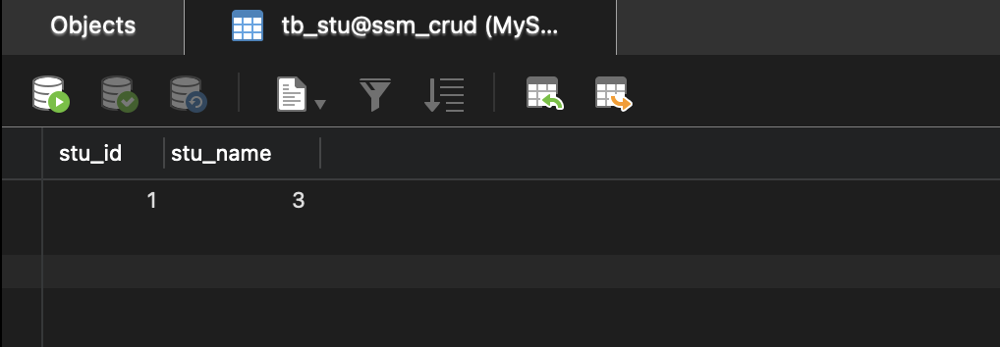

**<mark>set方法自成事务{2,4}回滚，inset无事务不会因set事务失败有影响，{1,3}被成功插入。</mark>**

+ ****情况二：被调用方法set必定为事务方法，调用方法inset也为事务方法，此情况就是inset的事务被挂起，set自成一事务，两个事务互不相关。****

```java
@Repository
public class TestMapperImpI {

    @Autowired
    private JdbcTemplate jdbcTemplate ;

    @Autowired
    private TestMapperImpI testMapperImpI;

    @Transactional
    public void insert(Student student){
        jdbcTemplate.update("insert into tb_stu value(1,3)");
        //这个时候必须要把这个异常处理一下，不然抛出到inset方法中，
        //也会引发insert方法异常，从而造成外部事务也因为异常回滚，
        //但是注意不能再set方法中立刻进行捕获处理，那样就算没有发生异常。
        try{
            testMapperImpI.set(student);
        }catch (Exception e){
            System.out.println("set方式出错");
        }
    }

    @Transactional(propagation = Propagation.REQUIRES_NEW)
    public void set(Student student){
        jdbcTemplate.update("insert into tb_stu value(2,4)");
            int i = 1/0;
    }
}
```

其他代码和上述一样，所以不重复放了，直接上数据库结果，大家可以先继续猜一猜，结果是什么？**(所有结果都是从空表开始的，和上一情况结果无关)**

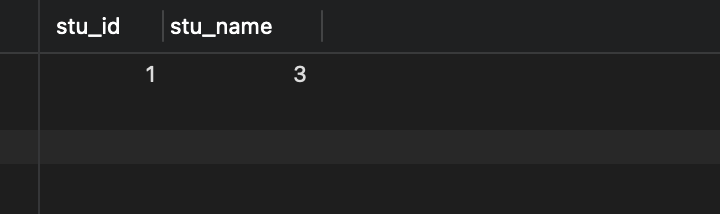

**<mark>set方法因为事务{2,4}回滚，inset事务被挂起不会因set事务失败而回滚,{1,3}成功插入。</mark>**

重点：**此情况二，如果是inset中有异常(此异常必须在调用set方法后，之前无意义)，set中无异常，只回滚inset事务，而不回滚set事务，因为挂起相当于两个互不相干的事务。相反inset中无异常，set中有异常也是同理。**


3）**NESTED事务传播行为**：隶属于死活都要事务型，被调用方法一定是事务方法的前提下，调用方法如果是事务方法，那被调用方法自成一事务，嵌套在外部事务中。反之单独自成一事务指向。

+ **情况一：被调用方法set必定为事务方法，调用方法inset不为事务方法，此情况就是set方法自成一派，自己单独作为事务执行**。**(不演示了，死要事务型情况一均相同)**

+ **情况二：被调用方法set必定为事务方法，调用方法inset也为事务方法，此情况就是set方法自成一派，并且把自己事务嵌入到外部事务中(嵌入很讲究，内部异常内部自己回滚，外部异常大家一起回滚)**

```java
@Repository
public class TestMapperImpI {
    @Autowired
    private JdbcTemplate jdbcTemplate ;

    @Autowired
    private TestMapperImpI testMapperImpI;

    @Transactional
    public void insert(Student student){
        jdbcTemplate.update("insert into tb_stu value(1,3)");
        //这个时候必须要把这个异常处理一下，不然抛出到inset方法中，也会引发insert方法异常，从而造成外部事务也因为异常回滚。
        try{
            testMapperImpI.set(student);
        }catch (Exception e){
            System.out.println("set出异常");
        }
    }

    @Transactional(propagation = Propagation.NESTED)
    public void set(Student student){
        jdbcTemplate.update("insert into tb_stu value(2,4)");
        int i = 1/0;
    }
}
```

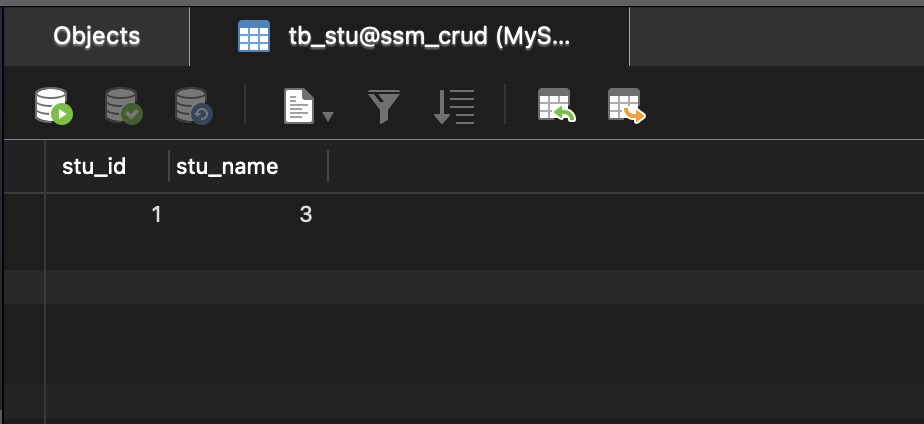

<mark>**可以发现在内部事务出问题的时候，内部事务自己回滚，外部事务无影响。**</mark>

**下述情况则是外部事务出问题，内外一起回滚的情况代码：**

```java
@Repository
public class TestMapperImpI {

    @Autowired
    private JdbcTemplate jdbcTemplate ;
    
    @Autowired
    private TestMapperImpI testMapperImpI;

    @Transactional
    public void insert(Student student){
        jdbcTemplate.update("insert into tb_stu value(1,3)");

        testMapperImpI.set(student);
        int i = 1/0;
    }

    @Transactional(propagation = Propagation.NESTED)
    public void set(Student student){
        jdbcTemplate.update("insert into tb_stu value(2,4)");
    }
}
```

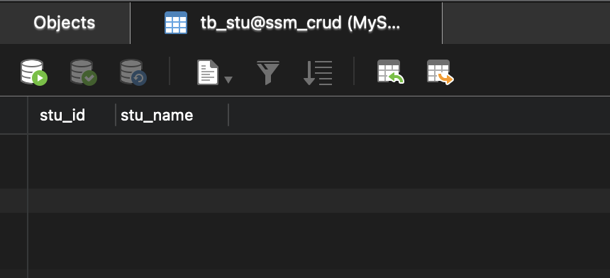


4）**MANDATORY事务传播行为**：隶属于死活都要事务型，被调用方法一定是事务方法的前提下，调用方法如果是事务方法，那被调用方法事务与外部事务进行合并。反之外部方法没有事务，则直接抛异常。

+ **情况一：被调用方法set必定为事务方法，调用方法inset不为事务方法，此情况set方法立刻抛出异常，外部方法由于不为事务方法，所以也不会进行任何回滚。**

```java
@Repository
public class TestMapperImpI {

    @Autowired
    private JdbcTemplate jdbcTemplate ;

    @Autowired
    private TestMapperImpI testMapperImpI;
    
    public void insert(Student student){
        jdbcTemplate.update("insert into tb_stu value(1,3)");
        try{
            testMapperImpI.set(student);
        }catch (Exception e){
            System.out.println("set异常");
        }
        int i = 10/0;
    }

    @Transactional(propagation = Propagation.MANDATORY)
    public void set(Student student){
        jdbcTemplate.update("insert into tb_stu value(2,4)");
    }
}
```

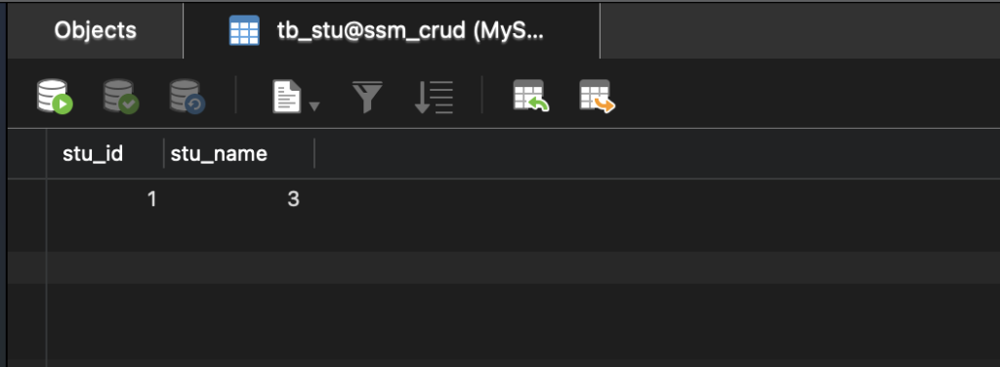

**结论：由于外部方法inset无事务，所以set方法直接抛出异常，被inset捕获处理，但是最后还会因为执行10/0出现异常，但是没有回滚，因为外部方法就没有事务。**

+ **情况二：被调用方法set必定为事务方法，调用方法inset也为事务方法，此情况set方法的事务融入到外部事务中。**

```java
@Repository
public class TestMapperImpI {

    @Autowired
    private JdbcTemplate jdbcTemplate ;

    @Autowired
    private TestMapperImpI testMapperImpI;

    @Transactional
    public void insert(Student student){
        jdbcTemplate.update("insert into tb_stu value(1,3)");
        try{
            testMapperImpI.set(student);
        }catch (Exception e){
            System.out.println("set异常");
        }
        int i = 10/0;
    }

    @Transactional(propagation = Propagation.MANDATORY)
    public void set(Student student){
        jdbcTemplate.update("insert into tb_stu value(2,4)");
    }
}
```

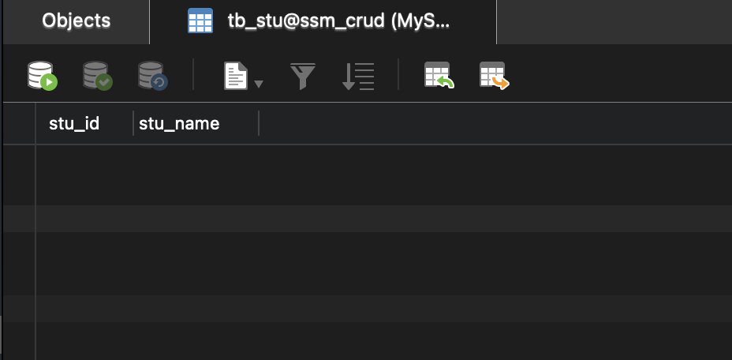

<mark>**内部事务无异常，外部事务最后会异常，由于内外部事务合并为一个事务，全部回滚。**</mark>

 

##### 死活不要事务型

1）**NEVER事务传播行为**：隶属于死活不要事务型，被调用方法一定是事务方法的前提下，调用方法如果是事务方法，那被调用方法直接抛出异常。反之调用方法不是事务方法，那么被调用方法自己在Never事务级别下也不建立事务，而是正常运行。

+ **情况一：被调用方法set必定为事务方法，调用方法inset不为事务方法，此情况就是set方法自己也不把自己当事务执行。**

```java
@Repository
public class TestMapperImpI {

    @Autowired
    private JdbcTemplate jdbcTemplate ;

    @Autowired
    private TestMapperImpI testMapperImpI;


    public void insert(Student student){
        jdbcTemplate.update("insert into tb_stu value(1,3)");
        testMapperImpI.set(student);
    }

    @Transactional(propagation = Propagation.NEVER)
    public void set(Student student){
        jdbcTemplate.update("insert into tb_stu value(2,4)");
            int i = 1/0;
    }
}
```

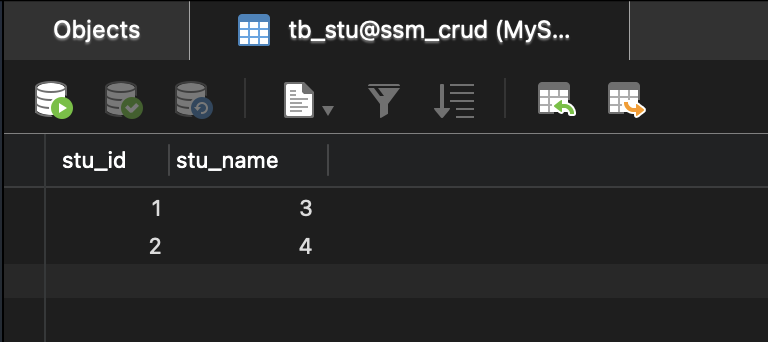

**结果明显，都是无事务方法执行的，哪怕set中出现异常，抛出到inset方法中，再导致inset方法异常，也没有进行回滚。**


+ **情况二：被调用方法set必定为事务方法，调用方法inset也为事务方法，此情况就是set方法直接啥不干了，直接抛异常。但是外部事务还是按事务走的，假设进行捕获set异常，那么外部事务不会回滚，反之会回滚。**

```java
@Repository
public class TestMapperImpI {

    @Autowired
    private JdbcTemplate jdbcTemplate ;

    @Autowired
    private TestMapperImpI testMapperImpI;

    @Transactional
    public void insert(Student student){
        jdbcTemplate.update("insert into tb_stu value(1,3)");
        try{
            testMapperImpI.set(student);
        }catch (Exception e){
            System.out.println("set出现异常");
        }
        int i = 10/0;
    }

    @Transactional(propagation = Propagation.NEVER)
    public void set(Student student){
        jdbcTemplate.update("insert into tb_stu value(2,4)");
    }
}
```

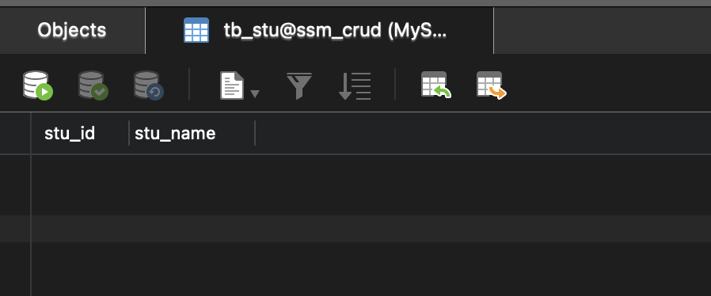

**结论：只要外部有事务，那么此事务传播级别的内部事物直接抛异常，外部事务则是正常执行，如果有异常还是回进行回滚操作。**


2）**NOT_SUPPORTED事务传播行为**：隶属于死活不要事务型，被调用方法一定是事务方法的前提下，调用方法如果是事务方法，那被调用方法则把外部事务挂起，自己以非事务的方式运行。反之调用方法如果不是事务方法，均不以事务方式运行。

+ **情况一：死活不要事务这情况一都一样，均不以事务方式运行。不多说了**

+ **情况二：这情况也和Never 差不多，但是起码其不会因为外部事务而直接抛异常，只有当内部方法中以非事务运行时，遇到异常才会抛异常。所以有一种情况是不同的，也就是当内部方法无异常执行完毕后，外部挂起事务回滚是不影响到内部无事务的方法的。**

```java
@Repository
public class TestMapperImpI {

    @Autowired
    private JdbcTemplate jdbcTemplate ;

    @Autowired
    private TestMapperImpI testMapperImpI;

    @Transactional
    public void insert(Student student){
        jdbcTemplate.update("insert into tb_stu value(1,3)");
        testMapperImpI.set(student);
        int i = 10/0;
    }

    @Transactional(propagation = Propagation.NOT_SUPPORTED)
    public void set(Student student){
        jdbcTemplate.update("insert into tb_stu value(2,4)");
    }
}
```

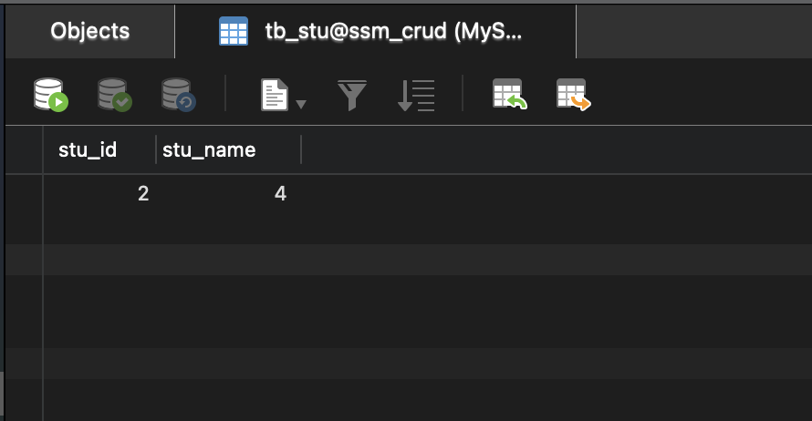


##### 可有可无事务型

1）**SUPPORTS事务传播行为**：隶属于可有可无事务型，被调用方法一定是事务方法的前提下，调用方法如果是事务方法，那就合并一起用。反之调用方法不是事务方法，那么被调用方法自己也不用。

+ **情况一：被调用方法set必定为事务方法，调用方法inset不为事务方法，此情况就是set方法自己也不把自己当事务执行。**

+ **情况二：被调用方法set必定为事务方法，调用方法inset为事务方法，此情况就是set方法事务与外部事务合并执行。**

------

### 第二参数ioslation事务隔离级别

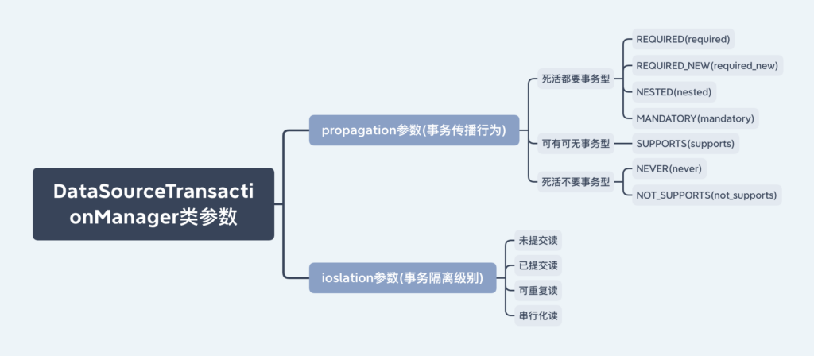

关于这个不多进行阐述，完全依靠于MySQL的四大隔离级别，含义也一样。

-------

### 其他参数

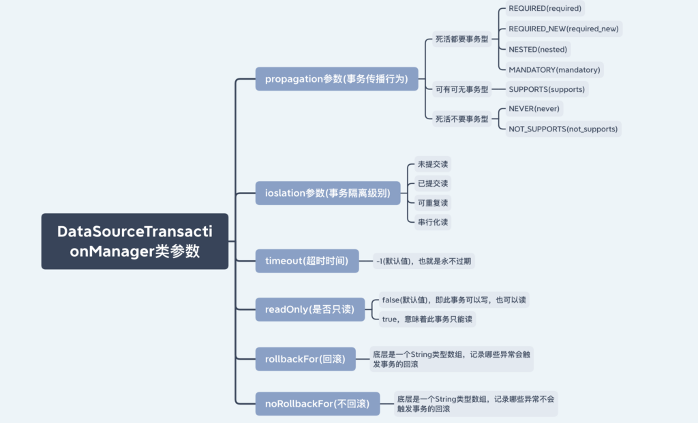

3）**timeout超时时间**：即事务不可能一直被持有，不被提交，所以需要设置一个事务持有超时时间，如果超过这个时间没有完成提交操作，那么事务被回滚。**默认值为-1，代表永不超时。**

4）**readOnly是否只读**：即事务是否只能读的设置，默认值为false，即该事务可以读，可以写。反之只能读。

5）**rollbackFor回滚**：底层是一个String类型数组，记录当前事务会因为哪些异常触发事务的回滚。

6）**noRollbackFor不回滚**：底层是一个String类型数组，记录当前事务不会因为哪些异常触发事务的回滚。


