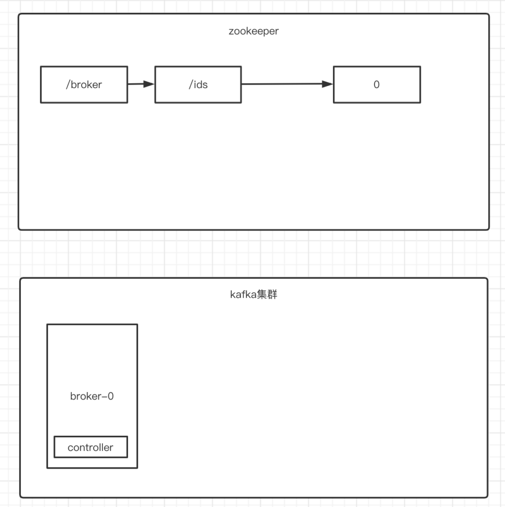
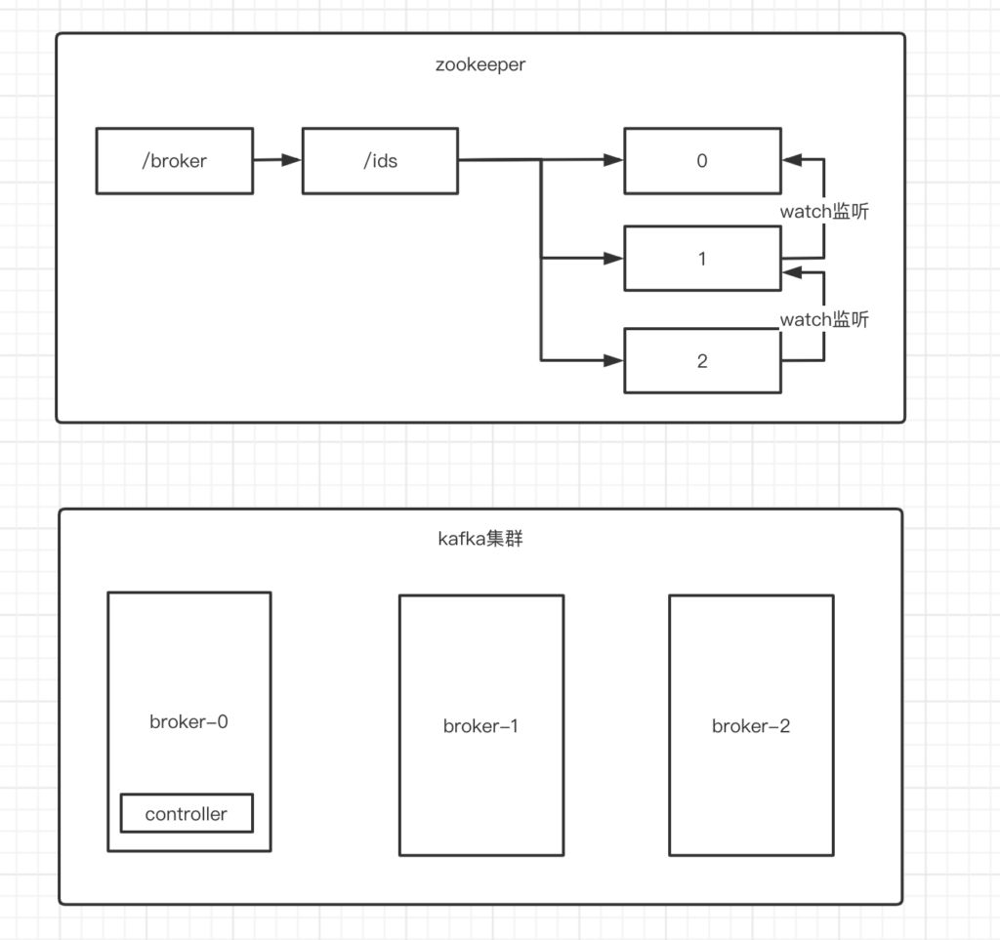
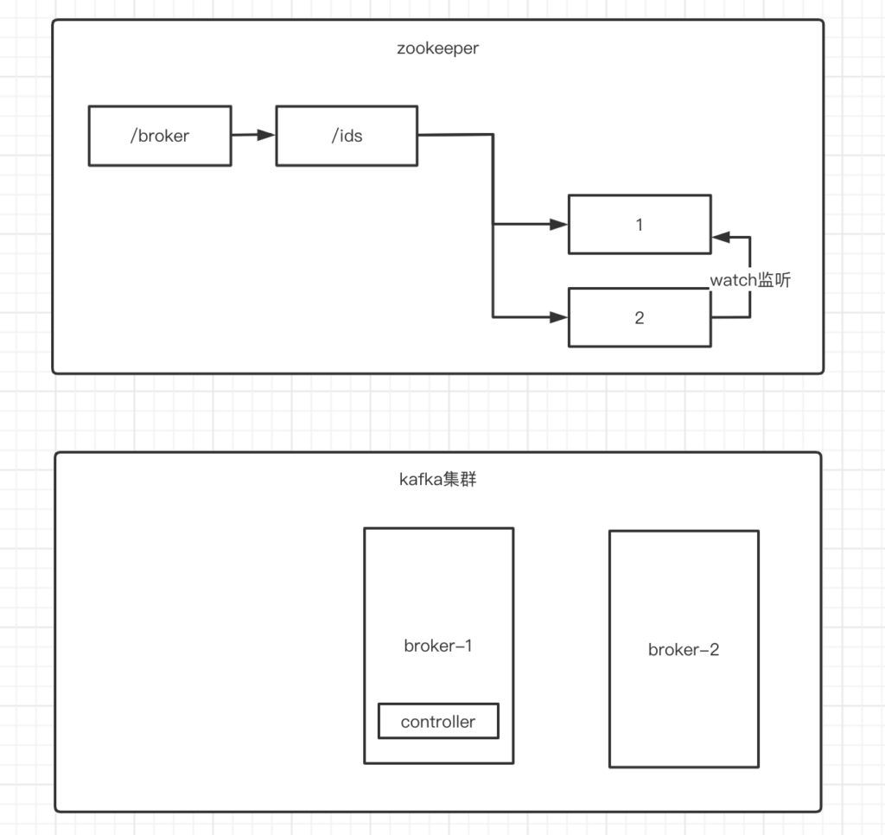
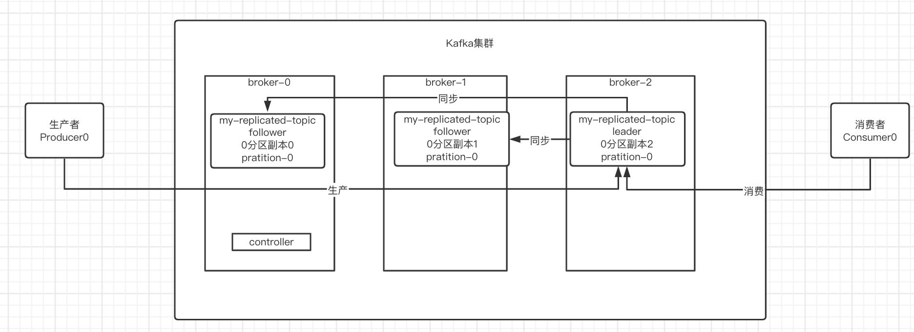
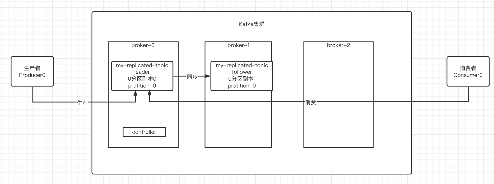
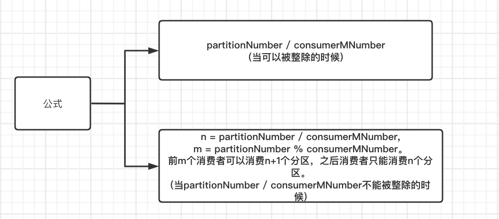
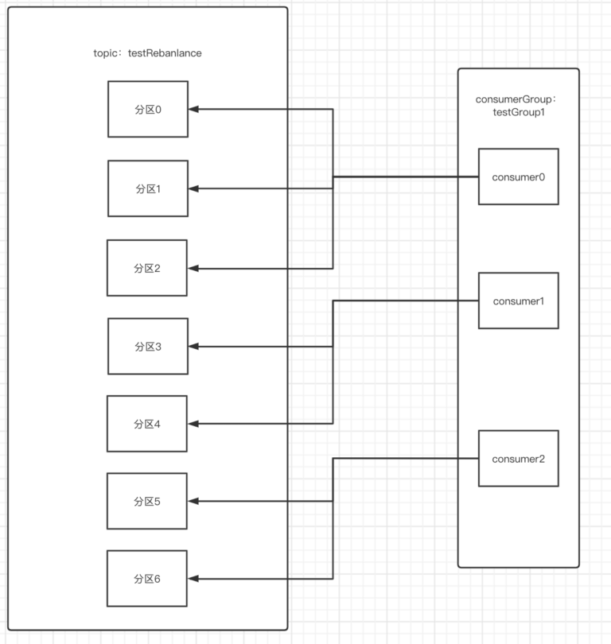
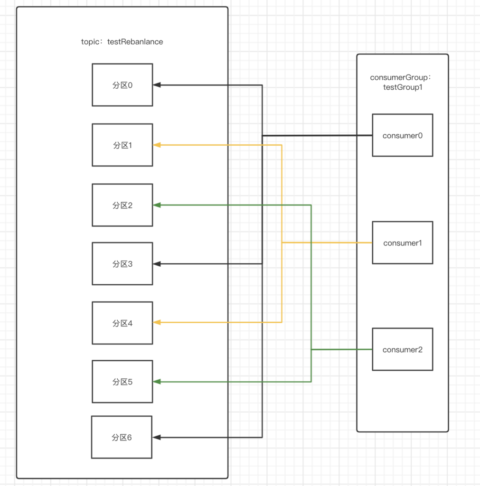
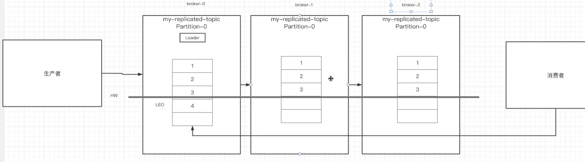
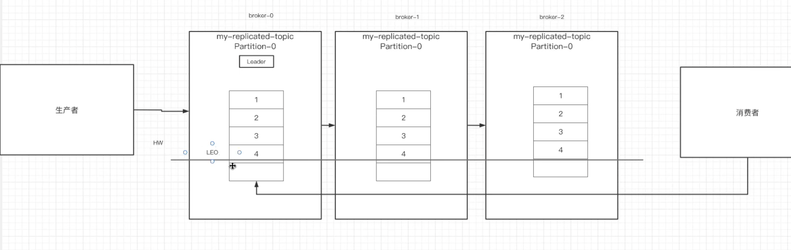

## Controller是什么？

即Kafka集群中的Leader节点被称为Controller节点，Controller节点负责管理集群中其他所有节点中分区,副本的状态。下述为Controller节点的作用：

1）**当某个分区的Leader副本出现故障时，由Controller负责为该分区选举出新的Leader副本。**

2）**当检测到某个分区的ISR集合发生变化时，由Controller负责通知所有broker更新其元数据信息。**

3）**当增加topic分区数量的时候，同样由Controller负责让新分区被其他节点感知到。**

对于这些作用我们均会画图讲解。

------

#### Controller的选举机制

Kafka强烈依赖强烈依赖于Zookeeper的原因之一就是Controller的选举，我们知道只要当一个broker生成时就会在zk的/broker/ids下创建临时顺序节点作为子节点。去代表此broker。

其实Controller的选举过程则是充分体现了ZK实现**集群管理**的作用。下述是我在ZK面经中的回答：

```
集群管理：集群管理主要分为两步，检测集群中节点的加入和退出，Leader的选举。

a.检查集群中节点的加入和退出：首先创建一个集群管理的持久化ZNode节点，然后使用在其子目录中使用临时顺序节点代表集群中节点。其子目录中所有临时顺序节点均使用Watch机制监听集群管理的持久化Znode节点，一旦其子目录中出现新的临时顺序节点(说明有节点加入)，或者其子目录中突然少了一个临时顺序节点(说明有节点退出)。那么就会触发其他临时顺序节点异步事件，让他们知道有节点加入/退出集群了。

b.Leader选举：这个没使用过复杂的选举算法，就单纯的使用最小序号的节点所代表的节点作为Leader节点。当集群节点诞生之后就会在zk中注册一个临时序号节点，此时此节点就会判断自己是不是最小序号节点，如果是，则此节点所代表的集群节点变成Leader，反之不是，则使用watch监听就比自己序号，一旦当前最小序号节点消失(对应的节点宕机等等)，那么就会watch通知此时序号最小的节点，此节点所代表的集群节点变成Leader节点。
```

这两步结合也就是Controller的选举过程完整体。我们使用流程图来模拟一下Controller的选举环节。

环境：由3个节点组成的kafka集群，分别是broker-0，broker-1，broker-2。

(1)搭建初始环境，即顺序启动broker-0，broker-1和broker-2。首先broker-0在zk的/broker/ids目录下生成key为0的临时序号节点。然后0节点获取到自己就是当前最小序号节点，所以broker-0成为了Controller。



(2)随后broker-1被启动，首先broker-1在zk的/broker/ids目录下生成key为1的临时序号节点。然后1节点获取到自己不是当前最小序号节点，所以1节点使用watch机制去监听了0节点。最后broker-2被启动，和broker-1一样的流程。



(3)我们假设broker-0宕机了，那么zk中/broker/ids目录下的0节点消失，触发watch机制，通知到1节点，1节点发现自己是当前最小顺序节点，所以其代表的broker-1变成Controller。



------

#### Controller作用流程演示

直接上之前的一个topic在三节点的kafka集群中的环境。用此环境作为实例环境。




接着我们模拟一下在broker2(partition为0的Leader副本2)宕机之后，0分区副本怎么选举出Leader。

当broker2宕机之后，controller节点也就是broker-0会去此副本对应的topic中查询其分区ISR情况，我们可以看到my-relication-topic的0分区ISR情况{0,1}，**此时Controller就是在更新自身borker节点的ISR元数据后去通知其他broker节点更新此元数据,也就是ISR{0,1}。那么Controller就会选举ISR集合中最左边的序号副本为Leader副本，也就是序号0。**





## Rebalance机制

对于Kafka消费者来说，***有一个难以避免的问题就是消费者的重平衡即Rebalance\***。***Rebalance是让一个消费组的所有消费者就如何消费订阅topic的所有分区达成共识的过程\***，在Rebalance过程中，所有Consumer实例都会停止消费，等待Rebalance的完成。因为要停止消费等待重平衡完成，因此Rebalance会严重影响消费端的TPS，是应当尽量避免的。

Rebalance 的触发条件有3个。

1）**消费组成员个数发生变化。例如有新的Consumer实例加入或离开该消费组。**

2）**订阅Topic 个数发生变化。**

3）**订阅 Topic 的分区数发生变化。**

除了第一个是经常自动发生的，其他两个均是指令操作才会触发的，我们为了避免rebalance执行时，所有消费者都停下来工作，所有尽量不要在运行时环境进行分区操作。

Rebalance机制的实现有三个政策：

1）**range范围策略**

2）**轮询策略**

3）**sticky策略**

------

#### 流程解析之range范围策略

每个消费者所订阅的分区数量计算公式：



我们来搭建一个环境，即同一个topic的7个分区和3个同处一个消费者组的消费者构成环境。

**注意：rebalance机制的前提环境是对于同一个topic必须排序好分区序号集合和排序好同一个消费者组中的消费者。**



我们根据上述公式一可以计算出，7/3是不能被整除的，也就是采用第二个公式，n=7/3=2，m=7%3=1。所以也就是前1个消费者消费2+1个分区{0,1,2}，后两个消费者分别消费2个分区{3,4}和{5,6}。

**注意：如果如果有消费者退出或者加入时，需要清空所有消费者已经订阅的顺序，并重新执行rebalance。**

**扩展：默认使用range来当作rebalance机制的策略。**

------

#### 流程解析之轮询策略

即顺序轮询的方式来分配消费者可以订阅的分区。



即consumer0订阅分区0，consumer1订阅分区1，consumer2订阅分区2，然后回到consumer0订阅分区3，以此类推。

**注意：如果如果有消费者退出或者加入时，需要清空所有消费者已经订阅的顺序，并重新执行rebalance。**

------

#### 流程解析之sticky策略

即rebalance执行之后，如果有消费者退出或者加入时，不需要重新rebalance，而是在已经订阅顺序的基础上进行修改。

**这个了解一下就行，挖个坑，以后来填。**


## HW高水位

HW全称”HighWaterMark”，即高水位的缩写，**一般取Kakfa集群节点中指定topic下pratition对应ISR副本集合中拥有最小Log-end-offset的副本中的Log-end-offset作为HW高水位线。**

在Kafka集群中，我们知道当生产者向Leader副本中写入数据的时候，只有当Leader副本把数据写入到本地log存储文件中之后，才会向其他副本中同步此更新数据。

但是如果说我们在还没有同步完成的时候，去消费数据的话，那么能够消费到这个还没有同步到的数据嘛？

下图就是一个模拟过程，即刚在offset=3的位置放入消息内容为4的消息，此时leader的log-end-offset为3，其他副本的log-end-offset为2，HW选取其他副本中最低的log-end-offset值，也就是2。



此时由于HW机制的原因是无法读取到最新消息的，只能读区到HW线所在的offset=2的消息。只有等待所有的副本都同步成功，所有副本的log-end-offset值为3，HW线随着变为3，那么就可以读取到最新消息了。



------

#### 为什么这么做？

这样的操作明显会带来性能缺陷，即无法立刻读取最新数据，但是优点也很明显，**那就是消息的安全性和不丢失性。**

在下述场景中，我们假设没有HW机制，那么在leader把最新消息写入到本地log文件之后，更新log-end-offset。其他消费者就可以消费到最新消息了，那么此时Leader所在broker宕机了，其他副本由于没有同步成功，导致最新消息丢失。

