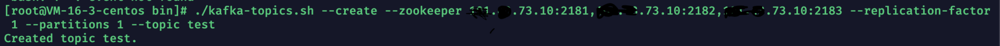

# Kafka基本概念

### 基本术语


我们来看看Broker，Topic，Producer和Consumer之间的关系。如下图所示


和轻topic相比，topic是由broker定义，后被Consumer订阅的。而不是均有Consumer定义且订阅。

宏观上：当生产者交给broker需要传输的数据之后，由broker根据key的特性把其转发到对应的topic中，然后由订阅了此topic的Consumer消费。


### 创建和查看topic

##### 创建指令

```tex
./kafka-topics.sh --create --zookeeper zkIP:PORT[,ZKIP2:PORT] --replication-factor 1 --partitions 1 --topic topicName
```

+ **--replication-fator number**：创建的副本数量

+ **--partitions number**：创建的topic分区数量
+ **--topic topicName**： 创建topic名称。




##### 查看当前kafka节点中有哪些topic 

```tex
./kafka-topics.sh --list --zookeeper localhost:2181[,localhost:Port]
```


### 向topic中发送和接受数据

首先kafka自带了一个**kafka-console-producer.s**h的客户端工具，此工具可以从文件中读取或者以指令形式输入内容等方式获取数据并把其封装为信息发送给Kafka节点。所以我们使用其进行演示

##### 发送数据

**输入此指令之后，会跳转到命令行，谨记在命令行中一行为一个信息**。

```tex
//其中--broker-list IP:PORT[,IP:PORT]是提供信息发送给指定的kafka节点/集群，--topic topicName为指定kafka节点/集群中指定的topic
./kafka-console-producer.sh --broker-list kafkaIP:PORT,[kafkaIP2:PORT] --topic topicName
```

+ **--broker-list IP:PORT[,IP:PORT]**：提供信息发送给指定的kafka节点/集群

+ **--topic topicName：**指定kafka节点/集群中指定的topic


kafka还自带了一个**kafka-console-consumer.sh**的客户端工具，此工具可以从Kafka节点的指定topic中消费信息。所以我们使用其进行演示：

##### 接收数据方式一

**(此指令代表从订阅时刻起信息偏移量+1开始消费(即最新消息))**

 ```tex
 ./kafka-console-consumer.sh --bootstrap-server 101.43.73.10:9093[,kafkaIP2:PORT2] --topic topicName
 ```

+ **--bootstrap--server IP:PORT[,IP:PORT]**：寻找指定kafka节点/集群中broker
+ **--topic topicName**：找到指定kafka节点/集群之后订阅指定的topic

注意：此指令代表从订阅时刻起信息偏移量+1开始消费(即最新消息)。


##### 接收数据方式二

**(此指令代表从头消费)**

```tex
./kafka-console-consumer.sh --bootstrap-server kafkaIP:PORT[,kafkaIP2:PORT2]  --from-beginning --topic topicName
```


### 生产-消费实例演示

演示内容：开启一个kafka消费者客户端，输入hello，new，world三条信息后，再开启一个消费最新消息的consumer客户端。然后再开启一个从头消费的consumer客户端。


我们可以发现输入完消息之后，再开启的Consumer客户端不会去消费之前输入的，其只会输入最新输入的信息。我们来看看：


确实如此，当Consumer客户端订阅topic之后的数据成功被消费。

当我们再开一个从头开始消费的Consumer客户端，来看看效果：


### kafka节点信息发送与接受功能解析

##### 信息记录形式

首先我们需要去到自己定义的目录文件地址，我这里是

```tex
log.dirs=/usr/local/kafka_2.11-2.4.0/logs/kafka-logs
```

所以我来到此目录下，寻找当前broker中唯一的topic也就是test


我们会找到代表test的文件test-0，0是此kafka的节点id。也就是说我们可以认为当我们发送数据的时候，数据会被存放到我们指定的kafka节点中，并被以文件的形式存储起来。

也就是说我们在发送指令上写的是IP:PORT集合，那么就是向集合中的kafka节点各发送一份数据。

**重点：Kafka中消息会被topic在日志目录下的存储日志文件保留7天，也就是哪怕被消费了也不会消失，只会通过偏移量来控制消费者可以消费到哪些信息。**


##### 信息消费流程

之前提过Consumer的消费方式有两种，一种是从头开始消费，一种是消费最新的信息。这个实现基础就是数据记录的偏移量。

当我们发送的数据来到指定kafka节点/多个节点被记录时，是按照发送顺序和偏移量来顺序记录的。

1）从头消费的客户端Consumer一旦被定义出来，那么初始化消费指针指向存储数据偏移量的最开始的偏移量，然后消费一个数据，指针就会向偏移量+1的位置上移动，如果此位置上有数据，继续消费。直到指针所指偏移量上没有数据，等待此偏移量上被写入数据（也即是等待新消息的到来）。

2）消费最新消息的客户端Consumer一旦被定义出来，那么初始化消费指针指向存储数据偏移量最后一个数据的偏移量+1的位置上。此时客户端会因为指针所指偏移量上无数据而陷入阻塞等待。只到此时有新的数据到来而且被记录后，才会去消费当前位置上消息。消费完之后指针移动到当前偏移量+1的位置上。继续等待新消息的到来。


### 消息的单播与多播

##### 单播

**即点对点通讯方式，即客户端发送消息到指定topic后，只能被一个消费者消费。**

单播的形式有两种：

+ 一种是无消费者组(ConsumerGroup)的
+ 一种是有消费者组ConsumerGroup的。


上图即为无组的单播，由于此topic1只被一个消费者订阅，所以形成单播。

然后我们来看看有消费者组的，**消费者组即包含订阅同一个topic的多个消费者的组结构，但是组内只有其中一个消费者实例可以消费topic信息，只要这个消费者实例不宕机，那么这个topic的消息可以一直由它来消费。**


##### 多播

**即一对多通讯方式，即客户端发送消息到指定topic后，可以被多个消费者消费。**

多播的形式同样也分为”无消费者组”和”有消费者组”。


上图为无消费者组的多播模式，当生产者发送消息到topic1后，会被两个消费者消费。

然后我们来看看有消费者组的多播模式流程图：


通过把多个订阅同一个topic的消费者分为两个消费者组，每个消费者组中均有一个消费者实例在消费，从而完成多播。


### 消费者组的创建和查看参数

##### 创建消费者组指令

```tex
./kafka-console-consumer.sh --bootstrap-server kafkaIP:PORT[,kafkaIP2:POST2] --consumer-property group.id=groupName --topic topicName
```

+ **--consumergroup-property group.id = groupName** ：指当前消费者创建或者加入的消费者组名称


##### 查看消费者组参数指令

```tex
//查看当前kafka节点/集群中有哪些consumergroup。
./kafka-consumer-groups.sh --bootstrap-server kafkaIP:PORT[,kafkaIP2:POST2] --list
```

```tex
//查看当前kafka节点/集群中指定consumergroup的参数信息
./kafka-consumer-groups.sh --bootstrap-server kafkaIP:PORT[,kafkaIP2:POST2] --describe --group groupName
```

消费者组参数介绍：

1）Group：当前消费者组名称id

2）Topic：当前消费者组所订阅的topic名称id

3）Partition：当前消费者组所定义topic中的具体分区，关于分区我们下一个博客讲解

4）Current-Offset：即当前消费者组中实际消费的消费者所消费的最新消息偏移量。

5）Log-End-Offset：即当前消费者组所订阅topic中最新数据的偏移量

6）Lag：即当前消费者组未消费消息数量，由Log-End-Offset 减去 Current – Offset得到。

7）Consumer-ID：即当前消费者组中实际消费者ID

8）Host：即当前消费者组中实际消费者所处IP

9）Client-ID：即当前消费者组中实际消费者在消费者组中编号

**注意：当消费者组中的消费者都宕机了后，生产者还在往topic中发送数据的话，log-end-offset值哥lag值会增加，current-offset值不变。**
