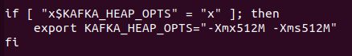

# Kafka安装流程

1）首先去”apache官网”下载2.4.0版本的kafka安装包。选择二进制下载的第一个kafka_2.11-2.4.0.tgz。	[kafka下载](https://kafka.apache.org/downloads)


2）使用传输工具或者scp指令传输到服务器所在IP地址的目标目录下，这里我传输到/usr/local/tar目录下

```tex
scp -r -P 22 kafka_2.11-2.4.0.tgz root@127.0.0.1:/usr/local/tar
```


3）跳转到/usr/local/tar目录下，使用tar -zxvf指令解压kafka_2.11-2.4.0.tgz包。

```tex
tar -zxvf kafka_2.11-2.4.0.tgz
```


4）使用mv指令把解压目录kafka_2.11-2.4.0移动到上一层目录local中

```tex
mv kafka_2.11-2.4.0 ../
```


5）进入到kafka_2.11-2.4.0目录中的conf目录下，修改server.properties。

```tex
cd kafka_2.11-2.4.0/config
```


6）修改下述字段

```properties
#类似于zk的myid，属于集群中节点的唯一标识
broker.id=0

#允许外部端口连接，云服务器填写内网IP，如果是虚拟机直接填写外网IP即可
listeners=PLAINTEXT://127.0.0.1:9092

#开放外部访问接口,云服务器填写外网IP
advertised.listeners=PLAINTEXT://121.201.64.12:9092

#kafka日志文件所在
log.dirs=/usr/local/kafka_2.11-2.4.0/logs/kafka-logs

#访问zk的IP地址和端口，填入你搭建好的ZK的IP:PORT即可，如果是集群使用,分开
zookeeper.connect=localhost:2181
```


7）回到kafka_2.11-2.4.0目录的bin目录下，找到kafka-server-start.sh启动kafka，并使用ps指令查看是否执行成功

```tex
./kafka-server-start.sh -daemon ../config/server.properties
```

```tex
ps -ef | grep 'server.properties'
```


8）如果遇到JVM内存分配不够，那么就进入到kafka-server-start.sh文件中修改内容




9）如果遇到没抛出错误启动失败，那么到logs目录下查看server.log文件查看异常在哪即可。