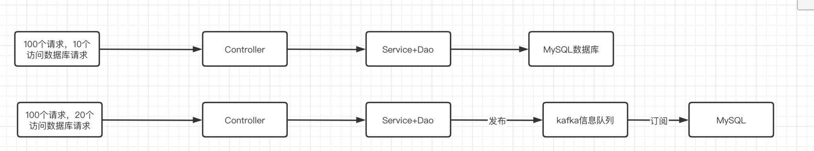
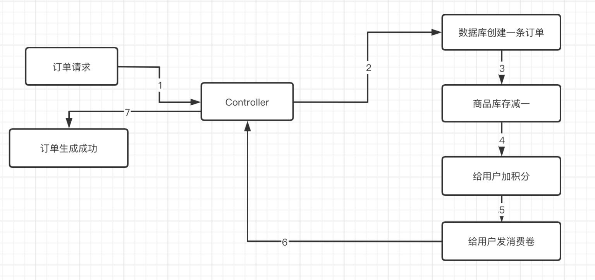
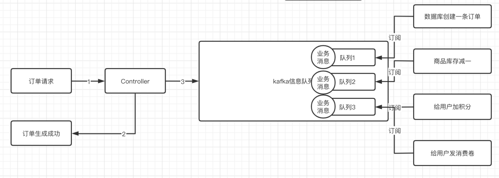
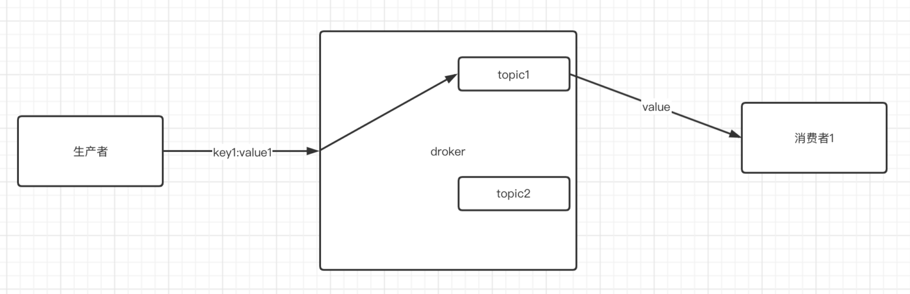
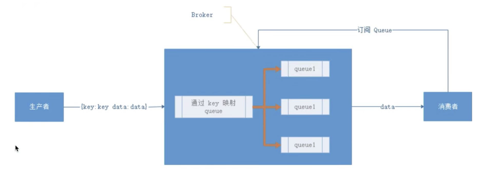
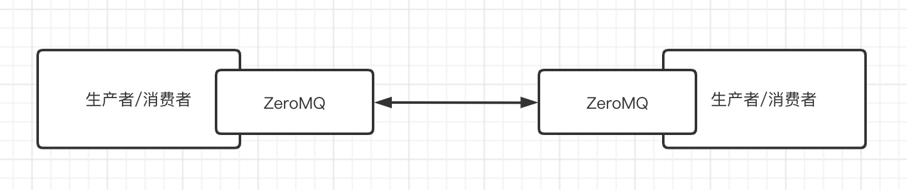

# Kafka简介

> Kafka是一个**分布式，可分区，多副本**，基于Zookeeper协调的**分布式信息系统**。由于其**高吞吐，低延迟**的特性，往往被后端开发者当作信息队列来使用。

### Kafka使用例子讲解

下面举两个开发实例来说明Kafka作为信息队列时的作用体现：

##### 流量削峰,保证系统稳定性

我们假设我们的微服务可以同时处理100个正常的请求，但是只能同时处理10个访问到数据库请求。这个时候如果同时到达20个访问到数据库的请求，那么我们的tomcat就会崩溃。所以我们想要办法把这个同步的20个访问数据库请求转变成异步的暂缓请求。即当我们的请求需要访问数据库的时候，就把这个请求丢到信息队列中，异步等待结果返回。这样就不算是同时访问的数据库，也就不会发生tomcat服务崩溃。

##### 帮助微服务完成异步通信，体现高吞吐和低延迟

假设一个电商业务，我们购买一个物品需要经四个微服务，分别是创建订单微服务，库存微服务，用户积分微服务，用户优惠价微服务。如果我们正常同步业务逻辑下实现的流程如下所示：

从1-7都是同步顺序执行的，我们如果假设1-7每一个都需要等待5毫秒，那么我们购买一个东西需要等待3.5s才能收到订单生成成功的提示。这么长的同步响应时间间隔如果出现在实际落地App中，那么肯定用户体验不高。

所以我们就可以使用kafka信息队列完成一个请求异步执行方式来提高这个请求的低延迟性能。如下图所示：

即我们不在等待同步执行完成，而是把业务信息都提取完毕之后，直接返回订单生成成功。然后订单的具体生产则交给信息队列去异步处理。这样做明显提升了低延迟的性能。

但是异步方式完成业务逻辑的话，我们还得注意就是如果其中一个微服务失败了，那么怎么办。

我们可以借助分布式事务来解决这个问题，数据库创建订单和库存减一明显必须是原子性的，一旦有出错要立刻回滚。但是用户加积分和消费卷如果失败，可以等待高峰过去再慢慢恢复即可。

### 信息队列的种类

在开发初期，根据业务的类型挑选具体业务落地采用技术被称为**技术选型**，我们需要知道关于这个业务能够落地实现的多个技术特征，从而选择一个符合这个业务的技术实现，而不是一味的选择最佳的最优的。

**简单描述一个信息队列(Message Queue)：为了完成通讯，并屏蔽底层复杂的通讯协议，定义了一套应用层的，更加简单的通讯协议。**

如果两个微服务之间通信采用TCP协议的话，我们不仅仅需要去定义TCP协议的长短连接，心跳检测以及为了在TCP长连接下保证数据边界的正确性，从而定义私有上层协议等等。按照上面一套流程开发下来，业务逻辑还没写呢，服务之间通信就占用了大半开发时间。

所以**MQ要做的就是在这些复杂协议之上构建一个简单的”协议”—-生产者/消费者模型**。MQ带给我们协议并非具体的通讯协议，而是更高层次的异步通讯模型。它定义了两个对象——生产者(发送数据)和消费者(接收数据)。并提供了一套完整的SDK让我们自定义生产者和消费者从而实现彼此之间的异步通讯，并无视底层通讯协议。

**简单来说就是你把需要传输的通讯数据传输给MQ以及从MQ中获取数据到指定消费者之间的通信需要的协议等等均交给MQ，不需要我们来操心。**

##### 种类一：包含Broker的MQ

即改种类的MQ往往会有一台服务器作为Broker，所有的信息均通过他来中转，生产者把信息交给他之后就结束自己的任务了，Broker则会把信息主动推送给消费者，或者由消费者轮询。

##### 种类二：重Topic的MQ

kafka，rocketMQ，activeMQ(JMS)就属于这个种类。

生产者会发送一个key和value到Broker中，消费者订阅指定的topic后，由Broker比较key之后决定给那个topic，也就是给那个对应的消费者。这种也是MQ最常见的类型，topic可以认为是Broker中的queue。一个Broker中可以有一个到多个topic，由Key决定value到达那个topic。

如果在乎通讯性能的话，那么kafka是最好的选择。

##### 种类三：轻Topic的MQ

RabbitMQ(AMQP)就是属于这个种类，生产者发送key和value，由消费者定义订阅的队列，Broker收到数据之后会通过一定的逻辑计算出key对应的队列，然后把数据交给队列。注意这是的交给不再是key和queue之间的单对单给予。

这种模式解藕了Key和queue，也就是不再是key和queue的单独对应关系，而是根据key的不同，可以把key交给不同的queue。而根据key映射到queue的设备被我们称为exchange(交换机)。

AMQP一共提供了四种交换机模式：

1）**Direct exchange**：key等于queue。

2）**Fanout exchange**：无视key，直接给所有queue各映射一份。

3）**Topic exchange**：key可以使用“宽字符”模糊匹配queue

4）**Headers exchange**：无视key，通过信息头部的元数据来决定给那个queue。

##### 种类四：不包含Broker的MQ

无Broker的MQ代表是ZeroMQ。ZeroMQ核心理念就是不认为这是一个中间件，而是一个更高级的Socket。

所以ZeroMQ和Socket很像，也就无需再借助Broker进行转发了。可以说ZeroMQ是单独封装的一套类似于Socket的API库，可以借助ZeroMQ完成信息的发送和接收。

通过上图可知ZeroMQ的每一个节点均可以是消费者或者是生产者。可以实现同一台机器的PRC通讯也可以实现不同机器的TCP/UDP通讯，如果需要一个强大，灵活，野蛮的通讯能力，可以试试ZeroMQ。