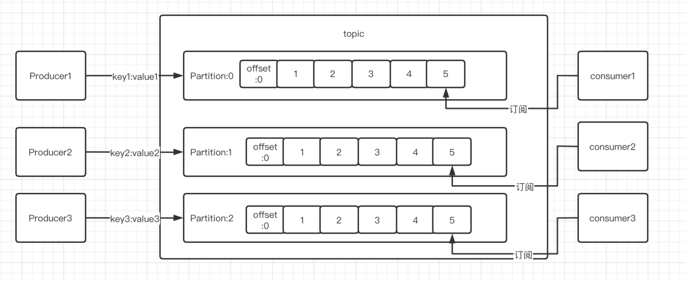
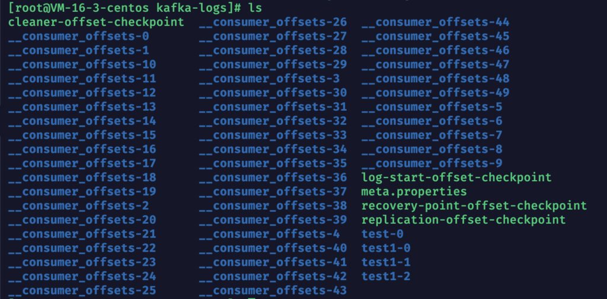
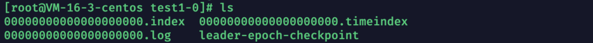
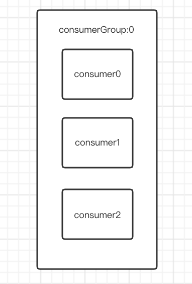
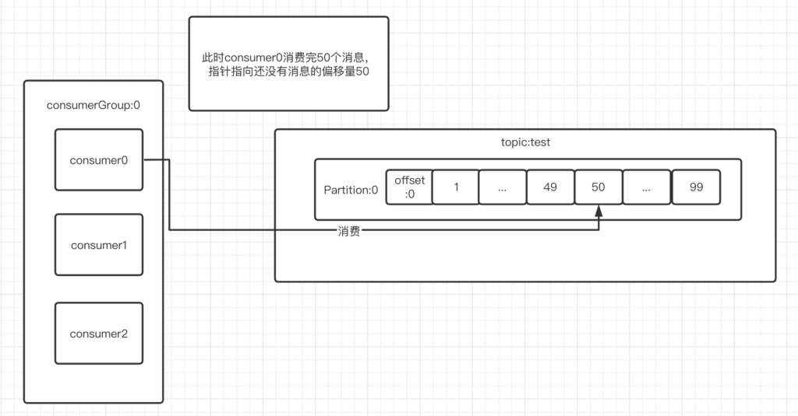
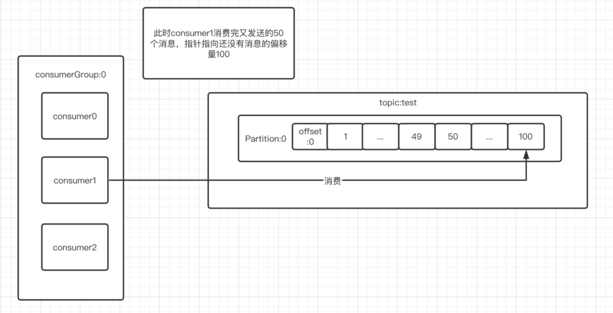
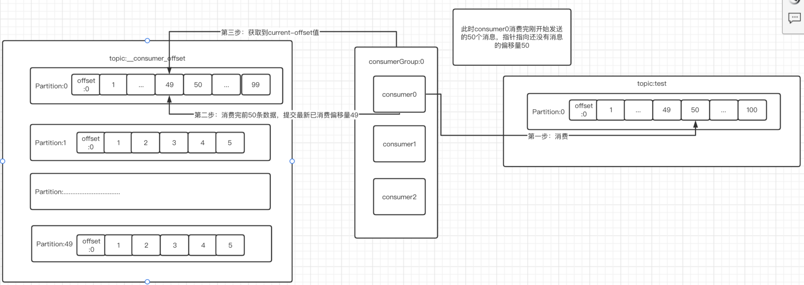

# 主题与分区

当我们使用下述指令创建topic的时候，我们曾指定过此topic的分区数量，也就是–partitions number参数。

```
./kafka-topics.sh --create --zookeeper zkIP:PORT[,ZKIP2:PORT] --replication-factor 1 --partitions 1 --topic topicName
```

那么这个存在于topic中分区partition到底是什么？

我们假设一下淘宝双十一的时候，秒杀商品的请求可以是百万，千万级的，那么我们使用消息队列来做请求异步处理的时候，一个topic中会存储百万，千万条消息，先不说这么大量消息存储在一个数据日志文件中让其占用空间过大的问题，光是生产吞吐和消费吞吐都会降的很低。所以kafka设计者为了解决吞吐问题，采用分布式思维，在topic中划分出来partition的概念。

如果我们创建topic的时候，指定分区数量为3，那么分区各自为partition-1，partition-2，partition-3。一旦生产者往此topic中发生数据，那么数据就会随机来到某个分区的最新偏移量上。**消费者只有订阅topic的指定分区才能获取到这个消息去消费。也就是哪怕消费者们订阅同一个topic，但是如果订阅分区不同，那么就获取不到没有订阅分区的信息。**



采用上述结构的话，有两个好处：

**1）一个partition对应了一个日志存储文件，所以解决了单个数据存储日志文件过大的问题。**

**2）同一时刻下，允许多个生产者(不多于partition数量)向topic中发送数据。当然同一时刻，也允许多个消费者向topic中消费数据。这样增加了topic的写/读吞吐量。**


# 分区在日志文件下的形式

我们使用创建topic指令创建一个名为test1的3分区topic，然后去配置文件中的日志文件路径下查看一下各分区的日志文件。

1）创建名为test1的topic，并分区数量为3

```tex
./kafka-topics.sh --create --zookeeper 127.0.0.1:2181 --replication-factor 1 --partitions 3 --topic test1
```

2）跳转到配置文件中的日志路径下，我的是/usr/local/kafka_2.11-2.4.0/logs/kafka-logs

```tex
cd /usr/local/kafka_2.11-2.4.0/logs/kafka-logs
```

3）使用ls指令，查看寻找此目录下的test1前缀的文件

```tex
ls  ./
```



**关于__consumer_offset为前缀的目录，暂时不管，我们在说完这个之后再consumerGroup运行流程中解释。**

在此目录下我们可以看到test1-0，test1-1，test1-2三个目录，此目录下就保存了当前名为test1的topic下三个分区的存储文件。

4）由于三个test1-0,1,2目录下文件数量和名称均一致，所以我们拿test1-0来举例，首先我们ls查看一下test1-0中文件



我们会发现主要的三个文件：

1）**000000000000000000.log文件**：按照偏移量顺序存储着此分区中消息，7天删除一次，保留最新的偏移量上的数据。

2）**000000000000000000.index文件**：为上一个文件的稀疏索引文件，即我们可以假设其中保留了偏移量为1000,2000,3000的数据索引，用来快速检索数据。

**3）000000000000000000.timeindex文件**：为第一个文件的时间索引文件，即我们可以假设其中保留了以多少时间间隔的数据偏移量索引。


# ConsumerGroup运行流程解析

刚刚在我们指定的目录地址下，也就是/usr/local/kafka_2.11-2.4.0/logs/kafka-logs目录下，我们发现有后缀0到49的_ _consumer_offset文件。


**这些文件其实是kafka内部创建的一个名为_ _consumer_offse主题的分区文件。**

从后缀可知，其一共有50个分区，**这个_ _consumer_offset主题是用来保存消费者消费某个主题(topic)的偏移量的。**

我们假设有一个消费组名为consumergroup_0，组内有consumer_0,consumer_1,consumer_2三个消费者。对外都是consumer_0来进行名为test主题的消费。



第一次生产者Producer向test主题(分区数为1个)中发送了50条消息，均被consumer_0消费，此时consumer_0宕机了，由consumer_1顶上此位置。



现在Producer又发送了50条消息来，此时均被consumer_1消费。**那么consumer_1怎么知道上一个消费者已经消费到偏移量为49的第50条消息呢？**进而从偏移量为50开始消费新的信息。



我们应该还记得我们查看consumerGroup的具体消息的时候，有current_offset和log-end-offset两个值来记录当前消费节点消费消息偏移量和topic中最新数据的信息偏移量。那么consumerGroup是怎么获取到current_offset这个消息的呢？

其实每当消费者消费一条消息之后，**就会向__consumer-offset主题内的固定某个分区提交数据，这个数据包含{key，value}。其中key为consumerGrouid+topic+topic其分区号，vaule为当前消费者消费数据的偏移量。**

所以consumerGroup0的current_offset值就是通过获取到**__consumer-offset**中对应分区内的最新偏移量来得到的。

那么我们怎么让一个consumerGroup组内所有的消费者都固定到**__consumer-offset**的某个分区呢？这就是要看一下这个分配算法了


# 分配算法

**hash(consumerGroupid)%consumer_offset_number**

**通过上述分配算法，基本上同一个consumerGroup内的消费者都可以计算到__consumer-offset的同一个分区。**

