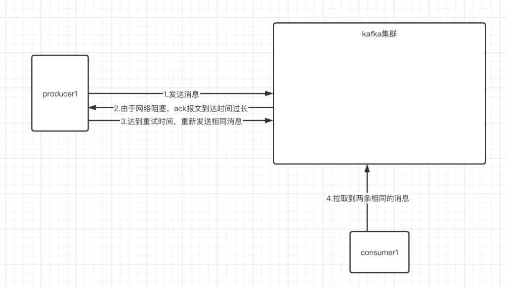
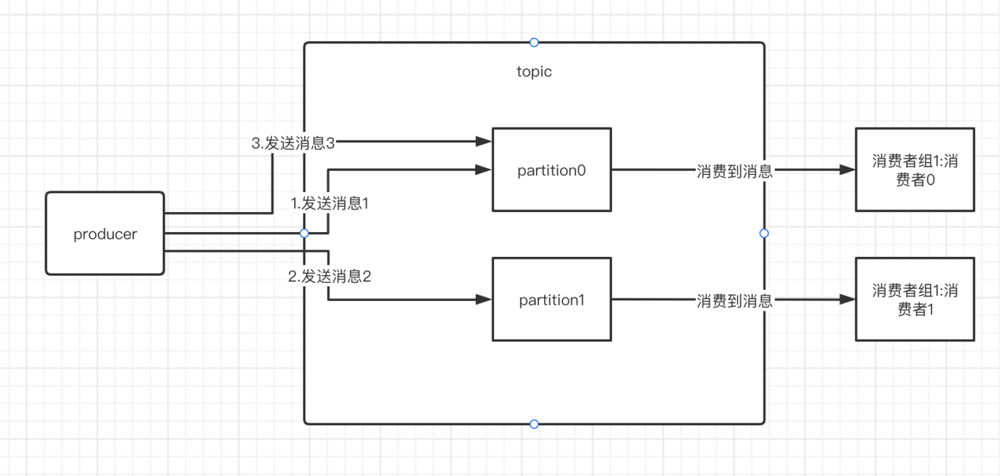
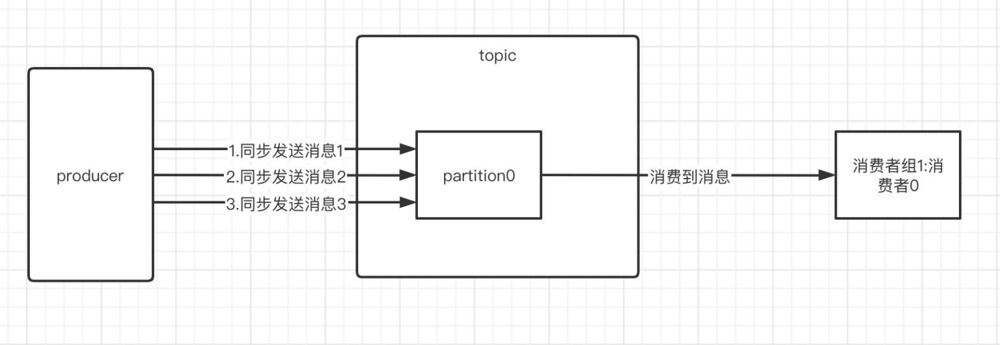
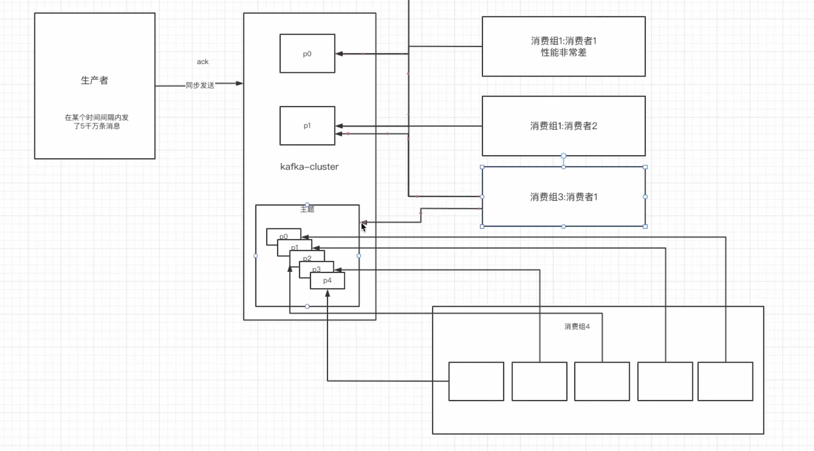

## 防止消息丢失

**生产者：**在客户端连接时配置**acks=1或者asks=-1/all**，可以在提交完消息之后，等待一个到多个副本同步完成之后，在返回ack报文，让生产者继续运行。

**扩展：如果要做到最大程度上的防止消息丢失，ack设成all，然后设置min.insync.replicas值为分区副本数量。**

```
spring.kafka.producer.acks=1
```

**消费者：**在提交方式上，选择手动提交，并设置为消费完poll到的单条或者消息集合时，手动提交。但是注意性能安排。

```
自动提交：容易丢失消息，即还没有消费消息集合时，已经把集合最后一个消息的offset提交给broker，如果消息集合没有消费完，消费者宕机了，那么消息集合中还没有被消费的消息就等于丢失了。
```

下述是消费完单条提交和消息集合时提交的不同性能影响：

(1)手动提交为每消费一个消息就手动提交一次。那么就会频繁给broker发送网络报文，占用网络资源，影响系统性能。

(2)手动提交为消费完一个消息集合后，手动提交一次。由于发送网络报文存在一定的间隔，系统性能会有所提升。

**关于生产者acks以及消费者手动提交等基础知识，可以看看[《Kafka的集成工具连接》](http://www.studylove.cn:8000/2022/01/20/kafka的集成工具连接/)博客。**

------

## 防止消息重复消费

即下述场景中即为消息的重复消费：



三种解决方案：

(1)**合理的重试时间**：设置合理的重试时间是可行的，但是需要一定的技术能力和项目经验。

(2)**关闭重试机制**：这个肯定可以解决，而且很容易，**但是带来的问题也很明显—消息丢失。**

(3)***\*在消费者处解决非幂等性\****：这操作方案有两个，其一是借助MySQL的主键机制，其一就是分布式锁的方式。

**幂等性：就是消费者对于同一操作发起的一次请求或者多次请求的结果是一致的，不会因为多次点击而产生了副作用。一般的查，改，删操作为幂等性操作，但是增肯定是非幂等性的。**

------

#### 解析MySQL主键解决**在消费者处解决非幂等性**问题流程

我们设置消息1和消息2为生产者发送来的重复信息，然后**信息内部拥有唯一的业务uuid，在消费之前，把信息放入到mysql指定表下的主键为order_id而且对应映射信息内部uuid属性的字段上**，这样重复的信息只能被插入一条。自然也就是完成了消费者处解决幂等性问题。

------

#### 解析分布式锁解决**在消费者处解决非幂等性**问题流程

**记住一个口诀(一锁二判三更新)**。

我们拿Redission锁来说，我们可以把消息内部的uuid当作是锁标识，即上锁代码为：

```
redission.lock(uuid);
```

由于此分布式锁是可重入锁，而且重复信息的uuid相同，所以我们还必须要在锁的业务代码中，进行信息重复判断，如果是重复信息，那么就跳过更新，反之执行更新即可。

------

## 保证信息的顺序消费

这个场景使用的不多，相当于在拿kafka的短板去跑业务。为什么这么说呢？

假设有三条信息必须是1-2-3这样被顺序执行的，不能出现2-1-3等等乱情况。我们先来看看为什么会出现乱序。

(1)**当kafka环境为多分区情况时，就会发生乱序消费情况，****此时可不敢保证消费者0和消费者1一起的消费顺序是1-2-3哦。**



**解决**：采用**单分区接受消息以及生产者同步发送**的方式，让1-2-3顺序的发送到指定分区中，然后有一个消费者去消费这一个分区，即可完成消息的顺序消费。如下图所示：



**问题**：如果因为网络抖动，导致消息1发生网络拥塞现象，导致触发重发机制，让生产者重新发送消息1，那么partition0中的信息顺序就会变成2-3-1。

**解决**：关闭重试机制。

**现在应该知道开头为什么说在拿kafka的短板去跑业务吧，kafka的特点就在与分布式思想的多分区多副本结构来提高消费性能和系统吞吐，但是如果只是使用单分区结构，那么大大抑制了kafka的处理性能。**

------

## 解决消息积压问题

当生产者发送消息速度远大于消费者消费的速度，那么就会出现消息积压的问题。这个问题满简单，因为解决方法均是在消费者上想办法。

1）在消费者段使用多线程消费，提高消费能力。

2）创建多个消费者组，使用多个消费者以多播的形式，一起消费。

3）创建一个消费者以及在kafka中创建一个新主题，并为这个新主题配上多个消费者。用新创建的一个消费者去订阅原来的业务topic，然后poll到消息之后，不去消费，而是把这个消息放到新主题中，然后由新的消费者组中多个消费者去消费新主题的多个分区。(不常用)




------

## 关于Kakfa的延时队列建议

kafka不像RabbitMQ和RocketMQ，其没有直接的延时队列API。所以一般重度需要延时队列的话，还是在技术选型阶段选择RabbitMQ或者RocketMQ。

真要kafka实现的话，建议使用redis过期键来实现。思路就是消费者消费的时候，判断一下这个消息对应的redis键是否存在，存在则说明消息还没有过期，那么消费者就不会提交这个消息的offset，并重新去poll消息。反之说明消息过期，直接提交过期消息的offset。