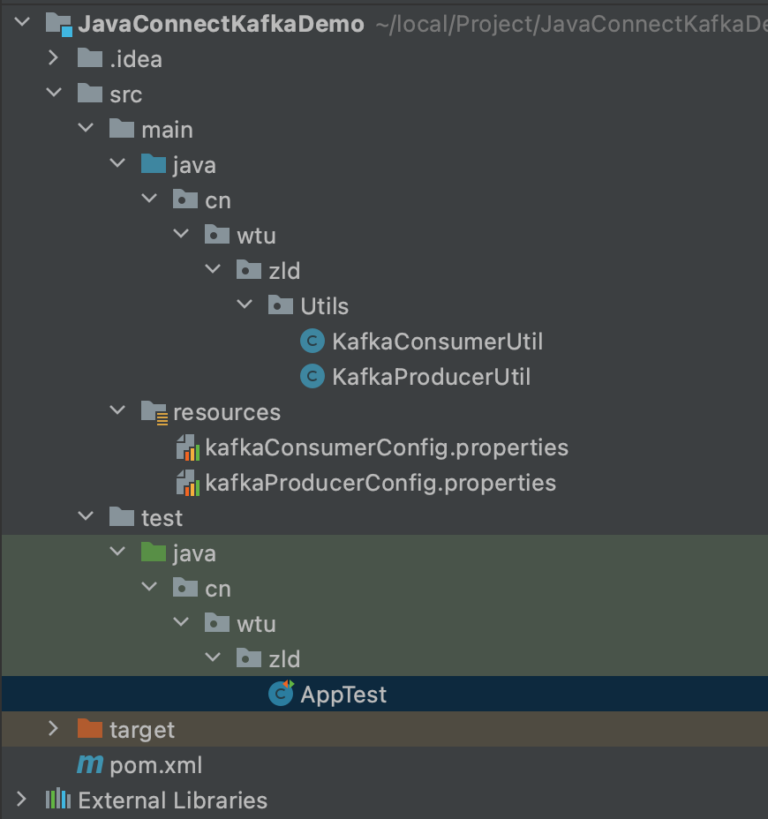
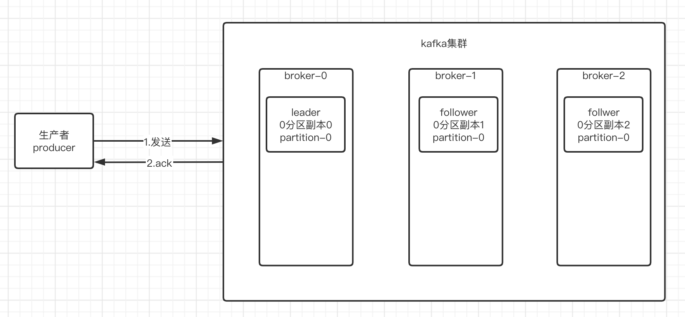
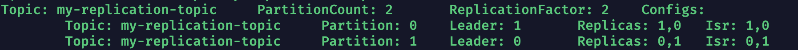
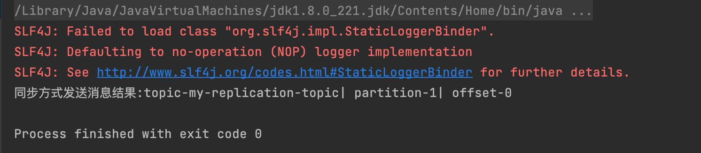
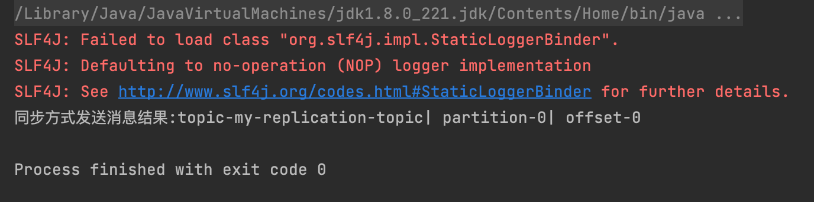
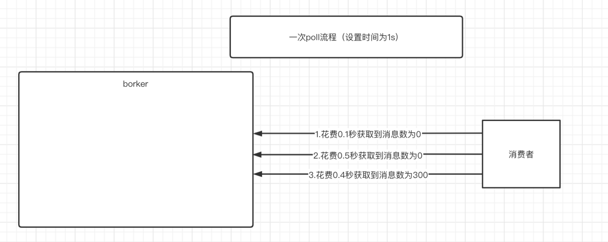
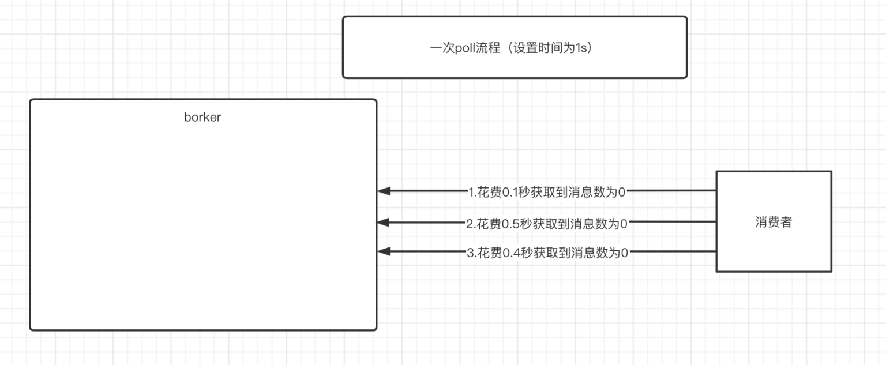
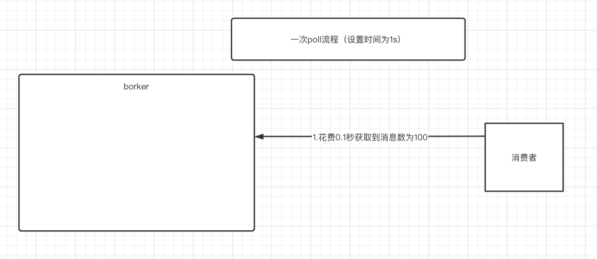
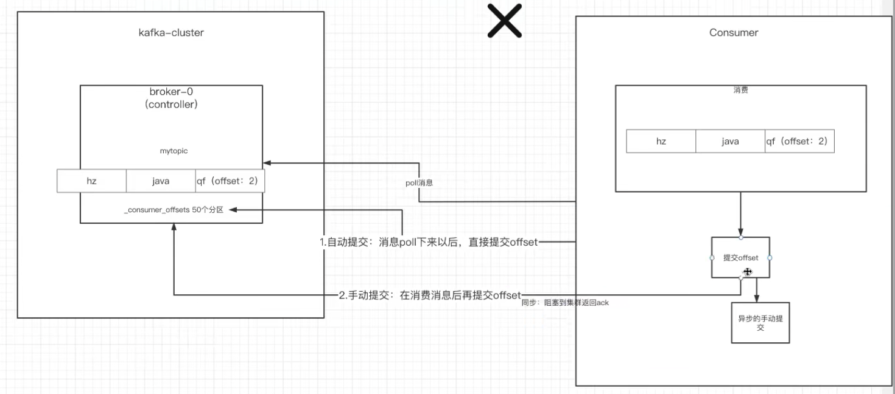

## Java/Spring连接kafka

### 项目结构图




### POM坐标

```xml
<dependency>
  <groupId>org.apache.kafka</groupId>
  <artifactId>kafka-clients</artifactId>
  <version>2.4.1</version>
</dependency>
```


### 生产者配置文件KafkaProducerConfig.properties

```properties
#指定kafka节点对外暴露IP:PORT或者kayak集群对外暴露IP:PORT集合(使用,分开)
kafka.bootstrap.server=127.0.0.1:9092,127.0.0.1:9093

#持久化机制参数，(默认为1)
#0: producer不需要等待任何broker确定收到消息的回复，就可以继续发送下一条消息。性能最高。但是最容易丢消息。
#1: 至少要等待Leader已经成功将数据写入此副本对应的0000..0000.log文件中，但是不需要等待follower同步完成。就可以发送下一条数据了。(这种情况有风险,如果还没follower同步成功时，leader宕机了，那么此数据丢失)
#-1: 需要等待min.insync.replicas(默认为1，推荐配置>=2)个副本个数都成功写入其各自的本地日志。这样起码可以保证有一个副本无论如何都可以是最新消息。如果用于金融或者涉及到钱的项目，推荐设置为2
kafka.acks=1

#发送失败重试次数(默认为3）
kafka.retries=3

#重试间隔，单位ms(默认100ms)
kafka.retry.backoff.ms=300

#发送消息的本地缓冲区大小并开启缓冲区，消息会先发送到本地缓冲区，默认是33554432，即32MB
kafka.buffer.memory=33554432

#设置批量发送消息的大小，即开启缓冲区，只要缓冲区中存储消息大小达到这个参数大小，本地线程才会提取出消息交给指定的Broker，默认为16384(16kb)。
kafka.batch.size=16384

#设置缓冲区中提交时间间隔，默认为10ms。即开启缓冲区后，如果10ms内缓冲区数据>=batch_size，那么就会被发送出去。反之10ms到了没满，也被发送出去。
kafka.linger.ms=10
```


### 生产者对象工具类KafkaProducerUtil类

```java
public class KafkaProducerUtil {
    /**
     * Producer<String,String>为Key和Value都是字符串转字节数组序列化的kafka消费者对象
     * @return producer
     * */
    public Producer<String,String> getProducer(){
        //通过ResourcesBundle获取配置消息
        ResourceBundle producerConfig = ResourceBundle.getBundle("kafkaProducerConfig");
        //获取kafka节点/集群IP:PORT
        String server = producerConfig.getString("kafka.bootstrap.server");
        //获取持久化参数
        String acks = producerConfig.getString("kafka.acks");
        //获取失败重试次数
        int retryCount = Integer.parseInt(producerConfig.getString("kafka.retries"));
        //获取失败间隔时间
        int retryBackOffMs = 
          Integer.parseInt(producerConfig.getString("kafka.retry.backoff.ms"));
        //设置缓冲区大小
        int bufferMemory = 
          Integer.parseInt(producerConfig.getString("kafka.buffer.memory"));
        //获取缓冲区设置的批量提交大小
        int batchSize = Integer.parseInt(producerConfig.getString("kafka.batch.size"));
        //获取缓冲区提交时间间隔
        int lingerMs = Integer.parseInt(producerConfig.getString("kafka.linger.ms"));
        Properties properties = new Properties();
        properties.put(ProducerConfig.BOOTSTRAP_SERVERS_CONFIG,server);
        properties.put(ProducerConfig.ACKS_CONFIG,acks);
        properties.put(ProducerConfig.RETRIES_CONFIG,retryCount);
        properties.put(ProducerConfig.RETRY_BACKOFF_MS_CONFIG,retryBackOffMs);
        properties.put(ProducerConfig.BUFFER_MEMORY_CONFIG,bufferMemory);
        properties.put(ProducerConfig.BATCH_SIZE_CONFIG,batchSize);
        properties.put(ProducerConfig.LINGER_MS_CONFIG,lingerMs);
        //配置Key和Value字符串转字节数组序列化
        properties.put(ProducerConfig.KEY_SERIALIZER_CLASS_CONFIG,StringSerializer.class.getName());
        properties.put(ProducerConfig.VALUE_SERIALIZER_CLASS_CONFIG,StringSerializer.class.getName());

        return new KafkaProducer<String,String>(properties);
    }
}
```

三大关键类，**RroducerConfig枚举类**中包含了kafka配置所有配置字段，**Properties类**用来存储ProducerCofig类中枚举的Kafka配置消息，**KakfaProducer类**用来配合Properties对象生产对应的生产者对象。


### 同步与异步发送区别

编写发送方式之前我们需要知道同步与异步发送之间的区别，我们根据下述生产者发送消息到Broker中流程图来分析：



**流程解析：当生产者发送消息给kafka集群之后，kafka集群会根据配置参数acks来返回ack报文给生产者。**

配置文件中提过acks的配置消息：

```properties
#持久化机制参数，(默认为1)
#0: producer不需要等待任何broker确定收到消息的回复，就可以继续发送下一条消息。性能最高。但是最容易丢消息。
#1: 至少要等待Leader已经成功将数据写入此副本对应的0000..0000.log文件中，但是不需要等待follower同步完成。就可以发送下一条数据了。(这种情况有风险,如果还没follower同步成功时，leader宕机了，那么此数据丢失)
#-1: 需要等待min.insync.replicas(默认为1，推荐配置>=2)个副本个数都成功写入其各自的本地日志。这样起码可以保证有一个副本无论如何都可以是最新消息。如果用于金融或者涉及到钱的项目，推荐设置为2
kafka.acks=1
```

1）对于acks=0来说，只要kafka集群接收到消息，不管Leader是否写入到本地log文件中，直接返回ack报文给生产者。

2）对于acks=1来说，当kafka集群中Leader接收到消息后并成功写入leader分区副本本地所在的log文件中，才会返回ack报文给生产者。

3）对于acks=-1/all，只有当kakfa集群中同步完成的副本数量达到min.insync.replicas值，才会返回ack报文给生产者。

**那么知道发送流程之后，我们来说说发送的同步和异步。**

**生产者的同步发送：即发送完消息之后，进入阻塞状态并等待kakfa返回ack之后才能继续运行之后的业务逻辑代码。**

**生产者的异步发送：即发送完消息之后，不需要等待kafka返回ack报文，直接去执行之后的业务逻辑代码。当kafka返回ack报文时，采用异步回调的方式，触发异步事件。**

**参数retries和retryBackOffMs解析**：

当生产者发送消息到kafka之后，如果生产者超过**retryBackOffMs**时间没有得到ack报文的话，就会重新发送一次消息。重试次数为**retries**次。一旦超过**retries**次，那么就会抛出异常。

**注意：由于网络拥塞等原因，可能会造成信息的重复发送，比如因为轻度拥塞，消息卡在某个路由节点上引发的超时重发。**


##### 编写生产者同步发送消息到指定topic不指定分区中的方法testSendSyncMessageFunction()

```java
//指定topic主题且不指定分区伪代码
//不指定发送分区(参数1为topic名称id，参数2为key，参数3为value)，如果value为对象，一定要使用JSON.toJSONString(Object object)方法序列化为JSON字符串。
//不指定分区情况下，由hash(key) * partitionNumber得到前往的分区下标。
ProducerRecord<String,String> producerRecord = new ProducerRecord<>("my-replication-topic","key","Hello");
//同步发送消息方法伪代码
RecordMetadata recordMetadata = producer.send(producerRecord).get();
```

完整**testSendSyncMessageFunction()**方法如下所示：

```java
/**
 * 测试生产者不指定分区下的同步发送
 * */
@Test
public void testSendSyncMessageFunction(){
    //创建出一个基于配置文件配置的生产者
    Producer<String, String> producer = new KafkaProducerUtil().getProducer();

    // 不指定发送分区(参数1为topic名称id，参数2为key，参数3为value)，
    // 如果value为对象，一定要使JSON.toJSONString(Object object)方法序列化为JSON字符串
    ProducerRecord<String,String> producerRecord = 
                               new ProducerRecord<>("my-replication-topic","key","Hello");

    //同步阻塞发送方法
    try {
        RecordMetadata recordMetadata = producer.send(producerRecord).get();
        // 同步发送成功之后，获取到消息发送的元数据并输出，
        // offset是消息发送成功后在指定分区的日志文件中偏移地址。
        System.out.println("同步方式发送消息结果:"+"topic-"+recordMetadata.topic()+
                                                "| partition-"+recordMetadata.partition()+
                                                "| offset-"+recordMetadata.offset());
    } catch (InterruptedException e) {
        e.printStackTrace();
    } catch (ExecutionException e) {
        e.printStackTrace();
    }
}
```

结果：首先看看my-replication-topic在集群中的部署情况，其为在两个节点组成的集群中，拥有2个分区，每个分区拥有2个副本的结构。






##### 编写生产者异步发送消息到指定topic指定0分区中的方法testSendAsynMessageFunction()

```java
    /**
     * 测试生产者指定分区下的同步发送
     * */
    @Test
    public void testSendAsnyMessageFunction(){
        //创建出一个基于配置文件配置的生产者
        Producer<String, String> producer = new KafkaProducerUtil().getProducer();
        //指定分区和发送内容
        final ProducerRecord<String,String> record =
                new ProducerRecord<String,String>("my-replication-topic",0,"key1","HelloAsny");
        //异步发送
        producer.send(record, new Callback() {
            @Override
            public void onCompletion(RecordMetadata recordMetadata, Exception e) {
                if(e != null){
                    System.out.println("发送异常"+e);
                }
                if(recordMetadata != null){
                    System.out.println("异步方式发送消息结果:"+"topic-"+recordMetadata.topic()+
                            "| partition-"+recordMetadata.partition()+
                            "| offset-"+recordMetadata.offset());
                }
            }
        });
        //主线程阻塞，不然接受不到回调
        try {
            TimeUnit.SECONDS.sleep(5);
        } catch (InterruptedException e) {
            e.printStackTrace();
        }
    }
```

结果：**这里下述结果中，同步其实是异步，结果出来之后才发现没改打印字符。**




### 消费者配置文件kafkaConsumerConfig.properties

```properties
#指定消费者所在的消费者组
kafka.consumer.group.name=testGroup

#消费kafka节点对外暴露IP:PORT，或者kafka集群对外暴露IP:PORT集合
kafka.server.host=127.0.0.1:9092,127.0.0.1:9093

#是否开启自动向__consumer-offsets主题分区中提交offset(默认为true)
kafka.enable.auto.commit=true

#自动提交时间间隔(即如果自动提交失败，下次提交时间间隔)
kafka.auto.commit.interval.ms=1000

#消费方式(下述两种消费方式，只在消费者均处于新的消费者组中生效)
# latest(默认): 当各分区下有已提交的offset时，从提交的offset开始消费；无提交的offset时，消费新产生的该分区下的数据
# earliest: 当各分区下有已提交的offset时，从提交的offset开始消费；无提交的offset时，从头开始消费
kafka.auto.offset_reset=earliest

#默认一次poll消息数量
kafka.max.poll.records=500

#如果两次poll的时间超过30s的时间间隔，kafka会认为其消费能力过弱，将其踢出消费组，将rebalance分区分配给其他消费者，
kafka.max.poll.interval.ms=30000

#consumer发送给broker的心跳间隔，默认为1000ms，也就是1s
kafka.heartbeat.intervak.ms=1000

#broker最大心跳等待时间，默认为10000ms，也就是10s，如果broker超过最大心跳等待时间没有收到消费者心跳报文，那么就把消费者踢出消费组，进行rebalance，把分区分配给其他的消费者
kafka.session.timeout.ms=10000
```


### 消费者生产工具类KafkaConsumerUtil.java

```java
public class KafkaConsumerUtil {

    /**
     * 通过配置文件获取到消费者实例
     * */
    public KafkaConsumer<String,String> getKafkaConsumer(){
        //通过ResourceBundle获取到配置文件
        ResourceBundle resourceBundle = ResourceBundle.getBundle("kafkaConsumerConfig");
        //获取配置消息
        //获取到消费者轮训的kafka节点/集群对外暴露IP
        String server = resourceBundle.getString("kafka.server.host");
        //获取到消费者所处消费者组
        String groupId = resourceBundle.getString("kafka.consumer.group.name");
        //获取到是否自动提交
        String autoCommitFlag = resourceBundle.getString("kafka.enable.auto.commit");
        //获取自动提交间隔
        String autoComitIntervalMs = resourceBundle.getString("kafka.auto.commit.interval.ms");
        //获取消费方式
        String autoOffsetReset = resourceBundle.getString("kafka.auto.offset_reset");

        //获取一次poll到的最大消息数量
        int maxPollRecoeds =
                Integer.parseInt(resourceBundle.getString("kafka.max.poll.records"));
        //获取poll之间的时间间隔
        int maxPollIntervalMs =
                Integer.parseInt(resourceBundle.getString("kafka.max.poll.interval.ms"));
        //获取到心跳发送间隔
        int hearbeatIntervakMs =
                Integer.parseInt(resourceBundle.getString("kafka.heartbeat.intervak.ms"));
        //获取到心跳最大等待时长
        int sessionTimeoutMs =
                Integer.parseInt(resourceBundle.getString("kafka.session.timeout.ms"));
        //创建Properties类来存储配置消息
        Properties properties = new Properties();
        properties.put(ConsumerConfig.BOOTSTRAP_SERVERS_CONFIG,server);
        properties.put(ConsumerConfig.GROUP_ID_CONFIG,groupId);
        properties.put(ConsumerConfig.ENABLE_AUTO_COMMIT_CONFIG,autoCommitFlag);
        properties.put(ConsumerConfig.AUTO_COMMIT_INTERVAL_MS_CONFIG,autoComitIntervalMs);
        properties.put(ConsumerConfig.AUTO_OFFSET_RESET_CONFIG,autoOffsetReset);
        properties.put(ConsumerConfig.MAX_POLL_RECORDS_CONFIG,maxPollRecoeds);
        properties.put(ConsumerConfig.MAX_POLL_INTERVAL_MS_CONFIG,maxPollIntervalMs);
        properties.put(ConsumerConfig.HEARTBEAT_INTERVAL_MS_CONFIG,hearbeatIntervakMs);
        properties.put(ConsumerConfig.SESSION_TIMEOUT_MS_CONFIG,sessionTimeoutMs);
        //序列化
        properties.put(ConsumerConfig.KEY_DESERIALIZER_CLASS_CONFIG, StringDeserializer.class.getName());
        properties.put(ConsumerConfig.VALUE_DESERIALIZER_CLASS_CONFIG,StringDeserializer.class.getName());
        //返回一个Consumer对象
        return new KafkaConsumer<String, String>(properties);
    }
}
```

三大关键类，**ConsumerConfig枚举类**中包含了Consumer配置的所有配置字段，**Properties类**用来存储ConsumerConfig类中枚举的Consumer配置消息，**KakfaConsumer类**用来配合Properties对象生产对应的消费者对象。


### 自动提交与手动提交

在编写消费代码之前我们**需要知道poll的具体流程以及Offset的自动提交和手动提交的区别**：

**我们先来看看poll的流程，下述为poll执行的伪代码：**

```java
 ConsumerRecords<String, String> records = kafkaConsumer.poll(Duration.ofMillis(1000));
```

**上述方法的作用就是在1s内去轮训指定topic中的消息，最大消息获取数量不多于kafka.max.poll.records值。**

情况一：即花费Duration.ofMillis(1000)时间正好完成轮训，获取到300条数据。




情况二：即花费Duration.ofMillis(1000)时间完成轮训，但没有获取到数据。




情况三：即没有花费到Duration.ofMillis(1000)时间，但是获取到数据数量为100，即完成轮训。




**注意：poll函数只要在指定时间之内，那次获取到结果，此结果一定小于等于kafka.max.poll.records值。那么此处poll结束，不会再进行获取操作。**

还需要看一个参数即**kafka.max.poll.interval.ms=30000**参数，此参数主要是消费性能管理参数，即两次poll之间的间隔不能超过此参数，如果超过则使用rebalance机制踢出消费者组，选一个新的消费者来继任。

这个要结合实际的业务场景来说明，会比较好说。所以上一段简易处理消息的伪代码：

```java
//此伪代码作用是在死循环中，使用poll获取到指定topic中一定数量的消息，并把获取到的信息打印的业务逻辑。
while (true){
      ConsumerRecords<String, String> records = kafkaConsumer.poll(Duration.ofMillis(1000));
      for(ConsumerRecord<String,String> record : records){
             System.out.println("收到消息:partition="+record.partition()+
                        ",offset="+record.offset()+",key="+record.key()+",value="+record.value());
      }
}
```

上述代码中，只是把信息打印，并不是负责的业务逻辑代码，占用时间少。但是如果是占用时间多的代码，那么就有可能出触发2次poll之间的时间间隔超时。

所以为了业务性能管控，**kafka.max.poll.records**参数和**kafka.max.poll.interval.ms**参数需要谨慎配置。

**明白poll流程之后，我们就可以说说offset的自动提交和手动提交了**

之前在kafka主题与分区博客中的ConsumerGroup讲解时，我们说过了__consumer-offset主题的作用就是接受消费者提交的Offset。

其实这个提交可被分为自动提交和手动提交。

**自动提交流程：**即当poll到一定数量的信息之后，直接向__consumer-offset主题提交poll到的信息集合中最后一条信息的Offset。哪怕此时这些信息还没有被消费。

**[由于自动提交的机制，所以存在信息丢失的风险，比如消费者1poll到300条信息后，自动提交offset=300完成。此时消费者1宕机了，300条信息还没有消费，选举出新的代替者之后从offset=301开始获取]**

**手动提交流程：**即在业务逻辑代码中等待消费完成之后，编写手动提交代码完成，提交消费完信息的最后一条信息offset。

**[手动提交涉及到同步提交和异步提交，当消费者向__consumer-offset主题提交完offset之后，其所在的broker会回发一个ack报文，表示提交完成。同步提交即等待ack报文到达之后，才可以继续执行之后的代码。异步提交则是先执行之后的代码，等待ack报文到达之后的异步回调事件]**




##### 编写自动提交下的消费者消费方法

```java
    /**
     * 测试自动提交下poll效果
     * */
    @Test
    public void testConsumerPollAndAutoCommit(){
        KafkaConsumer<String, String> kafkaConsumer = new KafkaConsumerUtil().getKafkaConsumer();
        //消费者订阅主题列表,参数是List类型，说明可以同时订阅多个主题，这里订阅一个
        kafkaConsumer.subscribe(Arrays.asList("my-replication-topic"));
        while (true){
            ConsumerRecords<String, String> records = kafkaConsumer.poll(Duration.ofMillis(1000));
            for(ConsumerRecord<String,String> record : records){
                System.out.println("收到消息:partition="+record.partition()+
                        ",offset="+record.offset()+",key="+record.key()+",value="+record.value());
            }
        }
    }
```


##### 编写同步手动提交下的消费者方法

手动提交需要把配置文件KafkaConsumerConfig.properties中**kafka.enable.auto.commit=true改为false**

```
kafka.enable.auto.commit=false
```

然后在消费者工具类KafkaConsumerUtil类中注视掉**kafka.auto.commit.interval.ms**的配置信息的获取。

```java
//        //获取自动提交间隔
//        String autoComitIntervalMs = resourceBundle.getString("kafka.auto.commit.interval.ms");
/**
 * 测试不指定订阅分区手动同步提交下poll效果
 * */
@Test
public void testConsumerPollAndSyncCommit(){
    KafkaConsumer<String, String> kafkaConsumer = new KafkaConsumerUtil().getKafkaConsumer();
    //消费者订阅主题列表(没有指定分区),参数是List类型，说明可以同时订阅多个主题，这里订阅一个
    kafkaConsumer.subscribe(Arrays.asList("my-replication-topic"));
    while (true){
        ConsumerRecords<String, String> records = kafkaConsumer.poll(Duration.ofMillis(1000));
        for(ConsumerRecord<String,String> record : records){
            System.out.println("收到消息:partition="+record.partition()+
                    ",offset="+record.offset()+",key="+record.key()+",value="+record.value());
        }
       
        if(records.count() > 0){
            //如果进行到这里说明，poll到的信息集合中数量大于0，说明poll到有效信息，并消费完成，需要手动提交
            kafkaConsumer.commitSync();
        }
    }
}
```


##### 编写异步手动提交下的消费者方法

```java
    /**
     * 测试不指定订阅分区手动异步提交下poll效果
     * */
    @Test
    public void testConsumerPollAndAsynCommit(){
        KafkaConsumer<String, String> kafkaConsumer = new KafkaConsumerUtil().getKafkaConsumer();
        //消费者订阅主题列表,参数是List类型，说明可以同时订阅多个主题，这里订阅一个
        kafkaConsumer.subscribe(Arrays.asList("my-replication-topic"));
        while (true){
            ConsumerRecords<String, String> records = kafkaConsumer.poll(Duration.ofMillis(1000));
            for(ConsumerRecord<String,String> record : records){
                System.out.println("收到消息:partition="+record.partition()+
                        ",offset="+record.offset()+",key="+record.key()+",value="+record.value());
            }
            //异步提交
            if(records.count() > 0){
                kafkaConsumer.commitAsync(new OffsetCommitCallback() {
                    @Override
                    public void onComplete(Map<TopicPartition, OffsetAndMetadata> map, Exception e) {
                        if(e != null){
                            System.out.println("手动提交发生异常"+e);
                        }
                        //这里可以获取到map的entrySet集合，然后遍历此集合可以得到，
                        //提交成功的offset和offset所处partition分区。
                        //........;
                    }
                });
            }
        }
    }
```


##### 指定分区消费方法

我们需要替换掉之前消费订阅subscribe方法，转而使用assign方法

```java
//assgin方法伪代码(所需参数一：topicid，参数二：pratitionIndex)
kafkaConsumer.assign(Arrays.asList(new TopicPartition("my-replication-topic",0)));
```

##### 指定分区信息回溯消费方法

即指定分区之后，从分区offset为0处开始消费。

```java
//assgin方法伪代码(所需参数一：topicid，参数二：pratitionIndex)
kafkaConsumer.assign(Arrays.asList(new TopicPartition("my-replication-topic",0)));
//seekToBeginning方法伪代码(所需参数一：topicid，参数二：pratitionIndex)
kafkaConsumer.seekToBeginning(Arrays.asList(new TopicPartition("my-replication-topic",0)));
```

##### 指定offset处消费方法

指定分区之后，从分区指定offset处开始消费。

```java
//assgin方法伪代码(所需参数一：topicid，参数二：pratitionIndex)
kafkaConsumer.assign(Arrays.asList(new TopicPartition("my-replication-topic",0)));
//seekToBeginning方法伪代码(10为指定offset)
kafkaConsumer.seek(Arrays.asList(new TopicPartition("my-replication-topic",0)),10);
```

##### 编写指定时间点开始消费方法

回调场景上可能会使用，比如今天的15:00-16:00之间某个信息出错了，然后到16:00我们修bug的时候，我们得把之前一个小时的信息在此获取到，用以修bug。

具体的思路逻辑就是：

1）获取到指定主题的所有分区对象，因为无法定位到错误消息在什么分区下面，所以我们需要全部分区

2）设置前一个小时的时间点也就是15:00，通过此时间点，获取到每个分区在这个时间点上的Offset。

3）最后通过获取到所有分区从Offset到现在的所有消息即可。

```java
/**
 * 获取到一小时之前的消息
 * */
@Test
public void testGetAllMessageFromTimeStamp(){
    KafkaConsumer<String, String> kafkaConsumer = new KafkaConsumerUtil().getKafkaConsumer();
    //获取到指定topic主题的所有分区
    List<PartitionInfo> partitionInfos = kafkaConsumer.partitionsFor("my-replication-topic");
    //设置前一个小时时间点
    long fetchDataTime = new Date().getTime() - (1000 * 60 * 60);
    //获取到每个分区中在前一个小时时间点的所有Offset集合,用Map集合存储
    Map<TopicPartition,Long> map = new HashMap<>();
    for(PartitionInfo partitionInfo : partitionInfos){
        map.put(new TopicPartition("my-replication-topic",
                partitionInfo.partition()),fetchDataTime);
    }
    //获取Offset集合
    Map<TopicPartition, OffsetAndTimestamp> offsetMap =
            kafkaConsumer.offsetsForTimes(map);
    //利用获取到的Offset集合，一遍一遍去获取不同分区中从Offset到现在的消息集合（这里方便，改成打印）
    Set<Map.Entry<TopicPartition, OffsetAndTimestamp>> entries = offsetMap.entrySet();
    for(Map.Entry<TopicPartition, OffsetAndTimestamp> entry :entries){
        //获取到查询必要消息
        TopicPartition key = entry.getKey();
        OffsetAndTimestamp value = entry.getValue();
        if(key == null || value == null){
            continue;
        }
        Long offset = value.offset();
        System.out.println("partition:"+key.partition()+",offset:"+offset);
        //获取到offset之后，可以获取消息了
        if(value != null){
            //这里要注意，如果不新的消费者去查询，多线程中无法使用单一线程
            KafkaConsumer<String,String> tempKafkaConsumer =
                    new KafkaConsumerUtil().getKafkaConsumer();
            tempKafkaConsumer.assign(Arrays.asList(key));
            tempKafkaConsumer.seek(key,offset);
            //通过线程池去完成操作
            ExecutorService executorService = Executors.newFixedThreadPool(1);
            executorService.execute(()->{
                while (true){
                    ConsumerRecords<String, String> records = 
                            tempKafkaConsumer.poll(Duration.ofMillis(1000));
                    for(ConsumerRecord<String,String> record : records){
                        System.out.println(
                                "收到消息:partition="+record.partition()+
                                ",offset="+record.offset()+
                                        ",key="+record.key()+",value="+record.value());
                    }
                    //异步提交
                    if(records.count() > 0){
                         tempKafkaConsumer.commitAsync(new OffsetCommitCallback() {
                            @Override
                            public void onComplete(Map<TopicPartition,
                                          OffsetAndMetadata> map, Exception e) {
                                if(e != null){
                                   System.out.println("手动提交发生异常"+e);
                                }
                                //这里可以获取到map的entrySet集合，然后遍历此集合可以得到，提交成功的offset和offset所处partition分区。
                                //........;
                            }
                        });
                    }
                }
            });
        }
    }
    //因为没有设置成守护线程，所以采用阻塞到方式
    try {
        TimeUnit.SECONDS.sleep(10);
    } catch (InterruptedException e) {
        e.printStackTrace();
    }
}
```


# Spring boot连接Kafka

pom坐标：主要是看boot版本和kafka版本,当然也可以直接使用起步依赖中勾选kafka。

```
<dependency>
    <groupId>org.springframework.boot</groupId>
    <artifactId>spring-boot-starter-web</artifactId>
    <version>2.3.7.RELEASE</version>
</dependency>
<dependency>
    <groupId>org.springframework.kafka</groupId>
    <artifactId>spring-kafka</artifactId>
    <version>2.5.1</version>
</dependency>
```

(**a).存放kafka生产者和消费者配置信息的application.properties文件**

```
spring.kafka.bootstrap-servers=127.0.0.1:9092,127.0.0.1:9092
#生产者配置
spring.kafka.producer.acks=1
spring.kafka.producer.retries=3
spring.kafka.producer.buffer-memory=33554432
spring.kafka.producer.batch-size=16384
spring.kafka.producer.key-serializer=org.apache.kafka.common.serialization.StringSerializer
spring.kafka.producer.value-serializer=org.apache.kafka.common.serialization.StringSerializer
#消费者配置
spring.kafka.consumer.group-id=testGroup
spring.kafka.consumer.enable-auto-commit=false
spring.kafka.consumer.auto-offset-reset=earliest
spring.kafka.consumer.max-poll-records=500
spring.kafka.consumer.heartbeat-interval=1000
spring.kafka.consumer.key-deserializer=org.apache.kafka.common.serialization.StringDeserializer
spring.kafka.consumer.value-deserializer=org.apache.kafka.common.serialization.StringDeserializer
#手动提交配置,使用监听器提交
#这边ack-mode有7种，分别对用了手动提交的不同模式
#RECOED模式：当每一条记录被消费者监听器处理之后提交
#BATCH模式：当每一批poll()数据被消费者监听器处理之后提交
#TIME模式：当每一批poll()数据被消费者监听器处理之后，距离上次提交时间大于TIME时提交。
#COUNT模式：当每一批poll()数据被消费者监听器处理之后，被处理recoed数据大于COUNT时提交。
#COUNT_TIME模式：当TIME或者COUNT模式有一种被满足的时候，提交.
#MANUAL模式：当每一批poll()数据被消费者监听器处理之后，手动调用Acknowledgment.acknowledge()方法后提交
#MANUAL_IMMEDIATE模式：手动调用Acknowledgment.acknowledge()方法后提交，推荐使用。
spring.kafka.listener.ack-mode=manual_immediate
```

**(b).编写MyKafkaController类用来接受外部请求后向指定kafka发送信息**

```
@RestController
@RequestMapping("/msg")
public class MyKafkaController {

    @Autowired
    private KafkaTemplate<String,String> kafkaTemplate;

    @RequestMapping("/send")
    public String sendMessage(){
        kafkaTemplate.send("my-replication-topic",0,"key1","msgValue4");
        return "send success";
    }
}
```

**(c).编写MyKafkaController类，用以创建消费者去订阅消息**

**注意：下述方法不能同时存在与一个MyKafkaController类中(只能留其一)，如果需要实现多个方法，请多创建几个类来别的方法实现，下述如此放置只是为了方便阅读。**

```
@Component
public class MyKafkaConsumer {
    /**
     * 创建一个消费者，加入指定消费者组去订阅单个指定topic,然后获取到一条纪录的操作
     * */
    @KafkaListener(topics = "my-replication-topic",groupId = "testGroup2")
    public void listenGroupAndRecord(ConsumerRecord<String,String> record, Acknowledgment ack){
        String value = record.value();
        System.out.println("record:"+record+",value:"+value);
        //消费完一条纪录之后，直接手动提交
        ack.acknowledge();
    }

    /**
     * 通过加入指定消费者组去订阅单个指定topic,然后获取到poll()整个纪录组的操作
     * */
    @KafkaListener(topics = "my-replication-topic",groupId = "testGroup1")
    public void listenGroupAndRecords(ConsumerRecords<String,String> records, Acknowledgment ack){
        for(ConsumerRecord<String,String> record : records){
            String value = record.value();
            System.out.println("record:"+record+",value:"+value);
        }
        //消费完poll()到的全部纪录集合之后，直接手动提交
        ack.acknowledge();
    }

    /**
     * 通过加入指定消费者组testGroup1去订阅中多个分区{my-replication-topic,my-replication-topic2}，
     * 订阅my-replication-topic主题的0和1分区，均按照earliest规则来
     * 订阅my-replication-topic1主题的0的分区按照earliest规则来，
     * 订阅my-replication-topic1主题的1的分区，从指定offset位置开始
     * 并指定此消费者组中共生成3个消费者，按照消费组原则，消费者数量最好小于等于所有分区数量
     * */
    @KafkaListener(groupId = "testGroup1",topicPartitions = {
            @TopicPartition( topic = "my-replication-topic",partitions = {"0","1"}),
            @TopicPartition( topic = "my-replication-topic2",partitions = "0",partitionOffsets = @PartitionOffset(partition = "1",initialOffset = "100"))
    },concurrency = "3")
    public void listenGroup2(ConsumerRecord<String,String> record, Acknowledgment ack){
        String value = record.value();
        System.out.println("record:"+record+",value:"+value);
        //手动提交
        ack.acknowledge();
    }
}
```

启动boot项目即可开始消费流程。