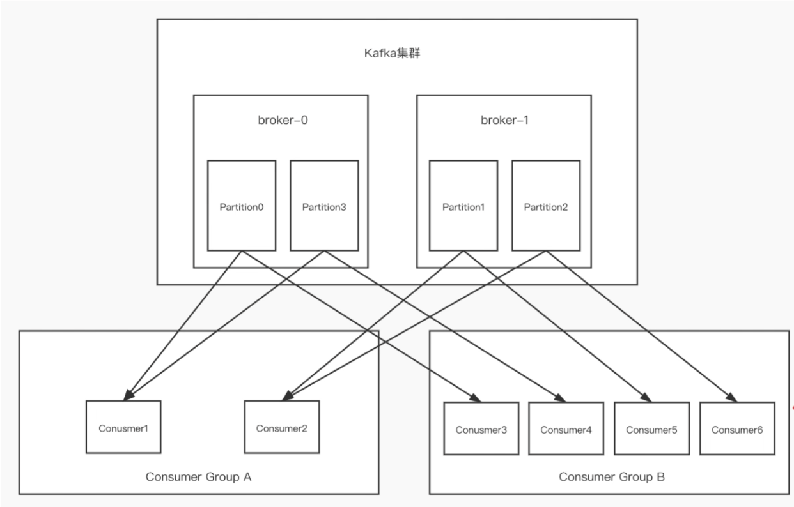

# 集群搭建

1）首先需要把存在与config文件下的server.proprety文件复制三份，并且修改下面指定字段：

```properties
broker.id=0
#对外监听接口(云服务器就内网IP,正常服务器就外网IP)
listeners=PLAINTEXT://IP:9092
#对外暴露连接接口(云服务器外网IP,正常服务器就外网IP)
advertised.listeners=PLAINTEXT://IP:9092
#集群节点1的日志文件
log.dir=/usr/local/kafka-2.11-2.4.0/cluster/kafka-logs-0
#访问zk的IP地址和端口，填入你搭建好的ZK的IP:PORT即可，如果是集群使用,分开。同一个kafka集群使用同一个zk即可。
zookeeper.connect=localhost:2181

broker.id=1
#对外监听接口(云服务器就内网IP,正常服务器就外网IP)
listeners=PLAINTEXT://IP:9093
#对外暴露连接接口(云服务器外网IP,正常服务器就外网IP)
advertised.listeners=PLAINTEXT://IP:9093
#集群节点1的日志文件
log.dir=/usr/local/kafka-2.11-2.4.0/cluster/kafka-logs-1
#访问zk的IP地址和端口，填入你搭建好的ZK的IP:PORT即可，如果是集群使用,分开。同一个kafka集群使用同一个zk即可。
zookeeper.connect=localhost:2182

broker.id=2
#对外监听接口(云服务器就内网IP,正常服务器就外网IP)
listeners=PLAINTEXT://IP:9094
#对外暴露连接接口(云服务器外网IP,正常服务器就外网IP)
advertised.listeners=PLAINTEXT://IP:9094
#集群节点1的日志文件
log.dir=/usr/local/kafka-2.11-2.4.0/cluster/kafka-logs-2
#访问zk的IP地址和端口，填入你搭建好的ZK的IP:PORT即可，如果是集群使用,分开。同一个kafka集群使用同一个zk即可。
zookeeper.connect=localhost:2183
```

2）使用启动指令来启动三台服务器

```tex
./kafka-server-start.sh -daemon ../config/server0.properties
./kafka-server-start.sh -daemon ../config/server1.properties
./kafka-server-start.sh -daemon ../config/server2.properties
```

**注意1：由于kafka集群判断是不是此集群节点采用的是zk中集群节点下的子节点来进行的。所以配置相同zk的算是同一个节点。**

**注意2：如果采用云服务器或者虚拟机内存只有1g的话，建议把启动指令脚本分配jvm内存大小改为256M甚至128M。不然你会发现只能启动2个，而启动不了第三个。**


## 集群中主题,分区和副本的关系

副本：即对一个topic中分区的备份，不同的副本可以部署到不同的Broker(kafka)中。

就比如上述集群安装教程中最后完成了一个kafka集群，由三个kafka节点组成。也就是有三个broker。分别为broker-0，broker-1，broker-2。

如果现在创建一个副本为3，分区为2的my-replication-topic主题，那么此topic主题分区的副本部署情况如下图所示：

```tex
./kafka-topics.sh --create --zookeeper zkIP:PORT[,ZKIP2:PORT] --replication-factor 3 --partitions 2 --topic my-replication-topic
```


使用下述指令查看一下是否如上述所说：

```
//查看topic具体消息指令
./kafka-topics.sh --describe --zookeeper 127.0.0.1:2181 --topic my-replication-topic
```


上述三图配合部署情况图，即可看懂副本与分区，分区与主题之间在集群中的关系。

1）被分别部署到不同broker中的副本会被标识上不同的身份，选举出一个Leader副本和其他Follower副本。

2）副本数量为3，分区数量为2，意味着每个分区均有三个副本，恰好kafka节点也有3个，所以每一个kafka上的broker中均有不同的分区副本文件。


## 集群中分区与副本消费流程

我们还是以上述部署情况图的情况来模拟消费，下述是改良部署情况图：


**1）生产者向指定topic发送数据之后，会根据算法选一个分区，假设这个分区是0，那么就会发送到kakfa集群中topic分区0副本中的Leader副本中。**

**2）消费者向指定topic分区中消费消息，假设这个分区是1，那么就会到kafak集群中topic分区为1的Leader副本中去消费消息。**

**3）一旦Leader副本中消息有生产/消费行为，那么就会同步到Follower节点中。**

------

**那么在有消费者组的情况下，集群的消费情况如何呢？**

我们重新建立一个集群部署图和消费者组。

下图为topic分区为4，副本为1的指令创在kafka集群节点为2的情况下的部署图：



相信还记得单播与多播的概念：

**单播：即对于topic中的同一分区，在消费者组中仅有一个消费者实例可以消费这个分区中的消息**

**多播：即对于topic中的同一个分区，在多个消费者组中每组均只有一个消费者实例可以消费这个分区中的消息。**

根据单播和多播的概念，来解读上述图中的消费情况：**(从Consumer1到6的顺序来说)**

1）ConsumerGroupA中的Comsumer1可以消费分区0到3中任意一个或者多个。

2）ConsumerGroupA中的Comsumer2可以消费分区0到3中除了被Consumer0消费分区的任意一个或者多个。

3）ConsumerGroupB中的Comsumer3可以消费分区0到3中任意一个或者多个。

4）ConsumerGroupA中的Comsumer4可以消费分区0到3中除了被Consumer3消费分区的任意一个或者多个。

5）ConsumerGroupA中的Comsumer5可以消费分区0到3中除了被Consumer3,4消费分区的任意一个或者多个。

6）ConsumerGroupA中的Comsumer6可以消费分区0到3中除了被Consumer3,4,5消费分区的任意一个或者多个。

**扩展1：partition的数量决定了消费者组中消费者的数量，建议同一个消费者组中的消费者不要超过partion的数量，否则多的消费者消费不到消息。\***

**扩展2：如果消费者挂了，rebalance机制会在消费者组中选一个可以替换之前消费者的消费者消费，挑选的消费者可以正在消费一个分区或者多个分区。\***