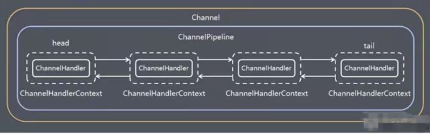
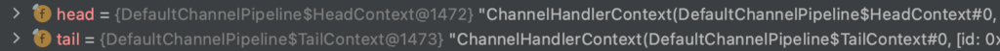

## ChannelPipeline组件的作用

**ChannelPipeline可以被看作一个Handler集合，他负责拦截和处理Channel中Inbound(入栈)和outbound(出栈)的事件和操作，相当于一个贯穿Netty的链。**

我们再从其数据结构上去理解上面这段话，ChannelPipeline含有Channel字段和维护着一个以ChannelHandlerContext类为节点的双向链表（注意是维护，ChannelPipeline并不是双向链表类），每一个ChannelHandlerContext类中包含一个Handler字段和与上层ChannelPipeline相同的Channel字段。

举个例子和其数据结构相呼应，我们把ChannelPipeline比作漫威电影宇宙，Channel对比漫威电影宇宙独有的时间线，每一个ChannelHandlerContext对比这个时间线上会发生的某个特定事件以及把其包含的Handler对比成处理这个特定事件的TAV(时间管理局)人员。

当时间线发生指定的事件的时候，负责这个时间线的TAV处理人员就去把这个事件拦截并处理掉。一条时间线上，顺序存在着无数个特定事件以及处理其的TAV人员。

**ChannelPipeline实现了一种高级形式的拦截过滤器模型，使用户可以完全控制事件的处理方式，以及Channel中各个Channel如何相互交互。**

一个小扩展点：ChannelPipeline维护的双向链表头节点一直都是我们实现了ChannelInitializer接口的自定义初始Handler。因为ChannelInitializer的基类也是ChannelHandler接口。

.

## 为什么一直强调ChannelPipeline不是双向链表

如果读者和笔者一样喜欢追溯源码的话，**你会发现ChannelPipeline本身并不是一个双向链表，而是通过一个实现了ChannelPipeline接口的DefaultChannelPipeline实现类对象作为双向链表的头尾节点（被ChannelHandlerContext包含）管理的基于ChannelHandlerContext节点的双向链表。**

下面程序运行截图来源于Http实例的Debug，不得不说idea的Debug功能还是强的。

可以清楚的看到CHannelPipeline维护的双向链表的头节点head和尾节点tail指向是两个不同的DefaultChannelPipeline对象

**不过在宏观简化理解上，可以说ChannelPipeline维护着一个双向链表。**

.

## 双向链表节点解析

通过上述的讲解，我们大致知道了双向链表中节点组成的固定模版，头尾节点的ChannelhandlerContext包含的均为两个不同的DefaultChannelPipeline对象，中间ChannelhandlerContext节点包含的编码解码Handler以及自定义Handler。

我们把双向节点分为两类：

1）头尾节点：位于双向链表的头尾部位，其不包含Handler，比如ChannelHandlerContext包含的DefaultChannelPipeline。

2）中间节点；位于头尾节点之间，其包含Handler，比如httpServerCodec编码解码Handler，比如自定义Handler

**一般我们使用ChannelPipeline的addLast和addFrist方法加入Handler都是加入到头尾之间的frist和last位置上。真正的头尾节点永远不改变。**

------

## 入栈事件和出栈事件

再借用一下这个图

**我们从head到tail的过程就是入栈事件，反之从tail到head就是出栈事件。**

但是并不说入栈处理的Handler出栈还会进行拦截，ChannelHandlerContext节点中还有两个关键字段，即inbound字段和outbound字段。这两个字段均为boolean类型。

1）inbound字段：判断此Handler是否为入栈拦截处理Handler。

2）outbound字段：判断此Handler是否为出栈拦截处理Handler。

**基于inbound字段和outbound字段，我们可以实现在同一个ChannelPipeline维护的双向链表中实现入栈出栈互不干扰的特性。**

------

## 关于Pipeline绑定Handler时的出站入站Handler搜寻方法

**当我们使用writeAndFlush出站的时候，会从当前Handler往前去顺序遍历每一个outBound为true的Handler**，**然后被拦截处理。**

**当有信息入站的时候，会一直出发链式顺序的inbound为ture的Handler。**