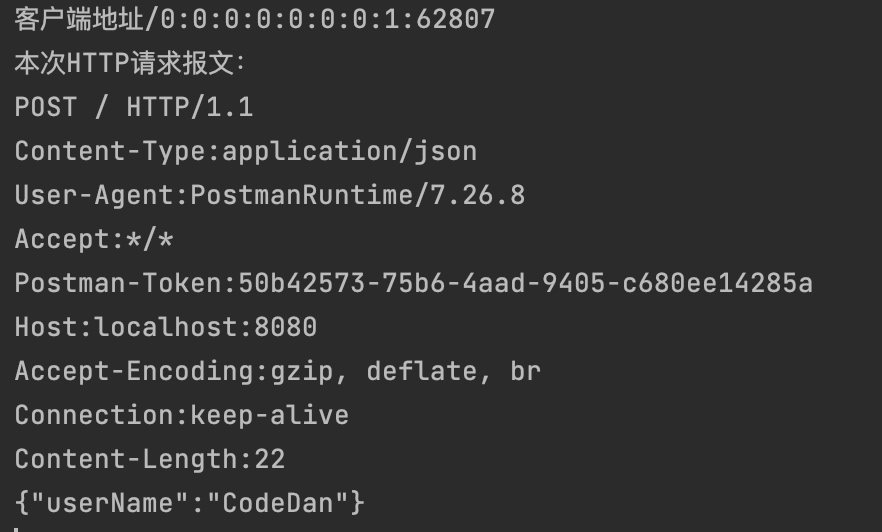

能看到这个博客的应该有Netty前面博客的基础，如果有Netty实例之TCP实例的记忆或者直接是有Netty基础的同学，可以直接开始进行了。

## **Netty模拟Http服务端实例解析**

**Http服务端实例编写思路**

编写服务器端流程：

1）为了方便我们配置服务端对象，我们把配置自定义Handler的业务代码以及SocketChannel初始化后配置Pipeline业务逻辑代抽出来做封装处理，让配置服务端对象类符合单一职责原则，通过把配置和自定义Handler解藕，增加代码的可复用性。让彼此可以独立发展。

自定义Handler类HttpServerHandler类写法


配置Pipeline业务逻辑代码类HttpServerInitializer<SocketChannel>类，继承ChannelInitalizer接口，重写init Channel方法。


配置生成服务器对象类HttpServer类写法


客户端实验：直接在浏览器中输入http://localhost:8080即可。就会得到Hello 我是服务器

有的同学可能启动之后，服务端收到两个http数据包，因为客户端因为图标还请求了一次。


------

.

## **Http事例之优化过滤功能**

主要在自定义Handler中设置，当然也主要是对HttpObject对象的操作上

1）首先把客户端发来的HttpObject对象类型转成HttpRequest对象，方便我们使用API

2）获取到当前请求对象的URL对象

3）通过URL对象的路径和指定的过滤资源路径进行比较，如果相同，则进行过滤。

实例演示，我们过滤一下favicon.ico，此URL为http://localhost:8080/favicon.ico


------

## HTTP核心组件解析之HttpServerCodec类

此类用以解析使用GET请求的HTTP报文，也就是可以解析URL后的参数，但是无法解析到body中的参数，所以也就是无法解析POST请求的HTTP报文。

对于对于GET请求的url，基本上对于携带数据的量上限很低，不会出现HTTP分段传输的情况，所以对于GET请求，单单使用HttpServerCodec编码解码器即可。

HttpServerCodec底层被分为HttpRequestDecoder和HttpResponseEncoder两个类，用以编码解码。为了简化开发，我们直接在Pipeline中加入HttpServerCodec即可，要不就是顺序添加HttpRequestDecoder和HttpResponseEncoder两个类。

但是对于Post请求和被分段传输的HTTP报文那我们该怎么处理呢？那就要使用另一个核心组件HttpObjectAggregator类。

------

## HTTP核心组件解析之HttpObjectAggregator类

HttpObjectAggregator类和HttpServerCodec也一样，也是一个用以编码解码的Handler，**不过HttpServerCodec把HTTP报文编码解码为HttpRequest对象，HttpObjectAggregator在被解析出来的HttpRequest对象基础上，解析出FullRequest对象**，拥有两个关键作用：

1）可以获取到Http报文中body包含的数据内容，也就是可以解析POST请求的HTTP报文。

2）可以把被HTTP解码器分段的HTTP信息进行整合，生成一个完整的FullHttpReqest对象或者FullHttpResponse对象。

（这里有个猜测，没有被笔者证实，也就是理论上数据大的HTTP报文到了IP网络层，由于链路的限制，进行IP分片，变成一个一个MTU，然后再接收方网络层通过分片编号还原成一个完整的TCP报文再拆包变成完整HTTP报文，所以HttpObjectAggregator类的分段收集是不是就是对这个功能的封装）

------

## HttpServerCodec和HttpObjectAggregator类方法解析和实例演示

HttpServerCodec产生的HttpRequest对象以及HttpObjectAggregator产生的FullHttpRequest对象都是HttpObject对象的派生类。


所以我们解析的是FullHttpRequest中的方法：**HttpRequest仅仅没有content方法**，其他都有且相同。

对于HTTP请求行，可以这样获取：

```
private FullHttpRequest fullRequest;
fullRequest.getMethod().name(); //获取请求方法
fullRequest.getMethod().getUri(); //获取请求URI
fullRequest.getProtocolVersion().text() //获取HTTP协议版本
```

HTTP请求头可以这样获取：键为请求头名，只需要遍历这个List就可以获取想要的请求头信息了

```
private final HttpHeaders header = fullRequest.headers();//获取Netty内置的请求头对象
fullRequest.headers().get("Content-Type");// 获取header中的数据，这里是map格式
List<Map.Entry<String, String>> list = header.entries(); //将包含的请求信息赋值到list中
```

对于请求体，调用其content方法获取ByteBuf对象就好了，里面包含了你想要获取的数据信息：**注意Get请求没有啊！！！！**

```
ByteBuf buf = fullRequest.content();
```

------

## 实例演示：**（请求均由PostMan发出）**

请求一个get请求，url为：http://localhost:8080，数据分两种，也就是发两次，第一次为url后添加，第二次为header中添加username = codeDan

请求一个post请求，url为：http://localhost:8080，数据两种，也就是发两次，第一次为表单数据username为codeDan，第二次为json数据{username:codeDan};

请求使用postman发送：

服务器代码：修改自上述HTTP协议服务器代码

**（下述代码均无需记忆，要用直接去最下面复制即可）**

```
public class HttpServer {

    private final int PORT = 8080;

    public void Listen(){

        NioEventLoopGroup bossGroup = new NioEventLoopGroup(1);
        NioEventLoopGroup workerGroup = new NioEventLoopGroup(8);
        ServerBootstrap serverBootstrap = new ServerBootstrap();
        try {
            serverBootstrap.group(bossGroup,workerGroup)
                    .channel(NioServerSocketChannel.class)
                    .childHandler(new HttpServerInitializer());
            ChannelFuture channelFuture = serverBootstrap.bind(PORT).sync();
            channelFuture.channel().closeFuture().sync();
        } catch (InterruptedException e) {
            e.printStackTrace();
        } finally {
            bossGroup.shutdownGracefully();
            workerGroup.shutdownGracefully();
        }
    }

    public static void main(String[] args) {
        HttpServer httpServer = new HttpServer();
        httpServer.Listen();
    }

}
public class HttpServerInitializer extends ChannelInitializer<SocketChannel> {
    @Override
    protected void initChannel(SocketChannel socketChannel) throws Exception {
        //获取通道
        ChannelPipeline pipeline = socketChannel.pipeline();
        //绑定Netty的Http编码解码类
        pipeline.addLast("NettyHttpServerCodec",new HttpServerCodec());
        //添加Post的编码解码类
        pipeline.addLast("NettyHttpObjectAggregator",new HttpObjectAggregator(8192));
        //绑定自定义Handler
        pipeline.addLast("MyHttpServerHandler",new MyHttpServerHandler());
    }
}
public class MyHttpServerHandler extends SimpleChannelInboundHandler<HttpObject> {

    private static ChannelGroup channels = new DefaultChannelGroup(GlobalEventExecutor.INSTANCE);


    @Override
    public void handlerAdded(ChannelHandlerContext ctx) throws Exception {
        System.out.println("连接成功"+ctx.channel().remoteAddress()+"对应channel"+ctx.channel().id().asLongText());
        channels.add(ctx.channel());
        //准备发送的信息
        ByteBuf byteBuf = Unpooled.copiedBuffer("Hello 客户端", CharsetUtil.UTF_8);
        DefaultFullHttpResponse response =
                new DefaultFullHttpResponse(HttpVersion.HTTP_1_1, HttpResponseStatus.OK, byteBuf);
        response.headers().set(HttpHeaderNames.CONTENT_TYPE,"text/plain");
        response.headers().set(HttpHeaderNames.CONTENT_LENGTH,byteBuf.readableBytes());
        channels.writeAndFlush(response);
    }

    @Override
    public void handlerRemoved(ChannelHandlerContext ctx) throws Exception {
        System.out.println("断开连接"+ctx.channel().remoteAddress()+"对应channel"+ctx.channel().id().asLongText());
    }

    @Override
    protected void channelRead0(ChannelHandlerContext channelHandlerContext, HttpObject httpObject) throws Exception {
        if(httpObject instanceof HttpRequest){
            String clientPath = channelHandlerContext.channel().remoteAddress().toString();
            System.out.println("客户端地址" + clientPath);

            //更换客户端发来的Http数据类型为FullHttpRequest
            FullHttpRequest fullHttpRequest = (FullHttpRequest) httpObject;
            System.out.println("本次HTTP请求报文：");
            //首先判断请求是get还是post
            String name = fullHttpRequest.getMethod().name();
            String path = new URI(fullHttpRequest.uri()).getPath();
            String version = fullHttpRequest.getProtocolVersion().toString();
            System.out.println(name +" "+path+" "+version);
//            if("POST".equals(name)){
//                //进行POST的处理,全打印看看有什么不同
//                postHttpRead(fullHttpRequest);
//            }else{
//                //进行Get的处理,全打印看看有什么不同
//                getHttpRead(fullHttpRequest);
//            }
            //获取请求对象的url
            URI uri = new URI(fullHttpRequest.uri());
            if("/favicon.ico".equals(uri.getPath())){
                System.out.println("favicon.ico属于过滤资源，不做处理");
                return;
            }
            //准备发送的信息
            ByteBuf byteBuf = Unpooled.copiedBuffer("Hello 客户端"+clientPath, CharsetUtil.UTF_8);
            DefaultFullHttpResponse response =
                    new DefaultFullHttpResponse(HttpVersion.HTTP_1_1, HttpResponseStatus.OK, byteBuf);
            response.headers().set(HttpHeaderNames.CONTENT_TYPE,"text/plain");
            response.headers().set(HttpHeaderNames.CONTENT_LENGTH,byteBuf.readableBytes());
            channels.writeAndFlush(response);
        }
    }

    public void getHttpRead(FullHttpRequest fullHttpRequest){
        //打印header行
        List<Map.Entry<String, String>> entryList = fullHttpRequest.headers().entries();
        Iterator<Map.Entry<String, String>> iterator = entryList.iterator();
        while (iterator.hasNext()){
            Map.Entry<String, String> next = iterator.next();
            System.out.println(next.getKey()+":"+next.getValue());
        }
        //判断是在header中还是在url中
        if(fullHttpRequest.headers().get("username") == null){
            //如果在url中
            QueryStringDecoder decoder = new QueryStringDecoder(fullHttpRequest.uri());
            Set<Map.Entry<String, List<String>>> entries = decoder.parameters().entrySet();
            Iterator<Map.Entry<String, List<String>>> entryIterator = entries.iterator();
            System.out.println("参数为:");
            while (entryIterator.hasNext()){
                Map.Entry<String, List<String>> next = entryIterator.next();
                System.out.println(next.getKey()+" "+next.getValue().get(0));
            }
        }else{
            System.out.println("参数为:username:"+fullHttpRequest.headers().get("username") );
        }
    }

    public void postHttpRead(FullHttpRequest fullHttpRequest){
        //首先打印header行
        List<Map.Entry<String, String>> entryList = fullHttpRequest.headers().entries();
        Iterator<Map.Entry<String, String>> iterator = entryList.iterator();
        while (iterator.hasNext()){
            Map.Entry<String, String> next = iterator.next();
            System.out.println(next.getKey()+":"+next.getValue());
        }
        //POST相对比较麻烦，需要判断Content-Type的值是application/json还是x-www-form-urlencoded
        String content_type = fullHttpRequest.headers().get("Content-Type");
        if(content_type.contains("application/json")){
            ByteBuf content = fullHttpRequest.content();
            String msg = content.toString(CharsetUtil.UTF_8);
            //这里自己使用JSON工具类转化成JSON格式即可
            System.out.println(msg);
        }
        if(content_type.contains("x-www-form-urlencoded")){
            HttpPostRequestDecoder decoder = new HttpPostRequestDecoder(new DefaultHttpDataFactory(false), fullHttpRequest);
            List<InterfaceHttpData> parmList = decoder.getBodyHttpDatas();
            for (InterfaceHttpData parm : parmList) {
                if (parm.getHttpDataType() == InterfaceHttpData.HttpDataType.Attribute) {
                    MemoryAttribute data = (MemoryAttribute) parm;
                    System.out.println(data.getName() + " " + data.getValue());
                }
            }
        }
    }

}
```

第一次GET结果：**没有在头header中找到参数，参数是从url中解析出来的**


第二次Get结果：**在header中找到了参数，所以参数是从header中解析出来的**


------

第一次POST结果：**可以发现header中提交方式为x-www-form-urlencoded**


第二次POST结果：**可以发现header中提交方式为application/JSON**




