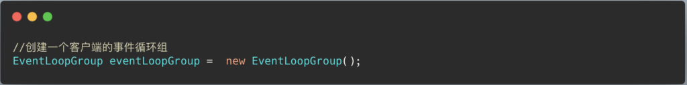

# Netty入门实例一之TCP服务

## TCP客户端-服务端交互实例

目标：基于Netty完成一个TCP客户端与服务端交互业务。

既然要使用了我们就要来看看Netty中几个组件的常用方法。


## TCP客户端-服务端交互实例编写思路

Maven坐标：

```
    <dependency>
      <groupId>io.netty</groupId>
      <artifactId>netty-all</artifactId>
      <version>4.1.20.Final</version>
    </dependency>
```

编写服务器流程：

1）首先我们得先创建BossGroup和WorkerGroup两个重要实例


2)创建服务器端的启动对象，并使用链式编程调用启动对象的方法用于配制参数


3）绑定一个端口,并启动服务器，会非阻塞的返回一个ChannelFuture对象。


4）对关闭通道进行监听


5)编写异常关闭服务器的方式


6）自定义一个Handler类，继承ChannelInboundHandlerAdapter类，重写channelRead方法（即读取客户端发送的消息）和 channelReadComplete方法（即数据读取完毕之后，回复消息）以及exceptionCaught方法（处理异常，一般就是通道关闭的情况）。


7）编写具体的channelRead方法


8）编写具体的channelReadComplete方法


9)编写具体的exceptionCaught方法


–

客户端编写流程：

1）首先创建客户端的事件循环组，客户端只有一个用来接受返回数据




2)把创建的时间循环组加入到客户端对象中，并链式编程开始配置客户端对象


3）客户端对象连接指定的TCP地址(IP,PORT),并启动客户端


4）监听关闭通道事件


5）编写异常关闭服务器的方式


6)编写自定义客户端Handler处理器，继承ChannelInboundHandlerAdapter类，重写channelActive方法（即一旦客户端的通道准备完毕，就可以进行写入操作）以及channelRead方法，exceptionCaught方法。


–

## 代码演示

服务器端初始状态：


客户端开启后双方的状态：（左图客户端，右图服务端）

- 
- 

–

## 代码Debug流程解析

1）首先是NioEventLoopGroup(BossGroup,WorkerGroup)的初始化，对于NioEventLoopGroup我们最关心的就是其中的线程(NioEventLoop)数是多少。默认构造方法是使用默认值，可以在构造方法中制定其中线程数量。

**NioEventLoopGroup中的线程数为当前机器CPU核心数\*2；在初始化的时候使用DEFAULT_EVENT_LOOP_THREADS字段，默认值要不为1，要不为当前机器CPU核心数\*2**。

在NioEventLoopGroup中包含一个EventExecutor线程池对象，通过EventExecutor来管理诸多NioEventLoop线程。

2）当我们设置BossGroup中线程数为1，WorkerGroup中线程数为8时（看大家自己的核心数是多少就设置核心数*2）。我们来开启一个服务器端，9个客户端，我们会发现前8个调用WorkerGroup线程是依次调用，即第一个客户端用的线程1，第二个客户端用的线程2……，知道第8个客户端用的线程8。到第9个线程的时候，又轮到了第一个线程。

3）每一个NioEventLoop中都有一个Seletor。

4）对于Pipeline和ChannelHandlerContext以及Handler和Channel的关系，我们得来捋捋，先声明pipeline的类型为ChannelPipeline。而且**ChannelPipeline不是双向链表，不是双向链表，不是双向链表**！！！，它是维护了一个ChannelHandler的双向链表，这个双向链表的节点类就是ChannelHandlerContext。

ChannelPipeline中包含了channel对象，ChannelHandlercontext节点中包含了相同的channel对象和单独拥有的Handler对象，也就是说，ChannelPipeline中的诸多Handler其实不是自己管理的，也是通过另一个类去管理的多个ChannelHandlerContext中不同的Handler。（这里不详细，只是方便理解，具体的ChannelPipeline解析可以看看这篇博客”ChannelPipeline组件解析”）

这也解释了ChannelPipeline的运行原理。

我们再多看看这些组件各自拥有常用的字段，首先是ChannelPipeline中包含channel字段，和head指针字段，tail指针字段。虽然数据结构上双向链表是ChannelHandler在管理，但是在外部来看还是由ChannelPipeline在操作。所以head指针字段是指向双向链表中第一个ChannelHandlerContext节点的，tail是指向双向链表中最后一个ChannelHandlerContext节点。

ChannelHandlerContext类中字段包含和ChannelPipeline相同的channel字段，和独有的Handler对象，以及prev前驱节点和next后继节点。他还有最关键运行的两大字段inbound和outbound代表入栈和出栈。