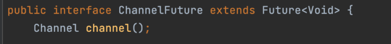
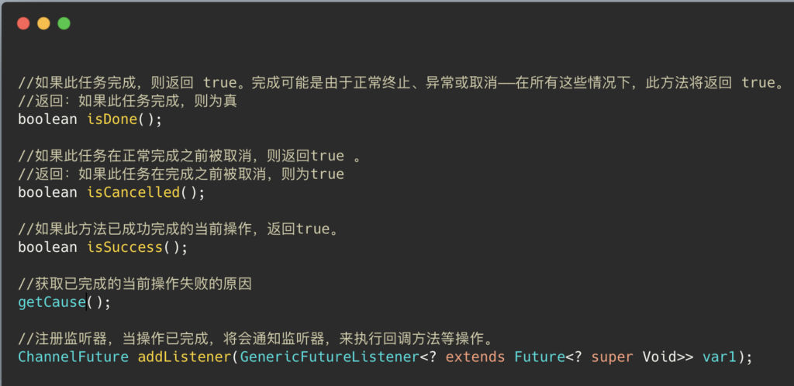
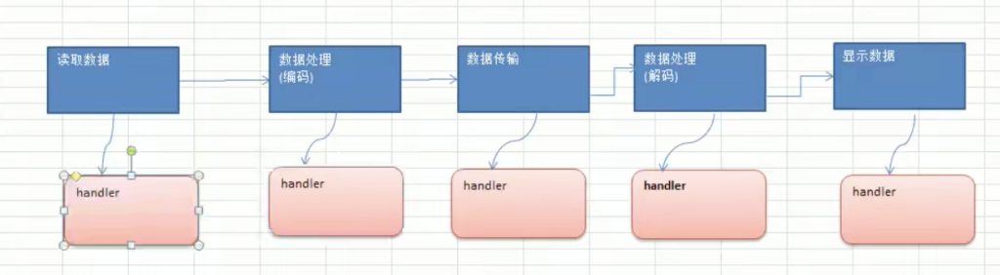

# Netty异步模型

## **什么是异步？**

首先我们来过一下异步是什么？异步和同步相对，当一个异步过程调用发出后，调用者不能立刻   得到结果。实际处理这个调用的组件在完成后，通过状态，通知和回调来通知调用者。

.

## **什么是Netty异步模型？**

我们再Netty中的I/O操作都是异步进行的，比如Bind，Write，Connect等操作都会简单的返回一个ChannelFuture对象。

**这种异步模型在Netty中也被称为****“Future-Listener”机制****，即用户可以使用ChannelFuture接口实现对象中的方法去获取到线程异步执行之后的结果。**

原理如果大家对并发编程有一定基础，通过名字已经可以有大致的判断了，Future-Listener机制实现是基于Future以及Callback两个类完成的。

所以这里不多做解释，详细可以看看博客：Callback和Future的关系。

.

## **ChannelFuture接口解析以及使用**

直接上一张ChannelFuture类结构代码图：

直观的可以看到继承了Future类。再来看看ChannelFuture接口提供的方法列表(主要是使用的还是Future接口中的方法)

ChannelFuture的使用在Handler中，为什么这么说。大家想必还记得ChannelPipeline这个结构吧，一个ChannelPipeline中包含一个channel和诸多Handler，从而形成一条职责链。如果把这个链通过同步的形式去看的话，就是下面这个图所示的模样：

在服务器数据入栈时的Channel职责链操作抽象图。当使用同步的时候，那么每一步都要等到相应的Handler执行完成之后才会执行下一步。

如果说当Handler通过Callback和Future变成异步的，并能获取完成返回值的方式。那么性能提升是巨大的。