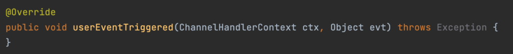
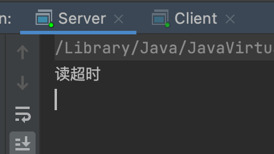

## 为什么需要心跳检测机制？

拿我们刚刚做的基于Netty的群聊系统来说，如果我们维护了很多的客户端，用以转发。正常来说一个客户端断开连接了都会去触发我们自定义Handler中的channelRemove方法，但是日常使用中，会有一些当客户端断开了，但是不会触发channelRemove的方法。

其实心跳机制算是Netty层面的TCP协议的保活机制了，谁让Netty就是基于TCP协议开发的呢。

对于TCP协议来说，遇到下面两种情况的时候，可能并不知道当前TCP通道已经断开。

1）TCP对于非正常断开的连接系统并不能侦测到（比如网线断掉）。

2）长时间没有任何数据发送，连接可能会被中断。这是因为，网络连接中间可能会经过路由器、防火墙等设备，而这些有可能会对长时间没有活动的连接断掉。

所以TCP保活机制就为了能够实时知道这个TCP连接通道的状态。对应在Netty层面的实现就是心跳检测机制。

**不过提醒一句，心跳检测机制（TCP保活机制）只在长连接中或者需要保活的连接场景中使用**

我们之前在配置服务器的时候，配置过childOption中ChannelOption.*SO_KEEPALIVE*为true，这就开启了保活机制。说明当前场景需要保活机制。

------

## 核心组件IdleStatehandler简介

Netty提供了对心跳机制的天然支持，心跳可以检测远程端是否存活，或者活跃等状态。暴露给我们使用的API就是IdleStateHandler类，此类具有四个初始化参数：

- **readerIdleTime**：为读超时时间（即测试端在超时时间阈值的时候就会发送心跳检测包被测试端是否连接，然后重制计时时间，如果再次超过时，会再次发送心跳检测包）
- **writerIdleTime**：为写超时时间
- **allIdleTime**：所有类型的超时时间
- **timeUtil**：超时时间单位

**idleStateHandler本质上也是一个ChannelHandler，所以我们也需要在服务器端进行此Handler关于Pipeline的绑定。**

说明基础之后，我们来看看是怎么运行的，也就是怎么判断和发送心跳报文的。

即当客户端对应操作的请求被IdleStateHandler拦截之后，会重置已经记录的时间值，然后把此请求转发给下一个Handler中进行对应的处理。

如果idleStateHandler中读或者写操作已经记录的时间值超过设置的阈值，那么就会触发下一个Handler中userEventTriggered方法，执行相应的操作。这里userEventTriggered方法处理有两种情况：

1）在userEventTrigger方法中业务处理为关闭这个通道，那么之后的其他操作超时或者这个操作的重复心跳就不会触发了。

2）在userEventTrigger方法中业务逻辑和关闭这个通道无关，**那么每到一个操作超时时间就会触发一次userEventTrgger方法后重制计时时间，当再次达到这个操作的超时阈值的时候会再次调用userEventTrigger方法。**

既然不管是什么操作超时或者重复超时都会调用其后一个Handler的userEventTrigger方法的话，那么我们怎么在这个方法中区别是什么操作引发的超时事件，然后区别处理呢？

我们来看看这个方法的参数和基本信息：

关键参数：Object evt，这个参数代表了**IdleStateEvent**类型的对象，这个对象中包含了**IdleState**枚举类，这个类中包含了三个字段：

1）**READER_IDLE**：如果evt对象中的state状态为此状态，那么触发原因是读超时。

2）**WRITER_IDLE**：如果evt对象中的state状态为此状态，那么触发原因是写超时。

**3）****ALL_IDLE**：如果evt对象中的state状态为此状态，那么出发原因是读或者写超时。

如果向深入源码层面，读者可以去看看对应idleStareHandler类源码。

------

## 简单心跳检测机制实例

要求：

1）当服务器超过3秒没有读操作时，就提示读空闲

2）当服务器超过5秒没有写操作时，就提示写空闲

3）当服务器超过7秒没有读操作以及没有写操作时，就提示读写空闲。

服务端代码：

客户端代码：

结果：

这是当我们没有在userEventHandler中进行关闭处理，导致重复超时触发。

我们修改一下服务器中userEventHandler代码，当读超时触发时，关闭此通道。下图是修改代码：

结果：

在读超时触发后关闭此通道，服务器不在维护这个连接，那么其对应的全部心跳事件自然就取消了。