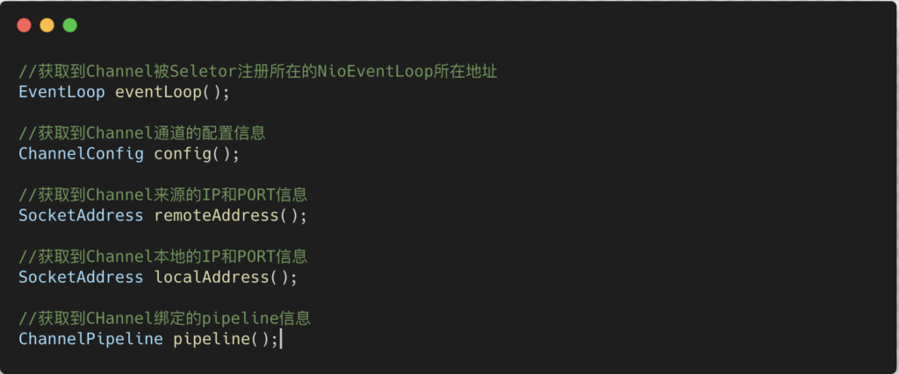

首先我们来看看BootStrap类和ServerBootstrap类，我们老是说生成一个客户端/服务端对象并配置，但是我们除了上述实例用过的配置，对这个类其实并不了解。

## Bootstrap和Serverstrap类解析

Bootstrap中文含义为”引导”，一个Netty应用通常由一个Bootstrap开始，其主要作用就是配置整个Netty程序，完成Netty模型搭建，把各个组件串联起来。

BootStrap是Netty客户端模型的引导对象。Serverstrap是Netty服务端模型的引导对象。

在源码层面上，Bootstrap和Serverstrap都继承自AbstractBootstrap类，只不过泛型不同罢了。类结构如下图所示

所以他们的方法其实都大同小异。我们可以一起解析：

1）**group方法**

2）**channel方法**，属于AbstractBootstrap类方法

3）**option和childOption方法**，前者属于AbstractBootstrap类方法，后者属于ServerBootstrap类方法。

4）**childHandler方法**，这个方法相比大家都超级熟悉，用于Workergroup中配置自定义Handler并绑定到ChannelPipeline对象中。（不要忘记ChannelPipeline对象的一条职责链模式哦），属于ServerBootstrap类方法。**其还有一个类似方法，即handler方法，也就是对BossGroup生效的Handler。**

5）**bind方法**，此方法用于ServerBootstrap对象，用于绑定监听端口，有多个重载方法，属于AbstractBootstrap类方法

6）**connect方法**，此方法用于Bootstrap对象，通过IP和PORT连接目标进程。由多个重载方法，属于BootStrap类方法。

说完Bootstrap和ServerBootstrap类，我们接着看看ChannelFuture类

.

## ChannelFuture类解析

channelFuture类继承Future类，通过CallBack和Future类来完成Netty中所有IO均为异步的功能，另外提供了监听器方法addListener方法，可以使得监听当前进行异步IO的通道，当这个通道完成IO操作之后触发想要的监听器对象执行通知方法。**关于ChannelFuture类的详细方法列表介绍看博客：Netty异步模型。**

这样解析一下ChannelFuture类常用的两种方法，sync和channel方法。

1）**Channel channel()方法**，通过当前异步对象返回其对应的当前正在进行的IO操作的通道。

2）**CHannelFuture sync()方法**，等待异步操作执行完毕。也就是把执行sync方法的操作变成异步操作，并返回一个异步对象。

就好比Bootstrap对象调用connect方法，是一个同步过程，通过在使用sync方法使其变成异步操作，并获取connect操作的异步对象。

通过这个异步对象可以获取connect执行的通道。

.

## Channel类解析

此Channel非彼Channel，这个Channel是Netty包中专门提供用来做网络通信的，能够执行网络I/O操作。

我们可以通过了解Netty的Channel含有哪些常用字段来深入了解Channel并加深对Netty模型的见解。

不同的协议对于不同的Channel实现，下列列表介绍一下常用的Channel实现类：

- **NioSocketChannel**：异步的客户端TCP Socket连接
- **NioServerSocketChannel**：异步的服务器端TCP Socket连接
- **NioDatagramChannel**：异步的UDP连接
- **NioSctpChannel**：异步的客户端sctp连接
- **NioSctpServerChannel**：异步的Sctp服务器端连接，这些通道涵盖了UDP和TCP网络IO以及文件IO。

.

## ChannelHandler以及其实现类解析

**ChannelHandler是一个接口，用于处理IO事件或者拦截IO操作，并将其转发到其ChannelPipeline中的下一个Channelhandler实现对象手里，完成职责链模型的实现。**

由于ChannelHandler本身并没有提供很多方法，因为这个接口有许多的方法需要实现，方便使用期间，可以继承它的子类。下图为Channelhandler类：

所以我们基本上都是使用ChannelHandler的子类实现类，我们来看看Channelhandler以及其派生实现类的UML关系类图：

我们基本上使用ChannelInitializer抽象类和SimpleChannelInboundHandler抽象类使用的频率最多

1）ChannelInitializer通过重写initChannel方法，把对应Channel的Handler的职责链生成。

2）SimpleChannelInboundHandler通过重写channelRead0方法完成自定义Handler的实现。

**其中我们来说说入站和出战的概念（引用B站UID为394263395用户的评论）**

1）客户端有出站入站，服务端也有出站入站

- 以客户端为例：
  - 如果有服务端传送的数据到达客户端，那么对于客户端来说就是入站；
  - 如果客户端传送数据到服务端，那么对于客户端来说就是出站；

- 对于服务端来说，也是一样的，有数据来就是入站，有数据输出就是出站

2）为什么服务端和客户端的handler都是继承SimpleChannelInboundHandler，而没有继承ChannelOutboundHandler的派生出站类？

实际上当我们在handler中调用ctx.writeAndFlush()方法后，就会将数据交给ChannelOutboundHandler进行出站处理，只是我们没有去定义出站类而已，若有需求可以自己去实现ChannelOutboundHandler出站类

3）总结就是客户端和服务端都有出站和入站的操作，形成一个循环链

**服务端——–出站——–入站——–客户端 ——–出站——–入站——–服务端**

先给大家一个出栈和入栈的概括，等到对ChannelPipline组件解析的时候，来详细说一下。

当有客户端请求的时候：

**handlerAdded -> channelRegistered -> channelActive**

当已经注册成功的客户端请求数据的时候：

**channelRead -> channelReadComplete**

当已经注册成功的客户端被关闭的时候：

**channelInactive -> channelRemove**

如果发生通道发生异常才会触发**exceptionCaught**方法。

也不用特别记忆，我们知道一套流程的话，自然就记住了，我们首先会建立TCP连接，当三次握手成功之后，触发连接就绪HandlerAdded方法，然后客户端借助这个TCP通道发送来请求，这个时候触发被注册事件channelRegistered方法，被注册之后也就意味着Netty可以使用这个Channel进行通信了，也就是就绪事件channelActive(),之后大家想必都明白了。