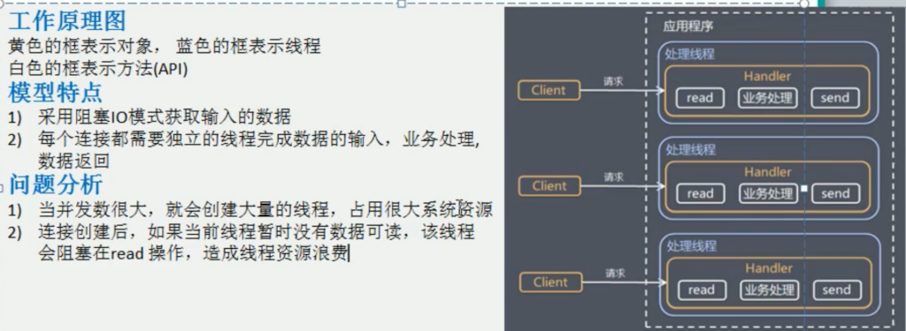
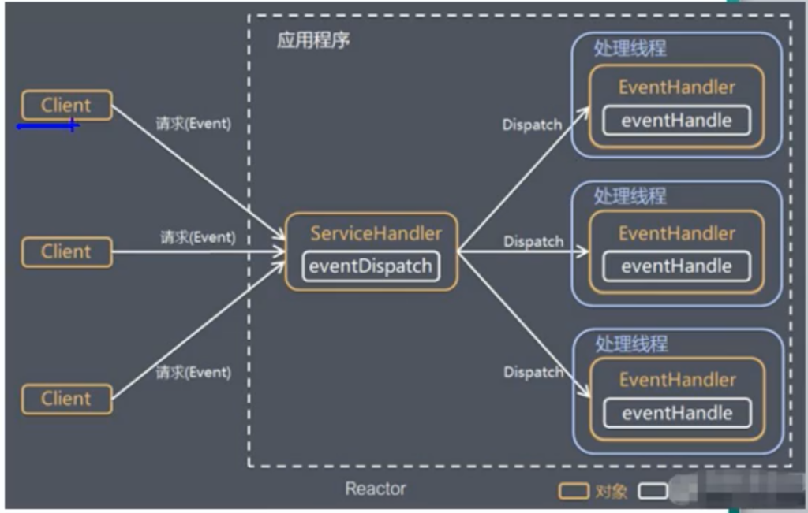
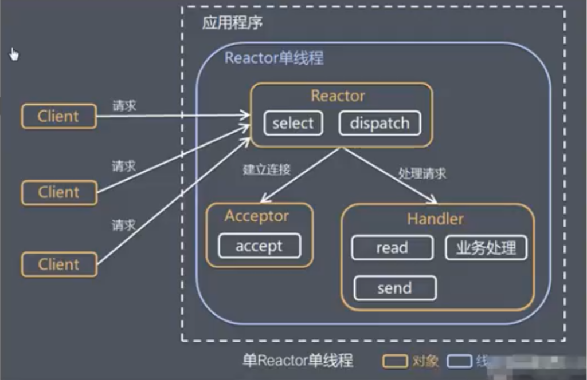
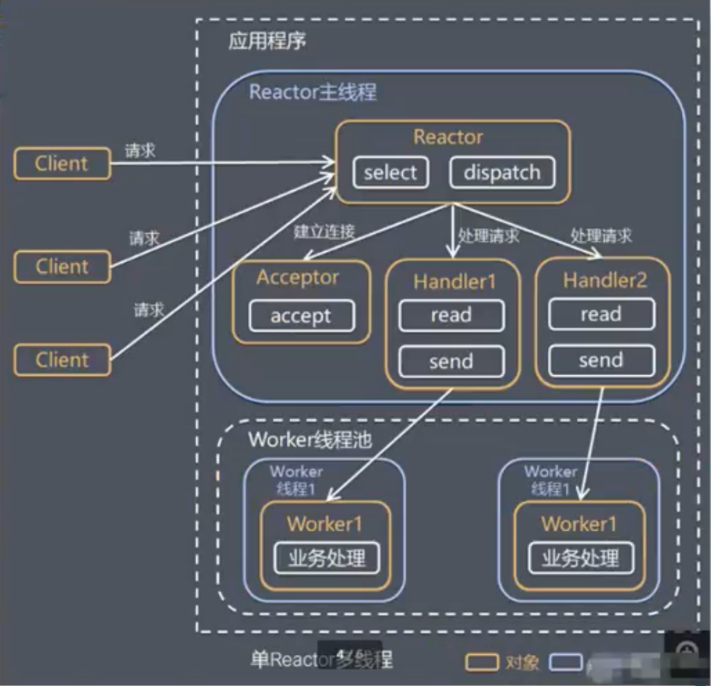
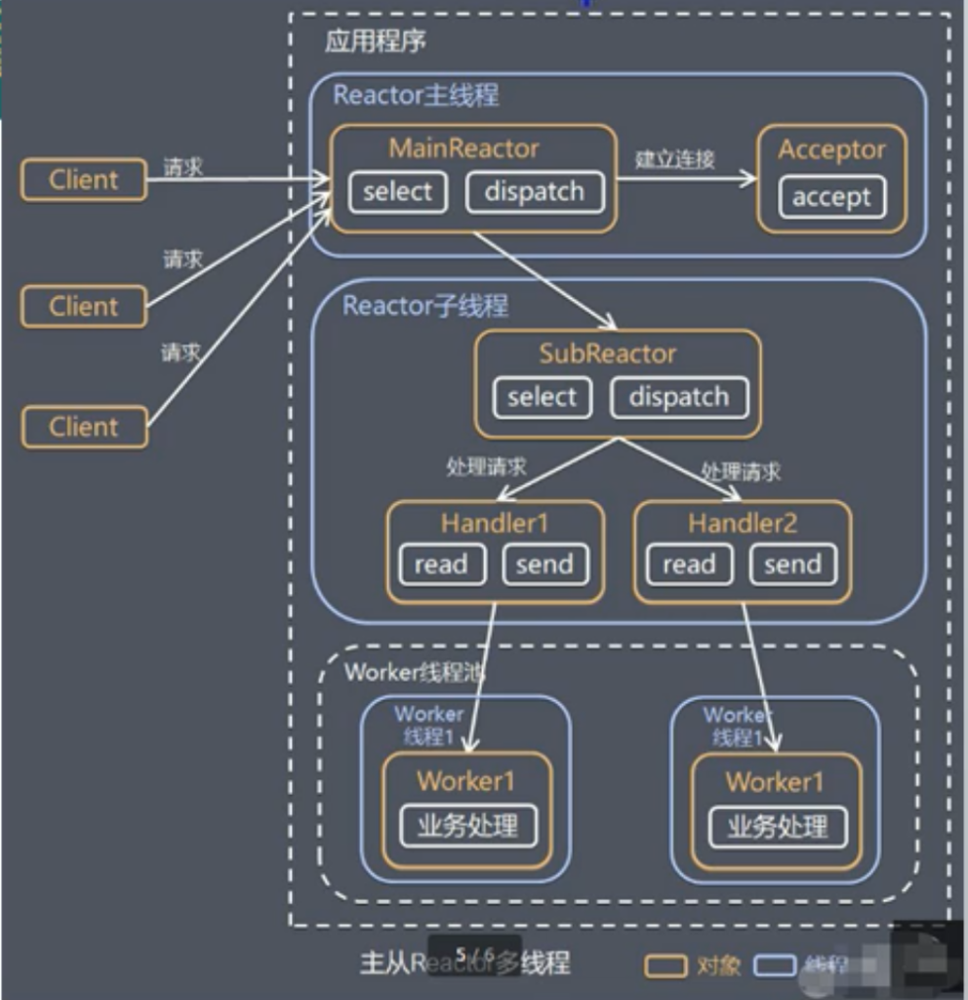
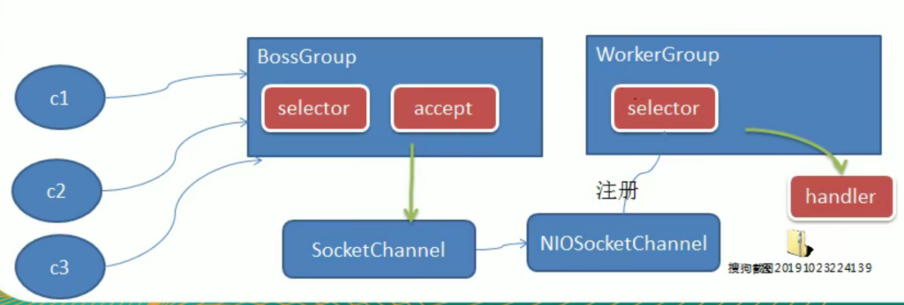
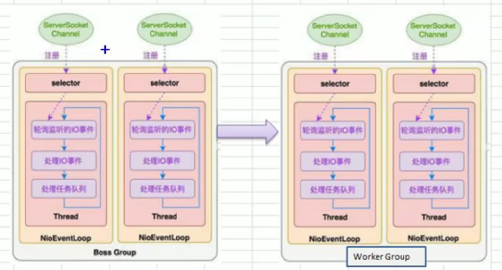
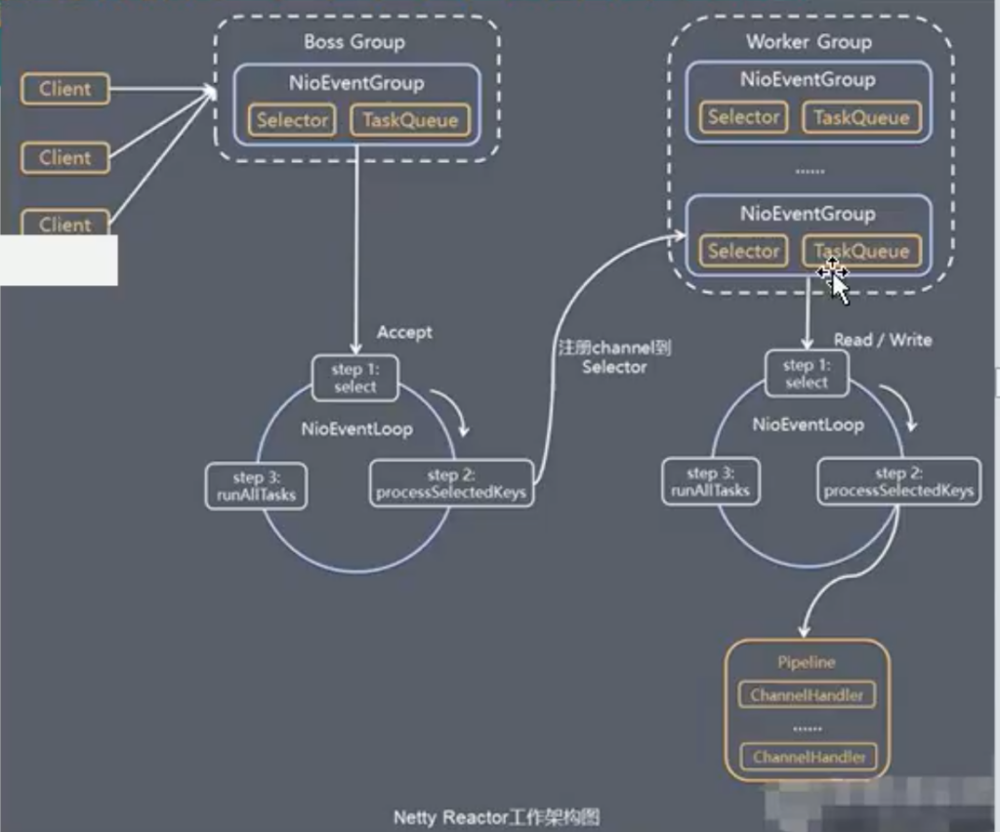

## Netty是什么？

netty就像是js和jquery之间的关系，是属于对Java NIO的高度封装之后的框架。为什么会出现Netty呢，因为如果单纯的使用NIO来进行业务处理的话，其的API和类库繁琐，使用起来麻烦。而且学习成本高，不但需要熟练掌握Seletor，ServerSocketChannel，SocketChannel，ByteBuffer等组件，而且还需要熟悉Java网络编程和Java并发编程的基础知识，才能写出一个成熟的基于NIO的业务逻辑处理代码。

NIO还有一个非常严重的Epoll BUG也就是空轮训，这个bug到jdk1.7还没有被解决。关于NIO的空轮训bug我会单独列出一篇博客进行讲述。这里着重Netty。

## Netty的作用是什么？

**Netty能够提供异步的，基于事件驱动的网络框架，可以帮助我们快速的开发服务器端和客户端。**

想要明白Netty的运行原理，就得先知道netty的线程模型，就像传统IO你得先把传统IO服务模型看懂才知道传统IO怎么运行的，所以我们来看看Netty的线程模型。

比如传统模型：

–

–

## Reactor模式

根据Reactor的数量和处理资源池线程的数量不同，有三种不同的实现，分别是：**Netty是基于主从Reactor多线程模型优化版的**

1）单Reactor单线程

2）单Reactor多线程

3）主从Reactor多线程

说了这么多，关于Reactor的内容可谓是一个没讲，想要了解这三个模式，就要先知道Reactor模式是什么？

Reactor模式有两大特点：

- 基于I/O复用模型：多个连接公用一个阻塞对象，应用程序只需要在一个阻塞对象等待，无需阻塞等待所有连接。当某个连接有新的数据可以处理时，操作系统通知应用程序，线程从阻塞状态返回，开始业务处理。
- 基于线程池复用线程资源：不必再为每一个连接创建线程，将连接完成后的业务处理任务分配给线程进行处理，一个线程可以处理多个连接的业务。

**从上图可以看出，Reactor模式整合NIO和线程池资源管理，原本NIO是事件就绪之后通过单个线程去执行相应的事件，现在是通过空闲的线程去执行这个事件。**

看到宏观的运行原理模型之后，我们就要来进行微观的一一对应解析了，首先再Reactor模型中，我们的Reactor在哪？

Reactor在一个单独的线程中运行，负责监听和分发事件，分发给适当的处理程序来对IO事件作出反应。**对应我们宏观模式图中的ServeicHandler。**

Headlers：处理程序执行I/O事件要完成的实际事件，也就是真正干活的。**对应我们宏观模式图中的多个EventHandler。**

–

–

## 单Reactor单线程

用什么来形容单Reactor单线程的经典使用呢？那就是我们之前玩的NIO啦，NIO就是类似于单Reactor单线程模式的一个服务模型。不过还是有一些不一样的。

下图就是单Reactor单线程服务模型图：

我们在之前书写NIO代码的时候，并没有把Acceptor和Handler分开，其实可以把这accept和（read，write等）封装成Aceeptor以及Handler对象后，再调用的话，就是这个服务模型的样式图。

缺点也很明显：

1）当程序并发量特别大的时候，后来的任务一定会阻塞住，等待前面的任务执行完毕。毕竟处理上依然是单线程。不知道有没有同学实验过，当我们把之前基于NIO的聊天室程序中的客户端改成一个不结束的一直发，那么别的客户端发送的消息就不无法被服务器接受，也就是单线程的问题。

2）单线程导致程序的健壮性不高，一旦线程意外中止了，程序就挂了。

但是也是有优点的：

1）这种单线程执行操作的方式可以保证线程是足够安全的，没有共享资源竞争的情况。**比如Redis在监听到是文件操作时就会进行单一线程操作，保证线程安全。**

–

–

## 单Reactor多线程

为了解决单Reactor单线程的并发性能问题，我们提出了多线程的解决方式，也就是Handler不再是一个线程解决，而是通过Reactor分发给多个相应的Handler线程去完成。这样我们就可以解决单个线程并发低的问题了。

我们来讲解一下单Reactor多线程的运行流程：

1）首先Reactor对象通过内聚的selector对象进行客户端请求的监听，监听到客户端请求之后，会通过dispathch进行请求分发。

2）如果是建立连接请求，则用Acceptor对象通过accept方法处理连接请求，然后创建一个Handler对象处理完成连接后的各种事件。

3）如果不是连接请求，则由Reactor分发调用连接对应的Handler对象来处理，Handler对象只负责响应对应的事件，而不是负责处理，通过read读取数据之后，会分发给后面的worker线程池中某个线程进行业务处理。

4）worker线程池分配一个独立线程完成真正的业务，并将结果返回给handler对象

5）handler对象包含了和客户端之间的连接通道，所以handler收到结果响应之后，通过send将结果返回给client。

我知道如果有和我一样的，想知道底层到底怎么实现的同学的话，现在就会急得不行。但是饭要一口一口吃，我们先知道这么个具体流程之后，我以后会开一个深入Netty源码分析的博客的。（又在给自己挖坑）……..

那么我们接下来看看单Reactor多线程的优点：

1）通过把占用大量数据的业务处理环节分离的方式并利用多核cpu的处理能力，进行多线程处理业务。大幅度提升并发性能。

缺点：

1）多线程编程的通病问题，共享数据的线程安全，死锁，线程上下文调度性能等问题。

2）单线程运行Reactor，在高并发情况下，容易在这里出现性能瓶颈，虽然我们把业务逻辑独立分出去了，但是判断对应handler，请求分发以及handler响应操作依然发生在Reactor上，依旧会在高并发环境下形成阻塞。（不过阻塞的并发阈值比第一个模型高多了）

3）单线程运行Reactor，如果因为特殊情况Reactor挂了，那么后面的执行操作就会执行不了，相当于应用程序挂了。健壮性不高。

## 主从Reactor多线程

为了解决上一个模型中，单线程Reactor带来的并发性能以及健壮性问题。提出了主从Reactor多线程。

下图就是主从Reactor多线程的服务模型图：

变化在于主Reactor用于监听Acceptor和分发业务请求给从Reactor，然后从Reactor负责去匹配对应的Headler以及分发，响应的操作。

**从Reactor可不是单单只有一个哦**，**一个主Reactor可以关联多个从Reactor。**

我们来解析一下流程：

1）Reactor主线程中MainReactor对象通过selector监听连接事件，收到事件后，通过Acceptor对象处理连接事件。

2）当Acceptor处理连接事件后，MainReactor将连接分配给SubReactor。

3）SubReactor将连接加入到连接队列进行监听，并创建handler进行各种事件处理。

4）当有已经建立的连接有新事件发生时，subReactor就会调用对应的handler处理。

5）之后的流程就和上一个模型一样了

我们来看看主从Reactor多线程的优点：

1）父线程于子线程的数据交互简单职责明确，父线程只需要接受新连接，子线程完成后续的业务处理。

2）父线程于子线程之间的数据交互简单，Reactor主线程只需要把新连接交给子线程，子线程无需返回数据给父线程。

缺点：

1）编程复杂度高。

说完主从Reactor多线程模型之后，就可以来看看Netty真正应用的优化版主从Reactor多线程模型。

–

–

## Netty服务模型解析

netty服务模型虽然基于主从Reactor多线程模型，但是优化之后比较复杂，所以我们分为化简版和详细版来分开解析：

首先我们说Netty简化版

我们来解析一下一个简化版，简化版的大致流程上和主从Reactor多线程相差不大，我们主要是熟悉一下在Netty中的名称。

1）BossGroup线程（主Reactor线程）维护Selector，只关注accept事件。

2）当接收到ACCEPT事件之后，获取对应的SocketChannel，封装成NIOScoketChannel并注册到Worker线程(事件处理循环),并进行维护。

3）当Worker线程监听到Selector中通道发生自己感兴趣的事件后，就进行处理(交给handler),handler对象中交给新的线程。

了解了替换名称的简化版Netty服务模型之后，我们直接上详细版来看看具体流程。

**我们直接把炸弹丢出来，详细版核心就在于BossGroup线程中不再是只有一个Reactor，而是多个Reactor线程！！！！WorkerGroup中也不是只有一个Selector进行处理，而是多个Selector线程在进行处理！！！！**

通过上面两张图的轰炸，应该会有个抽象的印象，比如BossGroup和WorkerGroup中好像又多了几个线程来完成构建这样的服务模型的。

没错。Netty抽象出两组线程池，即BossGroup和WorkerGroup。

**BossGroup专门负责接受客户端的连接，WorkerGroup专门负责网络的读写。他们的类型都是NioEventLoopGroup。**

N**ioEventLoopGroup相当于一个事件循环组，这个组中含有多个事件循环，每一个事件循环就是一个NioEventLoop。**

**NioEventLoop表示一个不断循环的执行处理任务的线程**。**每一个NioEventLoop都有一个Selector，用于监听绑定在其上的socket的网络通讯。**

我们来解析一下这个服务模型中Boss NioEventLoop和Worker NioEventLoop执行流程：

**Boss NioEventLoop：**

1）轮训Accept事件

2）处理Accept事件，与client建立连接，生成NioSocketChannel，并将其注册到某个woker NioEventLoop上的Seletor上。

3）再去处理任务队列中的任务，即runAllTask。

**Woker NioEventLoop：**

1）轮训read，write事件

2）处理i/o事件，即read，write事件，在对应NioSocketChannel上处理。但是这个处理并不是自己处理，而是通过Pipeline(管道)。

3）再去处理任务队列中的任务，即runAllTask。

**每个Worker NioEventLoop处理业务时，会使用Pipeline（管道），pipeline中包含了channel和对应的处理器Handler，即通过Pipenline可以获取对应的通道并且管道内维护了很多Handler处理器。**

**其实可以把管道看成一个由channel和诸多Handler组成的职责链模式，由channel来传递数据，然后诸多Handler相当于职责链模式进行处理。**

关于Pipeline管道的概念涉及很多，之后在关于Netty的使用上详细说明。