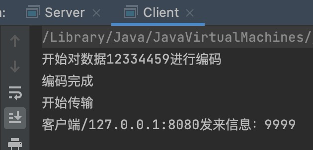
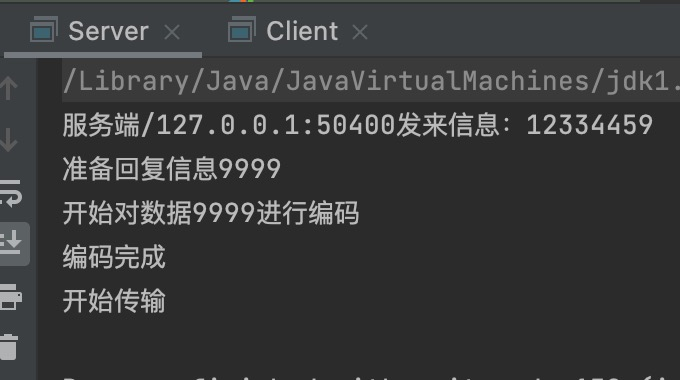
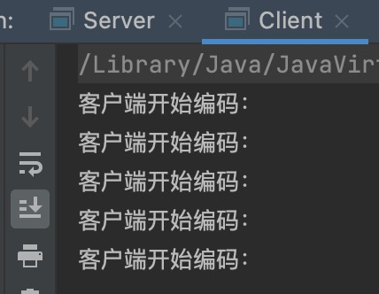
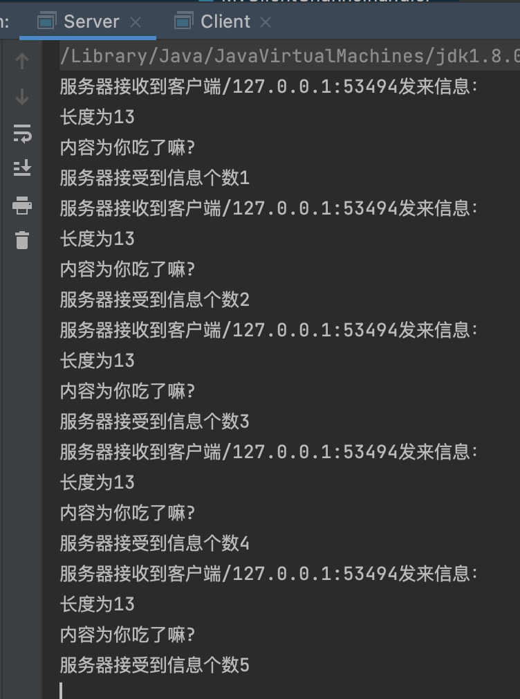

## 编码与解码机制

我们知道在网络编程中，数据的传输均依靠二进制流进行包/流式传输，但是我们的数据最开始并不是二进制流数据，而是各种各样格式的数据。

**编码可以保证在特定形式下被转化成二进制流，从而在网络中进行传输。**

**解码可以保证接受的二进制流可以被转化成与编码相应的特定形式，从而获取到被编码之前的数据。**

在解码时我们需要注意，短连接和长连接时解码的不同，短连接一次连接与断开为一次数据的传递，十分好确认这个数据的完整性。但是长连接不同，长连接下，一个TCP连接可以传递多个数据，那么我们在服务端解码的时候，怎么确定当前解码的数据是一个完整的呢？

具体有三种方式，关于这三个方式的详细可以看看博客：[“TCP分段与重组”](http://119.29.157.232:8000/2021/11/20/tcp分段与重组/)

1）双方固定数据长度。

2）以指定的字符或者字符串为”逻辑上包”的结束标志。

3）使用包头+包体的格式。

**HTTP协议的长连接就是编码时指定HTTP协议的包头和包体，解码时通过包头和包体来完成数据的正确解码。**

------

## Netty实现编码解码器底层类

**Netty实现编码解码类的两大类为ByteToMessageEncoder（编码）和ByteToMessageDecoder（解码）类**。

之前HTTP编程实例的时候，HttpServerCodec类的两个组成类，HttpRequestEncoder和HttpResponseDecoder类均分别是BtyeToMessageEncoder类和ByteToMessageDecoder类的派生类。

ByteToMessageEncoder/Decoder类的核心就是使用模版设计模式，定义了特定格式写入/获取二进制流的方法，分别为编码的encode方法和解码的decode方法。我们只需要负责重写这两个方法即可完成自定义的编码解码器类对象。

我们来看看这两个方法的参数和解析：

```
/**
* 作用：模版方法，自定义解码方式
* 参数：
* var1 解码类的基类也是ChannelHandler类，所以被当作ChannelhandlerContext节点包含的Handler对象
* var2 本次从Channel中获取到的字节流
* var3 每次从var2中提取出来的字节流集合，一般为一个完整的字节流数据。会交给下一个InboundHandler进行处理
* 例如：每次从var2中提取8个字节，当遇到var2中数据没有8个字节，那么就停止加入var3中，将没有提取出来的数据保留在var2中，等待下
* 次解码的时候累加上去。即Bytebuf的read和write双指针用法
*/
protected abstract void decode(ChannelHandlerContext var1, ByteBuf var2, List<Object> var3) throws Exception;
/**
* 作用：模版方法，自定义编码方式
* 参数：
* var1 解码类的基类也是ChannelHandler类，所以被当作ChannelhandlerContext节点包含的Handler对象
* var2 泛型对象，一般设置为需要被编码的对象类型
* var3 被编码对象二进制流传承对象，同来进行传输。
*/
protected abstract void encode(ChannelHandlerContext var1, I var2, ByteBuf var3) throws Exception;
```

我们通过完成一个实例来加深理解：

环境：即通过客户端进行long类型的编码(模拟)，然后在服务器端进行long类型的解码。

客户端编码解码以及自定义Handler：

```
public class MyClinetEncoderHandler extends MessageToByteEncoder<Long> {
    @Override
    protected void encode(ChannelHandlerContext channelHandlerContext, Long aLong, ByteBuf byteBuf) throws Exception {
        //模拟编码流程，这里只是简单的案例，并没设计到编码设计
        System.out.println("开始对数据" + aLong + "进行编码");
        System.out.println("编码完成");
        System.out.println("开始传输");
        //使用byteBuf自带的Long类型编码
        byteBuf.writeLong(aLong);
    }
}
public class MyClientDecoderHandler extends ByteToMessageDecoder {
    @Override
    protected void decode(ChannelHandlerContext channelHandlerContext, ByteBuf byteBuf, List<Object> list) throws Exception {
        if(byteBuf.readableBytes() >= 8){
            list.add(byteBuf.readLong());
        }
    }
}
public class ClientInitializer extends ChannelInitializer<SocketChannel> {
    @Override
    protected void initChannel(SocketChannel socketChannel) throws Exception {
        ChannelPipeline pipeline = socketChannel.pipeline();
        pipeline.addLast("myClientEncode",new MyClinetEncoderHandler());
        pipeline.addLast("myDecoderHandler",new MyClientDecoderHandler());
        pipeline.addLast("myClientHandler",new MyClientHandler());
    }
}
public class MyClientHandler extends SimpleChannelInboundHandler<Long> {
    @Override
    protected void channelRead0(ChannelHandlerContext channelHandlerContext, Long aLong) throws Exception {
        System.out.println("客户端"+channelHandlerContext.channel().remoteAddress()+"发来信息："+aLong);
    }
    @Override
    public void channelActive(ChannelHandlerContext ctx) throws Exception {
        ctx.writeAndFlush(12334459l);
    }
    @Override
    public void exceptionCaught(ChannelHandlerContext ctx, Throwable cause) throws Exception {
        ctx.channel().close();
    }
}
```

服务器端编码解码以及自定义Handler：

```
public class MyServerDecoderHandler extends ByteToMessageDecoder {
    @Override
    protected void decode(ChannelHandlerContext channelHandlerContext, ByteBuf byteBuf, List<Object> list) throws Exception {
        if(byteBuf.readableBytes() >= 8){
            list.add(byteBuf.readLong());
        }
    }
}
public class MyServerEncoderHandler extends MessageToByteEncoder<Long> {
    @Override
    protected void encode(ChannelHandlerContext channelHandlerContext, Long aLong, ByteBuf byteBuf) throws Exception {
        //模拟编码流程，这里只是简单的案例，并没设计到编码设计
        System.out.println("开始对数据" + aLong + "进行编码");
        System.out.println("编码完成");
        System.out.println("开始传输");
        //使用byteBuf自带的Long类型编码
        byteBuf.writeLong(aLong);
    }
}
public class ServerInitializer extends ChannelInitializer<SocketChannel> {
    @Override
    protected void initChannel(SocketChannel socketChannel) throws Exception {
        ChannelPipeline pipeline = socketChannel.pipeline();
        pipeline.addLast("DecoderHandler",new MyServerDecoderHandler());
        pipeline.addLast("EncoderHandler",new MyServerEncoderHandler());
        pipeline.addLast("MyHandler",new MyServerHandler());
    }
}
public class MyServerHandler extends SimpleChannelInboundHandler<Long> {
    @Override
    protected void channelRead0(ChannelHandlerContext channelHandlerContext, Long aLong) throws Exception {
        System.out.println("服务端"+channelHandlerContext.channel().remoteAddress()+"发来信息："+aLong);
        Long returnData = 9999l;
        System.out.println("准备回复信息"+returnData);
        channelHandlerContext.writeAndFlush(returnData);
    }
    @Override
    public void exceptionCaught(ChannelHandlerContext ctx, Throwable cause) throws Exception {
        ctx.channel().close();
    }
}
```

结果：左图客户端，右图服务器，

- 
- 

------

## 上述事例异常情况分析

**情况一：当发送数据不为Long类型时，可能会是字符串通过Unpool完成编码的Bytebuf对象，那么还会被自定义的Long编码器编码嘛？**

结果是会进入到我们自定义的Long编码器Handler类中，但是在MessageToByteEncoder类中，有一个write方法，其中一句：this.acceptOutboundMessage(msg)代码用来配合if语句进行判断这个数据对象是否是我负责编码的类型，是就进行encode方法进行编码，不是就直接写过去。

下图为writer方法源码：

```
public void write(ChannelHandlerContext ctx, Object msg, ChannelPromise promise) throws Exception {
        ByteBuf buf = null;
        try {
            if (this.acceptOutboundMessage(msg)) {
                I cast = msg;
                buf = this.allocateBuffer(ctx, msg, this.preferDirect);
                try {
                    this.encode(ctx, cast, buf);
                } finally {
                    ReferenceCountUtil.release(msg);
                }
                if (buf.isReadable()) {
                    ctx.write(buf, promise);
                } else {
                    buf.release();
                    ctx.write(Unpooled.EMPTY_BUFFER, promise);
                }
                buf = null;
            } else {
                ctx.write(msg, promise);
            }
        } catch (EncoderException var17) {
            throw var17;
        } catch (Throwable var18) {
            throw new EncoderException(var18);
        } finally {
            if (buf != null) {
                buf.release();
            }
        }
    }
```

**情况二：如果不被Long编码器编码的话，这个字符串转化的二进制流会被解码嘛，解码结果是怎么样的？**

会被我们自定义的解码器Handler拦截并解码，但是比如我们发送的字符串是abcdabcdabcdabcd，那么被解码之后的结果为7017280452178371428。肯定不是我们想要的数据。

------

## 获取固定数据大小解码类ReplayingDecoder类

我们发现在上述案例中的解码器类中，并没有和编码器一样使用泛型去做数据类型的检查，而是直接通过指定的字节数大小进行判断后处理，有没有解码器是可以通过泛型来检查并处理解码数据类型的呢？

**有，ReplayingDecoder类提供了指定泛型来指定用户状态管理的类型，并不需要调用readableBytes()方法获取字节数(也就是通过泛型代替了字节数大小的手动判断，而不是和wrtier方法一样通过泛型进行判断是否进行编码)。如果泛型为void，那么就是不需要状态管理。**

但是这种指定了特定类型的解码器类，就会具有一定的局限性，如果通过byteBuf调用了一个这个数据类型不支持的方法，那么就会抛出UnsupportedOperationException异常。

直接上代码：

```
public class MyClientDecoderHandler2 extends ReplayingDecoder<Long> {
    @Override
    protected void decode(ChannelHandlerContext channelHandlerContext, ByteBuf byteBuf, List<Object> list) throws Exception {
        list.add(byteBuf.readLong());
    }
}
```

**不管是实例中自定义的解码器还是ReplayingDecoder解码器都是通过获取固定数据长度来判断的TCP长连接中的数据边界。**

------

## 通过特定字符/字符串作为指定结尾符的解码类LineBasedFrameDecoder类

LineBasedFrameDecoder类通过”\n”或者”\r\n”作为结尾符，来解析一个完整的数据。**得配合StringDecoder使用。**

使用：直接使用LineBasedFrameDecoder类配合StringDecoder即可，注意一下LineBasedFrameDecoder类的构造参数即可。

```
//构造参数中maxLength为支持的最大长度，如果连续读取到最大长度后，仍然没有发现换行符，就会抛出异常，同时忽略掉之前读到的异常码流。
public LineBasedFrameDecoder(final int maxLength) {
    this(maxLength, true, false);
}

//如果failFash为true  , 则超过maxLength字符还未出现换行符，则会抛出异常。stripDelimiter 为true 会不携带换行符，如果为false则会携带结束符。
public LineBasedFrameDecoder(final int maxLength, final boolean stripDelimiter, final boolean failFast) {
    this.maxLength = maxLength;
    this.failFast = failFast;
    this.stripDelimiter = stripDelimiter;
}
//服务器端
public class ServerChannelIntialier extends ChannelInitializer<SocketChannel> {
    @Override
    protected void initChannel(SocketChannel socketChannel) throws Exception {
        ChannelPipeline pipeline = socketChannel.pipeline();
        pipeline.addLast(new LineBasedFrameDecoder(1024));
        pipeline.addLast(new StringDecoder());
        pipeline.addLast(new MyServerChannelhandler());
    }
}
//客户端
public class ClientChannelInitializer extends ChannelInitializer<SocketChannel> {
    @Override
    protected void initChannel(SocketChannel socketChannel) throws Exception {
        ChannelPipeline pipeline = socketChannel.pipeline();
        pipeline.addLast(new StringEncoder());
        pipeline.addLast(new MyClientChannelHandler());
    }
}
//发送方
public class MyServerChannelhandler extends SimpleChannelInboundHandler<String> {
    @Override
    protected void channelRead0(ChannelHandlerContext channelHandlerContext, String s) throws Exception {
        System.out.println("客户端发送信息"+s);
    }
    @Override
    public void exceptionCaught(ChannelHandlerContext ctx, Throwable cause) throws Exception {
        ctx.close();
    }
}
//接收方
public class MyClientChannelHandler extends SimpleChannelInboundHandler<String> {
    @Override
    protected void channelRead0(ChannelHandlerContext channelHandlerContext, String s) throws Exception {
    }
    @Override
    public void channelActive(ChannelHandlerContext ctx) throws Exception {
        for(int index = 0 ; index < 5 ; index++){
            String msg = "你好，服务端\n";
            ctx.writeAndFlush(msg);
        }
    }
    @Override
    public void exceptionCaught(ChannelHandlerContext ctx, Throwable cause) throws Exception {
        ctx.close();
    }
}
```

**其中使用DelimiterBasedFrameDecoder类可以自定义特殊字符作为数据的结束符。**得配合StringDecode使用。

```
//构造参数中maxFrameLength为支持的最大长度，如果连续读取到最大长度后，仍然没有发现换行符，就会抛出异常，同时忽略掉之前读到的异常码流。
//构造参数中的delimiter为自定义结束字符或者自定义字符串的字节码流对象
public DelimiterBasedFrameDecoder(int maxFrameLength, ByteBuf delimiter) {
        this(maxFrameLength, true, delimiter);
}
```

------

## 通过包头+包体定义上层协议的自定义解码类

**通过自定义协议思想和固定长度确定数据边界类来完成协议数据包的自定义过程。**

来看看自定义协议对象类组成：

```
public class ProtocolMessage {
    //包头，简易版只有数据长度
    private int messageLength ;
    //包体，用来存储数据
    private byte[] content;
    public ProtocolMessage(int messageLength, byte[] content) {
        this.messageLength = messageLength;
        this.content = content;
    }
    public int getMessageLength() {
        return messageLength;
    }
    public void setMessageLength(int messageLength) {
        this.messageLength = messageLength;
    }
    public byte[] getContent() {
        return content;
    }
    public void setContent(byte[] content) {
        this.content = content;
    }
    @Override
    public String toString() {
        return "ProtocolMessage{" +
                "messageLength=" + messageLength +
                ", content=" + Arrays.toString(content) +
                '}';
    }
}
```

自定义协议对象类的编码器：

```
public class MyProtocolEncoder extends MessageToByteEncoder<ProtocolMessage> {
    @Override
    protected void encode(ChannelHandlerContext channelHandlerContext, ProtocolMessage protocolMessage, ByteBuf byteBuf) throws Exception {
        System.out.println("客户端开始编码：");
        //获取协议对象中数据的长度，并发送
        int messageLength = protocolMessage.getMessageLength();
        byteBuf.writeInt(messageLength);
        //获取协议对象中的数据，并发送
        byte[] context = protocolMessage.getContent();
        byteBuf.writeBytes(context);
    }
}
```

自定义协议对象类的解码器：

```
public class MyProtocolDecoder extends ReplayingDecoder<ProtocolMessage> {
    @Override
    protected void decode(ChannelHandlerContext channelHandlerContext, ByteBuf byteBuf, List<Object> list) throws Exception {
        //首先获取长度
        int length = byteBuf.readInt();
        //通过长度获取指定长度的包体
        byte[] context = new byte[length];
        byteBuf.readBytes(context);
        //封装为协议对象
        ProtocolMessage protocolMessage = new ProtocolMessage(length, context);
        //发送给下一个Handler
        list.add(protocolMessage);
    }
}
```

客户端发送Handler代码：

```
public class MyClientChannelhandler extends SimpleChannelInboundHandler<ProtocolMessage> {
    @Override
    protected void channelRead0(ChannelHandlerContext channelHandlerContext, ProtocolMessage protocolMessage) throws Exception {
    }
    @Override
    public void channelActive(ChannelHandlerContext ctx) throws Exception {
        for(int index = 0; index < 5 ; index++){
            String msg = "你吃了嘛?";
            byte[] context = msg.getBytes(CharsetUtil.UTF_8);
            int length = context.length;
            ProtocolMessage protocolMessage = new ProtocolMessage(length, context);
            ctx.writeAndFlush(protocolMessage);
        }
    }
    @Override
    public void exceptionCaught(ChannelHandlerContext ctx, Throwable cause) throws Exception {
        ctx.channel().close();
    }
}
```

服务器端接受Handler代码：

```
public class MyServerChannelHandler extends SimpleChannelInboundHandler<ProtocolMessage> {
    private int time = 0;
    @Override
    protected void channelRead0(ChannelHandlerContext channelHandlerContext, ProtocolMessage protocolMessage) throws Exception {
        int length = protocolMessage.getMessageLength();
        byte[] context = protocolMessage.getContent();
        System.out.println("服务器接收到客户端"+channelHandlerContext.channel().remoteAddress()+"发来信息：");
        System.out.println("长度为"+length);
        System.out.println("内容为"+new String(context,CharsetUtil.UTF_8));
        System.out.println("服务器接受到信息个数"+(++this.time));
    }
    @Override
    public void exceptionCaught(ChannelHandlerContext ctx, Throwable cause) throws Exception {
        ctx.close();
    }
}
```

结果：左图客户端，右图服务端

- 
- 