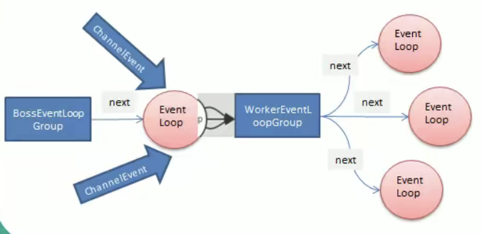

## EventLoopGroup结构

NioEventLoopGroup类是EventLoopGroup的常用派生类，我们直接从EventLoopGroup开讲。

EventLoopGroup是一组EventLoop的抽象，Netty为了更好的利用多核CPU资源，一个EventLoopGroup实例下通常会有多个EventLoop实例同时工作，每个EventLoop维护着一个Selector实例和一个TaskQueue实例。

在使用上，EventLoopGroup提供了next接口，可以从组里面按照一定规则获取其中一个EventLoop来处理任务。

一般来说服务器端需要两个EventLoopGroup实例，即BossGroup和WorkerGroup，客户端需要一个EventLoopGroup实例，即WorkerGourp实例。

## BossGroup和WorkerGroup的关系和运行流程

通常一个服务器端口即一个ServerSocketChannel对应一个BossEventLoop线程中的Seletor组件，BossEventLoop线程负责接受客户端的连接并将SocketChannel注册给WorkerEventLoopGroup中的某个WorkerEventLoop线程中的Seletor组件中，由WorkerEventLoop线程去执行IO操作。

解析一下上述运行流程：

1）BoossEventLoopGroup中通常是保留一个单线程的EventLoop，EventLoop中维护着一个注册了ServerSocketChannel的Seletor实例，EventLoop线程通过Seletor的不断轮训，将连接就绪（OP_ACCEPT事件）的客户端连接产生的SocketChannel分离出来。

2）将生成的SocketChannel交给WorkerEventLoopGroup组件，WorkerEventLoopGroup会通过next方法选择其中一个EventLoop线程，将此SocketChannel注册到这个EventLoop线程的Seletor组件中，让其进行操作事件轮训。

## **Next操作策略**

我们制定Worker的NioEventLoopGroup的NioEventLoop线程数为8个，当我们使用9个客户端来连接Netty服务端的时候，我们会发现客户端1-8顺序注册到了1-8号NioEventLoop线程的Seletor上，第9个客户端连接被注册到了1号NioEventLoop线程的Seletor组件中，说明Next操作是轮训策略。

这个博客挖个坑，ChannelOption的配置内容等我把操作系统读完之后再结合计算机网络进行解析