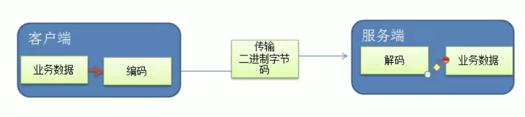
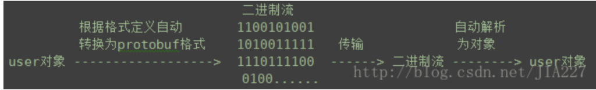
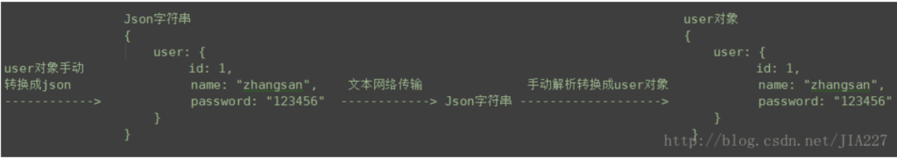
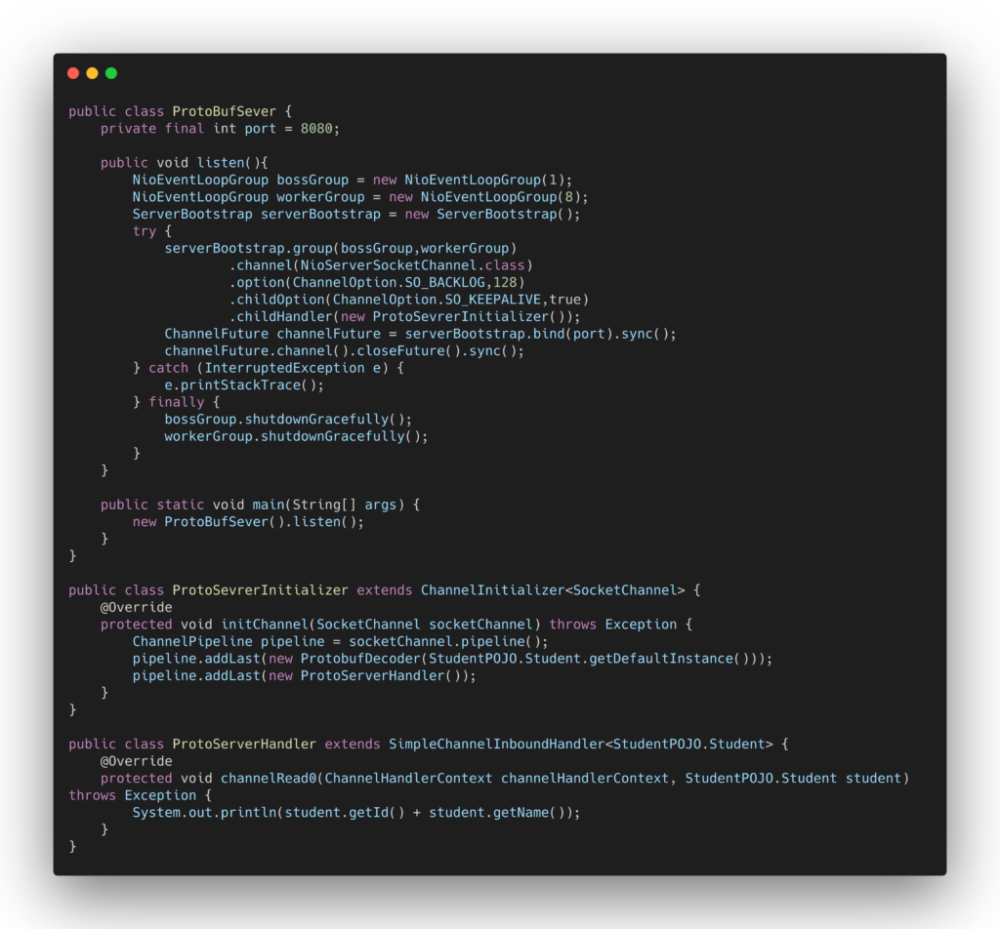
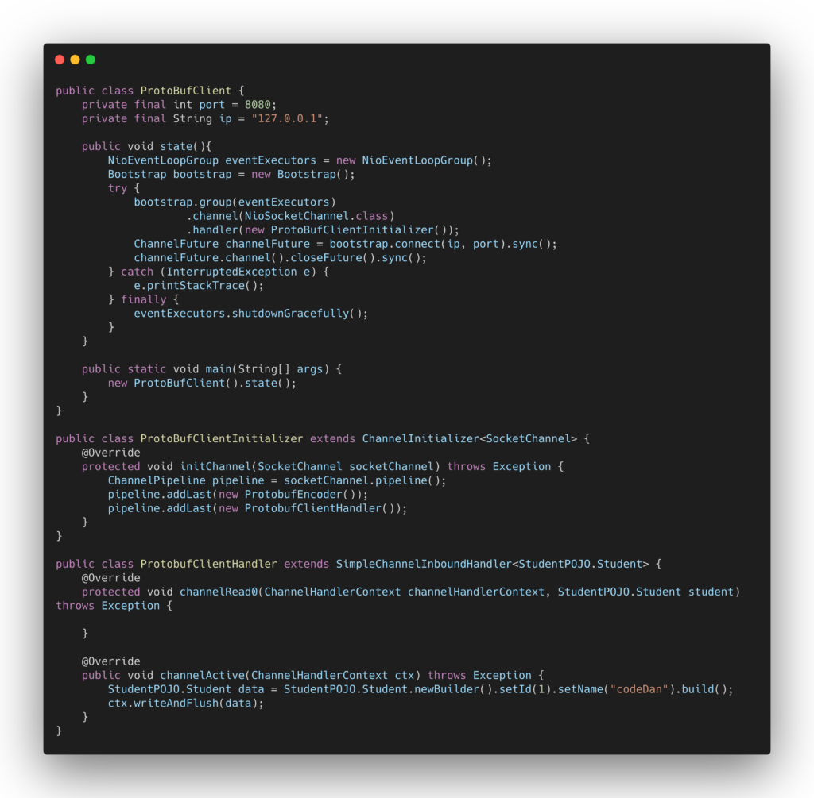
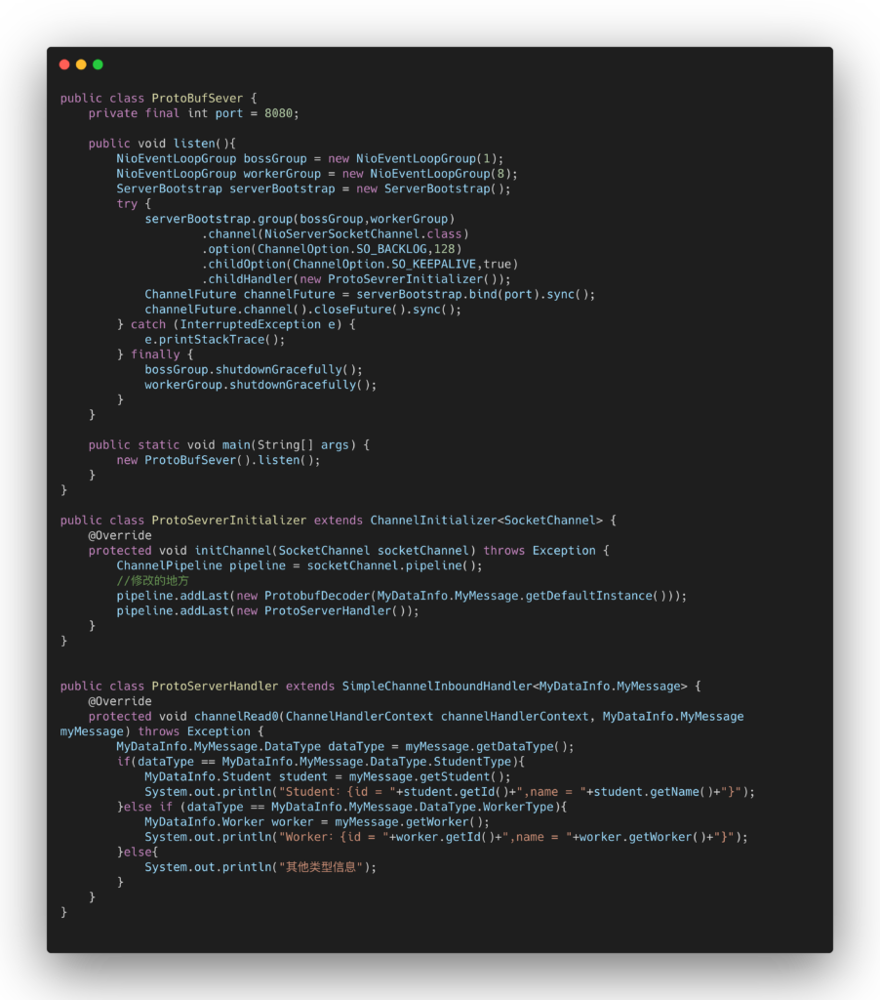
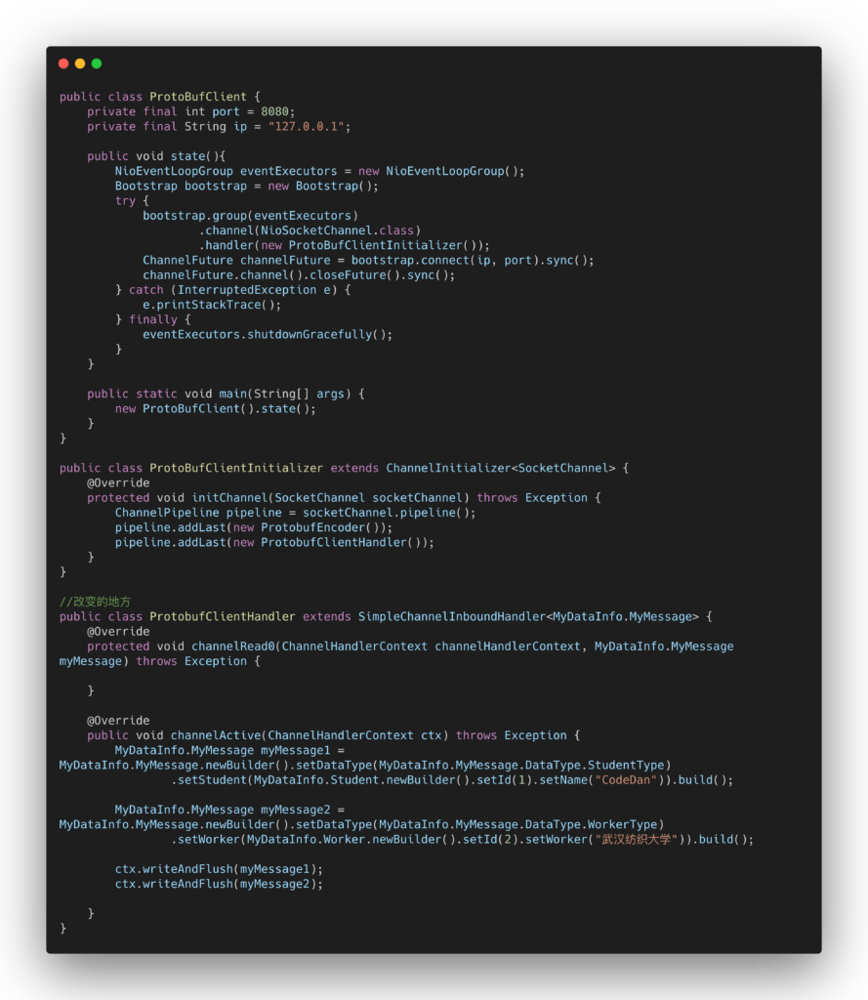

## 编码与解码

为什么要编码和解码，在编写网络应用中，**因为数据在网络中传输都是二进制字节码数据，在发送数据时就需要把数据编码成对应的二进制码，然后再网络中传输到指定的目标应用进程中，后被相应规格的解码器进行解码，把二进制字节码数据流还原为对应正确的数据。**

**编码器(\**Encoder\**)与解码器(\**Decoder\**)**

编码器与解码器的结合体叫Codec，Decoder负责把数据编码成相应格式对应的二进制字节码数据，Encoder负责通过. 相应的解码规则，还原出正确的数据。



------

## Netty本身提供的编码解码器

netty自身提供了一些编码解码器，比如

- StringEncoder和StringDecoder，用以字符串–>二进制流–>字符串的编码解码。
- ObjectEncoder和ObjectDecoder，用以java对象–>二进制流–>Java对象的编码解码。
- HttpServerEncoder和HttpServerDecoder，用以HTTP协议数据–>二进制流–>HTTP协议数据的编码解码。扩展有HttpObjectAggretor类

其中ObjectDecoder和ObjectEncoder编码解码器可以用来实现POJO对象或者各种业务对象的编码和解码，底层使用的序列化和反序列化来实现的。

Java序列化的缺点也很明显：

1）无法跨语言，Java客户端序列化的结果只有Java服务端才能反序列化

2）序列化之后的体积是二进制编的5倍多

3）序列化性能太低

为了解决这个问题，我们引入谷歌的一个开源项目：ProtoBuf项目

额外小话题：以前包括现在满多公司都还在使用HTTP+JSON格式数据进行结构化数据交换，但是也有在转型TCP+ProtoBuf进行结构化数据交换的。

------

## Protobuf项目解析

Protobuf是Google开源的项目，是一种以轻便高效的结构化数据存储的格式，可以将结构化数据串行化也就是序列化。**很适合做PRC框架的数据交换格式。支持跨语言，跨平台。**

通俗来说Protobuf可以通过自定义编写的类结构文件(.proto)，来自动将实例对象根据类结构文件转变为ProtoBuf文件格式文件，也就是满足protobuf规则的java类，然后把此java类变成二进制字节码流传输到目标应用中后再通过这个特定的java类拿到数据转化为我们使用的实例对象。



我们来对比一下json流程：转化业务代码繁琐。



知道怎么运行的之后，我们来看看这个.proto文件到底怎么写，语法是什么？

这个[ProtoBuf开发文档中文版](https://blog.csdn.net/u011518120/article/details/54604615?spm=1001.2101.3001.6650.2&utm_medium=distribute.pc_relevant.none-task-blog-2~default~CTRLIST~default-2.essearch_pc_relevant&depth_1-utm_source=distribute.pc_relevant.none-task-blog-2~default~CTRLIST~default-2.essearch_pc_relevant)先过一遍，有个印象，然后再看看安装手册，我们需要通过protoBuf指令完成.proto文件转化为java文件。这也是一个缺点。

安装方式：[点击](https://www.jianshu.com/p/67f64307d268)

**ProtoBuf实例解析**

要求：

1）客户端可以发送一个Student Pojo对象到服务器(通过ProtoBuf编码)

2）服务器端可以接受一个Student Pojo对象（通过ProtoBuf解码），并使用实例对象的方式进行显示。

步骤：

1）在maven中导入protobuf坐标，并使用maven进行编译，下载对应的jar到我们的运行时环境。

```
<dependency>
   <groupId>com.google.protobuf</groupId>
   <artifactId>protobuf-java</artifactId>
   <version>3.6.1</version>
</dependency>
```

2）通过proto文件格式编写一个Student.proto文件。

```
syntax = "proto3"; //使用proto版本
option java_outer_classname = "StudentPOJO";   //生成的外部类明，同时也是文件名
//protobuf使用message来管理结构话数据
message Student{
  int32 id = 1;    //Student类中的字段，其中1表示的字段序号，而不是初始值
  string name = 2;
}
```

\3) 通过指令生成对于的java文件,这个文件才是我们要发送的结构化数据实体类

```
项目路径.proto文件所在目录~:protoc --java_out=. Student.proto
```

(4)在客户端Channelinitializer接口的实现类中添加ProtoBuf的编码解码器

```
pipeline.addLast(new ProtoBufEncoder());
pipeline.addList(new 自定义Handler);
```

5）在客户端channelAction方法中进行发送（不一定要这个方法，也可以在别的方法，主要是看具体的业务逻辑）

```
StudentPOJO.Student student = StudentPOJO.Student.newBuilder().setId(4).setName("CodeDan").build();
ctx.writerAndFlush(student);
```

6）在服务器端Channelinitializer接口的实现累中添加ProtoBuf的解码器

```
pipeline.addLast(new ProtoBufDecoder(StudentPOJO.Student.getDefaultInstance()));    //参数为哪个对象，填入StudentPOJO中的那个内部类
pipeline.addList(new 自定义Handler);
```

7）在服务器端自定义Hanlder类中，继承SimpleInboundHandlerAdapter<StudentPOJO.Student>重写channelRead0方法

```
student.getId()+student.getName();
```

服务器代码：



客户端代码：




------

## ProtoBuf优化

上述代码中，充分体现出了ProtoBuf在使用上的繁琐性，一个studentPOJI类对应一个student类，解码器指定了一个student类对象，simpleInboundHandlerAdapter泛型也是StudentPOJO.student。那么我们做搞几个对象，不得累死。

其实ProtoBuf没有这么鸡肋。我们需要在.proto文件下使用其的枚举类型配合多个message实现一个.proto文件内可以使用多个类。（记得看一下中文文档的枚举类型要点）

1)我们新增Worker 类，修改一下我们的.proto文件

```
syntax = "proto3";
option java_outer_classname = "MyDataInfo";
//定义一个message汇总类
messags MyMessage{
   enum DataType{
     StudentType = 0; //枚举项标识
     WorkerType = 1；//枚举项标识
   }
   DataType data_type = 1; //字段标识
   //关于oneof种的引用其他message，不需要repeated关键字，其他message中引用其他message需要使用
   //选一个作为这个字段
   oneof dataBody{
     Student student = 2;
     Worker worker = 3;
   }
}
message Student{
   int32 id = 1;
   String name = 2;
}
message Worker{
   int32 id = 1;
   String worker = 2;
}
```

2）修改一下服务器端的解码器设置

```
pipeline.addLast(new ProtobufDecoder(MyDataInfo.MyMessage.getDefaultInstance()));
```

3）修改一下ChannelRead0方法中的获取方式,SimpleInboundHandlerAdapter<MyDataInfo.MyMessage>

```
    @Override
    protected void channelRead0(ChannelHandlerContext channelHandlerContext, MyDataInfo.MyMessage myMessage) throws Exception {
        MyDataInfo.MyMessage.DataType dataType = myMessage.getDataType();
        if(dataType == MyDataInfo.MyMessage.DataType.StudentType){
            MyDataInfo.Student student = myMessage.getStudent();
            System.out.println("Student：{id = "+student.getId()+",name = "+student.getName()+"}");
        }else if (dataType == MyDataInfo.MyMessage.DataType.WorkerType){
            MyDataInfo.Worker worker = myMessage.getWorker();
            System.out.println("Worker：{id = "+worker.getId()+",name = "+worker.getWorker()+"}");
        }else{
            System.out.println("其他类型信息");
        }
    }
```

4）修改一个客户端发送的形式

```
    @Override
    public void channelActive(ChannelHandlerContext ctx) throws Exception {
        MyDataInfo.MyMessage myMessage1 = MyDataInfo.MyMessage.newBuilder().setDataType(MyDataInfo.MyMessage.DataType.StudentType)
                .setStudent(MyDataInfo.Student.newBuilder().setId(1).setName("CodeDan")).build();
        MyDataInfo.MyMessage myMessage2 = MyDataInfo.MyMessage.newBuilder().setDataType(MyDataInfo.MyMessage.DataType.WorkerType)
                .setWorker(MyDataInfo.Worker.newBuilder().setId(2).setWorker("武汉纺织大学")).build();
        ctx.writeAndFlush(myMessage1);
        ctx.writeAndFlush(myMessage2);
    }
```

服务器代码：



客户端代码：

