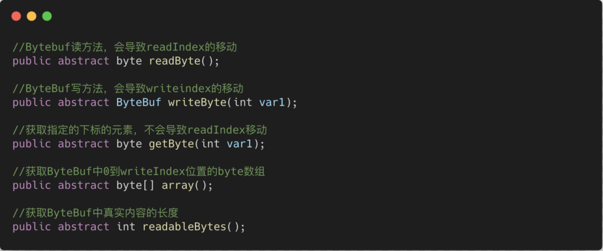

# Unpooled和ByteBuf类解析

## Unpooled类解析

Unpooled类为Netty专门为操作缓冲区(netty的数据容器ByteBuf)的工具类,经常被我们用来生成指定指定编码的ByteBuf。

常用方法：

## ByteBuf类解析

Netty专门提供的数据缓冲区类，类似于Nio中的ByteBuffer类，细节上有些不同。

在概念上，Bytebuf和ByteBuffer相同，均是一段连续的内存空间。

我们来看看ByteBuf和ByteBuffer的相同点和不同点：

首先来看不同点：

1）在创建方式上

2）在ByteBuffer中我们读写的位置使用postion记录，在ByteBuf中positon被拆分成readIndex和writeIndex表示不同操作时的下标。每次在使用不同的操作的时候，都需要filp一下，重置postion位置和limit位置。但是在Bytebuf中并不需要。

**也就是写入ByteBuf时，移动的是writeIndex（写入最多到Capacity位置），同理读取ByteBuf的时候，移动的是readIndex（读取最多到writeIndex位置）**

3）在ByteBuffer中我们标记的位置使用mark记录，在ByteBuf中mark也被拆分成markReadIndex和markWriteIndex表示不同操作时的不同标记下标位置。

相同点：均使用capacity表示Byte数组长度，可以使用ByteBuf的capacity方法获取到byte数组的长度。

.

说完不同点之后我们来看看ByteBuf的常用方法

## ByteBuf的常用方法解析：

