# netty异步任务队列

之前我们了解Netty服务模型的时候，在NioEventLoop线程中，除了Seletor组件之外，还存在TaskQueue组件，那么TaskQueue是个什么东西呢？

## **TaskQueue到底是个啥？**

TaskQueue本质上是一个任务队列，和Seletor是相互绑定的关系。当我们Seletor遇到处理时间长的任务的时候，此时无法处理新来的事件，那么就会把这个事件加入到任务队列TaskQueue中。

知道了TaskQueue是什么之后，我们来看看什么事件才会被放入到TaskQueue中

.

## **TaskQueue异步任务的三种事件来源**

1）**用户程序自定义的普通任务**

2）**用户自定义定时任务**

3）**非当前Reactor线程调用调用Channel的各种方法。**

**首先我们来为什么需要异步执行机制？然后再来说三种事件怎么实现。**

实验环境使用博客Netty实例之TCP实例的程序代码，当然也必须进行一下修局部改。

首先我们要修改服务器端自定义Handler类中的channelRead方法中的业务逻辑，不再是简单的打印一下客户端发来的信息，而是修改成一个业务逻辑处理时间较长的业务代码（使用Sleep休眠进行模拟）。

上图原Server代码，下图修改之后Server代码

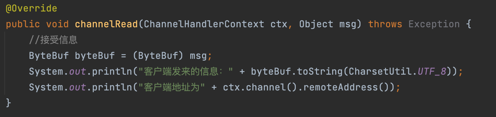

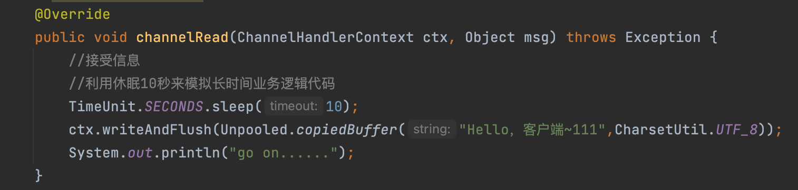

这个时候我们来进行程序运行，再查看结果。

初始状态图：左图服务器端，右图客户端

- 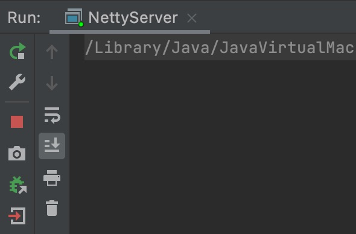
- 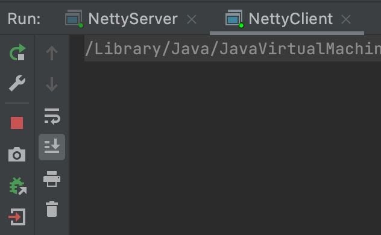

十秒之后图：左图服务器端，右图客户端

- 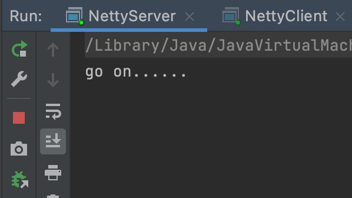
- 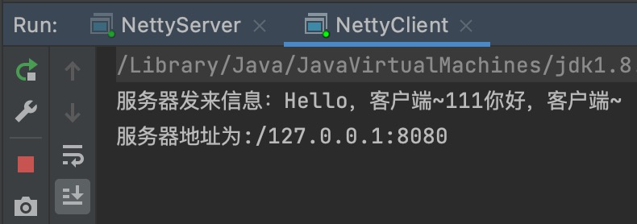

对比之后，可以知道服务器这边再同步阻塞处理，即当客户端发送信息到服务器端之后，服务器端Handler处理上进入了阻塞，等待休眠结束之后先回发给客户端”Hello ,客户端111″，才打印的go on之后再执行channelReadCompletel方法中的”你好，客户端～”信息的发送。

所以我们需要引入异步机制来解决这个问题。

.

.

## **情况一：用户程序自定义普通任务提交到TaskQueue中**

**把服务端的自定义Handler方法中长时间业务逻辑代码放入自定义的Runnable接口的Run方法中。把此Runnable对象放入ctx****.channel.eventLoop.execute(Runnale run)中**。如下图所示。

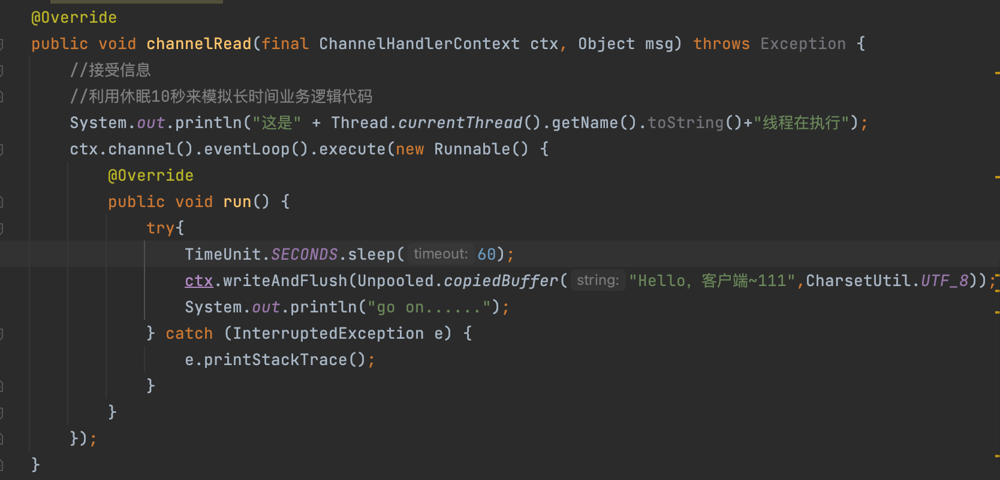

开始执行：左图服务器，后图客户端均启动状态

- 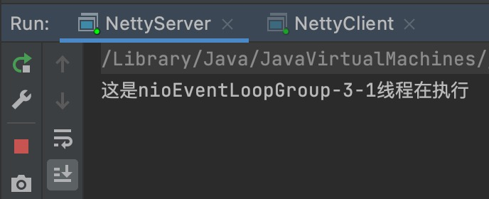
- 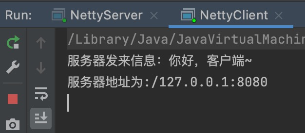

一分钟之后，左图左图服务器，后图客户端

- 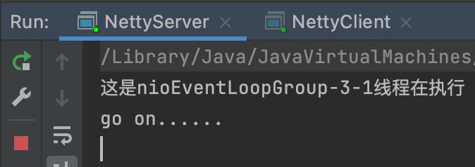
- 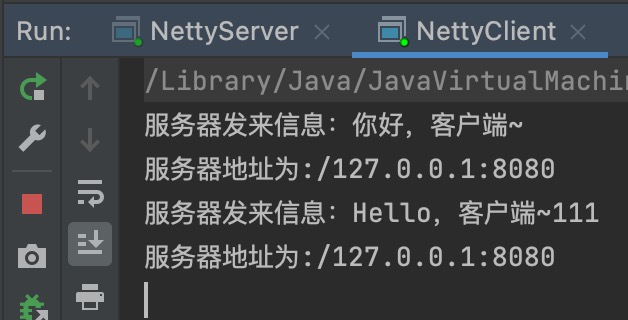

霍，这就有意思了，可以看到服务器端在接受到长时间业务时就把其生成一个新的任务放入了异步队列中，然后就算执行完了channelRead方法，就去执行channelReadCompleter方法了，导致出现了刚启动客户端，客户端就收到了channelReadCompleter中打印的你好,客户端。

之后等异步队列中的事件执行完之后，服务器端出现go on，客户端出现channelRead方法中长时间的业务逻辑代码结果Hello，客户端～111。

这个时候就有小伙伴要说了，这尼玛不就是在channelRead中又开了一个线程在执行嘛，那当线程数达到上限不一样堵？？？？？。

有这个问题说明你看的很认真，我们来测试一下，到底有没有新开线程来执行，我们在new Runnable代码块中加入下图代码：

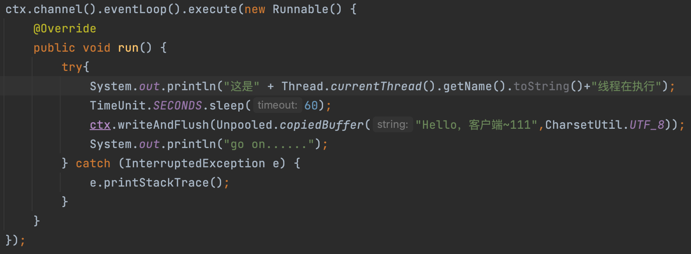

开始执行：左图服务器，后图客户端均启动状态

- 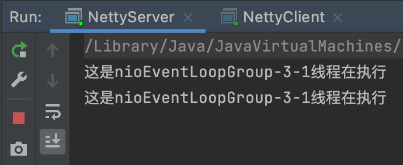
- 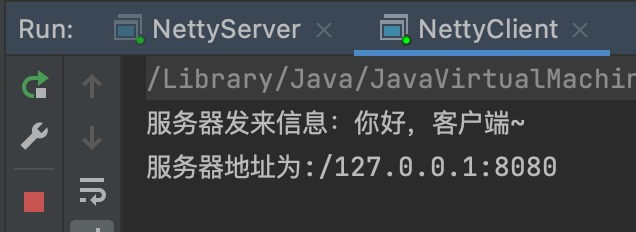

一分钟之后，左图左图服务器，后图客户端

- 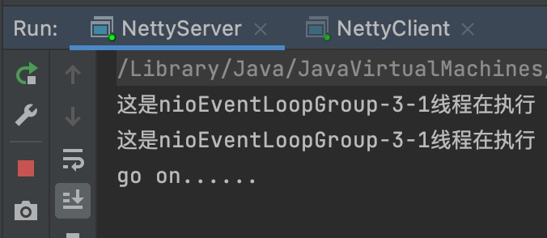
- 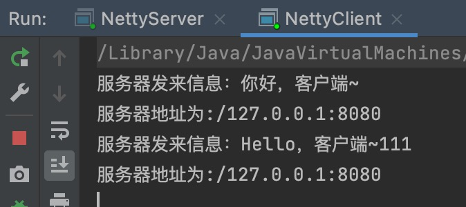

通过实例分析，我们发现并没有新建线程，而是通过因为异步处理处理长时间业务逻辑代码而直接完成的线程1后，再由线程1开始去完成长时间业务逻辑代码。

如果大家对线程池有底层了解的话，想必就会想到一种线程池工作模式和这个一模一样，即核心线程数==最大线程数的线程池=1。再Excutors工具类中newSingleThreadExecutor()方法生成的线程池就类似于这样的功能。

综上所述我们可以得到一个结论：

**NioEventLoop可以看成一个核心线程数==最大线程数=1的线程池。TaskQueue可以看成这个线程池中的阻塞任务队列。**

.

.

## **情况二：用户程序自定义定时任务提交到ScheduledTaskQueue中**

ScheduledTaskQueue任务队列和TaskQueue不同，此任务队列中存放延时执行的任务，比如延时5秒后再去执行（也就是当前NioEventLoop中的唯一线程先把channelRead和channelReadCompleter执行一遍，当然关键业务逻辑还是在新的Runnable中并加入到ScheduledTaskQueue任务队列）。但是现在当其执行完之后，并不会立刻去执行ScheduledTaskQueue任务队列中的延时任务，而是会等待延时条件满足之后再去做延时任务。

**这里有一个坑：也就是当channelRead中含有两个taskQueue任务队列任务和一个****ScheduledTaskQueue****任务队列的延时任务时，不管你延时的多早，都是先执行完两个taskQueue任务队列任务再去执行****ScheduledTaskQueue****任务队列，简直傻逼。**

**把服务端的自定义Handler方法中长时间业务逻辑代码放入自定义的Runnable接口的Run方法中。把此Runnable对象放入ctx.channel.eventLoop.scheduled(Runnale run，int time，Timeunti unit)中**。如下图所示。

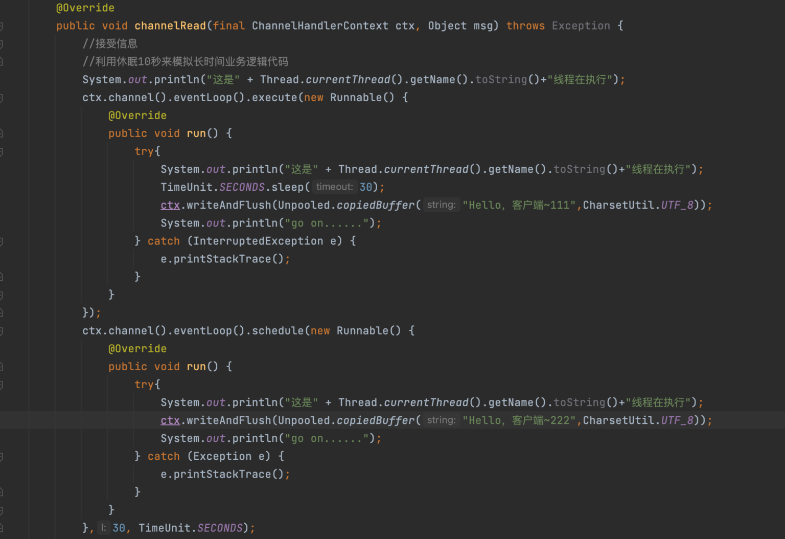

结果：

- 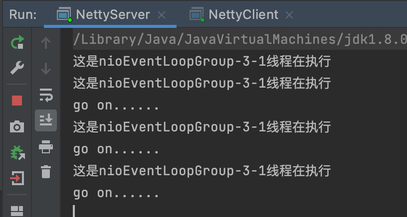
- 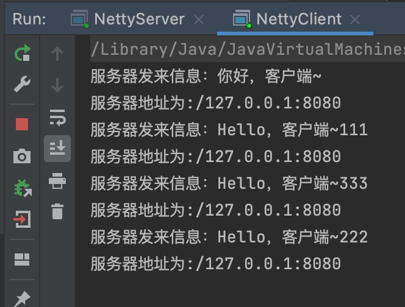

------

## **情况三：非当前Reactor线程调用调用Channel的各种方法自动加入到TaskQueue中。**

这个我们也来做个模拟：在自定义即设置BossGroup线程数为1，WorkerGroup线程数为4，我们创建5个线程客户端的执行情况。

在Handler方法中添加入线程显示代码

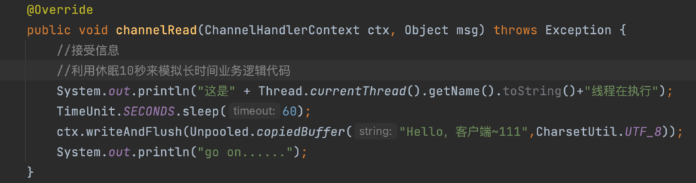

这是5个线程刚启动的时，服务器的状态，可以看到WorkerGroup中四个线程都在运行了。但是第五个进入到3-1线程中的TaskQueue队列中了。

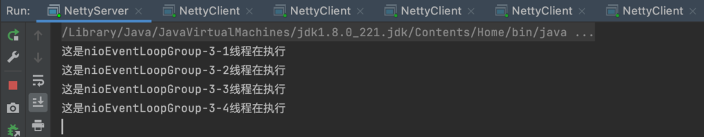

然后一分钟之后前四个各自业务逻辑处理结束之后的服务器状态：我们可以看到当第一个线程结束时，就会去执行其TaskQueue队列中的事件，也就是第五个客户端的事件。

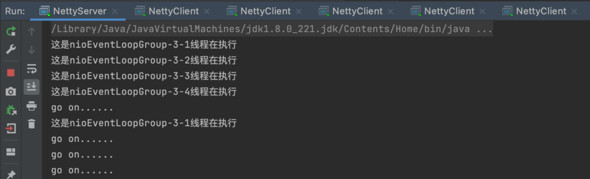

再次等待一分钟之后，第五个客户端事件处理结束

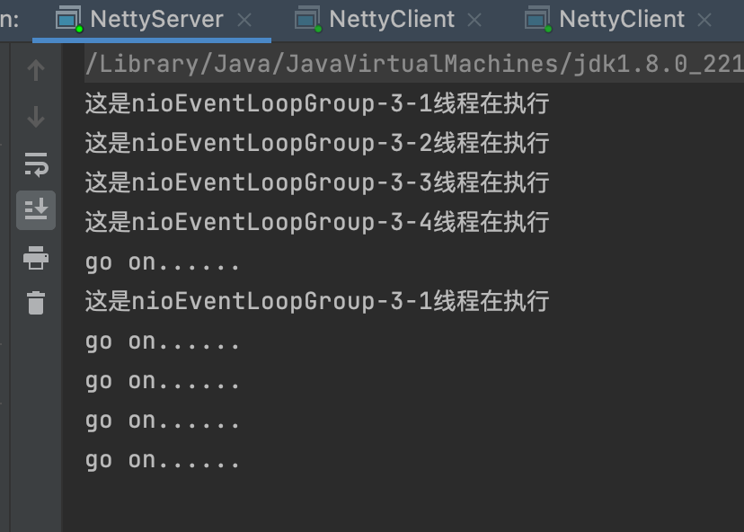

这只是解释场景，下面我们说一个第三种情况的实际业务场景。

即在推送系统的业务线程中，根据用户的标识，找到对应的channel应用，然后调用Writer类方法向该用户推送信息，就会进入到这种场景中。

**业务场景解析**：即我们在服务端进行服务器对象生成的时候，需要去初始化Socket Channel并绑定自定义handler的时候，可以在绑定之前把生成的Socket Channel放入到一个用户集合中，并设置用户标识。

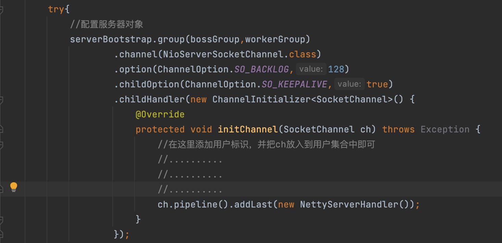

然后再独立的推送线程中，获取到该集合，然后通过不同的用户标识，去使用SocketChannel相应的writer类方法去完成推送。

由于每一个SocketChannel都是注册在不同的WorkerGroup下的NioEventLoop线程的Seletor上的，所以当这一个信息有大量的推送用户的时候，难免不会有一个NioEventLoop的Seletor上注册了成千上万个符合的SocketChannel。那么NioEventLoop个单线程的线程池怎么可能处理的过来呢，所以当然处理不来的通通先加入到其的TaskQueue中啦。