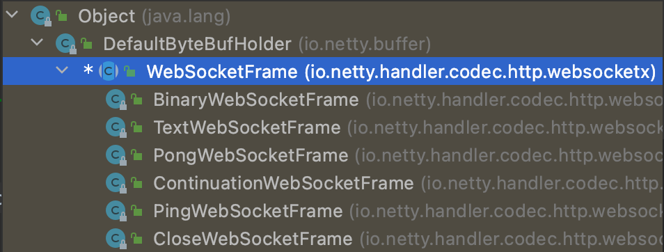
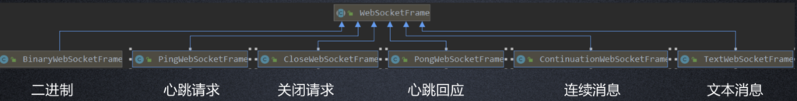
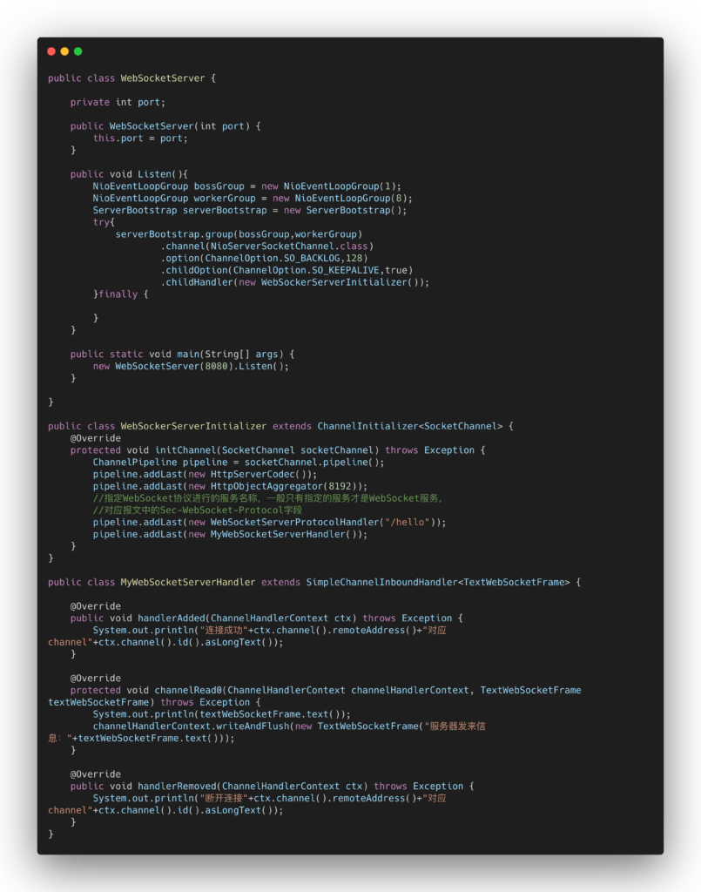
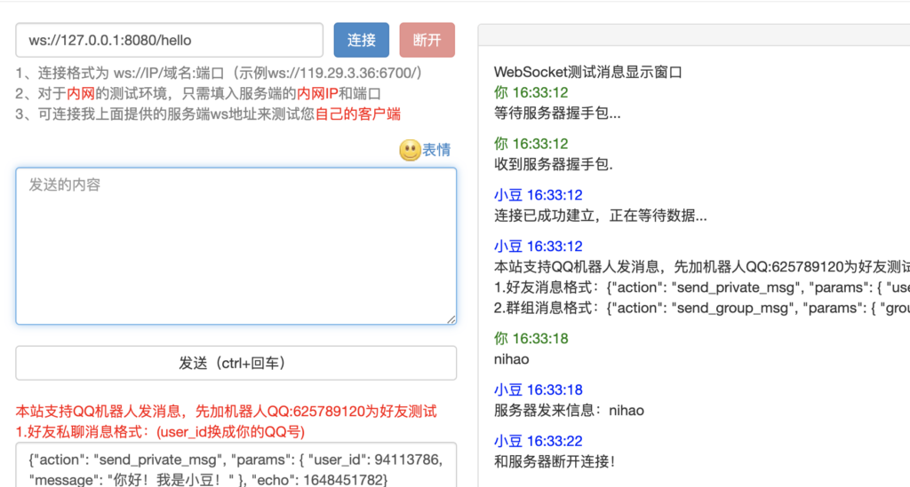

## WebSocketFrame类

一般我们在自定义Handler类的时候，一般把会返回信息类型作为自定义Handler的泛性，比如HTTP信息我们会使用HttpObject，TCP聊天我们会使用String，那么WebSocket协议信息我们使用什么呢？

**WebSocket协议，我们使用WebSocketFrame类的派生类来完成信息对象的封装。**

WebSocketFrame一共六大派生类：分别用来读取不同的数据

这六大类，分别对应了WebSocket协议传输数据的基本单位”帧”格式。

1）**BinaryWebSocketFrame**：对应二进制数据帧

2）**TextWebSocketFrame**：对应对应文本数据帧

3）**PongWebSocketFrame**：对应Pong心跳帧

4）**PingWebSocketFrame**：对应Ping帧，

5）**ContinuationWebSocketFrame**：对应连续的帧

6）**CloseWebSocketFrame**：对应连接关闭的帧

我们在这里使用textWebSocketFrame来获取文本帧

------

## 服务器实例代码：

结果：使用http://ws.douqq.com/可以完成对WebSocket协议的服务器进行测试

当我发起ws://localhsot:8080/hello请求的时候，WebSocket协议持久化通道建立成功，客户端收到服务端回发的连接成功（服务器中并没有写，客户端感知到的），当我们向其发送数据的时候，也成功回复了我们数据，当服务器关闭的时候，客户端也收到了服务器回发的信息（服务器中并没有写，客户端感知到的）。

------

------

------

## WebSocket实例和HTTP实例的区别

WebSocket实例可以在客户端没有Request的情况下，主动发送Response给客户端。Http实例不能。

但是有一种情况很误导人，也就是HTTP长连接下，推送信息业务。即当别的客户端给服务器发送了信息，然后服务器转发给了所有的HTTP长连接客户端。这一点是可以做到的。

所以聊天室等也可以使用HTTP长链接来实现，但是我们要知道什么是服务器自主给客户端发送信息。推送转发可不是服务器自主操作。

Http协议长连接，当服务器异常关闭时，客户端可收不到信息。WebSocket实例可以让我们实现真正的全双工，即服务端可以自主发送信息给客户端，而且客户端可以随时知道服务器端的情况，同理服务端也可以随时知道服务器端的情况。就是通过服务器自主发送信息给客户端才能做到的。

还有一点就是不稳定，HTTP长连接是基于keep-alive机制的，过了一定的时间就挂了。WebSocket得其中一遍挂了之后，然后等两边都挂了才关闭。