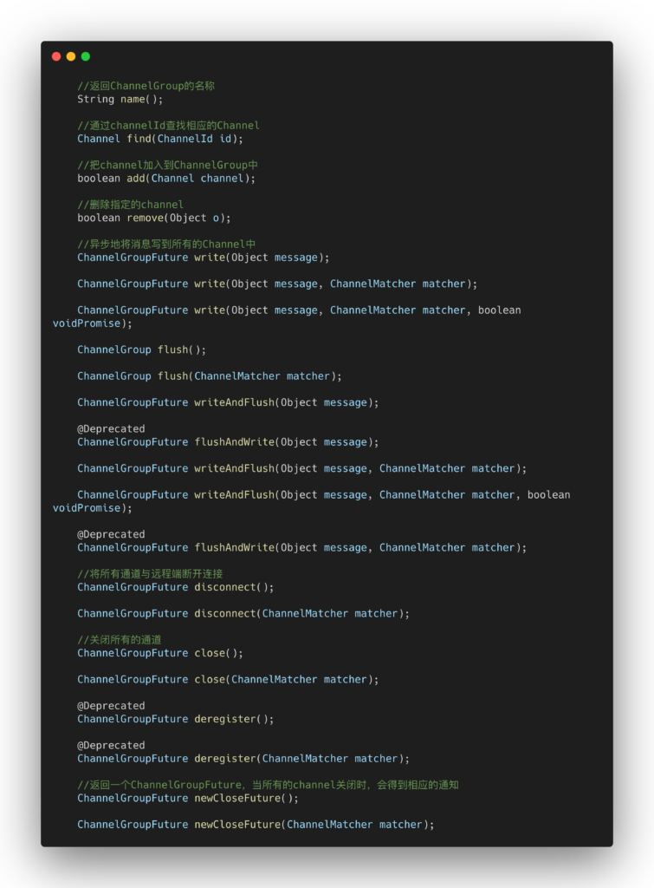
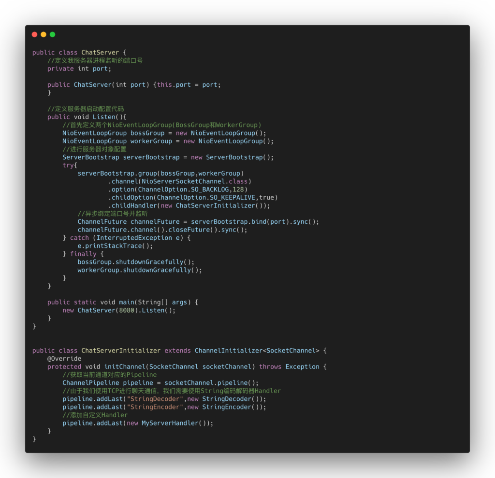
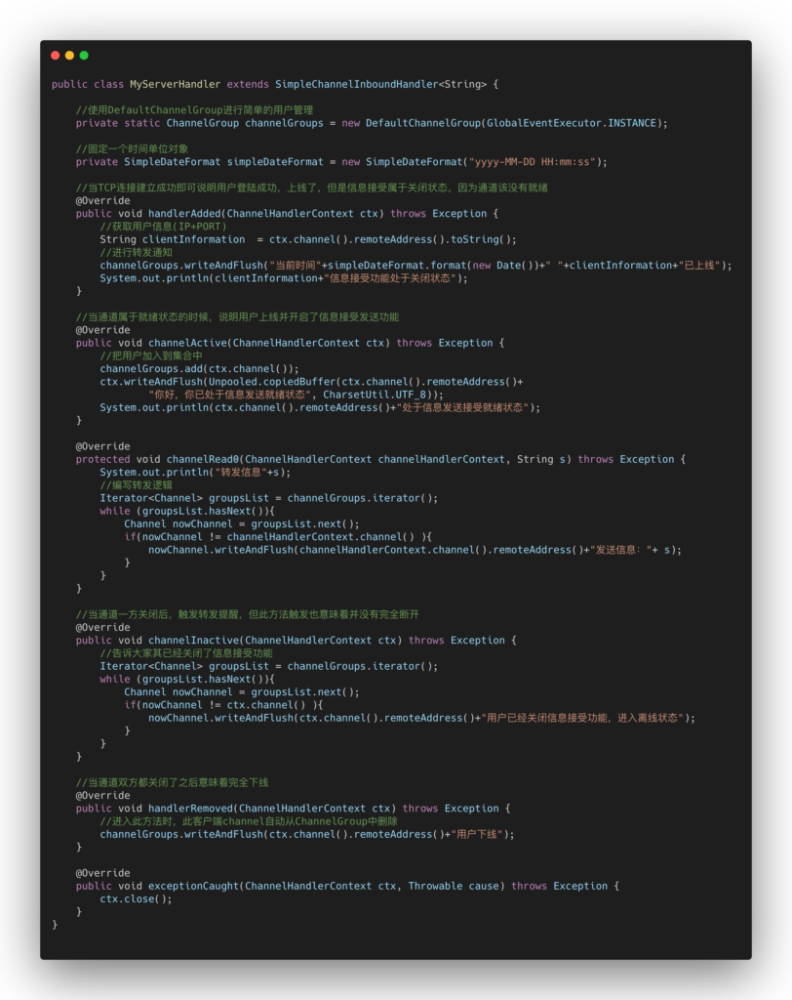
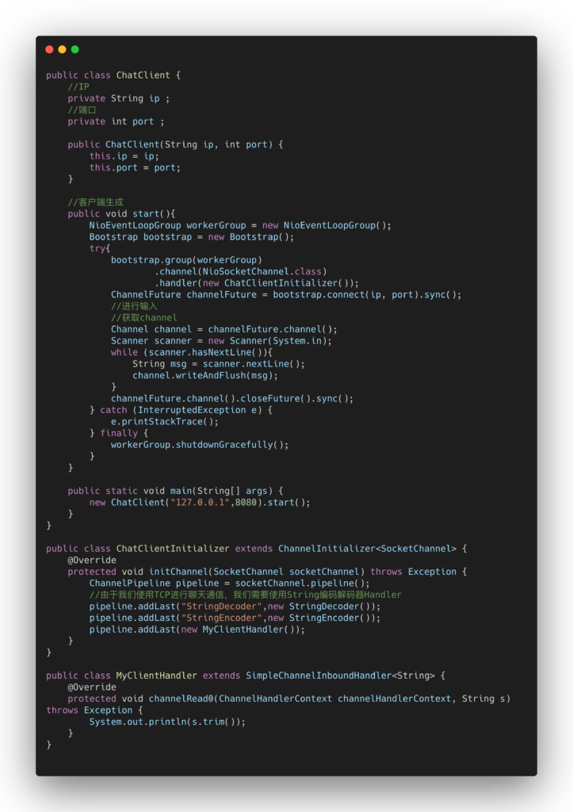

首先我们先来说说实现的思路。

## 聊天室群聊编程思路

1）服务器端我们需要保证有一个用户集合类，用以保存用户的信息和对应的客户端通道。当我们的服务器端监听到客户端连接时，并生成SocketChannel的时候把用户标识提取出来，并通知用户集合类中全部对象某用户标识上线，最后把对应的此通道变成用户对象，存入用户集合类中。

当我们客户端发送信息时，首先服务器接收信息后，遍历用户集合，给除自己之外的用户遍历发送一遍。当然是通过异步进行的。

当用户下线也即是通道发生异常的时候，转发通知其他用户，某用户标识已下线。

------

## 关键核心组件DefaultChannelGroup

netty是很为大家着想的，我们不需要自己去定义用户集合类以及用户信息类，也不用编写遍历转发的业务代码。netty通过提供DefaultChannelGroup帮我们封装了上述所有的操作。

所以DefaultChannelGroup到底是什么？

DefaultChannelGroup是netty内部提供用于保存通道的一个group集合类，用以保存通道对象以方便使用，并提供了大量相关操作的API。

我们来看看ChannelGroup提供的API到底有哪些？

------

缺点也明显，无法正确保证用户标识，想要功能多样化，那么必须使用自己定义的用户集合以及用户信息类。

## 服务器端代码

服务器代码分为三个类，服务器类ChatServer，绑定Handler类ChatServerInitializer类，自定义Handler类MyServerHandler。

------

## 客户端代码

客户端代码分为客户端类ChatClient类和ChatClientInitializer类,MyClientHandler类

------

## 私聊功能模块添加思路

想要在上面私聊的基础上实现私聊功能，那么我们就必须不再使用DefaultChannelGroup这个类，因为这个类虽然对我们的channel集合进行了封装了，方便了我们的使用，但是其中用户标识还是不足的，我们需要自己定义一个HashMap来管理我们的用户Channel和用户标识。

在逻辑上

1）我们会先登陆用户账号和密码，验证完成之后，把这段用户信息封装为User类，以User类做用户标识。

2）通过规定私聊格式：比如@某某：信息为通用私聊格式，通过某某这个信息去获取指定的User，然后用此用户标识去集合中寻找转发即可。