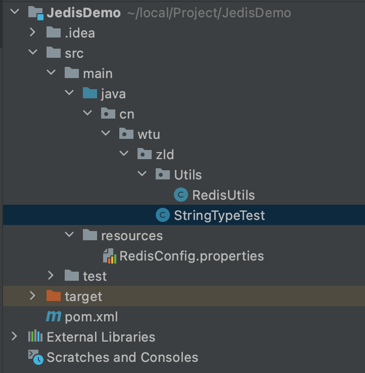

# Java连接Redis

## Jedis方式

在普通java项目中以及Spring项目中，推荐使用Jedis，配置相对简单。

pom坐标：

```
    <dependency>
      <groupId>redis.clients</groupId>
      <artifactId>jedis</artifactId>
      <version>2.5.0</version>
    </dependency>
```

先来看看整体目录结构如下所示：



配置文件RedisConfig.properties内容为：

```
#redis对外暴露的端口
spring.redis.host=******（换成你自己redisIP）
#redis对外暴露的端口号
spring.redis.port=****** (换成你自己redis端口)
#redis密码
spring.redis.password=********  （换成你自己redis密码）
#最长活动时间
spring.jedisPool.maxActive = 400
#最长连接等待时间
spring.jedisPool.maxWait = 10000
#最大空闲时间
spring.jedisPool.maxIdle = 40
```

配置类RedisUtils.java类内容为：

```
public class RedisUtils {

    private static JedisPool jedisPool;
    static {
        //我们要从配置文件中获取配置信息
        ResourceBundle redisConfig = ResourceBundle.getBundle("redisConfig");
        String host = redisConfig.getString("spring.redis.host");
        int port = Integer.parseInt(redisConfig.getString("spring.redis.port"));
        String pw = redisConfig.getString("spring.redis.password");
        int maxTotal = Integer.parseInt(redisConfig.getString("spring.jedisPool.maxActive"));
        int maxWait = Integer.parseInt(redisConfig.getString("spring.jedisPool.maxWait"));
        int maxIdle = Integer.parseInt(redisConfig.getString("spring.jedisPool.maxIdle"));
        JedisPoolConfig jedisPoolConfig = new JedisPoolConfig();
        jedisPoolConfig.setMaxTotal(maxTotal);
        jedisPoolConfig.setMaxWaitMillis(maxWait);
        jedisPoolConfig.setMinIdle(maxIdle);
        jedisPoolConfig.setTestOnReturn(true);
        jedisPoolConfig.setTestOnBorrow(true);
        jedisPool = new JedisPool(jedisPoolConfig,host,port,6000,pw);
    }

    public static JedisPool getJedisPool(){
        return jedisPool;
    }
}
```

测试类内容：

```
public class StringTypeTest {

    public void test(){
        //首先来连接我们的jedis
        JedisPool jedisPool = RedisUtils.getJedisPool();
        Jedis jedis = jedisPool.getResource();
        //如果有密码执行这一步
//        jedis.auth(passWord);
        //选定redis数据库
        jedis.select(0);
        //测试一：set指令
        jedis.set("name","CodeDan");
        //测试二：mset指令
        jedis.mset("userName","CodeDan","userPassword","passwd");
        //测试三：setnx指令
        jedis.setnx("name","zld");
        jedis.setnx("password","passwd");
    }
}
```

------

------

## Lettuce方式

由于Spring boot redis内置了lettuce的方式，所以在Spring boot中使用Lettuce方式。

pom坐标： **//注意：最好一起都是用起步依赖，要不boot版本和redis一致。**

```
<!-- https://mvnrepository.com/artifact/org.springframework.boot/spring-boot-starter-data-redis --><dependency>
     <groupId>org.springframework.boot</groupId>
     <artifactId>spring-boot-starter-data-redis</artifactId>
     <version>2.2.5.RELEASE</version>
</dependency>
```

先来看看整体Boot目录结构如下所示：


配置文件application.properites内容为：

```
#Redis所在IP地址
spring.redis.host=127.0.0.1
#Redis服务器连接端口
spring.redis.port=6379
#Redis服务器连接密码（默认为空）
spring.redis.password=
#连接池最大连接数（使用负值表示没有限制）
spring.redis.pool.max-active=400
#连接池最大阻塞等待时间（使用负值表示没有限制）
spring.redis.pool.max-wait=-1
#连接池中的最大空闲连接
spring.redis.pool.max-idle=40
#连接池中的最小空闲连接
spring.redis.pool.min-idle=0
#连接超时时间（毫秒）
spring.redis.timeout=30000
```

使用Lettuce方式的最关键的一个点就在于进行设置key和value的序列化方式，通过设置Redistemplate类来完成此序列化，所以我们要编写一个关于配置类搭配@Configuration标签来完成Redistemplate的配置并对其使用@Bean，交给IOC管理。

```
@Configuration
public class RedistemplateFactory {

    @Bean
    public RedisTemplate<String,Object> getRedisTemplate(RedisConnectionFactory redisConnectionFactory){
        //创建对象
        RedisTemplate<String,Object> redisTemplate = new RedisTemplate<>();
        //设置创建工厂
        redisTemplate.setConnectionFactory(redisConnectionFactory);
        //创建JSON格式序列化
        Jackson2JsonRedisSerializer<Object> jackson2JsonRedisSerializer =
                new Jackson2JsonRedisSerializer<Object>(Object.class);
        ObjectMapper objectMapper = new ObjectMapper();
        objectMapper.setVisibility(PropertyAccessor.ALL, JsonAutoDetect.Visibility.ANY);
        objectMapper.enableDefaultTyping(ObjectMapper.DefaultTyping.NON_FINAL);
        jackson2JsonRedisSerializer.setObjectMapper(objectMapper);
        //配置value的序列化为JSON格式
        redisTemplate.setValueSerializer(jackson2JsonRedisSerializer);
        return redisTemplate;
    }
}
```

**在使用上可以使用RedisTemplate和StringRedisTemplate两个类，其中RedisTemplate需要配置Value为Object对象时采用的序列化格式。但是StringRedisTemplate类默认为key和value为String类型。所以无需配置，所以我们如果存储Value不为一个对象的话，建议使用StringRedisTemplate类，比较快。**

而且上述两个类中均包含下述5种方法，可以获取到操作五大数据类型的类对象：

```
//操作字符串类型的类opsForValue
public ValueOperations<K,V> opsForValue();
//操作列表类型的类opsForList
public ValueOperations<K,V> opsForList();
//操作哈希类型的类opsForHash
public <HK,HV> HashOperations<K,HK,HV> opsForHash();
//操作集合类型的类opsForSet
public SetOperations<K,V> opsForSet();
//操作有序集合类型的类
public ZSetOperations<K,V> opsForZSet();
```

我们测试一下StringRedisTemplate类和RedisTemplate类：

```
@RestController
public class testController {

    @Autowired
    private StringRedisTemplate stringRedisTemplate;

    @Autowired
    private RedisTemplate<Object,Object> redisTemplate;

    @RequestMapping("/log")
    public String test(){

        ValueOperations<String, String> stringStringValueOperations = stringRedisTemplate.opsForValue();
        stringStringValueOperations.set("testBoot","1");

        redisTemplate.opsForValue().set("testObject","123");
        return "123";
    }
}
```

**扩展：这样写，容易让大家认为Redistemplate类有毛用，配置大半天，最后还是StringRedistemplate类方便，但是我们在使用Redis做缓存的时候，我们缓存value多半都是Java对象，而不是单一的值，所以当实际开发环境中，还是以Redistemplate类为主。**