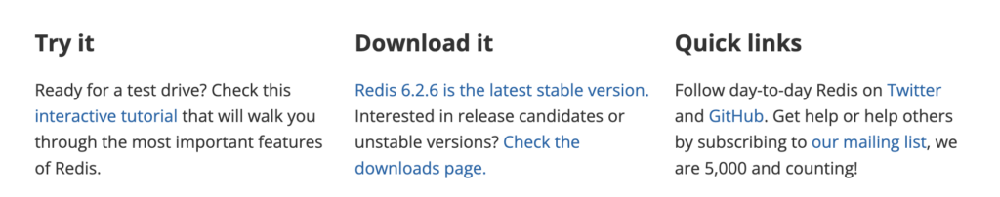
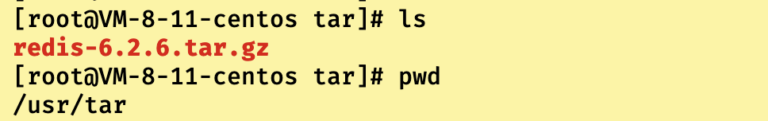
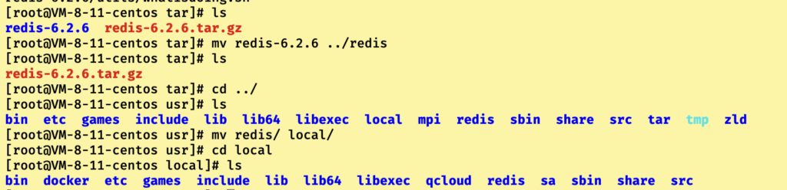
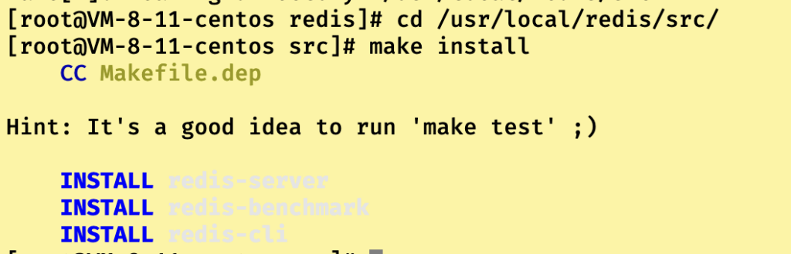
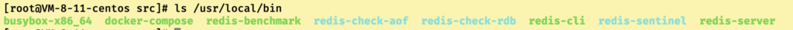
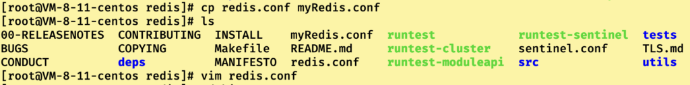
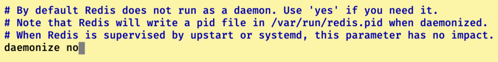
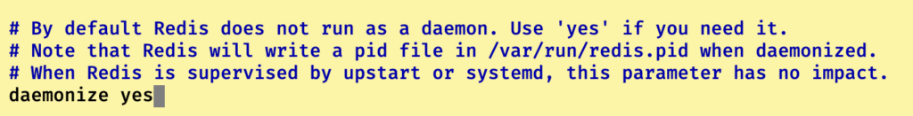
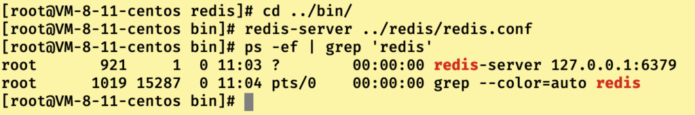
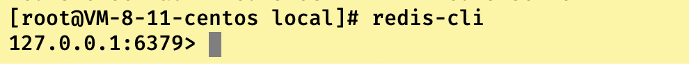

## 安装流程

1）首先去redis.io中下载最新的redis6版本，点击redis6.2.6 is the lastest statble vesion即可开始tar.gz包的下载。



2）传输下载的tar.gz包到指定服务器的目录下，笔者这里传输到远程服务器中的usr/tar目录下



3）可选操作，安装最新的gcc编译器，因为redis是用c写的，很多都需要c的环境才能运行（一般云服务器都自带gcc，虚拟机可以在选配的时候加入gcc）

4）进行下述解压指令操作，得到解压之后的文件夹redis-6.2.6后，使用mv指令把redis-6.2.6文件夹改名并移动到上层usr/local的目录下

```
tar -zxvf redis-6.2.6.tar.gz
```



5）进入redis目录，后执行下述指令编译一下redis（如果没有gcc编译器，此步骤会出错）

```
cd redis
make
```


6）编译完成后，会给出需要前往的目录，跳转之后执行make install方法进行redis的安装

```
cd /usr/local/redis/src
make install
```



7）安装成功后，默认安装到/usr/local/bin中,我们可以在该目录下看到redis的指令



- 简介一下这些指令的作用，看看就行（有个印象就行，后面博客写了才知道干嘛的）
  - **redis-benchmark**：redis的性能测试工具
  - **redis-check-aof**：修复有问题的aof文件
  - **redis-check-rdb**：修复有问题的rdb文件
  - **redis-sentinel**：redis集群指令
  - **redis-server**：redis服务器启动指令
  - **redis-cli**：redis客户端指令，也就是操作入口指令

8）启动redis服务器（推荐方式）

```
//修改redis.conf文件中的daemonize no改成yes后启动。（建议先使用cp指令进行一个备份）
cp redis.conf myRedis.conf
vim redis.conf
cd bin
//启动
redis-server ../redis.conf
//检查是否启动
ps -ef | grep 'redis'
```









9）启动redis客户端,这只是最简单的启动，之后还可以设置密码进行启动

```
redis-cli
```



------

------

## 远程连接文件配置

根据我们安装博客的安装方式，最后redis的配置文件redis.conf位于/usr/local/redis目录下，想要设置远程连接，我们要修改几处配置。

1）首先关闭已经运行的redis-server

```
//使用ps指令查看当前redis运行进程
ps -ef | grep 'redis'
//发现进程ID之后，使用kill指令杀死进程
kill -9 进程ID
```


2）修改配置文件，把bind 127.0.0.1注释掉，然后找到requirepass字段，删除其后所跟字符串，换成自己的密码。

```
#bind 127.0.0.1
requirepass 你自己的密码
```

3）重启Redis服务,在redis目录下

```
redis-server redis.conf
```

4）开启防火墙，并设置开放端口后，重启防火墙（如果是云服务器还要配置一下安全组）

```
//开启防火墙
systemctl start firewalld
//开启6379端口
firewall-cmd --zone=public --add-port=3679/tcp --permanent
//重启防火墙
firewall-cmd --reload
```