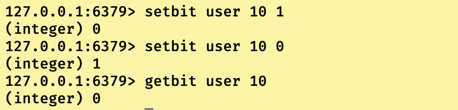
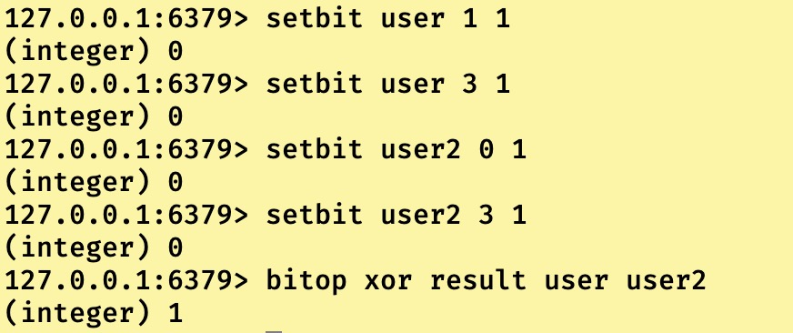

即在Redis6中新增三大数据类型，分别是Bitmap，HyperLogLog以及Geospatial类型。

我们依次来看看这新增的三大数据类型都是干什么的

## BitMap数据类型

**BitMap类型，本质上就是把存储字符串中的每一个单个字符转化为对应的二进制码段并将多个完整的二进制码段按照原来的顺序进行存储。**

举个例子，我们要存储”abc”，那么最后在Redis底层数据结构中就是使用embstr编码的简单动态字符串进行存储三个字符，分别是’a’,’b’,’c’。

如果把”abc”交给BitMap存储，那么其先把’a’,”b,’c’转化为对应的二进制码：a对应01100001，b对应0110010,c对应01100011编码。那么**在底层就是统一采用raw编码类型的简单动态字符串存储结构进行存储多个字符**，分别是

**‘0’,’1′,’1′,’0′,’0′,’0′,’0′,’1′, ‘0’,’1′,’1′,’0′,’0′,’0′,’1′,’0′, ‘0’,’1′,’1′,’0′,’0′,’0′,’1′,’1′,**

多个空格只是为了好看，真实存储并没有空格。

**所以BitMap本身并不是一种数据类型，本质上它还是字符串类型，所以最大长度依然为512MB。但是由于把字符转化为了二进制码后进行存储，BitMap存储的字符串可以进行位级别的操作。**

------

------

## BitMap常用指令以及实例使用

```
//设置指定key下BitMaps数据类型存储数据对应offset上的0或者1，offset对应数组下标index，value可以是0，也可以是1.返回修改之前的值。
127.0.0.1:6379> setbit key offset value
//获取指定key下BitMaps数据类型存储数据对应offset上的value，哪怕没有初始化的位置，也是返回0
127.0.0.1:6379> getbit key offset
```

关于setbit有个注意点，其内部的存储结构并不是你offset = 1000那就真在的数组的下标为1000的位置，这样数组初始化时间太长，甚至可能会阻塞。所以一般都是用特定的数去减，然后获取一个较小的offset进行存储，然后获取的时候也是同理获取到。



------

```
//获取指定key下BitMaps数据类型存储数据对应strat字节到end字节之间有多少bit被置为1.记住字节和byte的区别！！！，如果end = -1，说明到最后一个字节，如果-2就是到最后倒数第二个字节。
127.0.0.1:6379> bitcount key start end
```

首先我们bitMaps存储是依靠bit的偏移量，一个数组项代表一个bit，那么0～7就是第一个字节，8～15就是第二个字节。如果我们存储的bitMaps为0100 0000 0000 0000 1000 0000,那么bitcount key 0 -1的结果就是2，bitcount key 1 2的结果为1。因为这段bitMaps用字节标识就是0，1，2字节。


------

```
//可以对多个bitMaps数据类型进行交集and(与)，并集or(或)，not(非)，xor(异或)操作，并将结果保存在destkey中
127.0.0.1:6379> bitop and(or/not/xor) destkey [key.....]
```

环境：0100 0000 and 1000 0000结果 0000 0000 (结果使用可视化工具查看)


环境：0100 0000 or 1000 0000结果 1100 0000


环境：0100 0000 not 结果 1011 1111


环境：0101 0000 xor 1001 0000结果1100 0000




------

------

## BitMaps类型实例运用

我们来对bitmaps类型进行实例使用，加深印象，环境是这样的，我们需要存储当天那些用户访问过我的博客，使用用户id来进行存储。如果每一个用户id都封装成对象放入集合中，在大访问量下，太占服务器性能了，我们考虑使用redis的bitMaps类型来实现这个功能。

1）首先我们要在今天也就是20211205号，进行一下5个客户端访问，用户id分别为1,6,9,20,35。


2）获取一下用户id为1，6，9的有没有访问我的博客。


3）获取今天我博客的总访问量


4）获取一下20211204号和20211205号两天一共有多少人访问(也可以说是获取一下202111205号或者20211204号只要访问过的博客的人总数)


5）获取一下202111205号和20211204号都访问过博客的人总数。


------

------

## HyperLogLog数据类型

我们先了解一下这个这个类型的作用，正常来说我们在进行数据统计的时候，比如网站的访问量之类的统计，可以使用incr或者incrby来完成，但是有一个缺陷，当我们优化统计访问量的时候要求一个独立IP不管访问多少次均算一次等情况的时候**（基数问题：去重计数问题）**使用incy和incrby功能就不够了。

一般来说如果访问数量在数据库中统计的话，那么就可以使用日期字段和独立IP字段进行distinct配合count操作进行统计。**（当访问表数据超过百万的时候，在不进行索引优化的情况下，性能不太好）**

但是如果是存储在redis中的话，那该怎么解决这个问题呢？

我们可以用特殊的方式得到独立IP字段的映射值，然后使用bitMaps数据类型进行统计存储也可以实现。

但是这样缺陷也很明显，映射算法编写难度和bitMaps在不规范的大数据下数组长度问题**(很可能映射值特别大，导致数组分配的时候进入阻塞)。**

**上述的两种方法都是使用存储空间中已经存储的数据来进行去重之后再统计的，所以普遍会有在海量数据下内存消耗过大的问题或者引发的问题。**

那么有没有方法不占这么大内存用以存储，依然能解决基数问题呢？

redis提供了HyperLogLog类型来解决这个问题。

**首先HyperLogLog类型是基于基数算法的方式来进行运作的**

那什么是基数呢，基数定义为用于表示事物个数的数。假设现在有一个集合{1,2,5,5,6,8,8}，那么经过去重处理之后为{1,2,4,5,8}，那么其基数就是5，也就是去重之后的集合长度也可以说是元素个数。

知道基数之后，我们就可以来说说这个HyperLogLog到底是怎么运作的了

1）**HyperLogLog数据类型不会进行数据的存储，仅仅依靠每次的输入来计算结果也就是基数**。官方说法就是哪怕输入的数量特别大，HyperLogLog也只是使用固定的大小进行计算基数。**但是缺点也就出来了，根据HyperLogog类型得不到输入过的数据记录以及其数据本身。**

2）**一个HyperLogLog数据类型的键(key)只需要花费12KB内存就可以计算2^64次方个不同元素的基数**。**所以内存占用低，是其最大优点和特点。**

------

------

## HyperLogLog类型常用指令

```
//输入指定的元素到HyperLogLog中,如果基数发生变化，即输入的值是一个新值，返回integer 1，如果基数无变化，也就是输入的值是重复值，返回integr 0
127.0.0.1:6379> pfadd key value[value....]
```


------

```
//获取指定HyperLogLog类型的key的基数值,可以进行多个key的同时计算，也就是把多个key在计算成一个统一的基数
127.0.0.1:6379> pfcount key[key...]
```


------

```
//算是pfcount优化，可以将多个HLL(HyperLogLog)的key进行合并基数计算之后在赋给一个全新的HLL对应的key
127.0.0.1:6379> pfmerge resultKey Sourcekey[Sourcekey...]
```


------

------

## Geoospatial数据类型简介

这个数据类型通俗来说就是地理上表示经纬度相似的数据类型，**是一个由经纬度组成的二维坐标系的坐标值作为其Geo的数据类型。**

要明白这个类型，首先得明白经纬度的概念，这大家去百度学习一下，这种基础学科的定义百科可专业多了。

```
//添加一个城市的Geospatial类型数据，longitude为经度，latitude为纬度，name为城市名称
127.0.0.1:6379> geoadd key longitude latitude name [longitude latitude name...]
```

**实例**

“上海的经纬度是东经120°52′-122°12′,北纬30°40′-31°53′之间。”我们假设上海经度就为120.52，纬度为30.40。

“武汉位于东经113°41′-115°05′、北纬29°58′-31°22′之间。我们假设武汉经度为113.41，纬度为29.58

“北京市中心位置的经纬度为东经116°20′、北纬39°56′。我们假设北京经度为116.20，纬度为39.56


**注意：Redis的经纬度类型Geospatial中，经度范围是-180到180，纬度范围是-85到85.**

------

```
//获取指定key以及城市名称对应的经纬度
127.0.0.1:6379> geopos key name[name..]
```


------

```
//通过指定key下两个不同的城市名称获取到两个城市的直线距离，底层通过经纬度算法计算,默认单位是m（米），可以指定km(千米),mi（英里），ft(英尺)
127.0.0.1:6379> geodist key name1 name2[m|km|mi|ft]
```


------

```
//设定一个经纬度以及一个半经值，以经纬度为圆心，以半经化圆。显示指定key在圆内的城市名称
127.0.0.1:6379> georadius key longitude latitude radius [m|km|mi|ft]
```