# Redis主从复制及哨兵机制

当我们的Redis服务器只有一台的时候，一旦项目上线，Redis服务器因为某些异常原因宕机，那么带来的就是整个服务的瘫痪。这种情况是不被允许的。

------

## Redis主从复制机制

**即Redis提供的缓解Redis服务器压力以及提高容灾的机制**，通过配置多台Redis服务器，构建一个主(Master)Redis服务器和多个从(Slaver)Redis服务器的服务结构。

其中Master服务器只负责Redis客户端发来的写请求，Slaver服务器分担负责客户端发来的读请求。如下图所示

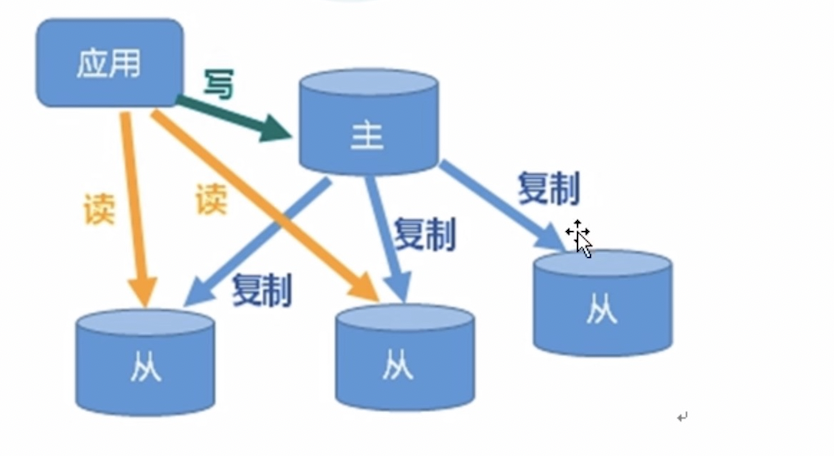

我们发现一旦Master服务器接收到Redis客户端的写请求，那么除了处理数据，还会把此处理后的数据复制到全部Slaver服务器上。

那么这个复制过程是怎么实现的？

------

## Master与Slaver之间的数据拷贝

Redis采用两种方式来完成Master与Slaver之间的数据拷贝，**分别是全复制和增量复制**。

### 全复制

一般作用在**从服务器申请连接主服务器成功**以及**从服务器(没有开启持久化)宕机之后重连主服务器时发生**(从服务器宕机之后会恢复成主服务器，需要再次连接)。

原理：

1. Slaver服务器连接上Master服务器之后，Slaver服务器向master服务器发送一个sync指令，告诉Master服务器需要进行数据同步。
2. 当Master服务器接受到Sync指令之后就会开始进行RDB持久化过程(相当于直接在后台执行了bgsave指令)，然后把生成的rdb文件和指令缓存区中的指令集合发送给从服务器。**(此期间Master服务器接受到客户端写请求会被放入指令缓冲区)**
3. 从服务器拿到RDB文件以及指令集合之后进行读取即可。

**为什么需要在数据同步进行的RDB持久化期间，把Redis主进程的接受到的写指令缓存起来？**

因为我们在进行RDB持久化的时候，Redis主进程还是可以响应Redis客户端请求的，也就是最后生成的RDB文件中数据和当前Mastet服务器中最新数据极有可能会不一致，如果Slaver服务器仅仅读取这个RDB文件的话，数据的一致性得不到保证。

------

### 增量复制

一般作用在**主从服务器连接成功之后的指令交互**以及**从服务器(开启持久化)宕机之后重连主服务器时**发生。

原理：

1. 当主从服务器进行全复制的时候，会把此期间Redis主服务器收到的最新指令放到一个缓存队列中，并记录每个指令的偏移量。
2. 在主从服务器完成连接之后，每次主服务器接收到新的写请求的时候，还会把这个写请求存储到缓存队列中，并更新其中的最新偏移量。
3. 每次主从服务器指令的交互就会把最新偏移量的指令发送给从服务器，完成主从服务器之间的数据交互。
4. 从服务器还记录了最新自己接受到主服务器指令的偏移量。用以每次交互对比以及宕机恢复。
5. 一旦开启了持久化的从服务器宕机再次向主服务器发起重连请求之后，不会进入到全复制，而是发送给宕机时自己记录的宕机时最后接受到的指令偏移量，主服务器收到这个偏移量之后就会去查看自己的缓存指令中最新的偏移量，把之间差值范围内的指令重新发送给从服务器，完成从服务器数据的恢复。

------

------

## Redis主从复制如何开启

配置Redis主从复制关键在于**配置文件的配置**和**redis-cli中指令的使用**

### 配置文件的配置(主要是主从复制的配置，其他的配置比如持久化等等看需求配置)

**主要是从机配置，主机基本不用配置**

在配置文件中检索REPLICATION关键字，即可出来主从复制配置区域

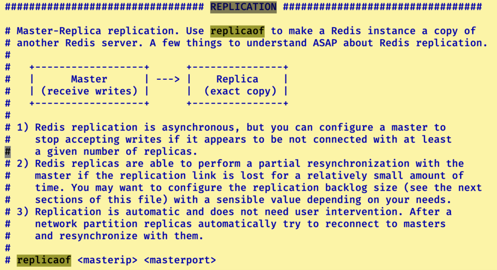

```
//配置在从机，replicaof字段，第一个参数IP，第二个参数port（用二元组来标识主服务器Redis进程）
replicaof IP PORT 
//如果主机配置了密码，那么从机得配置上主机的密码
masterauth <master-password>
```

------

### redis-cli指令使用

```
//查看当前主机/从机中主从复制连接信息
127.0.0.1:6379> info replication
//如果不在配置文件中配置relicaof字段，那么就使用slaveof IP PORT指令（哨兵模式下，推荐使用）
127.0.0.1:6379> slaveof IP PORT
//删除本机中的主从复制信息
127.0.0.1:6379> slaveof no one
```

------

------

## 主从复制实例Demo

环境介绍：一主两从，主Redis服务器占用6370端口，两个从服务器分别占用6371端口和6372端口。

端口6371从服务器配置内容：

```
//配置从服务器占用端口
port 6371
//配置从服务器跟随的主服务器IP和PORT
replicaof 127.0.0.1 6370
//配置此从服务器跟随的主服务器密码[可选配]
masterauth ***********
//配置持久化aof文件名称
appendfilename "appendonly6371.aof"
//配置持久化rdb文件名称
dbfilename dump6371.rdb
//修改pid日志文件名称为当前redis端口号
pidfile /var/run/redis_6371.pid
```

------

端口6372从服务器配置内容：

```
//配置从服务器占用端口
port 6372
//配置从服务器跟随的主服务器IP和PORT
replicaof 127.0.0.1 6370
//配置此从服务器跟随的主服务器密码[可选配]
masterauth ***********
//配置持久化aof文件名称
appendfilename "appendonly6372.aof"
//配置持久化rdb文件名称
dbfilename dump6372.rdb
//修改pid日志文件名称为当前redis端口号
pidfile /var/run/redis_6372.pid
```

------

我们来看看两台从服务器的主从信息和当前所拥有的所有键：（左图为6371，右图为6372）

- 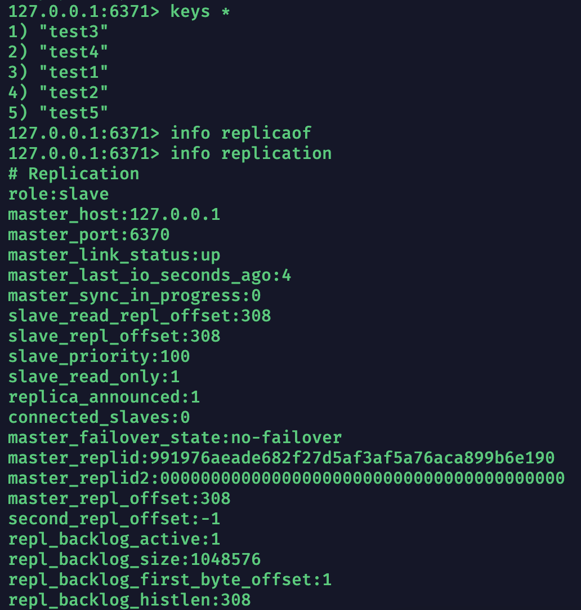
- 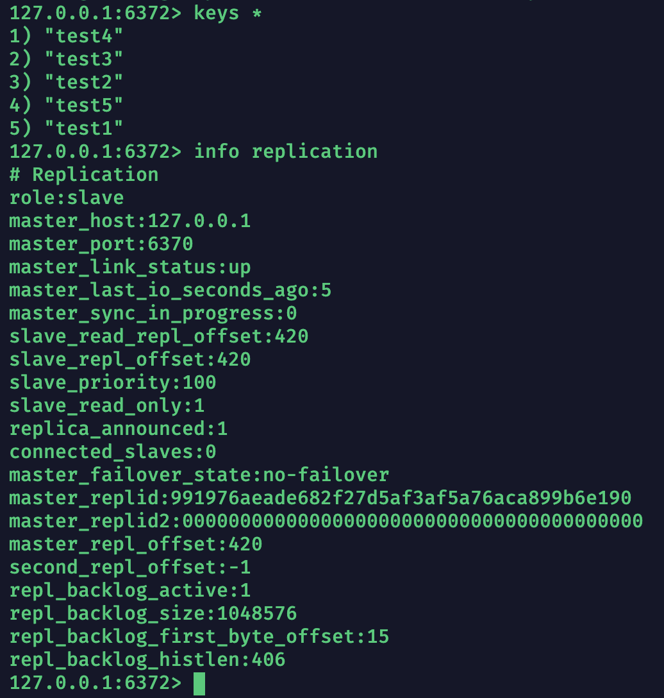

我们再看看主服务器的主从信息：

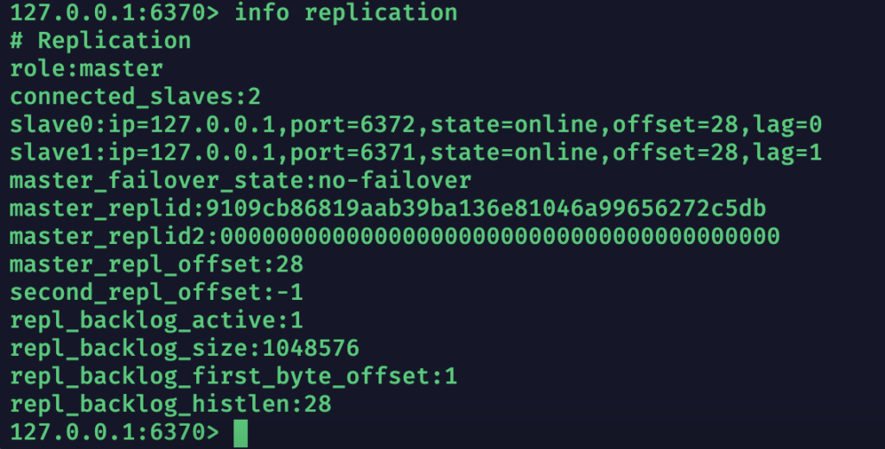


------

------

## 主从复制主服务器宕机手动处理Demo

我们先来梳理一下主服务器宕机之后我们处理的流程：

1. 当主服务器宕机之后，我们需要选取一个从服务器作为主服务器。
2. 我们需要把选定的从服务器停止服务，如何修改其配置文件中配置的从服务器信息(注释掉)
3. 把其他所有从服务器服务停止，把他们对应的配置文件中配置的跟随主服务器配置信息修改成新的主服务器信息
4. 重启所有redis服务

首先我们来手动关闭redis主服务器，使用kill指令

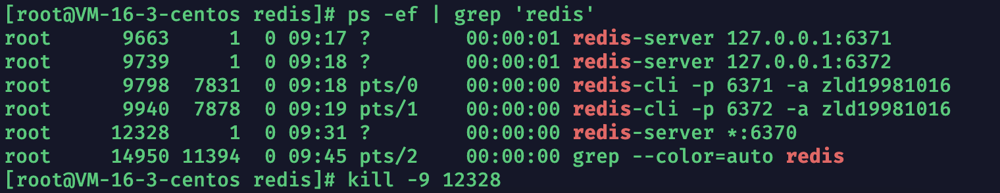

通过6371从服务器查看主从复制状态信息，发现此时主服务器宕机，redis对外不在提供服务，我们得选定一个从服务器重新作为主服务器(6371)

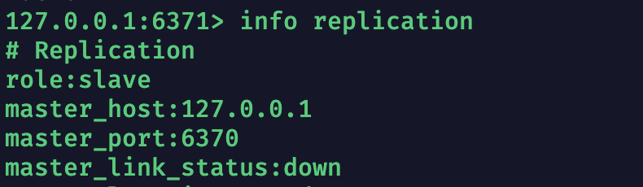

注释掉6371从服务器中追随原主服务器的信息

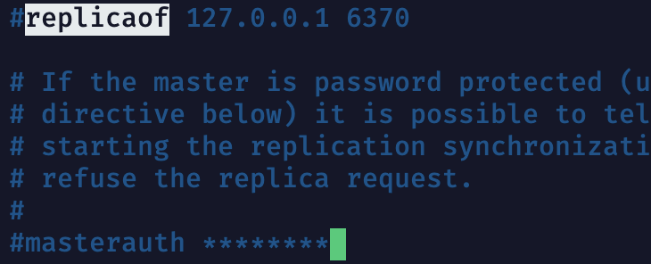

修改另一台6372从服务器配置信息，让其追随6371主服务器

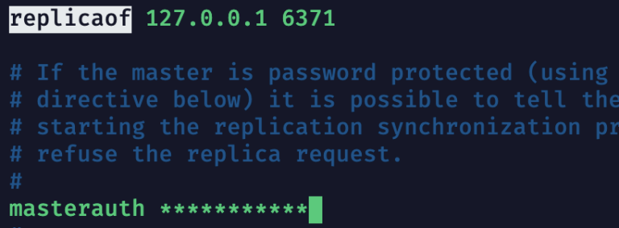

重启两个redis服务器，查看其分别显示的主从复制信息(左图：新主服务器6371，右图从服务器6372)

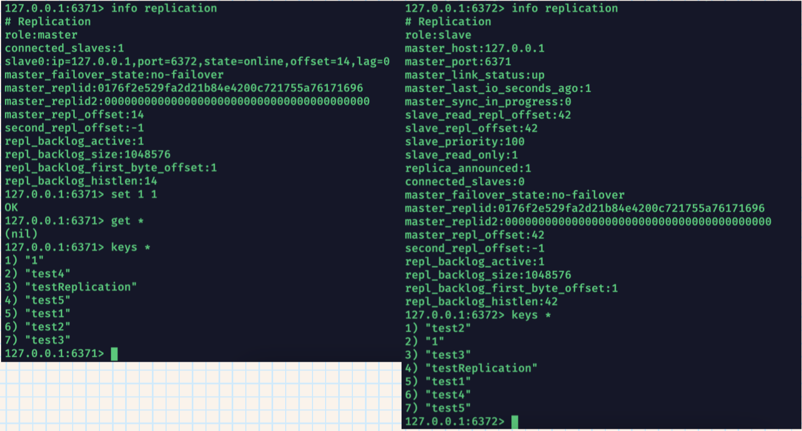

**做完实验之后，记得把之前的6370主服务器上线，并配置好作为从服务器加入到6371主服务器的主从结构中，待会需要作为进行哨兵实例演示环境。**

------

------

## Redis主从复制之哨兵机制

在上述**主从复制主服务器宕机手动处理Demo**中，我们模拟主数据库宕机之后，通过手动配置从数据库，选择一个从数据库转变为主数据库，继续保持正常运行，充分发挥了从数据库的数据冗余和读写分离特征。

但是手动配置如果在运行环境中，不仅要下线服务，还有消耗人力，这时，哨兵机制就可以解决这个问题。

**哨兵是监视多个redis数据库，如果一个主数据库宕机之后，哨兵会自动选取一个从数据库，自动配置让其转化为主数据库。**

------

### 哨兵的运行原理

哨兵的运行：当一个被哨兵监视的主数据库宕机之后，哨兵会认为这个主服务器**主观下线（即单个哨兵认为数据库宕机）**，因为哨兵是以向主服务器发送信息然后主服务器回应来做监视的**(心跳检测)**，所以认为主观下线的哨兵会告诉别的哨兵，这个数据库宕机了，然后别的哨兵就向这个主服务器进行心跳检测，如果得不到回应，那么第二个哨兵也认为其主观下线，当这样的认为的哨兵达到指定阈值之后，哨兵们就开始投票，选出一个新的主数据库。

**注意：单哨兵的话，不需要通知别的哨兵，只要他主观认为这个主服务器宕机了，那么就可以由其开始挑选新的主数据库了。**

------

------

## 开启哨兵所需要的配置信息

首先哨兵是一个独立的配置文件，**名称为sentinel.conf的文件，名称绝对不能错！！！！！！**

**而且不再使用Redis实例配置文件中的replicaof字段(注释掉)来配置主从复制(masterauth还是可以配置的)，而是使用redis-cli中slaveof指令来指定真实IP，不在使用127.0.0.1**。

我们所有关于哨兵的配置均在sentinel.conf文件中

```
//哨兵配置最关键的一段配置，关于哨兵还有很多配置，以后学习使用到再整理
sentinel monitor 主服务器别名 真实IP PORT 投票阈值
//如果Redis实例配置了密码，那么一定要主从密码一致，因为在哨兵配置这里要登记
sentinel auth-pass 主服务器别名 *****
```

使用redis-sentinel 配置文件路径 启动哨兵

```
redis-sentinel sentinel.conf
```

通过启动提醒信息，我们可以获取到哨兵的端口和进程PID以及哨兵监控主服务器的信息和主服务器旗下所有从服务器信息，如下图所示

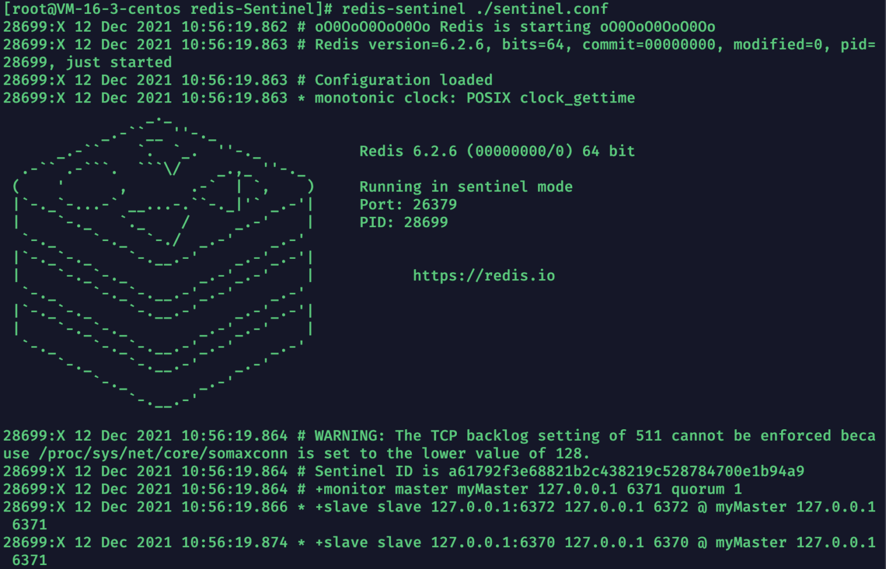


------

------

## 哨兵开启实例Demo

### 单哨兵结构实例

来看看现在哨兵开启的环境：

26379端口开启哨兵，6371为主服务器环境，6371，6370为从服务器环境**(使用slaveof IP PORT指令建立主从，来看看现在哨兵开启的环境：\**(下图为了不暴露IP地址，所以依然采用127.0.0.1，读者尝试就换成真实IP即可)\**)**

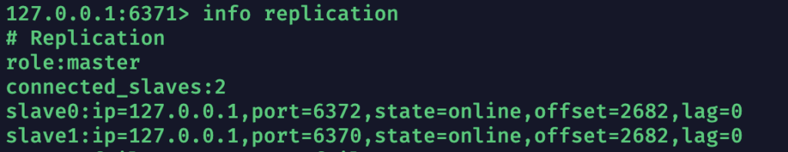

- 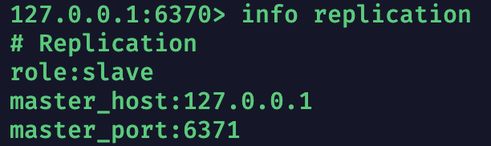
- 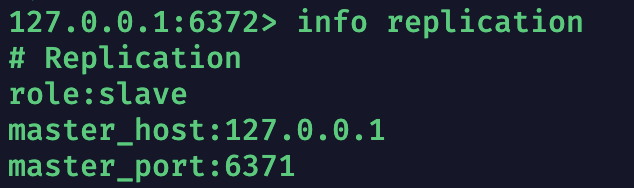

我们手动杀死主服务器进程之后，在查看6370和6372两个从服务器谁自动变成了主服务器

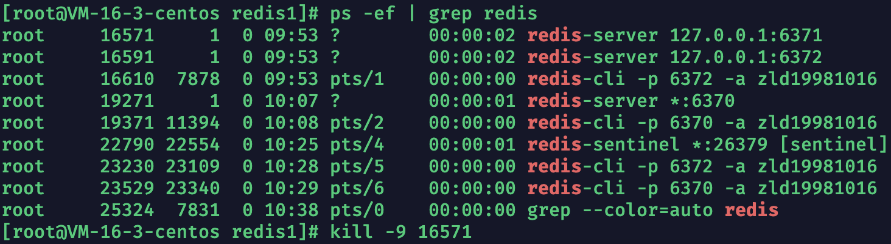

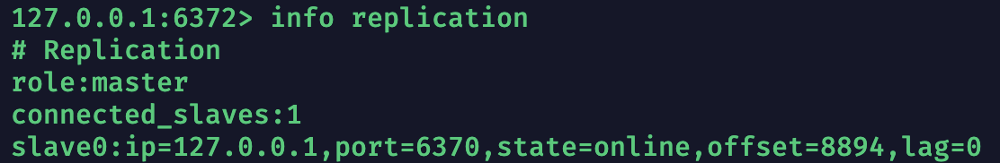

- 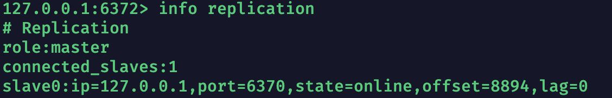
- 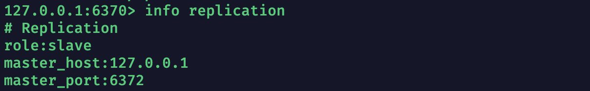

**当主服务器6371宕机之后，我们发现6372被选举为主服务器。**

在重新上线之前的6371主服务器，看看其主从状态

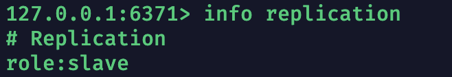

**从前的主服务器重连上之后恢复成从服务器状态。**

------

### 多哨兵结构实例

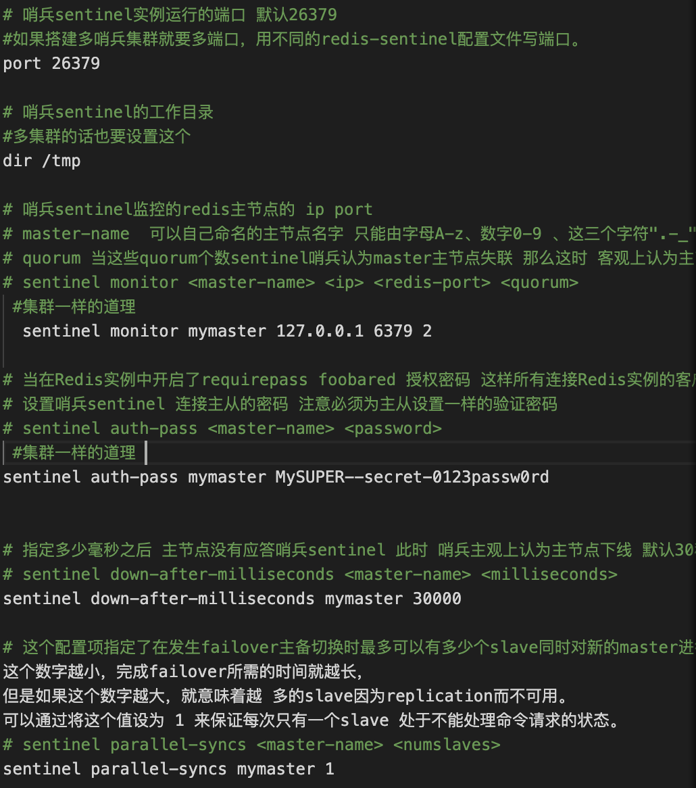

**编写多份上述sentinel.conf文件，并使用不同的端口号后启动即可。**

------

------

## Jedis如何使用进行了主从复制搭配哨兵的Redis结构

如果还是使用正常jedisPool配合jedis的方式那么当主服务器宕机的时候：

1）哨兵自动切换从服务器作为新的主服务器之后，我们配置的死信息，并不会随之改变。会依然去访问宕机的原主服务器。**(JedisConnectionException异常)**

2）原主服务器宕机重新上线后属于从服务器，我们客户端根据配置信息还会去把写指令发送给它，然后就会抛出异常。**(JedisDataException异常)**

------

## JedisSentinelPool类

JedisSentinelPool类就是用来解决上述问题的，这个类常用的构造方法为：

```
public JedisSentinelPool(String masterName, Set<String> sentinels, GenericObjectPoolConfig poolConfig, int timeout, String password) {
    this(masterName, sentinels, poolConfig, timeout, password, 0);
}
```

参数解析：

1. String masterName ：此参数和配置sentinel.conf的sentinel monitor字段中的mastername相同，自定义主服务器名称
2. Set<String> sentinels ：此参数用来存储哨兵的”IP:PORT”字符串集合。可以是一个也可以是多个。
3. GenricObjectPoolConfig poolConfig ：此参数就是之前我们使用的JedisPoolConfig对象，用来配置连接池参数
4. int timeout ：此参数用来定义jedis连接超时
5. String password：如果初始主服务器设置了密码，填入密码(主从服务器密码最好设置一致)

**之后我们就可以使用jedisSentinelPool对象的getResource()方法获取jedis对象了。**

------

### 实例演示

Redis主从复制Linux中环境：主服务器为121.199.79.104:6370，从服务器:121.199.79.104:6371，从服务器121.199.79.104:6372。哨兵为:121.199.79.104:26379。

我们来看一下封装之后的关键类RedisClient：

```
public class JedisClient {
    private static JedisSentinelPool jedisSentinelPool;
    static {
        Set<String> redisSet = new HashSet<>();
        redisSet.add("101.43.73.10:26379");
        JedisPoolConfig jedisPoolConfig = new JedisPoolConfig();
        jedisPoolConfig.setTestOnBorrow(true);
        jedisPoolConfig.setTestOnReturn(true);
        jedisPoolConfig.setMaxTotal(128);
        jedisPoolConfig.setMaxWaitMillis(10000);
        jedisPoolConfig.setMinIdle(20);
        jedisSentinelPool = new JedisSentinelPool("myMaster",redisSet,jedisPoolConfig,1000,"zld19981016");
    }

    public static JedisSentinelPool getJedisSentinelPool(){
        return jedisSentinelPool;
    }
}
```

测试方法：

```
    @Test
    public void testRedisSentinelPool(){
        JedisSentinelPool jedisSentinelPool = JedisClient.getJedisSentinelPool();
        Jedis jedis = jedisSentinelPool.getResource();
        jedis.set("testJedis","true");
        System.out.println(jedis.get("testJedis"));
        jedis.close();
    }
```

测试流程：

1）首先执行一次测试方法，检测是否可以接入主从结构，是否能正常写入testJedis-true值。

2）在主服务器端关闭服务，等待哨兵切换之后，再次执行测试方法。查看是否写入以及获取成功。

当我们构建好主服务器为121.199.79.104:6370，从服务器:121.199.79.104:6371，从服务器121.199.79.104:6372。哨兵为:121.199.79.104:26379环境之后，执行程序结果：

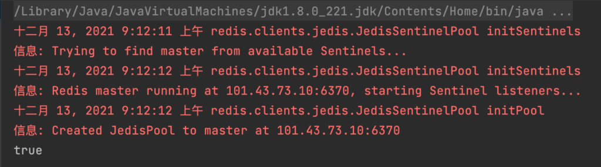

我们把主服务器宕机：


然后等待哨兵切换主服务器后，再次执行一次测试程序：

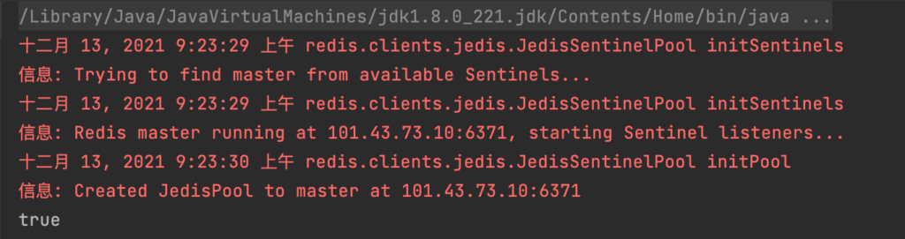

此次成功实现客户端无感切换主从服务器。