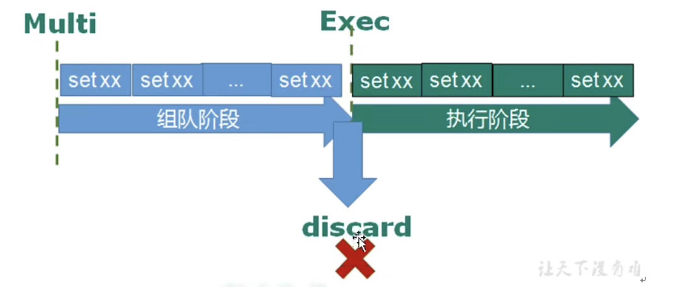
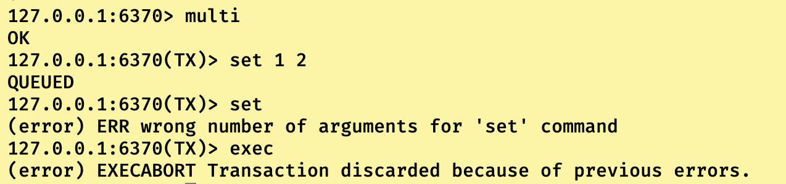
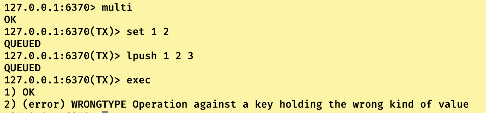

## 什么是事务

事务定义：逻辑上一组操作要不都执行，要不都不执行。

我们事务一般分为四个评定标准(ACID)：**四大标准都是为了让事务变得正确可靠！**

1. **原子性(Atomicity)**：**即事务中的指令集是不可再分的，是一个整体。要不都完成，要不都不完成**(这句话还有一层含义，也就是如果事务中有指令执行失败了，那就是都不完成状态，需要把之前完成的进行数据回滚)
2. **一致性(Consistency)**：**即事务执行之前和之后，数据总是从之前的状态转变成另一个状态，而不会有中间态**(这句话简易理解就是银行转账，初始A卡上100块，B卡上0块这是事务开始之前数据的状态，然后我们开始执行转账，如果转账成功，A卡上为0块，B卡上为100块这是事务完成之后的数据状态。哪怕转账中间出现异常，那么数据状态就不会改变，依然是初始状态，而不会有什么中间状态，比如A卡上100块，B卡上100块等等)。
3. **隔离性(ISolation)：数据库允许多个并发事务同时对其数据进行读写和修改的能力，隔离性可以防止多个事务并发执行时由于交叉执行而导致数据的不一致**（即事务A涉及到共享数据1的修改，事务B涉及到数据1的读取，假设当前事务A和B均未结束，但是事务已经修改了A的值，但是没有提交。那么事务B到底是读取事物A修改了还没有提交的值，还是读取事物A修改之前的数据1的值）
4. **持久性\**(Durability)\**：即数据被事务修改提交之后，应该是永久有效的。**

------

------

## Redis事务

**redis事务严格来说并不是完整的事务，因为它只能做到事务四大特征中的C和I，也就是一致性和隔离性，而无法做到A和D，也就是原子性和持久性。**

为什么这么说，我们先从Redis事务怎么运作的开始说起：

首先来说说Redis事务的基本操作方式也就是Multi，Exec以及discard指令。

1. **Multi指令**：提醒Redis事务开始，准备接收指令集。
2. **Exec指令**：结束指令集的接收，开始依次执行指令。
3. **Discard指令**：在Exec指令之前使用，用于取消此次事务指令准备并退出事务状态。

知道这些之后，我们来说说Redis为什么支持CI，但是不支持AD。

------

## 为什么Redis不支持事务的原子性

来复习一下事务的原子性：逻辑上指令集被当作一个整体，要不都完成，要不都不完成。

整个Redis事务流程被分为组队阶段和执行阶段，如上图所示。Redis由于下述情况一，导致很多人误认为Redis是有原子性的。

情况一：在组队阶段，如果指令出现语法错误，比如只写set或者只写set key不写value等问题，那么就会在组队阶段进行报错，整个事务不会被执行。

情况二：无论在组队阶段还是执行阶段，如果指令不是语法问题，而是异常问题，比如用set类型去设置别的类型等等，那么在执行阶段这异常指令会报错，但是之前的指令数据不回回滚，之后的指令照常执行。

仔细读读我们的事务原子性定义，就会发现情况二才是真正在说Redis事务是不具备原子性的！！！！

------

## 为什么Redis事务具备一致性

我们先来复习一下一致性的定义是什么？

事务一致性：在事务执行完成之前后，数据只能从前一个状态变化为另一个状态，没有所谓的中间状态。

这个实现其实大家很熟悉，还记得为什么Redis事务不具备原子性的情况一嘛

情况一：在组队阶段，如果指令出现语法错误，比如只写set或者只写set key写value等问题，那么就会在组队阶段进行报错，整个事务不会被执行。

对，没错。这玩意就是Redis事务实现一致性的关键，因为在redis看来，情况一已经把错误的中间状态给截住了，并且没有执行事务，所以数据依然是初始状态，哪怕出现情况二中异常情况，但是最后所到达的数据状态不是中间状态，而是事务执行之后的最终状态。

------

## 为什么Redis事务具有隔离性

复习一个隔离性的定义：在多个事务同时执行的时候，事务之间对共享数据的读写能力进行限制。可以防止多个事务并发执行而导致的数据不一致。

如果大家没忘的话，应该还记得Redis底层采用NIO多路复用配合轮询的方式监听Socket，当请求是一个文件/数据读写操作时，就会使用单线程进行处理。现在在添加一段，当请求是事务指令集的时候也是进行单线程执行的。

现在大家知道Redis事务为什么具有隔离性了吧，人家事务也只有一个线程在执行啊！！！

------

## 为什么Redis事务不具备持久性

这个解释知识有点超前，大家可以学习了Redis持久化之后再来看看，现在记得不具备持久性就行。

首先复习一个持久性定义：事务对于数据的修改是永久有效的

但是Redis如果不开启持久化的话，一旦重启redis或者因为突发情况导致redis服务中止亦可能redis所在服务器宕机等等情况，redis数据就会丢失。

所以Redis具不具备事务的持久性，我们要结合Redis的持久化来谈谈：

1. Redis采用RDB持久化时，事务并不具有持久性，为什么这么说，因为RDB的性质就是每一段时间产生一段数据备份，如果在事务执行之后还没到产生数据备份的时候，就宕机了。数据一样没有了。
2. Redis采用AOF持久化时，就要看appedfsync的配置了，如果appedfsync=always的时候，那Redis事务就是具有持久性的，但是如果appedfsync=everysec的时候，好巧不巧事务修改数据成功之后，还没过1秒，服务器宕机了。哦豁，修改数据没有了。所以此时Redis事务就是不具备持久性的。

综上所述：Redis事务不具备持久性，只要在特定情况下可以具备持久性。

------

------

## 扩展：为什么Redis采用不回滚的方式实现事务

- Redis 命令只会因为命令用在了错误类型的键上面而失效：这也就是说，从实用性的角度来说，失败的命令是由编程错误造成的，而这些错误应该在开发的过程中被发现，而不应该出现在生产环境中。
- 因为不需要对回滚进行支持，所以 Redis 的内部可以保持简单且快速。

在通常情况下， 回滚并不能解决编程错误带来的问题。

举个例子， 如果你本来想通过 `INCR` 命令将键的值加上 1 ， 却不小心加上了 2 ， 又或者对错误类型的键执行了 `INCR` ， 回滚是没有办法处理这些情况的。

鉴于没有任何机制能避免程序员自己造成的错误， 并且这类错误通常不会在生产环境中出现， 所以 Redis 选择了更简单、更快速的无回滚方式来处理事务。