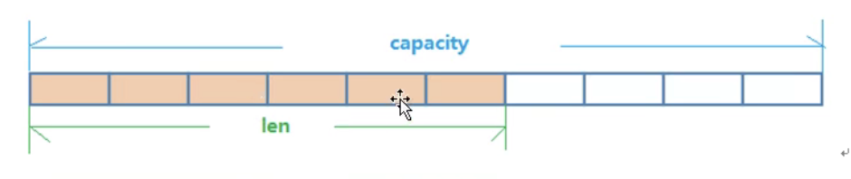
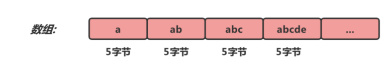
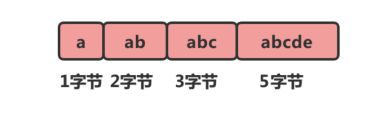
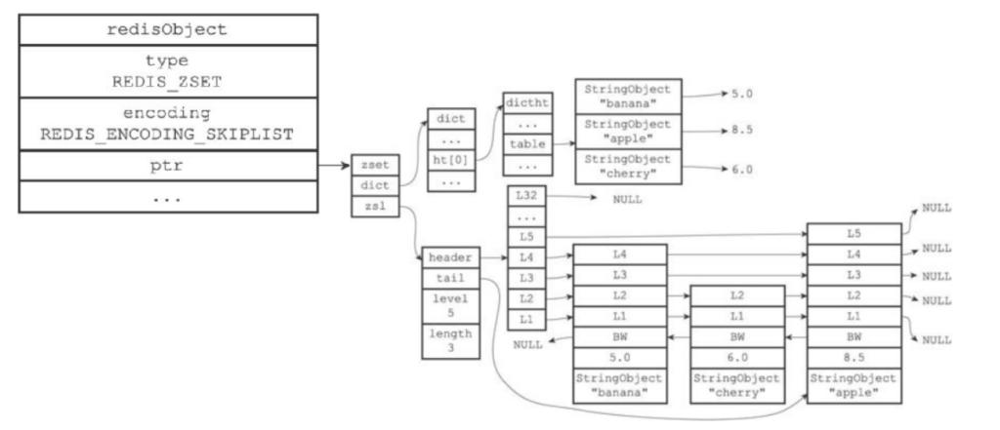

## RedisObject结构体

```
typedef struct redisObject {
    // 类型
    unsigned type;
    // 编码
    unsigned encoding;
    // 指向底层实现数据结构的指针
    void *ptr;
    // ...
} robj;
```

上述代码为Redis底层保存不同种类Value的数据结构，通过不同的type，encoding，*ptr字段组合实现不同类型的Value数据结构。

类型type是一个枚举类型，一共拥有以下枚举值：

1）***TYPE_STRING***：字符串类型

2）***TYPE_LIST\***：列表类型

3）***TYPE_HASH***：哈希类型

4）***TYPE_SET***：集合类型

5）***TYPE_ZSET***：有序集合类型

编码encoding字段值也是一个枚举类型，一共拥有以下枚举值：

1）***REDIS_DECODING_INT\***：long类型的整数编码

2）***REDIS_DECODING_EMBSTR***：embstr编码的简单动态字符串

3）***REDIS_DECODING_RAW\***：简单动态字符串

4）***REDIS_DECODING_HT***：字典

5）***REDIS_DECODING_LINKEDLSIT***：双向链表

6）***REDIS_DECODING_ZIPLIST***：压缩列表

7）***REDIS_DECODING_INTSET***：整数集合

8）***REDIS_DECODING_SKIPLIST***：跳表和字典

指针ptr为指向正在存储数据的内存地址。

------

## Redis字符串类型底层数据结构解析

字符串对象底层数据结构实现为**简单动态字符串（SDS）和直接存储**，**但其编码方式可以是int、raw或者embstr，区别在于内存结构的不同**（也就是ptr指针指向的内存地址上数据存储结构不同）。

首先我们来看看第一个int类型编码时，redisObject的组成：

1）type = TYPE_STRING;

2）encoding = REDIS_ENCODING_INT;

3）ptr = “12345”;

**可以看出当字符串类型Value为数字字符串时，编码采用REDIS_ENCODING_INT，ptr直接指向字符串常量的内存地址。属于直接存储。**

------

然后再来看看raw编码时，redisObject的组成：

1）type = TYPE_STRING;

2）encoding = REDIS_ENCODING_RAW;

3）ptr = sds对象内存地址；

**什么是SDS，SDS全称”sdshdr”，中文为简单动态字符串，用以存储字符串，作用方便存储添加时的扩容以及获取字符串长度等操作。**

下述代码为sdshdr组成结构体代码：

```
struct  stdhdr {
   int len  //记录buff数组中已使用字节的数量
   int free //记录buff数组中未使用字节的数量
   char buff[] //字节数组，用于保存字符串
}
```

其中buff字节数组最关键的就是其的扩容机制，我们直接上图来讲解buff的扩容过程：



首先我们可以通过free字段和len字段得到capacity的值，当达到字符串长度到达扩容的阈值时，就要进行扩容大小的判断，当字符串大小小于1M的时候，翻倍capactity的值作为扩容之后的新buff长度，反之每次只增加比上次capacity长度多1M的长度。

------

最后来看看embstr编码时，redisObject对象组成：

1）type = TYPE_STRING;

2）encoding = REDIS_ENCODING_EMBSTR;

3）ptr = sds对象内存地址；

我们发现这除了编码字段不同，其他都和RAW一样啊，这是为什么呢？

------

其实embstr编码和raw编码都是简单动态字符串（SDS）作为核心的，区别有两个。

**第一：RAW编码使用在字符串大小大于32字节的时候，小于32字节就会使用embstr编码。**

**第二：只不过raw编码的ptr指向的sds内存地址不是和redisObject对象连续的空间地址，而embstr编码的ptr指向的sds内存地址是和redisObject对象之后的连续的地址。**

所以在使用上，不管是创建还是删除，raw编码存储的字符串创建时需要2次分配内存操作（一次分配RedisObject对象的内存，一次分配sds对象的内存）删除同理，embstr编码存储的字符串创建时只需要1次分配内存操作（直接把redisObject对象和sds对象的内存地址连续的分配了）。


------

## Redis列表类型低层数据结构解析

Redis列表在底层数据结构实现**采用两种不同的实现，分别是ZIPLIST编码对应的压缩链表和LINKEDLIST对应的双向链表。**

我们来看看list类型分别两种编码的RedisObject结构体组成：

1）ZIPLIST编码对应的RedisObject结构体

```
typedef struct redisObject {
    // 类型
    unsigned type = REDIS_LIST;
    // 编码
    unsigned encoding = REDIS_ENCODING_ZIPLIST;
    // 指向底层实现数据结构的指针
    void *ptr = 压缩列表内存地址;
    // ...
} ;
```

那到底什么是压缩列表，其实算是Redis为了优化数组占用内存空间而自创的一种数据结构，普通的数组每个下标对于的内存空间都是固定大小，**但是压缩链表不同，虽然同为一段连续的内存空间，但是每一个下标的对应的内存空间大小是根据存放元素所占用内存大小来计算的。**

如同下述两图所示：上图为普通数组，下图为压缩列表。





------

2）LInkedList编码对应的RedisObject结构体

```
typedef struct redisObject {
    // 类型
    unsigned type = REDIS_LIST;
    // 编码
    unsigned encoding = REDIS_ENCODING_LINKEDLIST;
    // 指向底层实现数据结构的指针
    void *ptr = 双向链表头节点内存地址;
    // ...
} ;
```

这个就没什么好说的了。**只需要知道，双向链表中的节点不再是普通的字符串，而是Redis的字符串类型！！（Redis的字符串类型是唯一一个可以嵌套的类型）。**

------

我们来说说什么情况下，Redis的列表类型两种编码都是用在什么场景？

**ziplist编码得满足两个条件，其一为存储的所有字符串均小于64个字节，其二为元素个数小于512个。一旦一个不满足立马切换成linkedList编码。**

**注意！！！！zipList编码的两个条件只能说是默认值，因为可以在redis.conf文件中修改。**

------

## Redis哈希类型底层数据结构解析

Redis的哈希类型在底层的数据结构也有两种，**分别是ZipList编码对应的压缩列表和HashTable对应的哈希表。**

1）ZipList编码对应的RedisObject对象：

```
typedef struct redisObject {
    // 类型
    unsigned type = REDIS_HASH;
    // 编码
    unsigned encoding = REDIS_ENCODING_ZIPLIST;
    // 指向底层实现数据结构的指针
    void *ptr = 压缩列表内存地址;
    // ...
} ;
```

哈希类型在压缩列表上的存储和LiST类型不同，哈希类型总是只在队尾插入，而且一般是key-value键值对以紧密相连的方式放入压缩列表的。

比如我们要放入一个”name”-“CodeDan”的键值对，那么就会发生下述流程：

初始压缩列表：zlbytes–>zltail–>zllen

插入之后的压缩列表：zlbytes–>zltail–>zllen–>“name”->“CodeDan”

------

2）HashTable编码对应的RedisObject对象：

```
typedef struct redisObject {
    // 类型
    unsigned type = REDIS_HASH;
    // 编码
    unsigned encoding = REDIS_ENCODING_HT;
    // 指向底层实现数据结构的指针
    void *ptr = 哈希表内存地址;
    // ...
} ;
```

这个在结构上没什么说的，**也是注意hashKey和Hashvalue是RedisString类型，而不是普通String类型。**

------

我们来说说什么情况下，Redis的哈希类型两种编码都是用在什么场景？

**ziplist编码得满足两个条件，其一为存储的所有字符串均小于64个字节，其二为键值对个数小于512个。一旦一个不满足立马切换成HT编码。**

------

## Redis集合类型底层数据结构解析

Redis集合类型也是拥有两种编码对应的不同数据结构，**分别是inset编码对应的inset结构和hashtable编码对应的HashValue为null的哈希表结构。**

1）Insert编码对应的RedisObject对象：

```
typedef struct redisObject {
    // 类型
    unsigned type = REDIS_SET;
    // 编码
    unsigned encoding = REDIS_ENCODING_INTSET;
    // 指向底层实现数据结构的指针
    void *ptr = 整数集合内存地址;
    // ...
} ;
```

好了，问题来了，整数集合结构长什么样子？

```
typedef struct intset{
    //编码方式
    uint32_t encoding;
    //集合包含的元素数量
    uint32_t length;
    //保存元素的数组
    int8_t contents[];
}intset;
```

其中**encoding字段**可以为下属任何一种：

- INTSET_ENC_INT16：int16_t类型的整数值(最小为-32768，最大为32767)
- INTSET_ENC_INT32：int32_t类型的整数值(最小为-2147483648，最大为2147483647)
- INTSET_ENC_INT64：int64_t类型的整数值(最小为-9223372036854775808，最大为9223372036854775807)

**length字段**为整数集合包含的元素数量。

**contets数组**：是整数集合的底层实现，整数集合的每一个元素都是contents数组的一个数组项，各项在contenets数组中从小到大排序，而且不会有重复项。

------

2）HashValue=null的哈希编码对应的RedisObject对象：

```
typedef struct redisObject {
    // 类型
    unsigned type = REDIS_SET;
    // 编码
    unsigned encoding = REDIS_ENCODING_HT;
    // 指向底层实现数据结构的指针
    void *ptr = 哈希表内存地址;
    // ...
} ;
```

和正常的哈希表不同，SET类型只使用了哈希表的HashKey来进行数据存储，和Java中Set集合的底层实现采用相同的思路。

**注意：每一个HashKey均是一个RedisString类型字符串。**

------

我们来说说什么情况下，Redis的集合类型两种编码都是用在什么场景？

**IntSet编码得满足两个条件，其一为存储的所有字符串均为数字字符串，其二为元素个数小于512个。一旦一个不满足立马切换成HT编码。**

------

## Redis有序集合类型底层数据结构分析

Redis的有序集合类型也是**分两种不同的编码，分别是zipList编码的压缩列表和skipList编码的哈希表+跳表的存储结构。**

这个和哈希表的zipList编码实现相似。

1）ZipList编码下的有序集合类型对应的RedisObject对象：

```
typedef struct redisObject {
    // 类型
    unsigned type = REDIS_ZSET;
    // 编码
    unsigned encoding = REDIS_ENCODING_ZIPLIST;
    // 指向底层实现数据结构的指针
    void *ptr = 压缩列表;
    // ...
} ;
```

有序集合类型也总是只在队尾插入，而且一般是key-value键值对以紧密相连的方式放入压缩列表的。而且会从小到大自动排序。

比如我们要放入一个”CodeDan”-“32[Score]”的键值对，那么就会发生下述流程：

初始压缩列表：zlbytes–>zltail–>zllen

插入之后的压缩列表：zlbytes–>zltail–>zllen–>“CodeDan”->“32”

------

2）SkipList编码下的有序集合对应的RedisObject对象：

```
typedef struct redisObject {
    // 类型
    unsigned type = REDIS_ZSET;
    // 编码
    unsigned encoding = REDIS_ENCODING_SKIPLIST;
    // 指向底层实现数据结构的指针
    void *ptr = 复合结构内存地址;
    // ...
} ;
```

这个复合结构内存对象不好用语言描述，我们直接上图：



我们发现哈希表中存储的key-value键值对分被存放RedisKey和Score字段。跳表中的节点是有RedisKey和Score组成的。但是注意！！！！

**哈希表中的数据的内存地址和跳表节点中的数据内存地址是一致的，并没有多出冗余数据占用空间。**

所以跳表+哈希表的存储优化结构不但没有带来很多的内存占用，还优化了哈希表无序的特性。

------

我们来说说什么情况下，Redis的有序集合类型两种编码都是用在什么场景？

**ZIPLIST编码得满足两个条件，其一为存储的所有字符串大小不能超过64个字节，其二为元素个数小于128个。一旦一个不满足立马切换成skipList编码。**

------

## Redis如此设计数据结构思想的作用

列表（list）、哈希（hash）、集合（set）、有序集合（zset）底层实现都用到了压缩列表结构，并且使用压缩列表结构的条件都是在元素个数比较少、字节长度较短的情况下；

四种数据对象使用压缩列表的优点：

（1）节约内存，减少内存开销，Redis是内存型数据库，所以一定情况下减少内存开销是非常有必要的。

（2）减少内存碎片，压缩列表的内存块是连续的，并分配内存的次数一次即可。

（3）压缩列表的新增、删除、查找操作的平均时间复杂度是O(N)，在N再一定的范围内，这个时间几乎是可以忽略的，并且N的上限值是可以配置的。

（4）四种数据对象都有两种编码结构，灵活性增加。