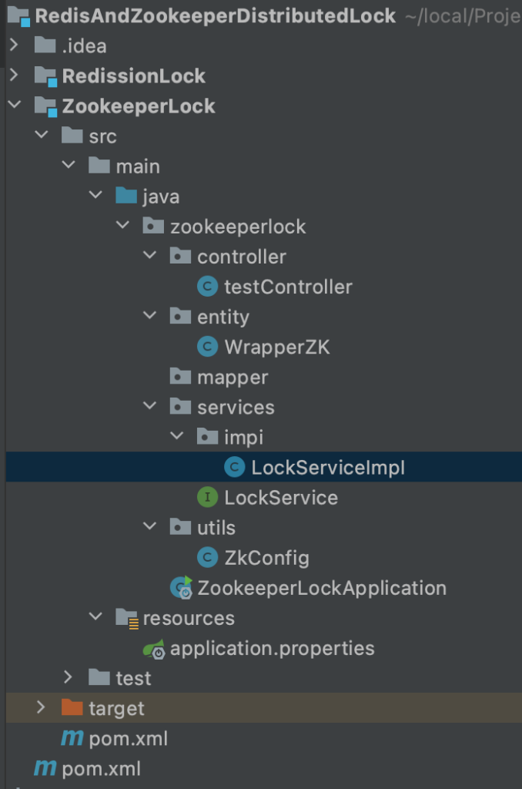

## 我们为什么需要分布式锁？

以前我们的并发环境都在单体程序上，也就是一个JVM进程下的不同线程之间的并发。

在同一个JVM进程下，所有的线程均可以访问共同使用的堆区，而我们的锁对象一般也都是位于堆中存储。所以同一个JVM下的线程均可以操作到这个锁对象，从而进行锁操作。

但是我们微服务下的分布式环境中，我们部署在各个不同服务器上的微服务可没有公共的内存区域，也就是服务之间数据相对独立，所以不能采用以往的单体架构锁方式进行并发编程。

**如果我们设想在这些服务之间使用一个能独立于这些服务独自运行的中间件，使用这个中间件来完成这些服务之间锁对象的存储，当服务们需要进行锁操作的时候，就直接去中间件中获取/修改锁对象的状态等等。**

在实际开发中分布式锁一般由Redis和Zookeepe完成。所以我们分别使用两种分布式锁来做演示。

首先说明下述采用Spring boot版本为:

```
        <dependency>
            <groupId>org.springframework.boot</groupId>
            <artifactId>spring-boot-starter-web</artifactId>
            <version>2.3.4.RELEASE</version>
        </dependency>
```

------

------

## Zookeeper分布式锁(Spring boot)

这篇内容需要读者掌握Zookeeper节点类型,Watch机制等知识。建议先把zookeeper学完之后再来看这里的内容。

Zookeeper分布式锁实现的关键在于Zookeeper的临时顺序节点，我们来看看获取锁的流程：

(1) 首先需要在Zookeeper中创建一个持久节点/parentLock


(2) 然后要获取共享数据的客户端线程就会在此/parentLock节点下创建/lock00001的临时顺序节点，由于此节点是序号最小节点，所以对应现场获取到锁。


(3) 在上一个线程还未释放锁的情况下，客户端线程2，3一样想获取到锁，那么就会依次创建/lock00002，00003节点，均发现自己节点不是当前序号最小的节点，线程陷入阻塞。并使用链式监听方式，各自监听前一个节点。


知道获取锁流程之后，我们再来看看释放锁流程：

(1) 当线程1对应的客户端修改完共享数据之后，删除/lock00001节点，触发watch监听器，唤醒了/lock00002对应的线程2客户端，此线程发现当前最小序号节点就是自己的节点，获取到锁。


**[扩展：哪怕线程1由于不可预计的错误宕机了，那么根据临时序号节点的特性，/lock00001也会自动被删除，随之触发Watch机制]**

(2) 当线程2由于不可抗力的原因连接中断了，那么ZK自动删除/lock_00002节点，触发Watch机制，唤醒/lock_00003所代表的线程3，线程3发现自己的节点是当前最小序号节点，成功获取锁。


------

至此，Zookeeper实现分布式锁的原理讲解完毕，我们来进行实际代码实现，由于Zookeeper相关的操作均被Curator客户端所封装，所以使用Curator操作ZK分布式锁十分的简单。

curator的pom坐标为：

```
        <!-- https://mvnrepository.com/artifact/org.apache.zookeeper/zookeeper -->
        <dependency>
            <groupId>org.apache.zookeeper</groupId>
            <artifactId>zookeeper</artifactId>
            <version>3.4.14</version>
            <!--     日志文件冲突和boot的       -->
            <exclusions>
                <exclusion>
                    <artifactId>slf4j-log4j12</artifactId>
                    <groupId>org.slf4j</groupId>
                </exclusion>
            </exclusions>
        </dependency>
        <!-- Curator-->
        <!-- https://mvnrepository.com/artifact/org.apache.curator/curator-framework -->
        <dependency>
            <groupId>org.apache.curator</groupId>
            <artifactId>curator-framework</artifactId>
            <version>2.12.0</version>
            <exclusions>
                <exclusion>
                    <groupId>org.apache.zookeeper</groupId>
                    <artifactId>zookeeper</artifactId>
                </exclusion>
            </exclusions>
        </dependency>

        <!-- https://mvnrepository.com/artifact/org.apache.curator/curator-recipes -->
        <dependency>
            <groupId>org.apache.curator</groupId>
            <artifactId>curator-recipes</artifactId>
            <version>2.12.0</version>
        </dependency>

        <!-- https://mvnrepository.com/artifact/org.projectlombok/lombok -->
        <dependency>
            <groupId>org.projectlombok</groupId>
            <artifactId>lombok</artifactId>
            <version>1.18.20</version>
            <scope>provided</scope>
        </dependency>
```

首先介绍一下，目录结构为分布式微服务结构，微服务ZookeeperLock为测试Zookeeper分布式锁的微服务正如下所示：



重点来看看配置文件application.properties和Curator配置实体类WrapperZK和Curator配置工具类ZKConfig

```
//这是application配置文件
#连接重试的次数
curator.retryCount=5
#连接重试的时间
curator.elapsedTimeMs=5000
#如果是集群，则吧非observer节点的IP，PORT全写,反之非集群写一个即可
curator.connectString=IP:2181,IP:2182,IP:2183
#会话超时时间
curator.sessionTimeoutMs=60000
#连接超时时间
curator.connectionTimeoutMs=5000
//这是配置实体类WrapperZK
import lombok.Data;
import org.springframework.boot.context.properties.ConfigurationProperties;
import org.springframework.stereotype.Component;

@Component
@Data
@ConfigurationProperties(prefix = "curator")
public class WrapperZK {
    private int retryCount;
    private int elapsedTimeMs;
    private String connectString;
    private int sessionTimeoutMs;
    private int conectionTimeoutMs;
}
//这是配置工具类ZKConfig
@Configuration
public class ZkConfig {

    @Autowired
    private WrapperZK wrapperZK;

    @Bean(initMethod = "start")
    public CuratorFramework curatorFramework(){
        return CuratorFrameworkFactory.newClient(
                wrapperZK.getConnectString(),
                wrapperZK.getSessionTimeoutMs(),
                wrapperZK.getConectionTimeoutMs(),
                new RetryNTimes(wrapperZK.getRetryCount(),wrapperZK.getElapsedTimeMs()));
    }
}
```

看完基本ZK和Curator客户端配置类之后，我们进入分布式锁的核心源码所在LockServerImpI类

```
@Service
public class LockServiceImpI implements LockService {

    @Autowired
    private CuratorFramework curatorFramework;
    
    /**
     * 首先在服务器端设置持久节点/parentLock和/data，/data设置值为100
     * 我们使用ab并发工具，设置请求数量为101，并发请求100
     * 预计结果，打印100-1数字，并无重复，最后打印一句本次累减结束，结果为0。
     * */
    @Override
    public void testGetLock() {
        //关键核心类InterProcessMutex类为可重入锁
        InterProcessMutex interProcessMutex = new InterProcessMutex(curatorFramework,"/parentLock");
        try {
            interProcessMutex.acquire();
            byte[] bytes = curatorFramework.getData().forPath("/data");
            int data = Integer.parseInt(new String(bytes));
            if(data <= 0){
                System.out.println("本次累减结束，结果为"+data);
                interProcessMutex.release();
                return;
            }
            System.out.println("当前数字为"+data);
            data = data - 1;
            String result = data+"";
            curatorFramework.setData().forPath("/data",result.getBytes(StandardCharsets.UTF_8));
            interProcessMutex.release();
        } catch (Exception e) {
            e.printStackTrace();
        }
    }
}
```

我们采用ab并发指令进行测试

```
ab -n 101 -c 100 http://localhost:8080/log
```

结果： **//截图太长，发不出来，复制的结果。**

```
当前数字为100
当前数字为99
当前数字为98
当前数字为97
当前数字为96
当前数字为95
当前数字为94
当前数字为93
当前数字为92
当前数字为91
当前数字为90
当前数字为89
当前数字为88
当前数字为87
当前数字为86
当前数字为85
当前数字为84
当前数字为83
当前数字为82
当前数字为81
当前数字为80
当前数字为79
当前数字为78
当前数字为77
当前数字为76
当前数字为75
当前数字为74
当前数字为73
当前数字为72
当前数字为71
当前数字为70
当前数字为69
当前数字为68
当前数字为67
当前数字为66
当前数字为65
当前数字为64
当前数字为63
当前数字为62
当前数字为61
当前数字为60
当前数字为59
当前数字为58
当前数字为57
当前数字为56
当前数字为55
当前数字为54
当前数字为53
当前数字为52
当前数字为51
当前数字为50
当前数字为49
当前数字为48
当前数字为47
当前数字为46
当前数字为45
当前数字为44
当前数字为43
当前数字为42
当前数字为41
当前数字为40
当前数字为39
当前数字为38
当前数字为37
当前数字为36
当前数字为35
当前数字为34
当前数字为33
当前数字为32
当前数字为31
当前数字为30
当前数字为29
当前数字为28
当前数字为27
当前数字为26
当前数字为25
当前数字为24
当前数字为23
当前数字为22
当前数字为21
当前数字为20
当前数字为19
当前数字为18
当前数字为17
当前数字为16
当前数字为15
当前数字为14
当前数字为13
当前数字为12
当前数字为11
当前数字为10
当前数字为9
当前数字为8
当前数字为7
当前数字为6
当前数字为5
当前数字为4
当前数字为3
当前数字为2
当前数字为1
本次累减结束，结果为0
```

具体代码github链接：点这里

具体代码gitee链接：点这里

------

------

## Redis分布式锁(Spring boot)

Redis分布式锁我们介绍一下原生Redis该怎么实现

我们首先从分布式锁的三大特性开始分析

**第一步：加锁**

加锁操作在Redis中我们可以理解为把一个节点的值设置为1，由于Redis单条指令的顺序原子性，此修改值的操作是原子的。

所以我们加锁的指令可以为以下几种：

```
set key 1
setnx key 1
setex key secoudTimeout 1
```

**问题一**：如果说我们采用**set key 1指令**来完成加锁，那么有可能出现多线程重复加锁行为，比如多并发环境下，有两个线程同时获取到key不存在，那么他们均可以使用set key 1指令。这样就会出现大问题。

**解决**：我们要把**判断key是否存在**和**设置key为1**这两个操作变成原子的。使用**setxnx key 1** 可以解决上述问题，setnx指令可以让判断key存不存在后再进行key的创建与赋值这个过程原子化。

**问题二**：这样一来，看起来好像没什么问题了，其实还有一种场景setnx满足不了，那就是获取锁之后此线程立马宕机了，无法执行解锁操作，后面的尝试获取锁线程全部阻塞不动。

**解决**：为了解决上述问题，脑海里蹦出来的可以就是再加锁之后再使用expire指令设置一个key过期时间不就好了。就算获取锁的线程在未解锁的时候宕机了，等待一段时间之后自动解锁不就行了。

**问题三**：但是如果是使用setnx key 1 配合expire指令的话，无法保证这两步是原子的，也就是可能会出现刚执行完setnx key secondtimeout 1指令后，此线程宕机，都没有来得及执行expire指令，那么还是会进入到上述场景中。

**解决**：所以我们要想办法把这两步也变成原子的，恰好**setex key secndTimeout 1**指令可以解决上述问题，其把检测，设置，过期这个流程变成原子性的。

但是在redis 2.6.12版本以后，修改了set指令的参数，让set指令也可以和setex指令一样。**推荐使用**

```
set(key,1,secondTimeout,NX);
```

------

**第二步：解锁**

解锁的方式，相比大家也可以想到，就是使用del进行解锁，指令如下所示：

```
del key
```

**问题一**：但是大家有没有想过，一个极端情况，当线程1获取到锁，但是在执行过程中耽误了很长的时间，导致锁释放了。线程2获取到锁并执行对应操作，就在此时线程1执行完了并执行了del key指令，那么恭喜线程1成功帮线程2解锁了。结果当然就是线程2还没执行完，线程3获取到锁。

**解决**：我们加锁的时候key的值不再是1，而是这个获取锁的线程ID，删除时，先判断key的值是不是自己的线程ID，如果是可以删除，不是则不能删除。

**问题二**：还是老问题，删除的判断和删除执行不是原子的，在多并发环境下，可能线程1判断这个锁是自己的，结果线程切换，导致这个锁过期了，线程2获取到锁并执行，此时线程切换回来了，线程1又删除了属于线程2的锁。

**解决**：由于del指令没有复杂的参数保证原子性，所以我们得使用LUA脚本完成删除的判断和执行。

```
//LUA脚本,String版本
String luaScipt = "if redis.call('get',KEYS[1]) == KEYS[2]] then return redis.call('del',KEYS[1]) else return 0 end";
//jedis启动
redisClient.evalsha(luaScript,2,key,threadId);
```

**问题三**：虽然我们解决了误删除事件的可能，但是上述情况中，线程2获取到锁，之后线程1还有可能在操作共享数据，这样会导致线程安全问题。所以我们还是要杜绝这个事情的发生。

**解决**：在获取到锁之后线程创建一个守护线程，只要这个获取锁线程没有宕机，那么哪怕快过期了，守护现场再重制一下过期时间即可。

**扩展：哪怕获取锁宕机了，由于守护线程和获取锁线程属于同一个进程，所以一旦获取锁线程宕机，守护线程也会宕机。就不会影响下一个线程获取锁了。**

------

redis的pom坐标：

```
        <!-- https://mvnrepository.com/artifact/org.springframework.boot/spring-boot-starter-data-redis -->
        <dependency>
        <groupId>org.springframework.boot</groupId>
        <artifactId>spring-boot-starter-data-redis</artifactId>
        <version>2.3.4.RELEASE</version>
       </dependency>
```

首先介绍一下，目录结构为分布式微服务结构，微服务RessionLock为测试Redis分布式锁的微服务正如下所示：


重点来看看配置文件application.properties和lettuce配置实体类RedistemplateFactory和LUA脚本类LuaUtil。

```
//这是application.properties内容
spring.redis.host = 101.43.73.10
spring.redis.port = 6370
spring.redis.password = zld19981016
spring.jedisPool.maxActive = 400
spring.jedisPool.maxWait = 10000
spring.jedisPool.maxIdle = 40
//这是lettuce配置实体类RedistemplateFactory内容
@Configuration
public class RedistemplateFactory {

    @Bean
    public RedisTemplate<String,Object> getRedisTemplate(RedisConnectionFactory redisConnectionFactory){
        //创建对象
        RedisTemplate<String,Object> redisTemplate = new RedisTemplate<>();
        //设置创建工厂
        redisTemplate.setConnectionFactory(redisConnectionFactory);
        //创建JSON格式序列化
        Jackson2JsonRedisSerializer<Object> jackson2JsonRedisSerializer =
                new Jackson2JsonRedisSerializer<Object>(Object.class);
        ObjectMapper objectMapper = new ObjectMapper();
        objectMapper.setVisibility(PropertyAccessor.ALL, JsonAutoDetect.Visibility.ANY);
        objectMapper.enableDefaultTyping(ObjectMapper.DefaultTyping.NON_FINAL);
        jackson2JsonRedisSerializer.setObjectMapper(objectMapper);
        //配置value的序列化为JSON格式
        redisTemplate.setValueSerializer(jackson2JsonRedisSerializer);
        return redisTemplate;
    }
}
//这是Lua脚本类LuaUtil内容
public class LuaUtil {

    String luaText = "if redis.call('get',KEYS[1]) == ARGV[1] then return redis.call('del',KEYS[1]) else return 0 end";

    public String getLuaText() {
        return luaText;
    }
}
```

看完基本Redis和Lettuce配置类以及Lua脚本之后，我们进入分布式锁的核心源码所在LockServerImpI类

```
@Service
public class LockServiceImpI implements LockService {

    @Autowired
    private StringRedisTemplate stringRedisTemplate;

    /**
     * 通过原子性加锁，原子性解锁来完成redis分布式锁
     * 前提：在redis服务器端创建字符串类型数据，key = num，value = 100即可运行
     * */
    @Override
    public void getRedisLock() {
        long id = Thread.currentThread().getId();
        String uuid = String.valueOf(id);
        //获取锁
        Boolean lockFlag = stringRedisTemplate.opsForValue()
                .setIfAbsent("lock", uuid, 20, TimeUnit.SECONDS);
        if(lockFlag){
            String num = stringRedisTemplate.opsForValue().get("num");
            if (num == null){
                System.out.println("还未开始");
                //这里如果我们测试准备好了，不会进入这里，所以没有必要解锁，等待超时即可
                return;
            }
            int value = Integer.parseInt(num);
            if (value <= 0 ){
                System.out.println("累减结束，当前结果为"+value);
            }else {
                System.out.println("现在数字为"+num);
                stringRedisTemplate.opsForValue().decrement("num");
            }
            //执行LUA脚本删除
            String luascript = new LuaUtil().getLuaText();
            DefaultRedisScript<Long> redisScript = new DefaultRedisScript<>();
            redisScript.setScriptText(luascript);
            redisScript.setResultType(Long.class);
            stringRedisTemplate.execute(redisScript, Arrays.asList("lock"),uuid);
        }else {
            //如果竞争失败，再次尝试获取锁，这里需要手动操作
            getRedisLock();
        }
    }
}
```

我们采用ab并发指令进行测试

```
ab -n 101 -c 100 http://localhost:8080/lock
```

结果： **//截图太长，发不出来，复制的结果。**

```
现在数字为100
现在数字为99
现在数字为98
现在数字为97
现在数字为96
现在数字为95
现在数字为94
现在数字为93
现在数字为92
现在数字为91
现在数字为90
现在数字为89
现在数字为88
现在数字为87
现在数字为86
现在数字为85
现在数字为84
现在数字为83
现在数字为82
现在数字为81
现在数字为80
现在数字为79
现在数字为78
现在数字为77
现在数字为76
现在数字为75
现在数字为74
现在数字为73
现在数字为72
现在数字为71
现在数字为70
现在数字为69
现在数字为68
现在数字为67
现在数字为66
现在数字为65
现在数字为64
现在数字为63
现在数字为62
现在数字为61
现在数字为60
现在数字为59
现在数字为58
现在数字为57
现在数字为56
现在数字为55
现在数字为54
现在数字为53
现在数字为52
现在数字为51
现在数字为50
现在数字为49
现在数字为48
现在数字为47
现在数字为46
现在数字为45
现在数字为44
现在数字为43
现在数字为42
现在数字为41
现在数字为40
现在数字为39
现在数字为38
现在数字为37
现在数字为36
现在数字为35
现在数字为34
现在数字为33
现在数字为32
现在数字为31
现在数字为30
现在数字为29
现在数字为28
现在数字为27
现在数字为26
现在数字为25
现在数字为24
现在数字为23
现在数字为22
现在数字为21
现在数字为20
现在数字为19
现在数字为18
现在数字为17
现在数字为16
现在数字为15
现在数字为14
现在数字为13
现在数字为12
现在数字为11
现在数字为10
现在数字为9
现在数字为8
现在数字为7
现在数字为6
现在数字为5
现在数字为4
现在数字为3
现在数字为2
现在数字为1
累减结束，当前结果为0
```

**注意1：由于本次测试中，没有什么占用时间太长的代码，所以没有设置守护线程作为续过期时间的操作，如果开发环境中有这种风险，务必加上守护线程。**
**注意2：由于本次操作涉及到key和value均为字符串，所以使用StringRedistemplate完成操作，但是最好还是用RedisTemplate来完成。两者操作都是一样的。区别在于需要单独配置RedisTemplate的value序列化。**

------

**Ression框架**

由于Ression使用，太多简单，所以这里并没有列举实例，但是还是放上具体流程：

redission的pom坐标：

```
	<!-- https://mvnrepository.com/artifact/org.redisson/redisson -->
	<dependency>
	    <groupId>org.redisson</groupId>
	    <artifactId>redisson</artifactId>
	    <version>3.13.6</version>
</dependency>
```

在applicaiton.properties文件中配置

```
spring.redis.host = 127.0.0.1
spring.redis.port = 6379
spring.redis.password = 123456
```

测试类：


------

------

## Redis分布式锁和Zookeeper分布式锁的区别

Zookeeper实现分布锁优点：

1）由于Zookeeper天生就是为分布式锁而生，所以有优秀的封装框架，非常容易实现

2）临时顺序节点使其拥有等待队列，大大提升了锁的抢占效率

Redis实现分布式的优点：

1）set和del指令执行效率高

------

Zookeeper实现分布式锁缺点：

1）由于是树结构，创建和删除节点的性能较弱。

Redis实现分布式锁缺点：

1）过程繁琐，需要考虑加锁，解锁原子性和锁超时等等情况

2）没有等待队列的结构，必须依赖客户端自旋完成锁的抢占，效率低下

------

**结论：推荐使用Zookeeper实现分布式锁，代码简单，思路清晰。**