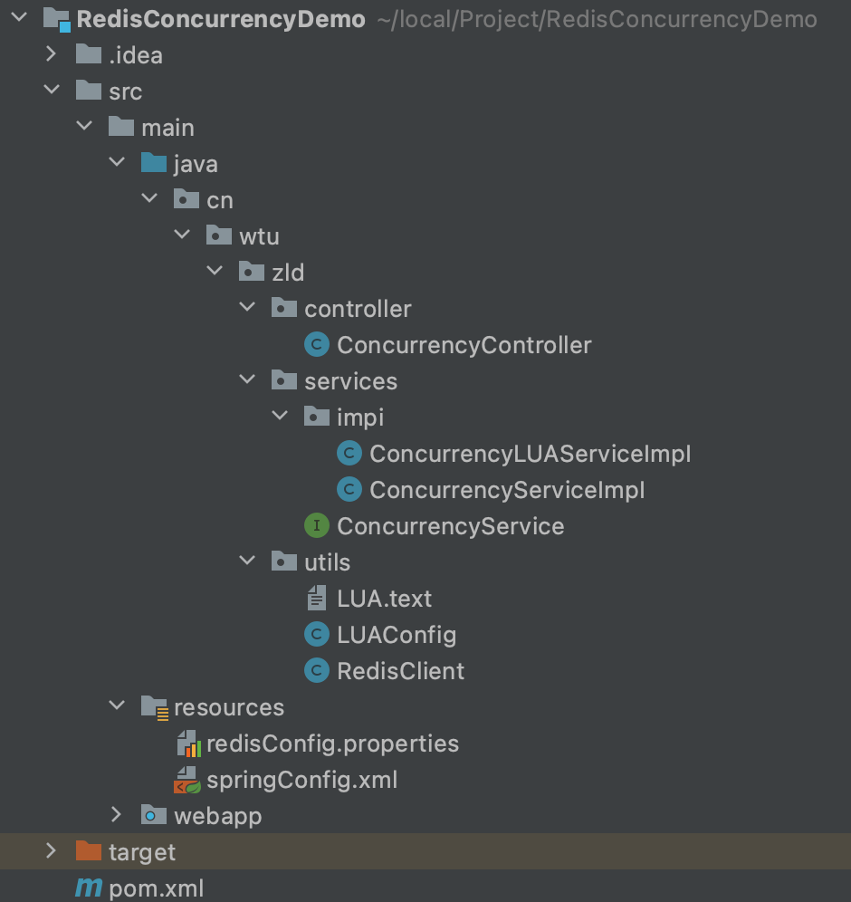

## 实例业务逻辑

1. 首先在redis中建立”活动名称+商家+商品编号”的key，value为此次秒杀库存以及”活动名称:商家:商品编号”的key，list类型value的”用户id”作为秒杀成功用户集合。
2. 使用watch监控”活动名称+商家+商品编号”的key，如果key=null，说明秒杀还没未开始，退出秒杀，如果key=0，说明秒杀结束，退出秒杀，如果key>0，则进入秒杀事务。
3. 开始秒杀事务，库存-1，添加用户到list集合中
4. 执行事务，如果事务返回集合size为0，说明watch撤销了事务，进行自旋重新秒杀。反之说明事务执行成功，退出秒杀。

------

## **一般秒杀常见并发存在的问题**

1. **超卖问题**：没有建立好共享数据与锁/事务之间的关系，导致获取的数据与修改时数据不一致，导致数据不一致。（解决：整理锁或者事务与共享数据的关系）

2. **连接超时问题**：即并发量特别大的时候，redis可能无法同时处理海量个数的请求，有些请求一直阻塞到超时。（解决：连接线程池）

3. 库存遗留问题

   ：当我们使用watch乐观锁配合事务的时候，可能会出现秒杀结束，库存遗留的问题。原因在watch让事务失效不进行提交。那么就相当于你白点了，但是你没重新点。当并发量不是很大或者库存很多的时候，可能就会大量失效导致库存遗留。(有两种方式：条件自旋。如果事务失效，”帮助”用户自动再进行一次，当库存没有就返回失败信息。或者使用LUA脚本)

   1. **自旋操作的问题：虽然解决了库存遗留，但是自旋一定程度上降低了并发性能。我们使用乐观锁一定程度上是读多写少的业务场景，当并发性能下降太多是无法接受的**
   2. **LUA脚本解决方案：Redis悲观锁实现方式，适合写多读少的业务场景，比起watch搭配自旋来说并发性高。**

------

------

## 并发工具AB介绍

ab属于apache公司开发并提供给开发者使用的并发测试工具。使用ab指令可以给指定的url秒杀请求模拟出指定量级的秒杀场景。

mac自带有ab，但是最大并发量有限制，建议重新安装或者在CentOS7中使用网络指令yum安装

```
//Centos7安装指令
yum install httpd-tools
```

------

## ab指令常用参数

```
//ab指令格式以及参数
ab [options] [url]
```

options常用参数介绍：

1）**-n requests** : 对当前url请求1000次

2）**-c concurrency(并发量)**：并发次数，**一般搭配-n使用，表示在requests个request中有concurrency个并发请求**

3**）-T content-type**：当我们url请求是post请求的时候，需要使用-t设置content-type。默认是text。

4）**-p postfile**：如果post中有参数，那么把参数放在自定义postfile文件中并给出文件路径，**必须配合-T使用,而且postfile文件以&结尾**

(postfile文件例子：userId=11809&)

------

------

## 环境搭建

Web项目采用Spring mvc进行项目搭建，这里不负责贴出完整的Spring mvc运行和配置代码。我们主要是分析关于缓存秒杀的业务逻辑代码。

首先我们来看看基于典型的Spring MVC项目结构的秒杀实例Demo结构：



1. 其中controller包下包含秒杀请求，services包下包含秒杀业务逻辑接口和其的两个不同实现类，分别是ConcurrencyServiceImpI类和ConcurrencyLUAServiceImpI类，其中ConcurrencyServiceImpI类是基于Redis乐观锁搭配自旋机制实现的秒杀业务逻辑类，ConcurrencyLUAServiceImpI类是基于LUA脚本实现的Redis悲观锁业务逻辑类。
2. utils包下有三个类，其中RedisClient类为配置Jedis连接池的配置类，LUAConfig类为LUA脚本的获取类以及LUA.text文件记录了LUA脚本的内容。
3. resources资源包下，存在springmvc的配置文件springConfig.xml和redis连接的配置文件RedisConfig.properties。（习惯了boot的配置方式，不太习惯在xml中书写bean）。

------

## Controller层业务代码展示

```
@Controller
public class ConcurrencyController {

    //这里负责切换不同的秒杀实现，默认是Redis乐观锁实现，如果想要悲观锁实现，那么就把注释去掉，并下把下面的注释即可
//    @Resource(name = "ConcurrencyLUAServiceImpI")
    @Resource(name = "ConcurrencyServiceImpI")
    private ConcurrencyService concurrencyService;

    //首页请求
    @RequestMapping("/")
    public String getMainPage(){
        return "index";
    }

     //统计并发请求次数使用，由于并发量大，所以采用原子性操作类来统计
//   private LongAdder longAdder =  new LongAdder();

    //测试秒杀请求
    @RequestMapping("/bug")
    @ResponseBody
    public String bugCommodify(String commodityId){
        //统计代码，调试的时候可以把注解去掉
//        longAdder.add(1);
//        System.out.println("这是第"+longAdder+"次请求");
        boolean commotidy = concurrencyService.bugCommotidy(commodityId);
        return commotidy+"";
    }
}
```

------

## 基于乐观锁实现的业务逻辑类代码展示

```
/**
 * 基于Watch实现的Redis乐观锁业务逻辑类
 * @author CodDean
 * */
@Service("ConcurrencyServiceImpI")
public class ConcurrencyServiceImpI implements ConcurrencyService {
    //计算并发请求失败次数
    private LongAdder longAdder = new LongAdder();

    //通过IOC获取到redis连接池对象，我们通过连接池对象获取与redis连接的线程
    @Autowired
    private JedisPool jedisPool;

    @Override
    public boolean bugCommotidy(String comId) {
        //首先我们来创建一个随机的用户ID
        String userId = new Random().nextInt(5000)+"";
        //拼接用户key，用于用户list类型的key
        String userKey = "Concurrency:user:"+comId;
        //拼接商品key，用于商品库存的key
        String comKey = "Concurrency:iphone:"+comId;
        //获取jedis连接线程
        Jedis jedis = jedisPool.getResource();
        //自旋解决乐观锁库存遗留问题
        while (true){
            //Redis乐观锁检测
            jedis.watch(comKey);
            //开始条件判断
            String s = jedis.get(comKey);
            //如果comKey返回null，说明后台还没有给库存设置key，代表秒杀还没开始
            if(s == null){
                System.out.println("秒杀还没开始");
                jedis.close();
                return false;
            }
            //如果在userKey的集合中检查到你用户id存在，说明你已经秒杀成功过了。
            if(jedis.sismember(userKey,userId)){
                System.out.println("您已购买成功，请勿重复购买秒杀商品");
                return false;
            }
            //当库存数量小于等于0，说明商品已经被秒杀空了，小于0是预防措施，哪怕并发失败了程序不能崩
            int number = Integer.parseInt(s);
            if(number <= 0 ){
                System.out.println("秒杀结束了");
                jedis.close();
                return false;
            }
            //执行到这里说明，检查到库存还有执行事务操作(库存减一，把用户加入到秒杀成功集合中)
            Transaction multi = jedis.multi();
                //减少库存
            multi.decr(comKey);
                //把用户加入到秒杀成功集合中
            multi.sadd(userKey,userId);
                //提交事务
            List<Object> exec = multi.exec();
            System.out.println("进入秒杀");
            //如果满足下述条件说明提交事务时，由于comKey被其他线程修改而且被watch检查到了数据版本不一致，取消事务提交。
            if(exec == null ||exec.size() == 0){
                longAdder.add(1);
                System.out.println("秒杀失败"+longAdder+"次");
            }else{
                //反之，watch检查到数据和获取时没有版本变化，说明没有线程修改，事务成功提交并执行
                System.out.println("秒杀成功");
                jedis.close();
                return true;
            }
        }
    }
}
```

------

------

## AB测试以及结果展示

我们来对上述基于乐观锁实现的秒杀Demo进行ab并发测试：

由于我们bug请求是POST请求，而且携带commodityId参数，所以我们得编写postfile脚本


开始执行ab指令，我们设置1000的请求数量，其中100个并发请求，库存数量为50

```
//设置库存数量为50,我们采用手动redis设置模拟，下述是redis指令
127.0.0.1:6379> set Concurrency:iphone:11809 50
```

成功启动后然后就可以使用ab指令进行测试了，注意如果程序所在服务器和执行ab的主机不在同一机器下，需要检查一下相互之间能不能ping通。

```
 ab -n 2000 -c 100 -p ./postfile -T 'application/x-www-form-urlencoded' http://localhost:8080/bug
```

结果：由于结果列表太长，截图就算了，我们浓缩成视频

<video controls="" src="../图片/ReduisCon03.mp4" style="box-sizing: border-box; -webkit-tap-highlight-color: transparent; display: inline-block; vertical-align: baseline; max-width: 100%; width: 750px;"></video>

**这里我们也看到了最后秒杀失败次数来到近3000的次数，也就是说大部分都失败了，为什么呢？就是因为Watch锁的特性导致的，每次成功一个事务提交就会有大量的并发线程事务提交失败，导致进入自旋。**

虽然能保证库存的线程安全，我们看看秒杀之后库存的数量：


说明秒杀最终是成功的，但是缺陷也明显了，失败太多，商品库存减少时间太慢。不符合秒杀的业务场景。

------

------

## LUA脚本重构项目

首先来介绍一下LUA脚本：

LUA脚本是一个小巧的脚本语言，LUA脚本很容易被C/C++代码调用，也可以反过来调用C/C++代码，但是由于LUA轻量的特性，所以其本身并没有强大的库给我们调用，毕竟一个LUA解释器不过200k，所以LUA脚本都是作为主流C/C++应用程序内嵌式脚本语言在使用。

为什么我们要使用LUA脚本重构我们的单体Redis秒杀实例呢，这和LUA脚本的特性有关。

**LUA脚本可以编写多条redis操作进行存储，然后执行的时候类似于Redis事务，具有一定的原子性，不会被其他命令插队，可以完成一些redis事务性的操作。**

说到现在大家应该知道为什么要使用LUA脚本了吧，因为我们要放弃使用乐观锁，转而使用悲观锁了。也就是去使用redis事务的隔离性来完成数据同步。

但是为什么要使用LUA不直接使用redis事务编写呢？

因为redis事务开始后，redis无法在里面执行条件判断语句，比如我们事务开始后可以要获取库存，如果库存为null，说明秒杀未开始，库存=0说明秒杀结束，只有当库存大于0的时候才会进行秒杀流程。但是这些都得在Redis事务中进行，显然redis可做不到支持。

**但是LUA脚本可以在里面编写各种条件判断后最后类似于与Redis事务执行啊，所以我们必须借助LUA脚本完成Redis悲观锁的实现。**

------

## LUA脚本的编写

```
local userId = KEYS[1];
local comId = KEYS[2];
local comKey = "Concurrency:iphone:"..comId;
local userKey = "Concurrency:user"..comId;
local userExists = redis.call("sismember",userKey,userId);
if tonumber(userExists) == 1 then
    return 2;
end
local num = redis.call("get",comKey);
if tonumber(num) <= 0 then
    return 0;
else
    redis.call("decr",comKey);
    redis.call("sadd",userKey,userId);
end
return 1;
```

------

## LUA脚本的使用

```
public class LUAConfig {
    //存放编写的LUA脚本，如果想读的话，请看utils包下的LUA.text文件
    private static String LUAcontent ;
    static {
        LUAcontent = "local userId = KEYS[1];\n" +
                "local comId = KEYS[2];\n" +
                "local comKey = \"Concurrency:iphone:\"..comId;\n" +
                "local userKey = \"Concurrency:user\"..comId;\n" +
                "local userExists = redis.call(\"sismember\",userKey,userId);\n" +
                "if tonumber(userExists) == 1 then\n" +
                "    return 2;\n" +
                "end\n" +
                "local num = redis.call(\"get\",comKey);\n" +
                "if tonumber(num) <= 0 then\n" +
                "    return 0;\n" +
                "else\n" +
                "    redis.call(\"decr\",comKey);\n" +
                "    redis.call(\"sadd\",userKey,userId);\n" +
                "end\n" +
                "return 1;";
    }
    public static String getLua(){
        return LUAcontent;
    }
}
```

------

```
public class ConcurrencyLUAServiceImpI implements ConcurrencyService {
    //通过IOC获取到redis连接池对象，我们通过连接池对象获取与redis连接的线程
    @Autowired
    private JedisPool jedisPool;

    @Override
    public boolean bugCommotidy(String comId) {
        //获取连接线程
        Jedis jedis = jedisPool.getResource();
        //使用jedis提供的scripLoad方法可以执行String类型的LUA脚本语句
        String scriptLoad = jedis.scriptLoad(LUAConfig.getLua());
        //随机获取一个用户ID
        String userId = new Random().nextInt(5000)+"";
        //执行LUA脚本，并获取结果
        Object evalsha = jedis.evalsha(scriptLoad, 2, userId, comId);
        //转化结果格式为Stirng类型
        String result = String.valueOf(evalsha);

        if("0".equals(result)){
            System.out.println("秒杀结束了，很遗憾，您没有抢到");
            return false;
        }else if("2".equals(result)){
            System.out.println("您已经成功秒杀到此商品，请勿重复秒杀");
            return false;
        }else if("1".equals(result)){
            System.out.println("恭喜您，成功秒杀到此商品");
            return true;
        }else{
            System.out.println("抢购异常");
            return false;
        }
    }
}
```

------

## AB测试结果显示

<video controls="" src="../图片/RedisCon05.mp4" style="box-sizing: border-box; -webkit-tap-highlight-color: transparent; display: inline-block; vertical-align: baseline; max-width: 100%; width: 750px;"></video>

并发量太大，库存只有50导致秒杀成功显示直接刷一下就过去了，最开始秒杀成功的显示直接没了啊，我们来看看最开始的100个并发结果截图：

```
恭喜您，成功秒杀到此商品
恭喜您，成功秒杀到此商品
恭喜您，成功秒杀到此商品
恭喜您，成功秒杀到此商品
恭喜您，成功秒杀到此商品
恭喜您，成功秒杀到此商品
恭喜您，成功秒杀到此商品
恭喜您，成功秒杀到此商品
恭喜您，成功秒杀到此商品
恭喜您，成功秒杀到此商品
恭喜您，成功秒杀到此商品
恭喜您，成功秒杀到此商品
恭喜您，成功秒杀到此商品
恭喜您，成功秒杀到此商品
恭喜您，成功秒杀到此商品
您已经成功秒杀到此商品，请勿重复秒杀
恭喜您，成功秒杀到此商品
恭喜您，成功秒杀到此商品
恭喜您，成功秒杀到此商品
恭喜您，成功秒杀到此商品
恭喜您，成功秒杀到此商品
您已经成功秒杀到此商品，请勿重复秒杀
恭喜您，成功秒杀到此商品
恭喜您，成功秒杀到此商品
恭喜您，成功秒杀到此商品
恭喜您，成功秒杀到此商品
恭喜您，成功秒杀到此商品
您已经成功秒杀到此商品，请勿重复秒杀
恭喜您，成功秒杀到此商品
恭喜您，成功秒杀到此商品
恭喜您，成功秒杀到此商品
........
秒杀结束了，很遗憾，您没有抢到
秒杀结束了，很遗憾，您没有抢到
秒杀结束了，很遗憾，您没有抢到
秒杀结束了，很遗憾，您没有抢到
秒杀结束了，很遗憾，您没有抢到
秒杀结束了，很遗憾，您没有抢到
秒杀结束了，很遗憾，您没有抢到
```

我们再来看看库存结果：


说明秒杀成功了，最简单的通过视频的播放速度，**大家都可以知道悲观锁更适合写多读少的高并发环境了。**