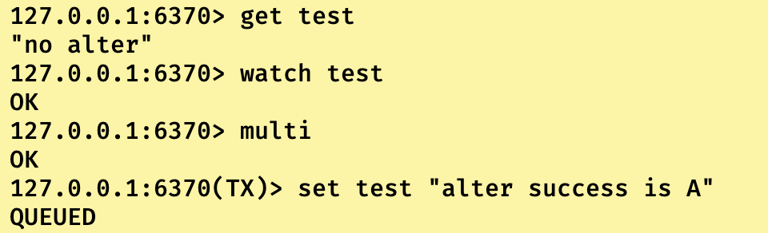
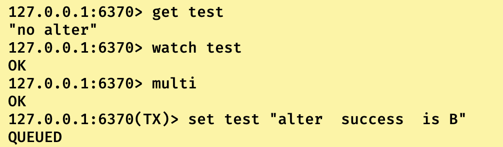
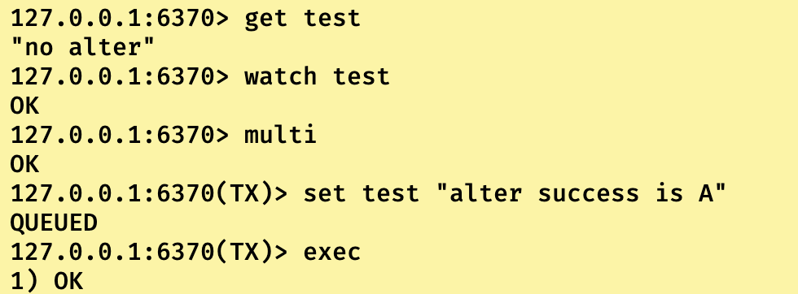
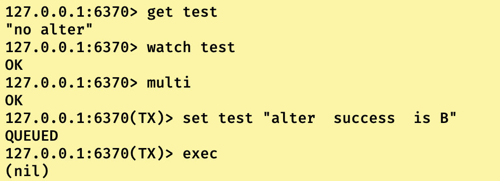

## Redis悲观锁

首先我们得先知道悲观锁是什么？

悲观素一般指多个线程在访问以及操作共享数据的时候，为了保证数据的线程安全，而给数据上了一把锁，这个锁只能由一个线程拥有，也只有拥有这个数据对应锁的线程才可以访问/修改这个数据，其他线程会进入阻塞等待获取锁的线程把锁进行释放之后才去争夺锁。

由于当锁被其中一个线程获取的时候，其他线程陷入阻塞，什么都做不了，只能干等在哪里。系统认为这是悲观的，所以也被称为悲观锁。

------

说完了悲观锁，大家也都知道Java的悲观锁很熟悉有synchronized以及ReentranLock等等，有我们来说说Redis的悲观锁是什么？

这里可能会困惑，Redis悲观锁实现到底是什么？因为在Redis简介中也没有悲观锁的关键字，但是Redis确实实现了悲观锁。

**Redis悲观锁就是Redis事务的隔离性**

大家回忆一下，上一篇博客《Redis事务特性解析》中对Redis事务隔离性的解析：

**Redis底层采用NIO多路复用配合轮询的方式监听Socket，当请求是一个文件/数据读写操作时，就会使用单线程进行处理。现在在添加一段，当请求是事务指令集的时候也是进行单线程执行的。**

当多个对共享数据进行修改的事务被提交了之后，是不是顺序到达被轮询的Socket，然后第一个到达的事务会被执行，其他事务会在Socket中陷入阻塞，只有当第一个到达事务执行完之后才会去执行之后的事务。

一般来说我们对事务的隔离性分为四大等级，分别为READ UNCOMMITED(未提交读)，READ COMMITED(已提交读)，REPEATABLE RAED(可重复度)以及SERIALIZEABLE(可串行化)。 **//这里只是举个例子，Redis事务隔离性没这么多选项，这是MySQL事务的隔离级别。**

Redis的事务隔离等级类似于SERIALIZEABLE可串行化，一般来说这个隔离等级只有悲观锁能实现。但是也带来了问题，随着隔离等级越高，对于并发性能影响越大。在SERIALIZEABLE级别下，服务的并发性会很低。

------

------

## Redis乐观锁

老规矩，先讲讲乐观锁是什么？

乐观锁一般指数据在无锁的情况下，多线程大家都可以获取到共享数据的值，但是在提交对共享数据的修改值时会去判断这个数据是不是已经被其他线程修改，如果已经被其他线程修改则返回异常信息或者指定返回对象。之后就可以选择自旋或者去执行其他的业务逻辑，而不是进入阻塞等待。系统认为这是乐观的，所以我们称这种锁为乐观锁。

------

一般来说乐观锁的实现都是建立在两大思想上的，即CAS(比较-交换思想)和MVCC(多版本控制思想)：

1. **CAS思想**：即大家都可以获取共享对象的值并存储，但是在修改的时候，还会再去内存中获取共享数据的值，然后与之前获取的值进行比较，如果相同，则说明没有线程对这个数据进行修改，自己可以修改。反之说明有线程已经对这个共享数据进行过修改了，这次修改操作失败。
2. **MVCC思想**：对共享数据”贴上”版本的概念，当多个线程下，线程们均获取到共享数据版本1.0的数据，但是在其中一个线程修改时，会去检查这个数据的版本是不是自己获取到的1.0，如果不是说明已经有别的数据对这个数据进行了修改，此次修改失败，反之修改成功之后，把共享数据的版本更新为2.0。

------

**Redis通过watch关键字实现乐观锁**

watch关键字会监听一个或者多个key，如果在事务的组队阶段时，这个关键字被修改，那么事务就不会被执行，也就是不会提交成功后进入Socket中进行阻塞等待。此时这个redis客户端是可以执行别的业务逻辑的。

知道watch是干什么的之后，我们来看看watch是怎么做到这一点的：

**首先watch是基于MVCC思想也就是多版本控制思想落地的，在我们是用watch监听key的时候，就是获取到了监听key的版本号，然后在事务提交的时候，就会去再次获取这个key版本号和之前获取的版本号进行对比，如果版本号不同，则事务取消。反之事务提交。**

------

## Watch实现实例演示

环境：redis6，centos7系统，初始化key为test的字符串数据”no alter”，开启两个客户端A和B，两个客户端事务开启前先同时监听test。

1）两边同时在事务队列中添加set test “alter success”

- 
- 

2）客户端A先提交，客户端B后提交

- 
- 

可以看到客户端A修改成功之后，客户端B再提交就直接返回nil了。