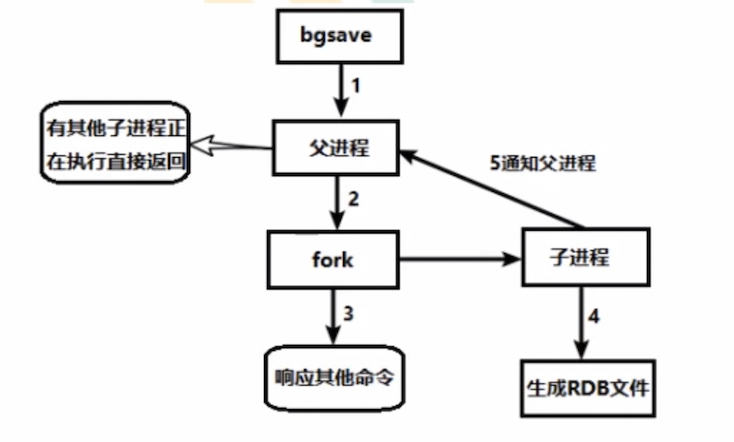
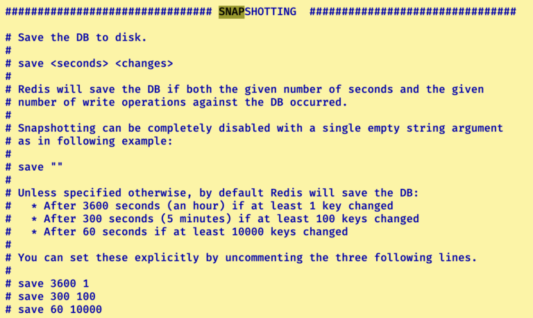
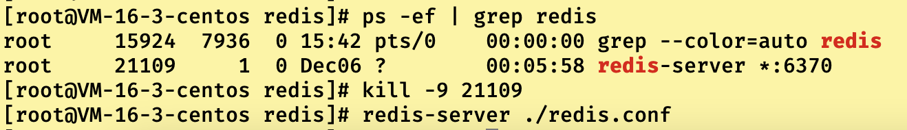
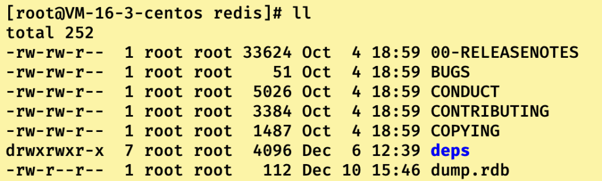
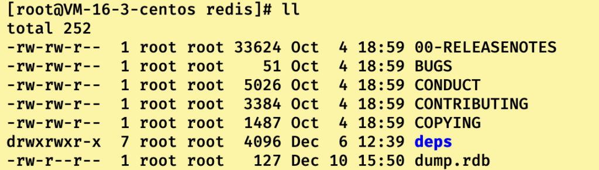
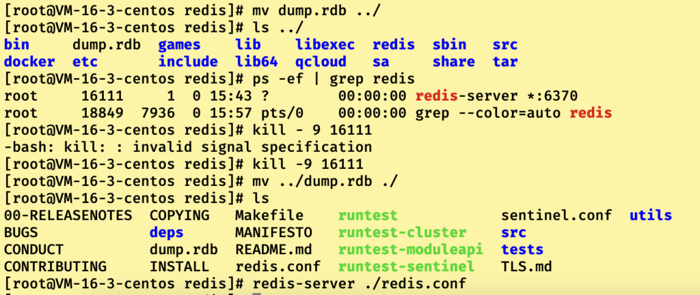
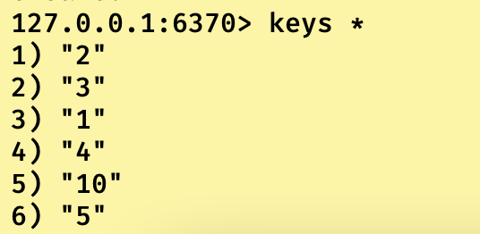
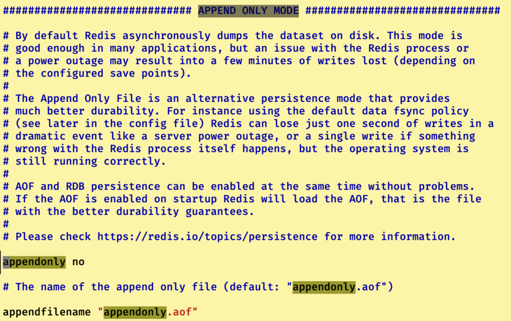
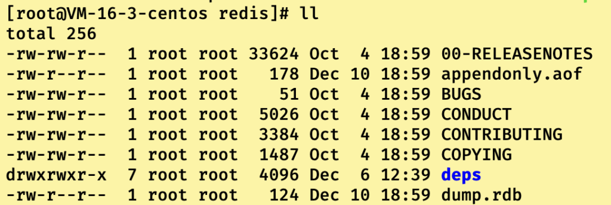
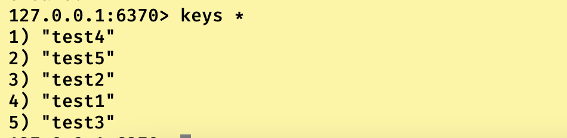

## Redis持久化是什么

**Redis持久化就是把Redis保存在内存中的数据转存到磁盘中。**

------

为什么需要持久化这个操作？

众所周知Redis的数据是存储在内存中的。如果我们的redis不进行持久化操作，当redis服务因为某些原因下线了或者某些原因导致服务器整体宕机了，当我们再次重启redis或者服务器的时候，之前保存在redis中的数据也就消失了。

作为一个稳定的系统来说，肯定是不能容忍数据就因为服务下线或者服务器宕机就消失的。所以Redis就提供了持久化操作，让我们可以把数据从内存中写入到磁盘里。

一旦发生上述的异常情况，就可以去指定的磁盘中读取数据到内存中，完成数据的恢复。

**Redis一共提供了两种持久化方式(RDB和AOF)，分别适合不同的业务场景或者混合使用。来保证数据的安全。**

------

------

## Redis持久化之RDB（Redis DataBase）

**RDB方式：在指定的时间间隔内将内存中的数据集快照写入到磁盘，恢复时是直接通过读取快照文件到内存中完成的。**

------

### RDB持久化的原理（bgsave方式）：

当我们开启RDB持久化之后，每次到达间隔时间就会触发bgsave指令，Redis主进程会通过fork()函数创建一个子进程来进行RDB持久化。

即这个子进程会将Redis主进程中的数据等信息写入到一个临时的文件中，待RDB持久化过程都结束了先通知Redis主进程完成此次RDB持久化后，**子进程再用这个临时文件替换上次持RDB久化结束的快照文件(dump.rdb)。此处子进程任务结束。**

注意：整个过程中，Redis主进程只有在调用fork()函数阶段处于阻塞状态（阻塞时间一般很短），其他时候均处于正常状态，也就是说这个RDB持久化过程会降低Redis的系统吞吐量。但是能够保证这一次快照创立之前的数据完整性。



------

### Fork()函数

**Fork指令的作用就是复制一个与当前进程一样的进程。新进程的所有数据(变量，环境变量，程序计数器等)都和原进程一摸一样，但是却是一个全新的进程，并作为原进程的子进程运行。**

注意一点：在linux中，fork()函数被利用**“写时复制技术”**优化了。

**即原进程和fork创建的子进程公用一块物理内存，减少了内存的消耗。只有当进程内数据被修改时，才会复制一份给子进程。**

------

------

## RDB实操演示

**RDB开启文件配置**

首先我们得先进入redis配置文件中寻找到配置RDB持久化的配置区域

```
//使用vim 进入redis.conf后使用搜索到SNAFSHOTTING
vim redis.conf
```



我们需要在这个区域修改多个配置信息

```
//dbfilename字段，修改默认的快照文件名称
dbfilename dump.rdb
//dir字段，即快照文件生成文件目录地址，默认是和redis.conf同级目录
dir ./
//stop-writes-on-bgsave-error字段，如果为yes，当redis无法写入磁盘的时候，就自动关闭rdb持久化操作
stop-writes-on-bgsave-error yes
//rdbcompresssion字段，如果为yes，就把每次生成的快照文件进行压缩算法处理进行压缩，但是会消耗一定的CPU性能(看业务场景开启)
rdbcompresssion yes
//rdbchecksum字段，如果为yes，就会检查rdb文件的完整性。作用类似于UDP和TCP报文的校验和，用CRC64算法来进行快照文件中的数据校验，同样损耗CPU性能(看业务场景开启)
rdbchecksum yes
//save字段，触发RDB时间间隔条件，分为两个参数，第一个参数为秒钟 第二个参数为写操作次数，即在900秒内(15分钟)发生5次写操作，那么就进行一个RDB持久化操作(不建议使用save触发)
save seconds changes
//bgsave字段，相对于save字段，bgsave字段触发的RDB持久化才是我们之前介绍的流程（就fork函数阻塞一下，其他时间还可以响应请求），save触发RDB持久化会让整个RDB过程中主线程阻塞。但是如果不是手动在redis-cli中输入save指令，在配置文件中配置save之后，后台其实是使用bgsave运行的。
```

------

**RDB备份以及恢复演示**

关于redis.conf中RDB配置信息

```
save 20 3

stop-writes-on-bgsave-error yes

rdbcompresssion yes

rdbchecksum yes

dbfilename dump.rdb

dir ./
```

通过ps -ef | grep redis获取到redis的进程ID后使用kill -9 redis进程号干掉redis进程后重新启动redis

```
ps -ef | grep redis
kill -9 redisUUID
redis-server ./redis.conf
```



然后我们就可以开启redis-cli后，往其中写入一些数据，满足20秒内3次的写入条件进行RDB持久化的触发

```
127.0.0.1:6379> set 1 1
127.0.0.1:6379> set 2 2
127.0.0.1:6379> set 3 3
127.0.0.1:6379> set 4 5
127.0.0.1:6379> set 5 5
```

然后我们到rdb文件所在目录中查看rdb文件,在第二排的第三行中



可以看到dump.rdb文件的大小为112，那么我们再次重新触发一次rdb持久化操作，看看rdb文件大小变化

```
127.0.0.1:6379> set 10 10
127.0.0.1:6379> set 11 11
127.0.0.1:6379> set 12 12
```



我们可以发现rdb文件大小增加了，说明其实覆盖原来的rdb文件了。

那么我们可以模拟redis服务宕机之后利用快照文件进行数据恢复了，首先我们得复制一份dump.rdb到其他目录，然后删除rdb文件原本文件之后紧接着使用kill杀掉redis服务，此时就可以把复制的rdb文件移入到之前存在的目录下，重启redis服务即可。



我们再进入到redis中看看结果：



数据成功恢复！！！！！！！！

------

------

## RDB持久化的优缺点

优点：

1. 能够保证每次快照文件中数据的完整性。适合大规模数据的容灾备份恢复以及全景复制等业务场景。
2. RDB通过把快照文件加载到内存中恢复文件的方式让恢复速度特别快。

缺点：

1. 每隔一段时间进行RDB持久化，一旦处于间隔时间内发生系统宕机，那就只能恢复到上一次RDB持久化时的数据。导致数据不一致。
2. 每次RDB操作都会创建一个和原进程数据相同的子进程，虽然通过”写时复制”优化了物理内存占用，但是线程的创建与销毁让其无法成为秒级或者实时持久化。

------

------

## Redis持久化之AOF（Append Only File）

**AOF方式：以日志的形式来记录每一个写操作(增量保存)，将Redis执行过的所有写指令记录下来(读质量不记录)，且只追加而不是覆盖记录。redis基于AOF恢复就是重新再执行一次日志中的指令。**

------

AOF持久化流程：

开启AOF持久化之后，redis客户端的写请求就被append方式追加到AOF缓冲区中，AOF缓冲区会根据配置文件中进行的AOF持久化策略将缓冲区中这些写请求同步到磁盘的AOF文件中**(此同步过程主进程阻塞，但是时间特别短，基本没感觉)**。

当AOF文件大小超过重写策略或者手动重写时，会对AOF文件rewrite重写，压缩AOF文件容量。

当Redis服务重启的时候，就会去加载AOF文件，然后对其中写请求重新顺序执行，达成数据恢复的目的。

------

### reWrite重写是什么？

AOF持久化采用文件追加的方式记录写请求，那么随着时间的推移，aof文件会越来越大。为了避免文件大小膨胀，当aof文件大小超过阈值的时候，redis就会启动aof文件的压缩流程，**把原本的单条指令重写为只保留可以恢复数据的最小指令集**。比如set 1 1 和 set 2 3重写为set 1 1 2 3。

**可以手动执行压缩：bgrewriteaof指令**

------

### reWrite重写原理

**AOF文件持续曾长而过大时，会调用fork()函数，创建一个子进程，这个子进程将rdb快照以二进制的形式附在新aof临时文件的头部，作为已有的历史数据，替换掉之前顺序的记录集合。然后以这个临时文件替换掉原有的aof文件。为了保证替换过程中，数据的一致性（因为fork之后主进程依然可以响应客户的写请求），客户端的写请求不仅会记录到aof缓冲区还会记录到重写缓存区中，直到子进程完成临时文件的重写之后，提醒主进程把重写缓冲区的记录写入到临时文件中，最后子进程替换掉来保证替换的aof文件中数据的一致性。**

------

------

## AOF实操演示

### AOF开启配置文件配置

首先我们得先进入redis配置文件中寻找到配置AOF持久化的配置区域

```
//使用vim 进入redis.conf后使用搜索到APPEND ONLY
vim redis.conf
```



我们需要在这个区域修改多个配置信息

```
//appendonly字段，如果为yes，则开启aof持久化，反之关闭
appendonly yes
//appendfilename字段，和dbfilename相同，属于设置持久化文件名称,但是aof没有指定生成位置的字段，采用和rdb相同的生成位置
appendfilename appendonly.aof
//appendfsync字段，即AOF持久化策略字段，拥有always级别(新增一条写请求就从缓存区中写入aof文件)，everysec级别（每一秒从缓冲区写入一次aof文件),no级别(不主动同步到aof文件，看操作系统决策)
appendfsync always
//两个配置字段，关于到aof文件的重写阈值设置，下述配置为aof文件重写基准为64MB，只有当文件大小超过64MB而且是上次重写之后文件大小的一倍及以上就会触发重写
auto-aof-rewrite-percentage 100
auto-aof-rewrite-min-size 64mb
//计算公式：aof当前大小 >= base_size + base_size * 100%（percentage配置值）而且文件大小>=64MB（size配置值）,Redis就是进行重写
```

------

**AOF备份以及恢复演示**

关于redis.conf中AOF的配置信息

```
appendonly yes

appendfilename appendonly.aof

appendfsync always

auto-aof-rewrite-percentage 100

auto-aof-rewrite-min-size 64mb
```

通过ps -ef | grep redis获取到redis的进程ID后使用kill -9 redis进程号干掉redis进程后重新启动redis

```
ps -ef | grep redis
kill -9 redisUUID
redis-server ./redis.conf
```


然后我们就可以开启redis-cli后，往其中写入一些数据

```
127.0.0.1:6370> flushdb
127.0.0.1:6370> set test1 1
127.0.0.1:6370> set test2 1
127.0.0.1:6370> set test3 1
127.0.0.1:6370> set test4 1
127.0.0.1:6370> set test5 1
```

然后我们可以查看到aof文件，文件大小为178。



然后我们复制一份aof文件到上层目录中，并删除当前目录下的aof文件后，关闭redis服务后，把上层目录中aof文件恢复到原本位置。

然后我们来看看redis现在中的值：



说明数据恢复了，而且走的aof文件恢复的，而不是rdb文件，因为我们输入的时候特意输入了五个，rdb文件条件只会记录三个。从上面查看文件的aof文件大小和rdb文件大小就不一致。

**这里还可以得到一个结论：当RDB和AOF持久化同时开始时，恢复文件采用AOF文件。**