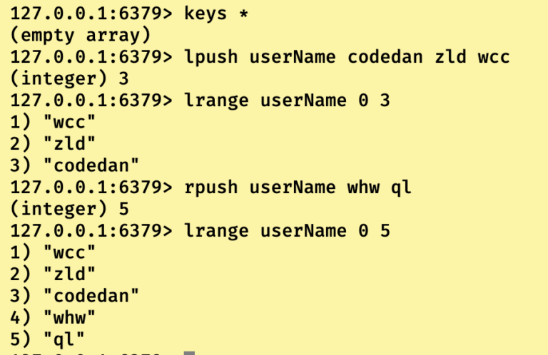
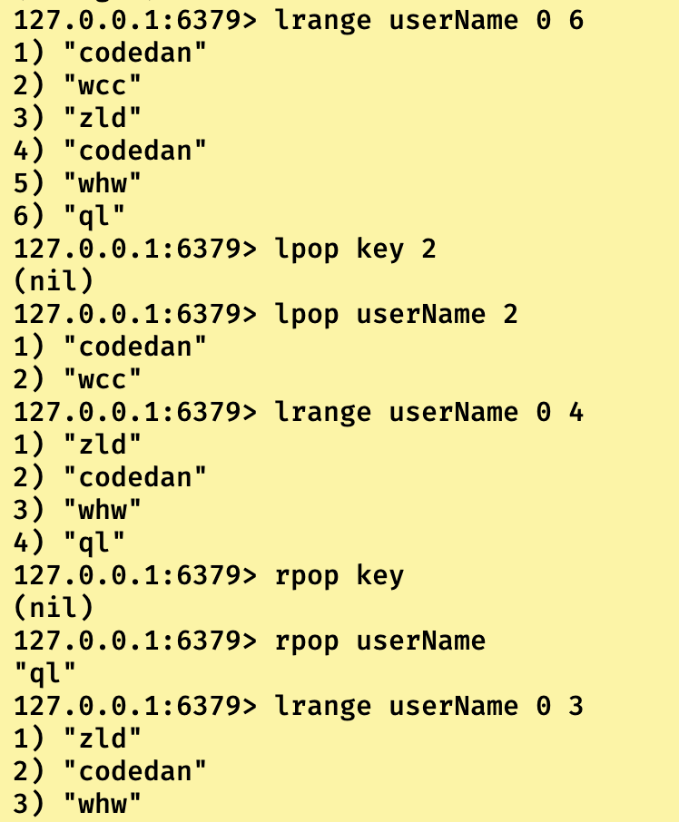
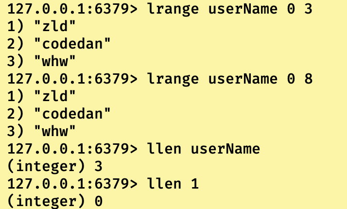

## 列表类型简介

即value的类型为list类型，**是由节点类型为字符串类型组成的有序列表，所以可以看作是泛型为String的双向链表组成的列表类型。**由于是双向链表，所以我们可以添加元素到列表的头部或者尾部。

列表类型在Redis中为一键多值的使用方式，即一个key对应了多个value，多个value之间使用双向链表作为数据结构进行存储。

------

## 列表类型常用指令

```
//在当前key中从头节点处插入一个或者多个value成为头节点（多个的时候，最后插入的为头节点），如果key不存在，则一起创建。
127.0.0.1:6379> lpush key value[value.....]
//在当前key中从尾节点处插入一个或者多个value成为为尾节点（多个的时候，最后插入的为尾节点），如果key不存在，则一起创建。
127.0.0.1:6379> lpush key value[value.....]
(注意：列表类型不是数据唯一性类型，所以如果插入重复元素也会成功插入)
```



------

```
//从当前key中头节点处弹出指定个数元素，返回弹出元素节点显示。如果key不存在返回nil。
127.0.0.1:6379> lpop key [count]
//从当前key中尾节点处弹出指定个数元素，返回弹出元素节点显示。如果key不存在返回nil。
127.0.0.1:6379> rpop key [count]
```



------

```
//查看列表key中从startIndex到endindex之间的元素，如果endIndex超出真实范围，则默认为真实范围的最右值.如果startIndex超过endIndex那么返回空列表。而且当endIndex = -1的时候，也是返回相当于从startIndex到结尾的列表。
127.0.0.1:6379> lrange key startIndex bodyIndex
//通过下标查询指定的元素（从左到右）
127.0.0.1:6379> lindex key index
//查看当前列表key的长度，返回(integer) 长度，如果key不存在则返回(integer) 0.
127.0.0.1:6379> llen key
```



------

```
//通过制定的方式删除列表中的指定元素,即当count小于0的时候，从尾节点往左删除count个指定元素，反之当count大于0的时候，从头节点往右删除count个指定元素，当count==0的时候，删除当前key列表中所有的指定元素。
127.0.0.1:6379> lrem key count value
127.0.0.1:6379> lrange userName 0 9
1) "codedan"
2) "zld"
3) "codedan"
4) "whw"
5) "pl"
6) "wcc"
7) "whwh"
8) "whw"
127.0.0.1:6379> lpush userName codedan
(integer) 9
127.0.0.1:6379> lrange userName 0 -1
1) "codedan"
2) "codedan"
3) "zld"
4) "codedan"
5) "whw"
6) "pl"
7) "wcc"
8) "whwh"
9) "whw"
127.0.0.1:6379> lrem userName -1 codedan
(integer) 1
127.0.0.1:6379> lrange userName 0 -1
1) "codedan"
2) "codedan"
3) "zld"
4) "whw"
5) "pl"
6) "wcc"
7) "whwh"
8) "whw"
127.0.0.1:6379> lrem userName 1 whw
(integer) 1
127.0.0.1:6379> lrange userName 0 -1
1) "codedan"
2) "codedan"
3) "zld"
4) "pl"
5) "wcc"
6) "whwh"
7) "whw"
127.0.0.1:6379> lrem userName 0 codedan
(integer) 2
127.0.0.1:6379> lrange userName 0 -1
1) "zld"
2) "pl"
3) "wcc"
4) "whwh"
5) "whw"
```

------

```
//在当前key中的指定的值之前/之后插入一个newValue,(默认从左到右寻找的value)
127.0.0.1:6379> linsert key after/before value newValue
//在当前key中将指定下标的元素替换成新元素
127.0.0.1:6379> lset key index newValue
127.0.0.1:6379> lrange userName 0 -1
1) "zld"
2) "pl"
3) "wcc"
4) "whwh"
5) "whw"
127.0.0.1:6379> linsert userName after whwh wcc
(integer) 6
127.0.0.1:6379> lrange userName 0 -1
1) "zld"
2) "pl"
3) "wcc"
4) "whwh"
5) "wcc"
6) "whw"
127.0.0.1:6379> linsert userName after wcc wcc
(integer) 7
127.0.0.1:6379> lrange userName 0 -1
1) "zld"
2) "pl"
3) "wcc"
4) "wcc"
5) "whwh"
6) "wcc"
7) "whw"
127.0.0.1:6379> linsert userName before wcc wcc
(integer) 8
127.0.0.1:6379> lrange userName 0 -1
1) "zld"
2) "pl"
3) "wcc"
4) "wcc"
5) "wcc"
6) "whwh"
7) "wcc"
8) "whw"
127.0.0.1:6379> lset userName wcc zld
(error) ERR value is not an integer or out of range
127.0.0.1:6379> lset userName 4 zld
OK
127.0.0.1:6379> lrange userName 0 -1
1) "zld"
2) "pl"
3) "wcc"
4) "wcc"
5) "zld"
6) "whwh"
7) "wcc"
8) "whw"
```